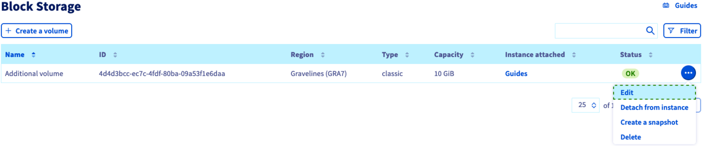
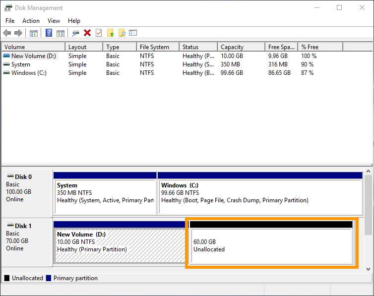
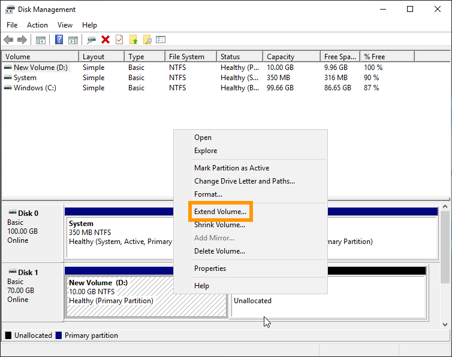
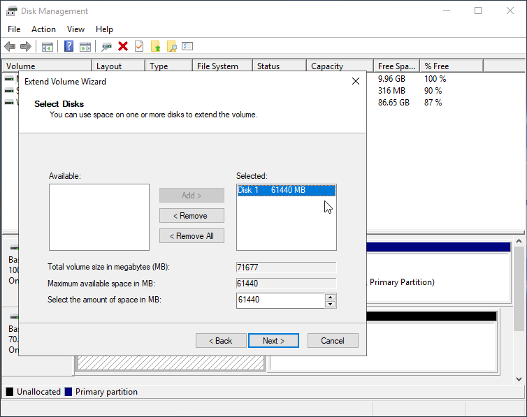

> [!primary]
> Esta tradução foi automaticamente gerada pelo nosso parceiro SYSTRAN. Em certos casos, poderão ocorrer formulações imprecisas, como por exemplo nomes de botões ou detalhes técnicos. Recomendamos que consulte a versão inglesa ou francesa do manual, caso tenha alguma dúvida. Se nos quiser ajudar a melhorar esta tradução, clique em "Contribuir" nesta página.
>

**Última atualização: 29/03/2022**

## Objetivo

Se atingiu a capacidade máxima do seu disco suplementar, pode adicionar armazenamento aumentando o seu tamanho. 

**Este guia explica como aumentar o tamanho de um disco adicional e como expandir a partição principal em conformidade.**

## Requisitos

- Uma [instância Public Cloud](https://www.ovhcloud.com/pt/public-cloud/) no seu projeto Public Cloud
- Um [disco adicional](/pages/public_cloud/compute/create_and_configure_an_additional_disk_on_an_instance) criado no seu projeto
- Ter acesso à [Área de Cliente OVHcloud](https://www.ovh.com/auth/?action=gotomanager&from=https://www.ovh.pt/&ovhSubsidiary=pt)
- Ter acesso administrativo (root) à sua instância através de SSH (Linux) ou RDP (Windows)

## Instruções

Os passos seguintes pressupõem que já configurou um disco suplementar de acordo com as intrusões do [nosso guia](/pages/public_cloud/compute/create_and_configure_an_additional_disk_on_an_instance).

### Modificar o tamanho do disco

Ligue-se à sua [Área de Cliente OVHcloud](https://www.ovh.com/auth/?action=gotomanager&from=https://www.ovh.pt/&ovhSubsidiary=pt) e abra o seu projeto `Public Cloud`{.action}. A seguir, clique em `Block Storage`{.action} no menu à esquerda.

Se o volume está associado a uma **instância Windows**, clique no botão `...`{.action} à direita do volume em causa e selecione `Desassociar a instância`{.action}.

Clique no botão `...`{.action} à direita do volume em causa e selecione `Editar`{.action}.

{.thumbnail}

Na nova janela, indique o novo tamanho do volume e clique em `Modificar o volume`{.action}.

{.thumbnail}

Certifique-se de que o volume está ligado à sua instância antes de continuar. Se não for o caso, clique em `...`{.action} na linha do volume e selecione `Associar a instância`{.action}.

### Estender a partição (instância Linux)

Abra uma ligação SSH à sua instância para ajustar a partição ao disco redimensionado.

Desmonte primeiro o disco utilizando este comando:

```bash
admin@server:~$ sudo umount /mnt/disk
```

Recrie a partição:

```bash
admin@server:~$ sudo fdisk /dev/vdb
```
```console
Welcome to fdisk (util-linux 2.25.2).
Changes will remain in memory only, until you decide to write them.
Be careful before using the write command
```
```console
Command (m for help): d

Selected partition 1
Partition 1 has been deleted.
```
```console
Command (m for help): n

Partition type
p primary (0 primary, 0 extended, 4 free)
e extended (container for logical partitions)
Select (default p):
Using default response p.
Partition number (1-4, default 1):
First sector (2048-146800639, default 2048):
Last sector, +sectors or +size{K,M,G,T,P} (2048-146800639, default 146800639):

Created a new partition 1 of type 'Linux' and of size 70 GiB.
```
```console
Command (m for help): w

The partition table has been altered.
Calling ioctl() to re-read partition table.
Syncing disks.
```

Verifique a partição:

```bash
admin@server:~$ sudo e2fsck -f /dev/vdb1

e2fsck 1.42.12 (29-Aug-2014)
Pass 1: Checking inodes, blocks, and sizes
Pass 2: Checking directory structure
Pass 3: Checking directory connectivity
Pass 4: Checking reference counts
Pass 5: Checking group summary information
/dev/vdb: 12/3276800 files (0.0% non-contiguous), 251700/13107200 blocks
```

```bash
admin@server:~$ sudo resize2fs /dev/vdb1

resize2fs 1.42.12 (29-Aug-2014)
Resizing the filesystem on /dev/vdb to 18350080 (4k) blocks.
The filesystem on /dev/vdb is now 18350080 (4k) blocks long.
```

Por fim, volte e verifique o disco:

```bash
admin@server:~$ sudo mount /dev/vdb1 /mnt/disk/
```

```bash
admin@server:~$ df -h
Filesystem Size Used Avail Use% Mounted on
/dev/vda1 9.8G 840M 8.6G 9% /
udev 10M 0 10M 0% /dev
tmpfs 393M 5.2M 388M 2% /run
tmpfs 982M 0 982M 0% /dev/shm
tmpfs 5.0M 0 5.0M 0% /run/lock
tmpfs 982M 0 982M 0% /sys/fs/cgroup
/dev/vdb1 69G 52M 66G 1% /mnt/disk
```

### Estender a partição (instância Windows)

Crie uma ligação RDP (Remote Desktop) na sua instância Windows.

Uma vez ligado, clique com o botão `Iniciar`{.action} e abra a `Gestão dos discos`{.action}.

{.thumbnail}

O disco ampliado apresenta agora a capacidade suplementar sob a forma de espaço não atribuído.

{.thumbnail}

Faça um clique direito no volume e selecione `Expandir o volume`{.action} no menu contextual.

{.thumbnail}

No assistente de extensão de volume, clique em `Seguinte`{.action} para continuar.

Pode alterar o espaço de disco nesta etapa se deseja adicionar uma capacidade inferior à totalidade da partição.

Clique em `Seguinte`{.action}.

{.thumbnail}

Clique em `Terminar`{.action} para terminar o processo.

O volume redimensionado inclui agora o espaço de disco suplementar.

{.thumbnail}

## Quer saber mais?

[Criar e configurar um disco suplementar numa instância](/pages/public_cloud/compute/create_and_configure_an_additional_disk_on_an_instance)

Junte-se à nossa comunidade de utilizadores em <https://community.ovh.com/en/>.