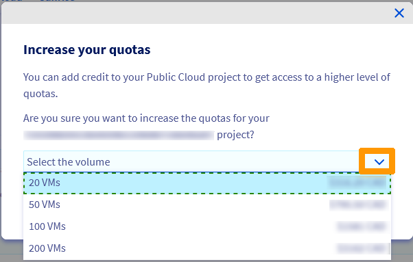
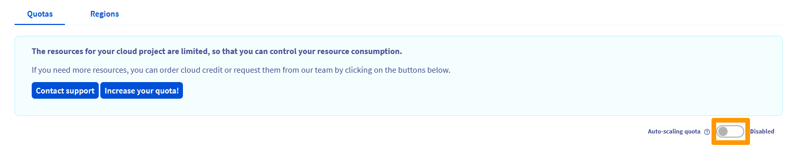

## Objectif

Par défaut, le nombre de ressources (RAM, CPU, espace disque, nombre d'instances...) et de projets que vous pouvez créer est limité.

Si vous souhaitez en créer davantage, une augmentation de quota est alors nécessaire.

**Découvrez comment demander et augmenter un quota Public Cloud dans votre espace client OVHcloud.**

## Prérequis

- Être connecté à votre [espace client OVHcloud](https://ca.ovh.com/auth/?action=gotomanager&from=https://www.ovh.com/ca/fr/&ovhSubsidiary=qc)
- [Disposer d'un moyen de paiement valide](/pages/account_and_service_management/managing_billing_payments_and_services/manage-payment-methods) dans votre espace client OVHcloud

## En pratique

### Augmenter votre quota de ressources

En accord avec des critères internes (ancienneté, existence de factures acquitées, etc.), vous êtes désormais autonome sur les demandes d’augmentation de quotas en lien avec vos projets Public Cloud.

Vous avez la possibilté d'augmenter votre quota de ressources manuellement ou automatiquement.

> [!primary]
> Si vous avez besoin d'augmenter votre quota et que le bouton `Augmenter mes quotas!`{.action} n'est pas disponible dans votre espace client, vous pouvez contacter nos équipes support.
>

#### Augmenter manuellement votre quota de ressources

Cette procédure vous permet de demander manuellement une augmentation de quota et de la valider via un paiement initial (crédit Public Cloud).

Connectez-vous à votre [espace client OVHcloud](https://ca.ovh.com/auth/?action=gotomanager&from=https://www.ovh.com/ca/fr/&ovhSubsidiary=qc){.external}, accédez à la section `Public Cloud`{.action} et sélectionnez votre projet Public Cloud.
  Dans la rubrique `Project Management`, cliquez sur `Quota and Regions`{.action}.

{.thumbnail}

Cette page présente un récapitulatif des quotas actuels de votre projet, par région. Un avertissement apparaît à côté d'une ressource dès lors que 80 % de son quota est atteint.

Cliquez sur `Augmenter mes quotas`{.action}.

{.thumbnail}

Cliquez sur la flèche à côté de « Sélectionnez le volume » pour afficher la liste des quotas actuellement disponibles. Ce menu déroulant affiche également le montant à payer pour bénéficier de ces ressources.

{.thumbnail}

Le tableau ci-dessous vous indique les ressources obtenues pour chaque quota :

|Quota|Instances|CPU/Cores|RAM (Mo)|Taille du volume (Go)|Volumes|Snapshots|Taille des sauvegardes (Go)|Floating IPs|Load Balancer Octavia|Gateway (Routers)|
|---|---|---|---|---|---|---|---|---|---|---|
|10 VMs|10|34|430080|20000|100|600|60000|15|5|2|
|20 VMs|20|40|430080|20000|200|1200|120000|30|10|4|
|50 VMs|50|64|507904|20000|500|3000|300000|75|25|10|
|100 VMs|100|128|1015808|40000|1000|6000|600000|300|10|10|
|200 VMs|200|512|4063232|80000|2000|12000|1200000|600|50|50|

Une fois votre volume sélectionné, cliquez sur `Confirmer`{.action}. Votre paiement sera pris en compte dans les plus brefs délais.

> [!warning]
> **Toute augmentation manuelle de quota est immédiatement facturée**.
>
> Une fois que vous cliquez sur le bouton `Confirmer`{.action}, la commande est automatiquement créée et débitée de votre moyen de paiement.
>

#### Augmenter automatiquement votre quota de ressources via l'option « Quota autoscaling »

Cette option vous permet de demander une augmentation automatique et progressive de votre quota de ressources. Votre quota sera augmenté en fonction de votre utilisation et de critères internes.

Veuillez noter que le processus n'est pas immédiat. Le quota de ressources est augmenté au fil du temps.

Connectez-vous à votre [espace client OVHcloud](https://ca.ovh.com/auth/?action=gotomanager&from=https://www.ovh.com/ca/fr/&ovhSubsidiary=qc){.external}, accédez à la section `Public Cloud`{.action} et sélectionnez votre projet Public Cloud.
  Dans la rubrique `Project Management`, cliquez sur `Quota and Regions`{.action}.

Pour avoir plus d'informations sur cette fonctionnalité, cliquez sur le bouton `?`{.action}. Cliquez ensuite sur le bouton dédié afin de passer l'état à « **Activé** ».

{.thumbnail}

L'auto-scaling sera alors activé sur votre projet et votre quota de ressources sera augmenté au fil du temps.

### Augmenter le quota de vos projets Public Cloud

Si vous avez atteint le nombre maximum de projets Public Cloud autorisés dans votre espace client et que vous souhaitez créer des projets supplémentaires, vous devez en faire la demande auprès de nos équipes support.

## Aller plus loin

Échangez avec notre communauté d'utilisateurs sur <https://community.ovh.com>.
