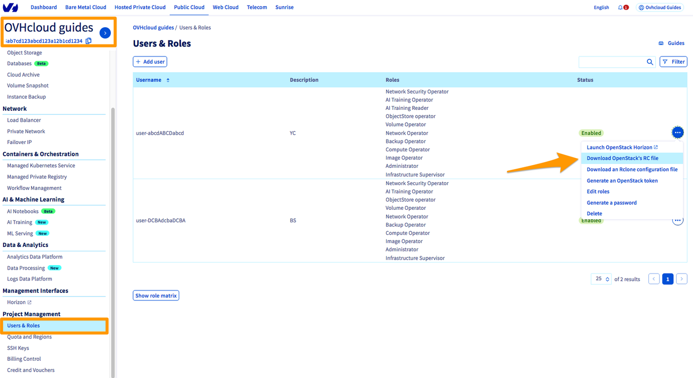

## Objective

By setting OpenStack environment variables on your desktop, you can use the OpenStack API to manage your infrastructure.

## Requirements

- Access to the [OVHcloud Control Panel](/links/manager)
- An [OpenStack user account](/pages/public_cloud/compute/create_and_delete_a_user)
- OpenStack [installed on your system](/pages/public_cloud/compute/prepare_the_environment_for_using_the_openstack_api)

## Instructions

### Step 1: Retrieve the variables

To retrieve your environment variables, you can download the OpenRC file from the OpenStack user account you have created.

Log in to the [OVHcloud Control Panel](/links/manager) and switch to the `Public Cloud`{.action} section. Select your Public Cloud project at the top of the left-hand sidebar.

Click on `Users & Roles`{.action}, then click on the `...`{.action} to the right of your user, then select `Download OpenStack's RC file`{.action}.

{.thumbnail}

An OpenRC file corresponds to a specific user and zone. You cannot manage multiple zones in the same file.

### Step 2: Set the variables

#### **On Linux**

* Open a terminal, or connect via the user who will be making the OpenStack API calls.
* Load the file’s contents in the current environment. You will then be prompted to enter the Horizon user password.

```bash
admin@vpsxxxxxx:~$ source openrc.sh
Please enter your OpenStack Password:
```

As outlined in [this guide](/pages/public_cloud/compute/create_and_delete_a_user), the password is only visible once — when it is created.

If you forget your password, you will need to reset it.

If the CLIs are already installed, check if they are working properly:

```bash
(env)$ openstack server list
+--------------------------------------+------------+--------+-----------------------------------------------+-----------+--------+
| ID                                   | Name       | Status | Networks                                      | Image     | Flavor |
+--------------------------------------+------------+--------+-----------------------------------------------+-----------+--------+
| 8d7c67c0-38e1-4091-88d5-c14844c1f455 | b2-7-gra11 | ACTIVE | Ext-Net=2001:xxxx:xxx:xxx::xxxx, xx.xxx.xx.xx | Debian 12 | b2-7   |
+--------------------------------------+------------+--------+-----------------------------------------------+-----------+--------+
```

#### **On Windows**

The OpenRC file is not designed to be launched on Windows.

There are two ways of setting environment variables:

- You will need to adapt the file by changing certain commands. The **export** part can be replaced with **set**:

```bash
set OS_PASSWORD="Your Horizon user password"
```

- You can set the variables directly via the system settings: Control Panel > System > Advanced System Properties > Environment Variables:

{.thumbnail}

## Go further

To learn how to use OpenStack: [OpenStack documentation](https://docs.openstack.org/){.external}

Join our community of users on <https://community.ovh.com/en/>.
