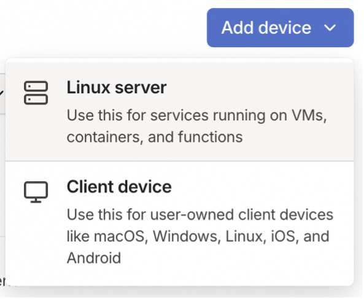
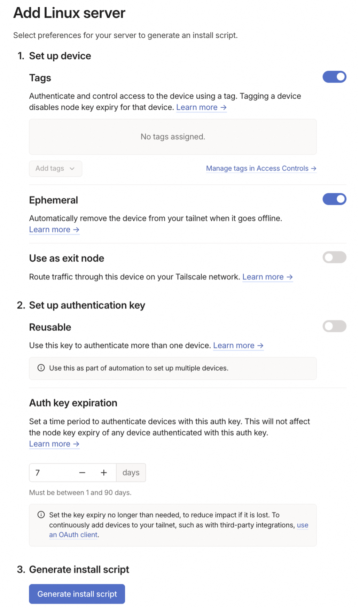
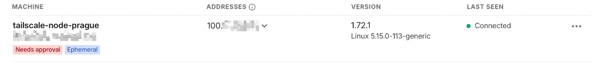
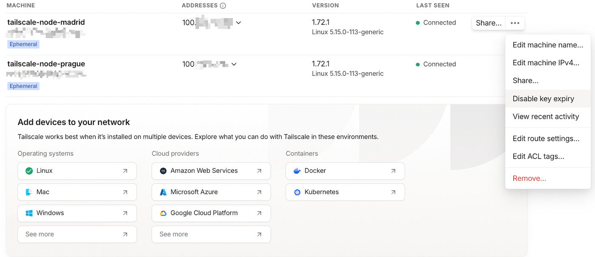

## Objective

Suppose you have Public Clous instances in different OVHcloud Local Zones, such as Prague and Madrid, and you need to securely connect them. Instead of setting up a complex VPN infrastructure, you can use Tailscale, which leverages WireGuard, to easily create an encrypted mesh network between your instances. This is particularly useful for developers, distributed systems, or secure cross-region communications.

This feature allows you to:

- Set up a VPN mesh network for secure connections between Public Cloud instances in different OVHcloud Local Zones.
- Easily connect and manage your instances via Tailscale.
- Enable ephemeral nodes so that temporary instances are automatically removed from the Tailscale network when they are deleted.
- Use Tailscale’s Access Control Lists (ACLs) to manage network permissions.

**This tutorial will guide you through the steps to integrate Tailscale into your OVHcloud Local Zone Public Cloud instances, providing a VPN-as-a-Service (VPNaaS) solution. Tailscale allows you to create a secure, peer-to-peer mesh network between your servers in different geographical locations.**

## Requirements

- An [OVHcloud account](/pages/account_and_service_management/account_information/ovhcloud-account-creation).
- [Two Public Cloud instances](/pages/public_cloud/compute/public-cloud-first-steps) deployed in different [OVHcloud Local Zones](/links/public-cloud/local-zones) (we will use Prague and Madrid for this example).
- [SSH access to your OVHcloud Local Zone Public Cloud Instances](/pages/public_cloud/compute/creating-ssh-keys-pci).
- A [Tailscale](https://tailscale.com/) account with admin access.
- A [Tailscale Auth Key](https://tailscale.com/kb/1085/auth-keys) (which you will generate from the Tailscale admin panel).
- Familiarity with SSH and basic terminal commands. For more information on SSH, read our guide on [how to create and use SSH keys for Public Cloud instances](/pages/public_cloud/compute/creating-ssh-keys-pci).

## Instructions

### Step 1 - Create two instances in OVHcloud Local Zones

[Create two instances](/pages/public_cloud/compute/public-cloud-first-steps) in different OVHcloud Local Zones, such as Prague and Madrid.

Ensure that public networking is enabled for both instances.

### Step 2 - Log into Tailscale

1\. Log into your Tailscale account at [Tailscale](https://login.tailscale.com/).<br>
2\. Go to the `Devices`{.action} tab and click `Add Device`{.action}.<br>
3\. Select `Linux server` as the device type.

{.thumbnail}

4\. Enable `ephemeral nodes` to ensure that nodes are automatically removed from the network when their corresponding server is deleted.

{.thumbnail width="600"}

5\. Copy the provided install script for later use.

### Step 3 - Install Tailscale on the Prague instance

SSH into the Prague instance:

```bash
ssh root@$PRAGUE_IP -i ~/.ssh/tailscale-test
```

1\. Install Tailscale on the instance by running the following command:

```bash
curl -fsSL https://tailscale.com/install.sh | sh && sudo tailscale up --auth-key=$TAILSCALE-KEY
```

2\. Log in to the Tailscale admin panel to approve the new node by visiting <https://login.tailscale.com/admin>.

3\. Approve the node using the menu on the right (with the `...`{.action} button).

{.thumbnail width="600"}

4\. Once approved, you will see a success message in the terminal:

```bash
Installation complete! Log in to start using Tailscale by running:
tailscale up
```

### Step 4 - Install Tailscale on the Madrid instance

1\. SSH into the Madrid instance:

```bash
ssh root@$MADRID_IP -i ~/.ssh/tailscale-test
```

2\. Repeat the Tailscale installation process on the Madrid instance:

```bash
curl -fsSL https://tailscale.com/install.sh | sh && sudo tailscale up --auth-key=$TAILSCALE-KEY
```

3\. Approve the Node in the Admin Panel:

Like with the Prague instance, a prompt will appear asking you to approve the Madrid node. The installation will remain pending until approval.
Visit <https://login.tailscale.com/admin> and approve the new node.

4\. After approval, the installation will finish, and you will see the following success message in the terminal:

```bash
Installation complete! Log in to start using Tailscale by running:
tailscale up
```

### Step 5 - Verify the Tailscale network

To check the status of the Tailscale network, log in to one of your instances (e.g., the Prague instance) and run the following command:

```bash
tailscale status
```

The output should look like this, showing the connection between the two nodes:

```bash
100.X.X.X   tailscale-node-prague john.doe@ linux   -
100.X.X.X   tailscale-node-madrid john.doe@ linux   -
```

### Step 6 - Test the Connection Between Nodes

Now, test the connection between the two nodes using Tailscale’s ping command.

On the Prague instance, run:

```bash
tailscale ping tailscale-node-madrid
```

On the Madrid instance, run:

```bash
tailscale ping tailscale-node-prague
```

You should see a pong response indicating successful communication between the two instances, similar to this: 

```bash
pong from tailscale-node-madrid (100.X.X.X) via [X:X:X:X:X:X:X]:41641 in 34ms
```

### Step 7 - Manage Key Expiry

Tailscale nodes are assigned keys, and these keys can expire. If your nodes are expected to remain in the network for a longer period, you may want to disable key expiry. You can do this in the Tailscale admin panel, depending on your security and access requirements.

{.thumbnail width="600"}

### Step 8 - Access Control

Tailscale creates a mesh network, meaning all nodes can communicate with each other by default. If you need more granular control, use Tailscale's Access Control Lists (ACLs) to specify which devices can communicate with others.

You can read more about ACLs here: [Tailscale ACL Documentation](https://tailscale.com/kb/1393/access-control).

## Go further

Please send us your questions, feedback and suggestions to improve the service:

- On the OVHcloud [Discord server](https://discord.gg/ovhcloud)

If you need training or technical assistance to implement our solutions, contact your sales representative or click on [this link](/links/professional-services) to get a quote and ask our Professional Services experts for assisting you on your specific use case of your project.

Join our [community of users](/links/community).
