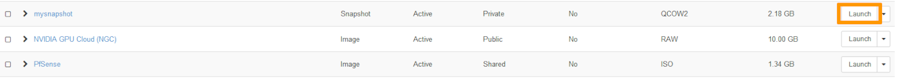
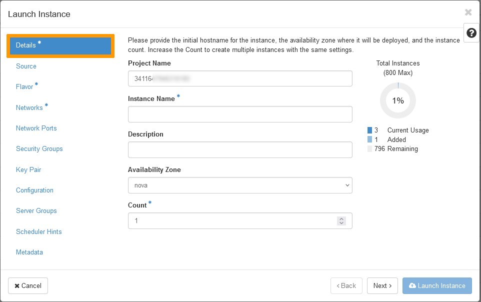
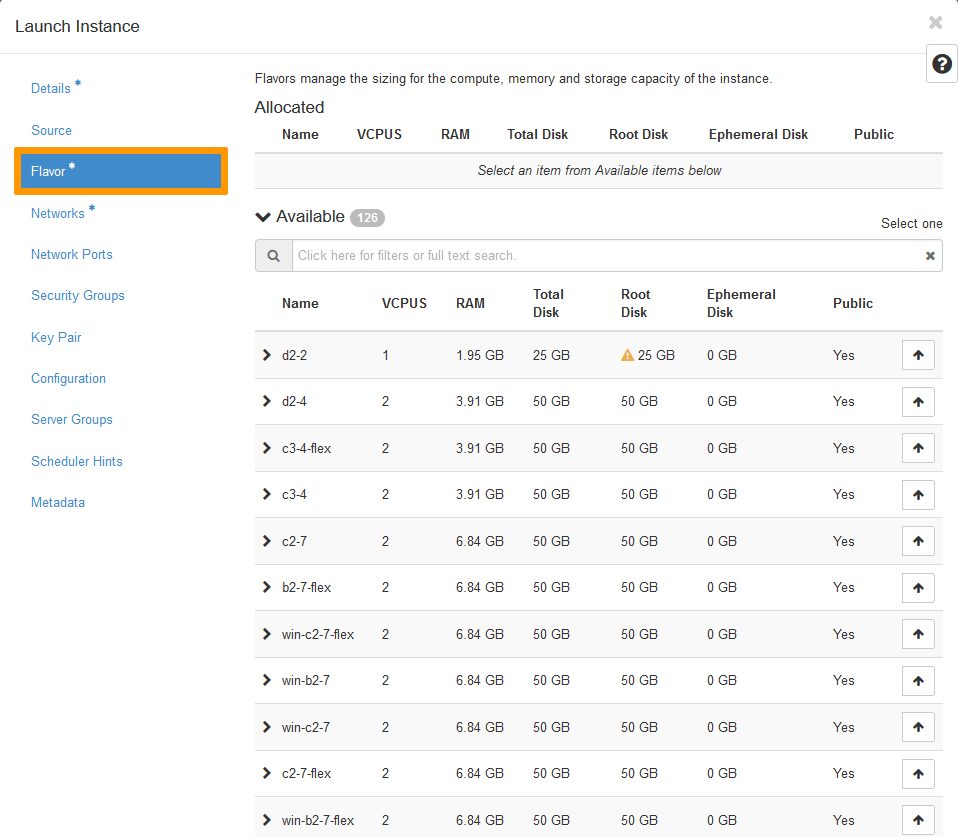
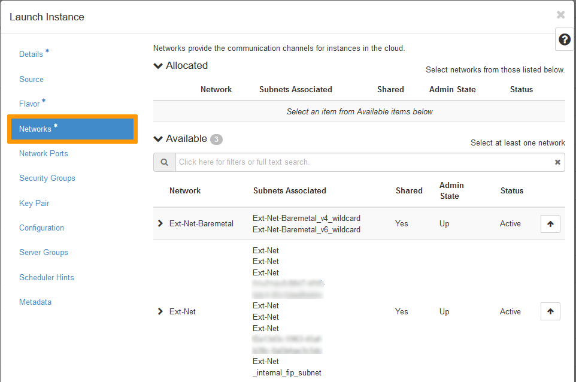
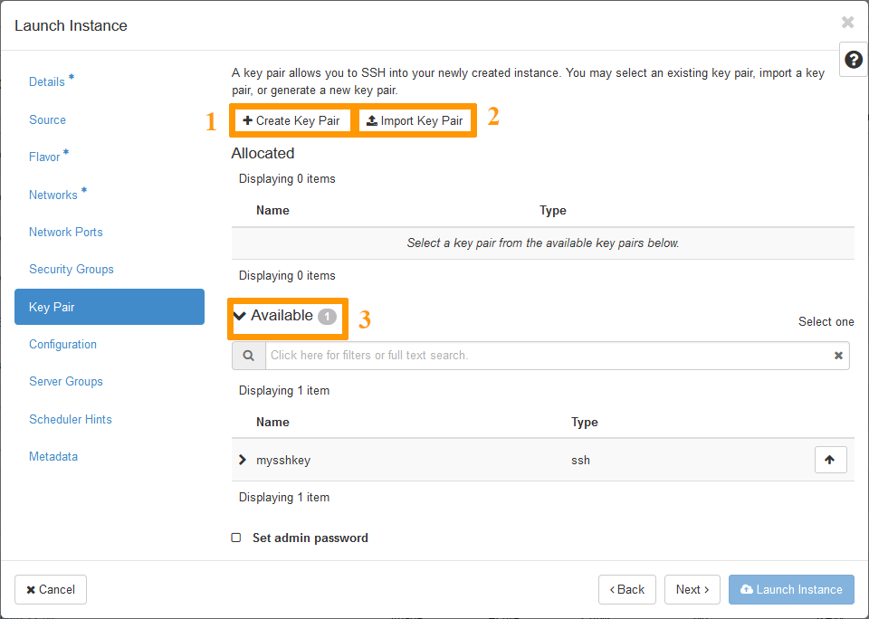

> [!primary]
> Esta traducción ha sido generada de forma automática por nuestro partner SYSTRAN. En algunos casos puede contener términos imprecisos, como en las etiquetas de los botones o los detalles técnicos. En caso de duda, le recomendamos que consulte la versión inglesa o francesa de la guía. Si quiere ayudarnos a mejorar esta traducción, por favor, utilice el botón «Contribuir» de esta página.
>

## Objetivo

En algunos casos, será necesario realizar una copia de seguridad de sus datos, de sus configuraciones o incluso de sus instancias al completo.  
Para ello, puede crear instantáneas (snapshot) de sus instancias, que podrá utilizar para restaurar una configuración posterior en su instancia o incluso para crear una copia exacta de la misma. 

**Esta guía explica cómo gestionar una instantánea en OpenStack Horizon.**

## Requisitos

- Haber [creado una instancia de Public Cloud](/pages/public_cloud/compute/public-cloud-first-steps#3-crear-una-instancia) en su cuenta de OVHcloud
- [Conectarse a Horizon](/pages/public_cloud/compute/introducing_horizon)

## Procedimiento

### Creación del snapshot

Conéctese a la interfaz Horizon y asegúrese de estar en la zona adecuada. Puede comprobarlo en la parte superior izquierda. 

{.thumbnail}

En el menú `Compute`{.action}, haga clic en el botón `Instances`{.action}. Haga clic en `Create Snapshot`{.action} en la línea de la instancia correspondiente.

{.thumbnail}

Se abrirá una ventana en la que deberá introducir la siguiente información:

* Snapshot Name: asigne un nombre al snapshot y haga clic en `Create Snapshot`{.action}.

{.thumbnail}

El snapshot se mostrará en la sección `Images`{.action}. Es recomendable asignar un nombre explícito a cada snapshot.

### Restauración de un snapshot

Es posible restaurar un snapshot creando una nueva instancia a partir de él.

En la interfaz de Horizon, haga clic en el menú `Compute`{.action} a la izquierda y seleccione `Images`{.action}.

Haga clic en `Launch`{.action} junto al snapshot seleccionado.

{.thumbnail}

Para completar la restauración del snapshot, es necesario seleccionar una serie de opciones en la ventana emergente.

> [!tabs]
> **Details**
>>
>> **Nombre de la instancia (*Instance name*):** Especifique el nombre deseado para la instancia. 
>> **Count:** Seleccione el número de instancias que quiere iniciar a partir del snapshot.  
>>{.thumbnail} 
>>
> **Flavor**
>>
>> Seleccione el *flavor* deseado. Asegúrese de seleccionar una versión con recursos iguales o mayores que el tamaño de la imagen (snapshot).  
>>{.thumbnail} 
>>
> **Red (*Network*)**
>>
>> Seleccione una red pública (Ext-Net) para asociarla a la instancia.  
>>{.thumbnail} 
>>
> **Keypair**
>>
>> Seleccione (3), cree (1) o importe (2) un par de claves.  
>>{.thumbnail} 
>>

Haga clic en `Launch Instance`{.action} para empezar a crear su instancia.

### Eliminación de un snapshot

En el menú `Compute`{.action}, haga clic en el botón `Images`{.action} y seleccione Compute.

Haga clic en la flecha desplegable situada junto al snapshot que desea eliminar y seleccione `Delete Image`{.action}. Confirme la eliminación del snapshot.

{.thumbnail}

## Más información
  
Interactúe con nuestra comunidad de usuarios en <https://community.ovh.com/en/>.
	

