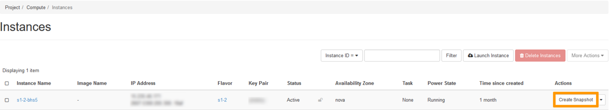
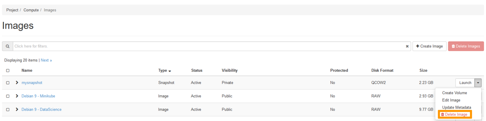

> [!primary]
> Questa traduzione è stata generata automaticamente dal nostro partner SYSTRAN. I contenuti potrebbero presentare imprecisioni, ad esempio la nomenclatura dei pulsanti o alcuni dettagli tecnici. In caso di dubbi consigliamo di fare riferimento alla versione inglese o francese della guida. Per aiutarci a migliorare questa traduzione, utilizza il pulsante "Contribuisci" di questa pagina.
>

## Obiettivo

Durante la tua attività, potresti avere bisogno di eseguire un backup dei tuoi dati, delle tue configurazioni o di tutte le tue istanze.
Creando degli snapshot, puoi effettuare una copia della tua istanza o ripristinare sulla tua istanza una configurazione precedente.

**Questa guida ti mostra come gestire gli Snapshot dall'interfaccia OpenStack Horizon.**

## Prerequisiti

- Aver [creato un'istanza Public Cloud](/pages/public_cloud/compute/public-cloud-first-steps#step-3-crea-unistanza) nel tuo account OVHcloud
- [Accedere all’interfaccia Horizon](/pages/public_cloud/compute/introducing_horizon)

## Procedura

### Crea lo Snapshot

Accedi all'interfaccia Horizon e assicurati di essere nella regione giusta. Potete controllarlo in alto a sinistra. 

{.thumbnail}

Clicca sul menu `Compute`{.action} a sinistra e poi su `Instances`{.action}. Clicca su `Create Snapshot`{.action} sulla riga dell'istanza corrispondente.

{.thumbnail}

Nella nuova finestra inserisci le informazioni richieste:

* Snapshot Name: definisci un nome per lo snapshot e clicca su `Create Snapshot`{.action}.

{.thumbnail}

Lo Snapshot sarà successivamente elencato nella sezione `Images`{.action}. Ti consigliamo di assegnare un nome esplicito a ogni Snapshot. 

### Elimina uno Snapshot

Nell'interfaccia horizon, clicca sul menu `Compute`{.action} a sinistra e poi su `Images`{.action}.

Clicca sulla freccia a tendina accanto allo Snapshot da eliminare e clicca su `Delete Image`{.action}. Conferma l'eliminazione dello Snapshot.

{.thumbnail}

## Per saperne di più

Contatta la nostra Community di utenti all’indirizzo <https://community.ovh.com/en/>.
