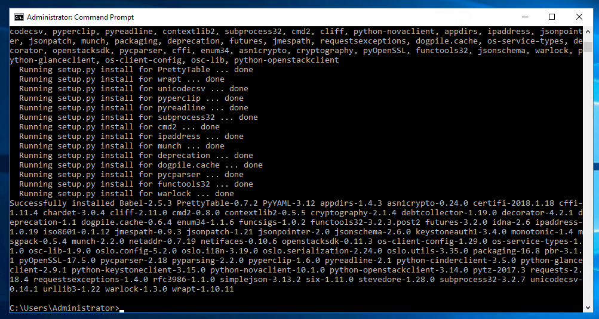
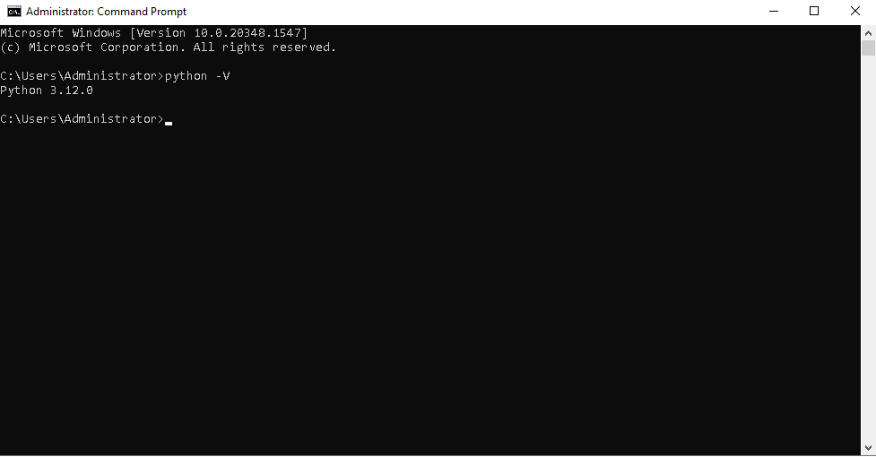

## Objective

You can manage Public Cloud services using commands sent from the system console, once you have downloaded and installed OpenStack tools.

With the OpenStack API, you can automate your management by generating scripts. 

> [!primary]
>
> OpenStack requires Python >=3.8.
> This guide describes the installation of the package `python-openstackclient` which bundles the command line for the majority of OpenStack projects.
> The Octavia project (which powers the `Public Cloud Load Balancer`) is not included. Hence you have to run `pip3 install python-octaviaclient` on top of the installation instructions found below.
>

**Find out how to install these OpenStack tools.**

## Requirements

- **Root** access to the environment you want to configure

## Instructions

### On Debian

Open the terminal and connect to the environment you want to prepare via SSH.

Update the packet cache using the `apt update` command:

```sh
apt update
```

Use the command below to install the OpenStack client:

```sh
$ apt install python3-pip python3-venv -y
$ python3 -m venv env
$ source env/bin/activate
(env)$ pip3 install --upgrade pip
(env)$ pip3 install python-openstackclient
```

After you have completed this step, we recommend creating a special user without root access.

To access the help tools, run the following command:

```sh
openstack --help
```

> [!primary]
>
> The documentation for the OpenStack API is available [here](https://docs.openstack.org/python-openstackclient/latest/){.external}.
>

### On CentOS

Open the terminal and connect to the environment you want to prepare via SSH.

Update the packet cache using the following command:

```sh
yum update -y
```

Use the command below to install the OpenStack client:

```sh
yum install python3-pip -y
$ python3 -m venv env
$ source env/bin/activate
(env)$ pip3 install --upgrade pip
(env)$ pip3 install python-openstackclient
```

After you have completed this step, we recommend creating a special user without root access.

To access the help tools, run the following command:

```sh
openstack --help
```

> [!primary]
>
> The documentation for the OpenStack API is available [here](https://docs.openstack.org/python-openstackclient/latest/){.external}.
>

### On Windows

Download and install Python version 3.12.0. You can choose to add the Python programming language automatically to Path, by ticking this option in the installation configuration:

{.thumbnail}

You can also install it yourself. To do this, follow the actions described below:

#### Step 1: Edit the system’s environment variables.

Search for the system’s environment variable settings, and go to “Edit the system environment variables”:

{.thumbnail}

#### Step 2: Edit the system settings.

Go to the `Advanced`{.action} tab, and click `Environment Variables`{.action} to edit the settings.

{.thumbnail}

#### Step 3: Configure the environment variables.

In the ‘System variables’ section, select ‘New’, attribute the name “PYTHON_HOME”, and add the access path to Python.

{.thumbnail}

#### Step 4: Add the path for the variables.

Once you have added Python, edit the ‘Path’ field in the system variables, and add the following to the end of the path:

`...;%PYTHON_HOME%\;%PYTHON_HOME%\Script`

#### Step 5: Restart Windows.

The changes you have made will become effective after the system has been rebooted.

#### Step 6: Install the OpenStack client.

As an administrator, open the program in the command line (CMD), and install the OpenStack client using the following command:

```sh
pip install python-openstackclient
```

If the operation is completed properly, you will see a summary:

{.thumbnail}

You can check the installation version in the CMD (command line) window that has just opened, by entering `python -V` from any system location.

{.thumbnail}

### On MacOS

You can use [HomeBrew](https://brew.sh), a package manager for MacOS.

Open the terminal and execute the following command:

```bash
brew install openstackclient
```

To access the help tools, run the following command:

```sh
openstack --help
```

## Go further

[Setting OpenStack environment variables](/pages/public_cloud/compute/loading_openstack_environment_variables)

Join our community of users on <https://community.ovh.com/en/>.
