<style>
details>summary {
    color:rgb(33, 153, 232) !important;
    cursor: pointer;
}
details>summary::before {
    content:'\25B6';
    padding-right:1ch;
}
details[open]>summary::before {
    content:'\25BC';
}
</style>

> [!primary]
> Tłumaczenie zostało wygenerowane automatycznie przez system naszego partnera SYSTRAN. W niektórych przypadkach mogą wystąpić nieprecyzyjne sformułowania, na przykład w tłumaczeniu nazw przycisków lub szczegółów technicznych. W przypadku jakichkolwiek wątpliwości zalecamy zapoznanie się z angielską/francuską wersją przewodnika. Jeśli chcesz przyczynić się do ulepszenia tłumaczenia, kliknij przycisk "Zgłóś propozycję modyfikacji" na tej stronie.
>

## Wprowadzenie

Instancje Public Cloud są łatwe do wdrożenia i zarządzania. Jednak jako członek ekosystemu Public Cloud od OVHcloud, instancje oferują wiele opcji konfiguracyjnych i mogą być dostosowywane do różnych zastosowań. Poniższe instrukcje zawierają wszystkie niezbędne etapy (a także opcjonalne etapy) tworzenia instancji w Panelu klienta OVHcloud i uzyskiwania do niej zdalnego dostępu.  
W zależności od Twoich potrzeb będziesz mógł skorzystać z Twojego projektu Public Cloud.

**Niniejszy przewodnik przedstawia pierwsze kroki z instancją Public Cloud.**

## Wymagania początkowe

- [Projekt Public Cloud](/links/public-cloud/public-cloud) na koncie OVHcloud
- Dostęp do [Panelu klienta OVHcloud](/links/manager)

## W praktyce

> [!primary]
>
> Jeśli jeszcze nie utworzyłeś projektu Public Cloud, zacznij od naszego [Przewodnika tworzenia projektu](/pages/public_cloud/compute/create_a_public_cloud_project).
>
> **Informacje techniczne** na temat Public Cloud OVHcloud są dostępne na [tej stronie](/pages/public_cloud/compute/00-essential-info-to-get-started-on-public-cloud).
>

### Prezentacja zawartości


- [**1** Tworzenie kluczy SSH](#create-ssh)
- [**2** Importowanie kluczy SSH](#import-ssh)
- [**3** Przygotowywanie do konfiguracji sieci](#network)
- [**4** Tworzenie instancji](#create-instance)
    - [**4.1** Wybór modelu wystąpienia](#model)
    - [**4.2** Wybór regionu](#region)
    - [**4.3** Zaznaczanie obrazu](#image)
    - [**4.4** Konfiguracja instancji](#configuration)
    - [**4.5** Konfiguracja sieci](#network)
    - [**4.6** Wybierz okres rozliczeniowy](#billing)
- [**5** Logowanie do instancji](#connect-instance)
    - [**5.1** Weryfikacja instalacji instancji w Panelu klienta OVHcloud](#verify-status)
    - [**5.2** Pierwsze logowanie do instancji z zainstalowanym systemem operacyjnym GNU/Linux](#login-linux)
    - [**5.3** Instancje Windows](#windows)
        - [**5.3.1** Ukończono instalację instancji systemu Windows](#windows)
        - [**5.3.2** Połączenie zdalne z systemu Windows](#login-windows)
        - [**5.3.3** Połączenie zdalne z innego systemu operacyjnego](#login-other)
    - [**5.4** Dostęp do konsoli VNC](#vnc-console)
- [**6** Pierwsze kroki z nową instancją](#manage-access)
    - [**6.1** Zarządzanie użytkownikami](#user-mgmt)
        - [**6.1.1** Ustawianie hasła dla bieżącego konta użytkownika](#set-password)
        - [**6.1.2** Aktywacja połączeń zdalnych za pomocą hasła](#remote-password)
    - [**6.2** Dodatkowe klucze SSH](#add-keys)


> [!primary]
>
> **Podczas tworzenia instancji Public Cloud w Panelu klienta należy podać publiczny klucz SSH.** Po utworzeniu instancji możesz w dogodnym dla Ciebie czasie skonfigurować zdalny dostęp.
>
> **Wyjątek**: Uwierzytelnianie połączenia z wystąpieniami systemu Windows wymaga podania nazwy użytkownika i hasła, ponieważ system Windows używa protokołu RDP (**R**emote **D**esktop **P**rotocol).
>

<a name="create-ssh"></a>

### Etap 1: tworzenie zestawu kluczy SSH

Jeśli posiadasz gotową parę kluczy SSH, możesz pominąć ten krok.

[SSH](/pages/bare_metal_cloud/dedicated_servers/ssh_introduction) umożliwia szyfrowaną komunikację klient-serwer. **Para kluczy SSH** składa się z klucza publicznego i prywatnego.

- **Klucz publiczny** jest dodawany do instancji Public Cloud (i może być również [przechowywany w Panelu klienta OVHcloud](#import-ssh)).
- **Klucz prywatny** jest przechowywany na Twoim lokalnym sprzęcie i musi być zabezpieczony przed nieuprawnionym dostępem. Tylko urządzenia klienckie z odpowiednim kluczem prywatnym mogą uzyskać dostęp do Twojej instancji. Do zalogowania nie jest wymagane hasło konta użytkownika.

Masz do wyboru dwie opcje tworzenia kluczy SSH i zarządzania nimi:

- Interfejs wiersza poleceń systemu operacyjnego (prosty klient **Open SSH**).
- Dodatkowe oprogramowanie (kompatybilne z protokołem **Open SSH**) z wierszem poleceń lub interfejsem graficznym.

Większość współczesnych stacjonarnych systemów operacyjnych zawiera natywnie klienta **Open SSH** dostępny za pośrednictwem aplikacji wiersza poleceń systemu (`cmd`, `Powershell`, `Terminal`, etc.). Jeśli nie wiesz, jak używać kluczy SSH jako metody uwierzytelniania, możesz użyć instrukcji z [tego przewodnika](/pages/bare_metal_cloud/dedicated_servers/creating-ssh-keys-dedicated#create-ssh-key), aby utworzyć parę kluczy.

Jeśli używasz innego oprogramowania, zapoznaj się z jego dokumentacją. Instrukcje dotyczące rozwiązania open source `PuTTY` są dostępne w [tym przewodniku](/pages/bare_metal_cloud/dedicated_servers/creating-ssh-keys-dedicated#useputty).

<a name="import-ssh"></a>

### Etap 2: Importuj klucze SSH

Publiczne klucze SSH możesz przechowywać w sekcji `Public Cloud`{.action} w [Panelu klienta OVHcloud](/links/manager). Nie jest to obowiązkowe, ale sprawia, że proces tworzenia instancji jest bardziej praktyczny.

> [!primary]
>
> Przechowywane klucze SSH pozwalają na szybsze tworzenie instancji w Panelu klienta. Aby zmienić pary kluczy i dodać użytkowników po utworzeniu instancji, zapoznaj się z przewodnikiem [Dodatkowe klucze SSH](/pages/public_cloud/compute/configuring_additional_ssh_keys).
>
> Publiczne klucze SSH dodane do Panelu klienta OVHcloud będą dostępne dla usług Public Cloud we wszystkich [regionach](/links/public-cloud/regions-pci). Możesz przechowywać zaszyfrowane klucze za pomocą **RSA**, **ECDSA** i **ED25519**.
>

Zaloguj się do [Panelu klienta OVHcloud](/links/manager), przejdź do sekcji `Public Cloud`{.action} i wybierz odpowiedni projekt Public Cloud.

{.thumbnail}

Otwórz `SSH Keys`{.action} w menu po lewej stronie, pod **Project Management**. Kliknij przycisk `Dodaj klucz SSH`{.action}.

{.thumbnail}

W nowym oknie wpisz nazwę klucza. Wypełnij pole `Klucz` ciągiem klucza publicznego, na przykład klucza utworzonego w kroku [etap 1](#create-ssh). Potwierdź, klikając `Dodaj`{.action}.

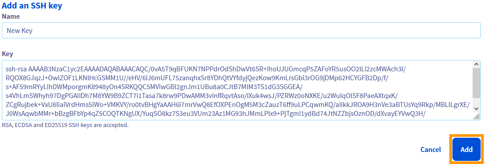{.thumbnail}

Możesz teraz wybrać ten klucz w [Krok 4](#create-instance), aby dodać go do nowego wystąpienia.

<a name="network"></a>

### Etap 3: Przygotowanie konfiguracji sieci

Przed utworzeniem instancji zalecamy zapoznanie się ze sposobem użycia instancji w kontekście sieciowym.

- Jeśli nie musisz w tym momencie konfigurować instancji z siecią prywatną, możesz przejść do [etapu 4](#create-instance). Możesz utworzyć instancję udostępnioną w Internecie publicznym (zobacz **Tryb publiczny** [poniżej](#networking-modes).)
- Jeśli instancja musi być podłączona do nowej prywatnej sieci (OVHcloud [vRack](/links/network/vrack)), **przed kontynuowaniem utwórz najpierw Twoją usługę vRack**. Więcej informacji na ten temat znajdziesz w [przewodniku dotyczącym usługi vRack Public Cloud](/pages/public_cloud/public_cloud_network_services/getting-started-07-creating-vrack).

<a name="networking-modes"></a>

/// details | Public Cloud Networking - Tryby

**Public Mode**

Instancje w trybie publicznym są udostępniane do Internetu bezpośrednio przez IPv4/IPv6. Adresy IP nie mogą być modyfikowane, ale instancje mogą mieć przypisane adresy [Additional IP](/links/network/additional-ip) ([w tym Twoje własne IP](/links/network/byoip)) i mogą być podłączone do sieci [vRack](/links/network/vrack).

**Private Mode**

Instancje działające w trybie prywatnym mogą być dostępne do Internetu tylko za pośrednictwem usługi [Gateway](/links/public-cloud/gateway) lub [Load Balancer](/links/public-cloud/load-balancer) oraz adresów [Floating IP](/links/public-cloud/floating-ip).

Więcej informacji znajdziesz w naszych przewodnikach w sekcji [Public Cloud Network Services](/products/public-cloud-network). [Przewodnik po pojęciach](/pages/public_cloud/public_cloud_network_services/concepts-01-public-cloud-networking-concepts) stanowi wprowadzenie do sieci Public Cloud Networking.

**Local Private Mode**

Lokalny tryb prywatny ma zastosowanie tylko wtedy, gdy utworzysz instancję w strefie **Local Zone**. Instancje mogą być podłączone do Internetu bezpośrednio przez IPv4/IPv6. Tylko instancje tej samej strefy lokalnej mogą być podłączone za pośrednictwem sieci prywatnych. Lokalne strefy nie są kompatybilne z [vRack](/links/network/vrack). W tym trybie DHCP automatycznie dostarcza adresy IP do Twoich instancji.

Aby uzyskać więcej informacji, zobacz [strona sieci Web stref lokalnych](/links/public-cloud/local-zones).

///

<a name="create-instance"></a>

### Etap 4: Tworzenie instancji

> [!primary]
>
> Publiczny klucz SSH jest obowiązkowy podczas tworzenia instancji w Panelu klienta OVHcloud (z wyjątkiem instancji Windows).
>
> Zapoznaj się z [etapem 1](#create-ssh) i [etapem 2](#import-ssh) w tym przewodniku, jeśli nie posiadasz gotowych kluczy SSH.
>

Zaloguj się do [Panelu klienta OVHcloud](/links/manager), przejdź do sekcji `Public Cloud`{.action} i wybierz odpowiedni projekt Public Cloud.

{.thumbnail}

Na stronie "**Strona główna**" kliknij `Utwórz instancję`{.action}.

{.thumbnail}

<a name="model"></a>

#### Krok 4.1: Wybierz szablon

W pierwszym kroku wybierz model instancji (można go również nazwać "*flavour*"), który definiuje zasoby instancji. Kliknij zakładkę z kluczowymi zasobami, aby znaleźć nasze zoptymalizowane modele instancji.

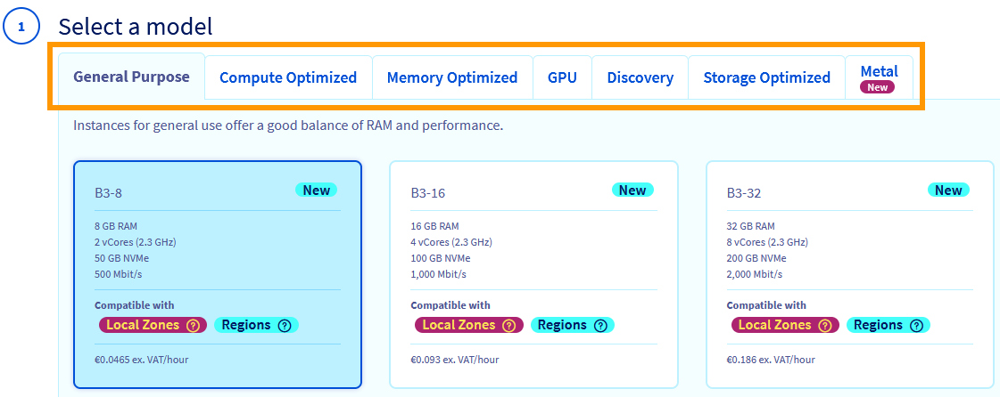{.thumbnail}

W sekcji `Discover`{.action} proponujemy modele instancji ze współdzielonymi zasobami w bardzo atrakcyjnej cenie. Są one idealne do testowania usługi Public Cloud w ogóle lub aplikacji webowej.

Modele instancji typu `Metal`{.action} dostarczają dedykowanych zasobów fizycznych.

> [!primary]
>
> Całkowite zasoby Public Cloud zostaną początkowo ograniczone ze względu na kontrolę kosztów i bezpieczeństwo. Możesz sprawdzić te limity, klikając `Quota and Regions`{.action} na pasku nawigacyjnym po lewej stronie, pod **Project Management**. [Więcej informacji na ten temat znajdziesz w dokumentacji dedykowanej](/pages/public_cloud/compute/increasing_public_cloud_quota).
>
> Pamiętaj, że możesz **uaktualnić** Twoją instancję po jej utworzeniu, aby mieć więcej dostępnych zasobów. Przejście na mniejszy model nie jest jednak możliwe w przypadku instancji regularnej. Więcej informacji na ten temat można znaleźć w **etapie 4.4** poniżej.
>

### Informacje dodatkowe

/// details | Kategorie modeli instancji

| Typ | Gwarantowane zasoby | Informacje o użyciu |
| :---          |     :---:      |          ---  |
| General Purpose   | ✓     | Serwery do programowania, obsługi aplikacji www lub biznesowych    |
| Compute Optimized     | ✓       | Kodowanie wideo lub inne zastosowania wymagające dużej wydajności obliczeniowej      |
| Memory Optimized    | ✓     | Bazy danych, analizy i obliczenia w pamięci    |
| GPU     | ✓       | Moc przetwarzania równoległego dla zaawansowanych aplikacji (renderowanie, big data, deep learning, itp.)       |
| Discovery    | -       | Hosting ze współdzielonymi zasobami dla środowisk testowych i deweloperskich      |
| Optimized Storage   | ✓     | Zoptymalizowane do przenoszenia danych na dysk    |
| Metal | ✓ | Dedykowane zasoby z bezpośrednim dostępem do zasobów obliczeniowych, pamięci masowej i sieci|

///

/// details | Regiony i Local Zones

**Regiony**

**Region** to lokalizacja na świecie składająca się z jednego lub kilku centrów danych, w których hostowane są usługi OVHcloud. Więcej informacji na temat regionów, rozmieszczenia geograficznego i dostępności usług znajdziesz na naszej [dedykowanej stronie WWW](/links/public-cloud/regions-pci) i naszej [stronie WWW dotyczącej lokalizacji infrastruktur OVHcloud](/links/infrareg).

**Local Zones**

Lokalne strefy to rozszerzenie **regionów**, które przybliża usługi OVHcloud do określonych lokalizacji oferujących krótszy czas odpowiedzi i lepszą wydajność aplikacji. Więcej informacji można znaleźć na [stronie internetowej stref lokalnych](/links/public-cloud/local-zones) oraz w [dokumentacji możliwości stref lokalnych](/pages/public_cloud/compute/local-zones-capabilities-limitations).

///

<a name="region"></a>

#### Krok 4.2: Wybierz lokalizację

Wybierz [region](/links/public-cloud/regions-pci) najbliżej użytkowników lub klientów. Opcja ta może być ograniczona w zależności od modelu wybranego w **etapie 4.1**. Jeśli na tym etapie wybierzesz strefę **Local Zone**, instancja będzie podlegać ograniczeniom sieci (patrz [Etap 3](#networking-modes)).

Zapoznaj się również z informacjami podanymi na [stronie sieci Web stref lokalnych](/links/public-cloud/local-zones) oraz w [dokumentacji możliwości stref lokalnych](/pages/public_cloud/compute/local-zones-capabilities-limitations).

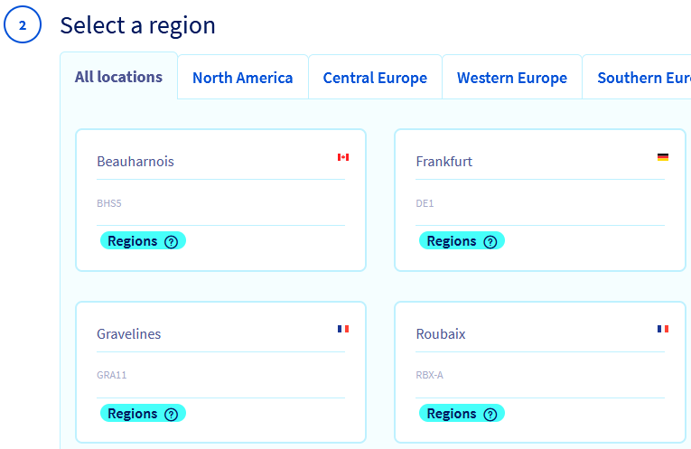{.thumbnail}

<a name="image"></a>

#### Krok 4.3: Wybierz obraz

Kliknij wybraną kartę i z menu rozwijanego wybierz system operacyjny dla Twojej instancji.

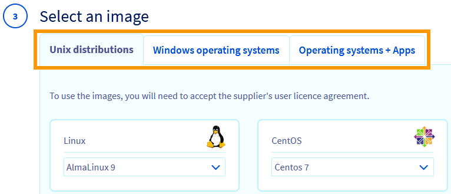{.thumbnail}

Obrazy dostępne na tym etapie zależą od wyborów dokonanych na wcześniejszych etapach - kompatybilności z modelem instancji oraz dostępności regionalnej. Na przykład, jeśli chcesz wybrać system operacyjny Windows, a na karcie Windows nie ma żadnych opcji, musisz zmienić wybory dotyczące poprzednich kroków.

> [!primary]
>
> Jeśli wybierzesz system operacyjny wymagający płatnej licencji, koszty te zostaną automatycznie uwzględnione na fakturze za projekt.
>

Ten etap wymaga również **dodania publicznego klucza SSH** (z wyjątkiem instancji Windows). Masz 2 opcje:

- Użycie klucza publicznego przechowywanego wcześniej w Panelu klienta OVHcloud
- Bezpośrednie wprowadzanie klucza publicznego

Kliknij poniższe karty, aby wyświetlić ich prezentację:

> [!tabs]
> **Użyj przechowywanego klucza**
>>
>> Aby dodać klucz przechowywany w Panelu klienta OVHcloud (patrz [Etap 2](#import-ssh)), wybierz go z listy.<br><br>
>>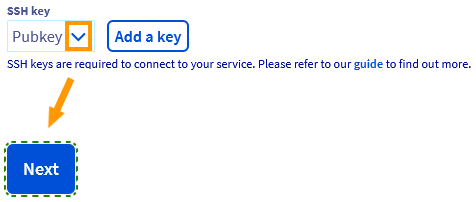{.thumbnail}<br>
>>
> **Bezpośrednie wprowadzanie klucza**
>>
>> Aby dodać klucz publiczny przez wklejenie łańcucha kluczy, kliknij przycisk `Dodaj klucz`{.action}.<br><br>
>>{.thumbnail}<br>
>> Wprowadź nazwę dla klucza i ciągu klucza w odpowiednich polach. Następnie kliknij przycisk `Dalej`{.action}.<br><br>
>>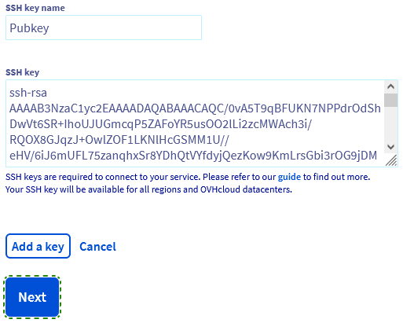{.thumbnail}<br>
>> Zanim klikniesz przycisk `Dalej`{.action}, możesz skorzystać z przycisku `Dodaj klucz`{.action}, aby zapisać ten klucz w Panelu klienta OVHcloud (więcej informacji zawiera[etap 2](#import-ssh)).
>>

<a name="configuration"></a>

#### Etap 4.4: Konfiguracja instancji

{.thumbnail}

Ten etap oferuje kilka opcji konfiguracji. Kliknij poniższe zakładki, aby wyświetlić szczegółowe informacje:

> [!tabs]
> **1: Liczba instancji do utworzenia**
>>
>> Możesz utworzyć wiele instancji na podstawie wyborów dokonanych na etapach tworzenia, ale [limity przydziału zasobów](/pages/public_cloud/compute/increasing_public_cloud_quota) będą stosowane.<br>
>>
> **2: Elastyczna instancja**
>>
>> Jeśli wybrany szablon jest zgodny, możesz utworzyć **instancję Flex**. Ta opcja umożliwia uaktualnienie do mniejszego modelu (a nawet zmianę kategorii modelu), ale ogranicza instancję do **50 GB przestrzeni dyskowej zawartej w ofercie środków trwałych**, niezależnie od innych aktualizacji lub degradacji.<br>
>>
> **3: Nazwa instancji**
>>
>> Wprowadź pełną nazwę instancji. Domyślnym odwołaniem biznesowym do szablonu wystąpienia.<br>
>>
> **4: Skrypt po-instalacyjny**
>>
>> W tym polu możesz dodać [Twój skrypt](/pages/public_cloud/compute/launching_script_when_creating_instance).<br>
>>
> **5: Automatyczne kopie zapasowe instancji**
>>
>> Możesz włączyć [automatyczne kopie zapasowe](/pages/public_cloud/compute/save_an_instance), zaznaczając tę opcję. Zapoznaj się z cennikiem i dodatkowymi informacjami.
>>

<a name="network"></a>

#### Etap 4.5: Konfiguracja sieci

W tym kroku zastosuj wybrany przez Ciebie tryb sieci Public Cloud, w zależności od informacji zawartych w powyższym kroku [3](#network). Twoje opcje zależą od [wyboru poprzedniej lokalizacji](#region) dla instancji (**Region** lub **Local Zone**).

#### Regionów

> [!tabs]
> **Private Mode**
>>
>> Instancja może pozostać w pełni prywatna.<br><br>
>>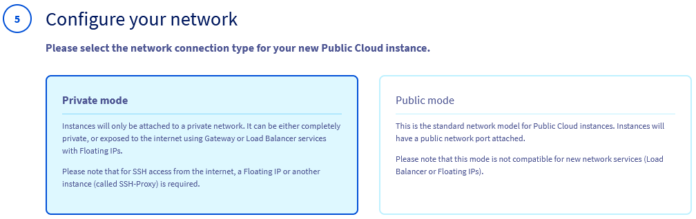{.thumbnail}<br>
>> Możesz połączyć instancję z [siecią prywatną](#networking-modes) i [Floating IP](/links/public-cloud/floating-ip). Nie zostanie dołączony żaden publiczny dedykowany adres IP.<br><br>
>>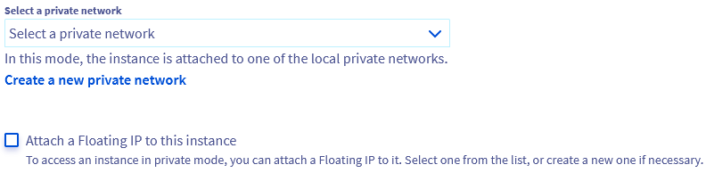{.thumbnail}<br>
>> Pamiętaj, że kliknięcie przycisku `Utwórz nową prywatną sieć`{.action} spowoduje przerwanie procesu tworzenia instancji i jego ponowne uruchomienie od początku.<br>
>>
> **Public Mode**
>>
>> TInstancja będzie udostępniona w Internecie bezpośrednio przez IPv4/IPv6.<br><br>
>>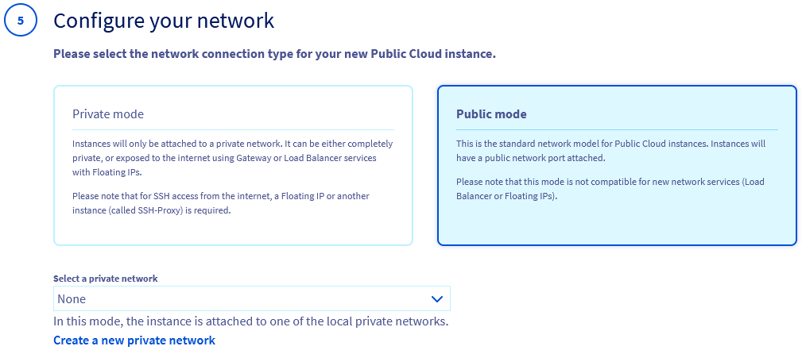{.thumbnail}<br>
>> Możesz również połączyć instancję z [siecią prywatną](#networking-modes) (vRack) za pomocą menu rozwijanego.<br>
>> Pamiętaj, że kliknięcie przycisku `Utwórz nową prywatną sieć`{.action} spowoduje przerwanie procesu tworzenia instancji i jego ponowne uruchomienie od początku.
>>

Kliknij przycisk `Dalej`{.action}, aby przejść do ostatniego etapu.

#### Lokalnych Stref

Możesz przypisać instancję do sieci prywatnej, udostępnić ją publicznie lub obydwa te elementy.

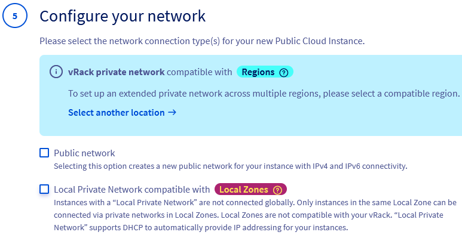{.thumbnail}


> [!tabs]
> **Public Network**
>>
>> Po wybraniu opcji `Sieć publiczna` instancja będzie udostępniona w Internecie bezpośrednio przez IPv4/IPv6.<br>
>> Możesz dodatkowo połączyć instancję z [siecią prywatną](#networking-modes) (niekompatybilną z vRack), jeśli wybierzesz opcję Lokalna sieć prywatna kompatybilna z Local Zones` (patrz zakładka **Lokalna sieć prywatna**)..
>>
> **Local Private Network**
>>
>> Zaznacz kratkę `Lokalna sieć prywatna kompatybilna z Local Zones`. Jeśli wybierzesz **ta opcja bez wybrania** `Sieć publiczna`, instancja pozostanie w pełni prywatna, przypisana do [sieci prywatnej](#networking-modes) (niekompatybilna z usługą vRack). Wybierz istniejącą sieć z listy za pomocą opcji `Dołącz istniejącą sieć prywatną` lub utwórz nową sieć dla strefy lokalnej, wybierając polecenie `Utwórz lokalną sieć prywatną` (bez przerywania procesu tworzenia instancji).<br><br>
>>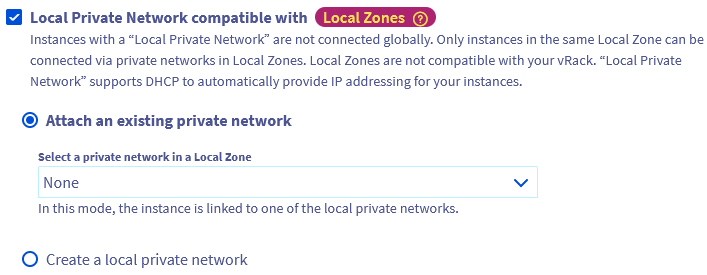{.thumbnail}
>> 

Kliknij przycisk `Dalej`{.action}, aby przejść do ostatniego etapu.

<a name="billing"></a>

#### Krok 4.6: Wybierz okres rozliczeniowy

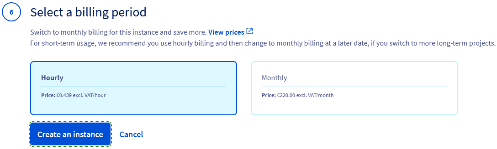{.thumbnail}

> [!primary]
>
> Pamiętaj, że w zależności od wybranego modelu instancji wyświetlane może być wyłącznie rozliczenie **godzina**. Jest to tymczasowe ograniczenie, nowe opcje fakturowania za usługę Public Cloud będą wkrótce dostępne.
>

> [!tabs]
> **Płatności miesięczne**
>>
>> Płatność miesięczna spowoduje z czasem obniżenie kosztów, ale **nie może zostać zmieniona** na fakturowanie godzinowe po utworzeniu instancji.<br>
>>
> **Płatności za godzinę**
>>
>> Płatność za godzinę jest najlepszym wyborem, jeśli nie określiłeś jasno, jak długo korzystasz z usługi. Jeśli zdecydujesz się zachować instancję na potrzeby długoterminowego użytkowania, nadal możesz [zmienić abonament na miesięczny](/pages/account_and_service_management/managing_billing_payments_and_services/changing_hourly_monthly_billing).<br>
>> Opłata za instancję zostanie naliczona, jeśli **nie zostanie usunięty**, niezależnie od faktycznego wykorzystania instancji.
>>

Szczegółowe informacje znajdziesz w naszej dedykowanej dokumentacji fakturowania:

- [Płatności za usługę Public Cloud](/pages/public_cloud/compute/analyze_billing)
- [FAQ dotyczący rozliczenia miesięcznego](/pages/public_cloud/compute/faq_change_of_monthly_billing_method)

Po zakończeniu konfiguracji Twojej instancji kliknij przycisk `Utwórz instancję`{.action}. Dostarczenie usługi może potrwać kilka minut.

<a name="connect-instance"></a>

### Etap 5: Logowanie do instancji

Instrukcje w tej części dotyczą zdalnych połączeń za pomocą protokołów **Open SSH** i **RDP** przez sieć publiczną (Internet).

Informujemy, że proponujemy alternatywne sposoby dostępu (używane głównie do rozwiązywania problemów), które są dostępne tylko w Panelu klienta OVHcloud:

- [Konsola VNC](#vnc-console)
- [Tryb rescue](/pages/public_cloud/compute/put_an_instance_in_rescue_mode)

> [!primary]
>
> Jeśli zainstalowałeś system **OS z aplikacją**, zapoznaj się z [Przewodnikiem dotyczącym pierwszych kroków z aplikacjami](/pages/public_cloud/compute/apps_first_steps) oraz z oficjalną dokumentacją producenta systemu operacyjnego.
>

<a name="verify-status"></a>

#### 5.1: Sprawdź stan instancji w Panelu klienta

Zaloguj się do [Panelu klienta OVHcloud](/links/manager), przejdź do sekcji `Public Cloud`{.action} i wybierz odpowiedni projekt Public Cloud.

{.thumbnail}

Wybierz `Instancje`{.action} na pasku nawigacyjnym po lewej stronie, pod **Compute**. Twoja instancja jest gotowa, gdy w tabeli stan jest ustawiony na `Włączony`. Jeśli instancja została niedawno utworzona i ma inny stan, kliknij przycisk Odśwież znajdujący się obok filtru wyszukiwania.

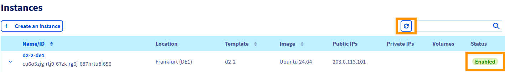{.thumbnail}

Kliknij nazwę instancji w tej tabeli, aby otworzyć `Dashboard`{.action}, na którym znajdziesz wszystkie informacje dotyczące instancji. Aby dowiedzieć się więcej o funkcjach dostępnych na tej stronie, zapoznaj się z naszym przewodnikiem dotyczącym [zarządzania instancjami w Panelu klienta](/pages/public_cloud/compute/first_steps_with_public_cloud_instance).

Użytkownik **z podwyższonym poziomem uprawnień (*sudo*) jest automatycznie tworzony** na instancji. Nazwa użytkownika odzwierciedla zainstalowany obraz, na przykład "ubuntu", "debian", "fedora", itp. Możesz to sprawdzić po prawej stronie `Dashboard`{.action} w sekcji **Sieci**.

{.thumbnail}

Jeśli Twoja [para kluczy SSH jest prawidłowo skonfigurowana](#create-ssh), możesz teraz zalogować się do instancji za pomocą wstępnie skonfigurowanego użytkownika i Twojego klucza SSH. Bardziej szczegółowe instrukcje znajdują się w następnych akapitach.

> [!primary]
>
> Dostęp przez **konsolę VNC** do nowej instancji systemu operacyjnego GNU/Linux utworzonej w Panelu klienta należy aktywować w sposób opisany w [sekcji przewodnika poniżej](#vnc-console).
>
> Ten przewodnik nie obejmuje prywatnej sieci dla instancji. Zapoznaj się z naszą dokumentacją [Public Cloud Network Services](/products/public-cloud-network) na ten temat.
>

<a name="login-linux"></a>

#### 5.2: Pierwsze logowanie do instancji z systemem OS GNU/Linux

> [!primary]
>
> Jeśli wyświetlają się komunikaty o błędach dotyczące **kluczy SSH**, sprawdź, czy na Twoim lokalnym urządzeniu jest poprawnie skonfigurowany prywatny klucz SSH, używając informacji z [tego przewodnika](/pages/bare_metal_cloud/dedicated_servers/creating-ssh-keys-dedicated#create-ssh-key).</br>
> Jeśli nadal występują problemy, możesz wymienić parę kluczy za pomocą [tego przewodnika](/pages/public_cloud/compute/replacing_lost_ssh_key).
>
> Jeśli instancja została utworzona bez klucza SSH, w [API OVHcloud](/pages/manage_and_operate/api/first-steps) lub [interfejs OpenStack Horizon](/pages/public_cloud/compute/create_instance_in_horizon) możesz dodać klucz SSH do instancji tylko w trybie [rescue](/pages/public_cloud/compute/put_an_instance_in_rescue_mode), postępując zgodnie z instrukcjami zawartymi w [tym przewodniku](/pages/public_cloud/compute/replacing_lost_ssh_key).
>

Dostęp do instancji jest możliwy zaraz po jej utworzeniu poprzez interfejs wiersza poleceń Twojego lokalnego stanowiska pracy (`Terminal`, `Command prompt`, `Powershell`, etc.) przez SSH.

```bash
ssh username@IPv4_instance
```

Przykład:

```bash
ssh ubuntu@203.0.113.101
```

[W zależności od konfiguracji](#create-ssh), wprowadź hasło, które chroni klucz prywatny lub określ ścieżkę dostępu do pliku klucza. Szczegółowe informacje na ten temat można znaleźć w [przewodniku dotyczącym kluczy SSH](/pages/bare_metal_cloud/dedicated_servers/creating-ssh-keys-dedicated#multiplekeys).

Jeśli używasz innego klienta SSH, zapoznaj się z jego dokumentacją. Przykład zastosowania rozwiązania open source `PuTTY` można znaleźć w [tym przewodniku](/pages/bare_metal_cloud/dedicated_servers/creating-ssh-keys-dedicated#useputty).

Kontynuuj[etap 6 poniżej](#manage-access).

<a name="Windows"></a>

#### 5.3: Instancje Windows

##### 5.3.1: Zakończ instalację instancji Windows

Po sprawdzeniu, czy instancja Windows jest [zainstalowana](#verify-status), otwórz kartę `Console VNC`{.action} w [Panelu klienta OVHcloud](/links/manager).

Następnie należy dokończyć wstępną konfigurację systemu operacyjnego Windows. Postępuj zgodnie z poniższymi instrukcjami, przechodząc przez karty:

> [!tabs]
> 1. **Ustawienia regionalne**
>>
>> Skonfiguruj swoje **kraj/region**, **preferowany język Windows** i **układ klawiatury**. Następnie kliknij przycisk `Next`{.action} na dole po prawej stronie.<br><br>
>>{.thumbnail}<br>
>>
> 2. **Hasło administratora**
>>
>> Ustaw hasło dla konta Windows `Administrator` i potwierdź je, następnie kliknij `Finish`{.action}.<br><br>
>>{.thumbnail}<br>
>>
> 3. **Ekran logowania**
>>
>> System Windows zastosuje ustawienia i wyświetli ekran logowania. Kliknij przycisk `Send CtrlAltDel`{.action} w prawym górnym rogu, aby się zalogować.<br><br>
>>{.thumbnail}<br>
>>
> 4. **Login administratora**
>>
>> EWprowadź hasło `Administrator` utworzone na poprzednim etapie i kliknij przycisk `Strzała`..<br><br>
>>{.thumbnail}
>>

<a name="login-windows"></a>

##### 5.3.2: Zdalny dostęp z poziomu systemu Windows

Na lokalnym komputerze z systemem Windows możesz zalogować się do instancji za pomocą aplikacji klienckiej `Remote Desktop Connection`.

{.thumbnail}

Wprowadź adres IPv4 Twojej instancji, następnie identyfikator i hasło. Zazwyczaj pojawia się komunikat ostrzegawczy z prośbą o potwierdzenie logowania z powodu nieznanego certyfikatu. Kliknij na `Tak`{.action}, aby się zalogować.

> [!primary]
>
> Jeśli masz problemy z tą procedurą, sprawdź, czy połączenia zdalne (RDP) są dozwolone na Twoim urządzeniu, sprawdzając ustawienia systemu, reguły zapory i możliwe ograniczenia sieciowe.
>

<a name="login-other"></a>

##### 5.3.3: Zdalne logowanie z innego systemu operacyjnego

Połączenia z komputerowym systemem operacyjnym innym niż Windows zazwyczaj wymagają oprogramowania klienckiego zgodnego z `Remote Desktop Protocol` (RDP). Niektóre środowiska i systemy operacyjne mogą mieć wbudowanego klienta natywnego.

Bez względu na to, którego klienta używasz, do zalogowania się do konta `Administrator` wymagany jest tylko adres IP instancji oraz hasło.

**Przykład zastosowania**

Wolne oprogramowanie open source `Remmina Remote Desktop Client` jest dostępne dla wielu dystrybucji GNU/Linux. Jeśli nie znajdziesz Remmina w managerze oprogramowania w swoim środowisku biurowym, możesz ją uzyskać na [oficjalnej stronie](https://remmina.org/).

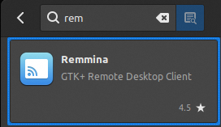{.thumbnail}<br>

> [!tabs]
> 1. **Logowanie**
>>
>> Otwórz Remmina i upewnij się, że protokół połączenia ma ustawioną wartość "RDP". Wprowadź adres IPv4 Twojej instancji Public Cloud i naciśnij `Enter`.<br><br>
>>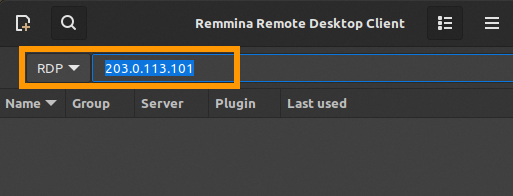{.thumbnail}<br>
>>
> 2. **Uwierzytelnianie**
>>
>> Jeśli pojawi się komunikat ostrzegawczy certyfikatu, kliknij `Yes`{.action}. Wprowadź nazwę użytkownika i hasło dla systemu Windows, a następnie kliknij przycisk `OK`{.action}, aby nawiązać połączenie.<br><br>
>>{.thumbnail}<br>
>>
> 3. **Parametry**
>>
>> Przydatne elementy można znaleźć na pasku narzędzi po lewej stronie. Na przykład kliknij ikonę `Toggle dynamic resolution update`{.action}, aby poprawić rozdzielczość okna.<br><br>
>>{.thumbnail}
>>

<a name="vnc-console"></a>

#### 5.4: Dostęp do konsoli VNC

Konsola VNC pozwala na łączenie się z instancjami, nawet jeśli inne metody dostępu nie są dostępne.

Zaloguj się do [Panelu klienta OVHcloud](/links/manager), przejdź do sekcji `Public Cloud`{.action} i wybierz odpowiedni projekt Public Cloud.

{.thumbnail}

Wybierz `Instancje`{.action} na pasku nawigacyjnym po lewej stronie, pod **Compute**. Kliknij nazwę instancji i otwórz zakładkę `Konsola VNC`{.action}.

{.thumbnail}


> [!tabs]
> **Instancja z zainstalowanym systemem operacyjnym GNU/Linux**
>>
>> Aby korzystać z konsoli VNC, w instancji musi być skonfigurowane konto użytkownika **z hasłem**. Aby ustawić hasło dla konta wstępnie skonfigurowanego, wykonaj czynności opisane w [sekcja 6.1.1 poniżej](#set-password).
>>
> **Instancja Windows**
>>
>> Zaloguj się za pomocą identyfikatora Windows. W przypadku aktywnej sesji masz natychmiastowy dostęp. Nastąpi znaczne opóźnienie w stosunku do połączenia RDP.
>>

<a name="manage-access"></a>

### Etap 6: Pierwsze kroki z nową instancją

> [!primary]
>
> **Instancje Windows**
>
> Dodatkowe etapy nie są wymagane w przypadku instancji z zainstalowanym systemem operacyjnym Windows.
>
> Więcej informacji znajdziesz w sekcji [Sprawdź również](#go-further) poniżej.
>

<a name="user-mgmt"></a>

#### 6.1: Zarządzanie użytkownikami

<a name="set-password"></a>

> [!primary]
>
> Podczas konfigurowania kont użytkowników i poziomów uprawnień dla instancji zalecamy użycie informacji z naszego [Przewodnika po koncie użytkownika](/pages/bare_metal_cloud/dedicated_servers/changing_root_password_linux_ds).
>

##### 6.1.1: Ustaw hasło dla bieżącego konta użytkownika

Podczas [logowania do instancji](#manage-access) ustaw hasło dla bieżącego użytkownika, wprowadzając następującą komendę:

```bash
sudo passwd
```

Wprowadź hasło, potwierdź przyciskiem `Enter` i powtórz.

```console
New password: 
Retype new password:
passwd: password updated successfully
```

**To wystarczy, aby aktywować logi za pośrednictwem [konsoli VNC](#vnc-console) w Twoim [Panelu klienta OVHcloud](/links/manager)**. Jednak zdalne połączenia SSH z tym hasłem są nadal **wyłączone**.

<a name="remote-password"></a>

#### 6.1.2: Aktywacja połączenia zdalnego za pomocą hasła (opcjonalnie)

> [!warning]
>
> Ten krok nie jest konieczny i powinien zostać wykonany tylko, jeśli istnieje ważny powód, dla którego należy aktywować ten typ dostępu; na przykład, jeśli konieczne jest tymczasowe zalogowanie się do instancji z urządzenia, na którym nie jest przechowywany Twój prywatny klucz SSH.
>
> Poniższy przykład ilustruje tymczasowe rozwiązanie na instancji, na której zainstalowany jest Ubuntu. Pamiętaj, że może być konieczne dostosowanie poleceń w zależności od systemu operacyjnego. Nie zaleca się zachowywania tej konfiguracji na stałe, ponieważ zwiększa ona potencjalne ryzyko bezpieczeństwa poprzez otwarcie systemu na ataki oparte na SSH.
>

Po [zalogowaniu do Twojej instancji](#manage-access) otwórz odpowiedni plik konfiguracyjny w edytorze tekstu. Przykład:

```bash
sudo nano /etc/ssh/sshd_config
```

Zmień wiersz `#PasswordAuthentication yes` w następujący sposób:

```console
PasswordAuthentication yes
```

Zmień wiersz `Include /etc/ssh/sshd_config.d/*.conf` w następujący sposób:

```console
#Include /etc/ssh/sshd_config.d/*.conf
```

Zapisz plik i zamknij edytor.

Uruchom ponownie usługę SSH za pomocą jednego z następujących poleceń:

```bash
sudo systemctl restart ssh
```

```bash
sudo systemctl restart sshd
```

Możesz teraz zalogować się przez SSH, używając nazwy użytkownika i hasła dostępu.

Anuluj te zmiany, aby powrócić do logowania za pomocą klucza dla instancji.

<a name="add-keys"></a>

#### 6.2: Dodatkowe klucze SSH

Jeśli chcesz zezwolić większej liczbie kont użytkowników na dostęp do instancji, standardowa procedura jest następująca:

- Utworzenie konta na instancji.
- Tworzenie nowej pary kluczy SSH na danym urządzeniu.
- Dodaj klucz publiczny do instancji.

Aby uzyskać szczegółowe informacje na temat tych kroków, zapoznaj się z [przewodnikiem dedykowanym](/pages/public_cloud/compute/configuring_additional_ssh_keys).

<a name="go-further"></a>

## Sprawdź również

[Jak aktywować licencję Windows dla instancji w trybie prywatnym](/pages/public_cloud/compute/activate-windows-license-private-mode)

[Jak zresetować hasło administratora systemu Windows](/pages/bare_metal_cloud/virtual_private_servers/resetting_a_windows_password)

[Zarządzanie instancjami w Panelu klienta](/pages/public_cloud/compute/first_steps_with_public_cloud_instance)

[Jak rozpocząć pracę z OpenStack](/pages/public_cloud/compute/prepare_the_environment_for_using_the_openstack_api)

[Jak rozpocząć pracę z Horizon](/pages/public_cloud/compute/introducing_horizon)

Jeśli potrzebujesz szkolenia lub pomocy technicznej w celu wdrożenia naszych rozwiązań, skontaktuj się z przedstawicielem handlowym lub kliknij [ten link](/links/professional-services), aby uzyskać wycenę i poprosić o spersonalizowaną analizę projektu od naszych ekspertów z zespołu Professional Services.

Dołącz do [grona naszych użytkowników](/links/community).
