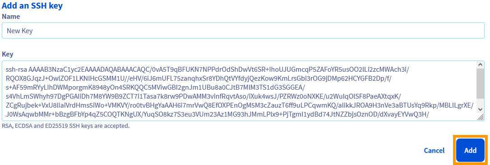
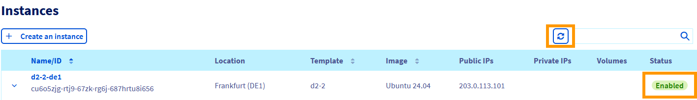
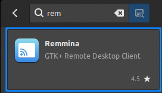
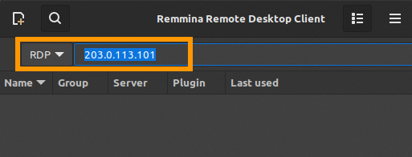
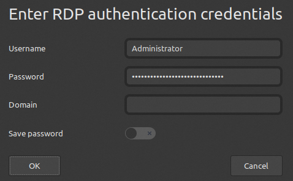

<style>
details>summary {
    color:rgb(33, 153, 232) !important;
    cursor: pointer;
}
details>summary::before {
    content:'\25B6';
    padding-right:1ch;
}
details[open]>summary::before {
    content:'\25BC';
}
</style>

## Wprowadzenie

Instancje Public Cloud są łatwe do wdrożenia i zarządzania. Jednak jako część ekosystemu OVHcloud Public Cloud instancje oferują wiele opcji konfiguracyjnych i mogą być dostosowywane do różnych zastosowań. Poniższe instrukcje zawierają wszystkie niezbędne i opcjonalne kroki tworzenia instancji w Panelu klienta OVHcloud i uzyskiwania do niej zdalnego dostępu.
W zależności od Twoich potrzeb będziesz mógł dalej rozwijać swój projekt Public Cloud.

**Niniejszy przewodnik przedstawia pierwsze kroki z instancją Public Cloud.**


## Wymagania początkowe

- [Projekt Public Cloud](/links/public-cloud/public-cloud) na koncie OVHcloud

<!-- CP-NAV-START:publiccloud-projects -->
---

### Dostęp do Panelu klienta OVHcloud

- **Link bezpośredni:** [Public Cloud Projects](/links/control-panel/publiccloud-projects)
- **Ścieżka nawigacji:** `Public Cloud`{.action} > Wybierz projekt

---
<!-- CP-NAV-END:publiccloud-projects -->

> [!success]
> Skorzystaj z obniżonych cen, zobowiązując się do korzystania z zasobów Public Cloud przez okres od 1 do 36 miesięcy. Więcej informacji na stronie [Savings Plans](/links/public-cloud/savings-plan).

## W praktyce

> [!primary]
>
> Jeśli jeszcze nie utworzyłeś projektu Public Cloud, zacznij od naszego [przewodnika dotyczącego tworzenia projektu](/pages/public_cloud/public_cloud_cross_functional/create_a_public_cloud_project).
>
> Ważne **informacje techniczne** na temat OVHcloud Public Cloud są dostępne na [tej stronie przewodnika](/pages/public_cloud/public_cloud_cross_functional/00-essential-info-to-get-started-on-public-cloud).
>

### Prezentacja zawartości

- [Wprowadzenie](#wprowadzenie)
- [Wymagania początkowe](#wymagania-poczatkowe)
- [W praktyce](#w-praktyce)
  - [Prezentacja zawartości](#prezentacja-zawartosci)
  - [Krok 1: Tworzenie zestawu kluczy SSH](#krok-1-tworzenie-zestawu-kluczy-ssh)
  - [Krok 2: Importowanie kluczy SSH](#krok-2-importowanie-kluczy-ssh)
  - [Krok 3: Przygotowanie konfiguracji sieci](#krok-3-przygotowanie-konfiguracji-sieci)
  - [Krok 4: Tworzenie instancji](#krok-4-tworzenie-instancji)
    - [Krok 4.1: Nazwa instancji](#krok-41-nazwa-instancji)
    - [Krok 4.2: Wybór lokalizacji](#krok-42-wybor-lokalizacji)
    - [Krok 4.3: Wybór modelu](#krok-43-wybor-modelu)
      - [Informacje dodatkowe](#informacje-dodatkowe)
    - [Krok 4.4: Wybór obrazu](#krok-44-wybor-obrazu)
    - [Krok 4.5: Wybór klucza SSH (nie dotyczy instancji Windows)](#krok-45-wybor-klucza-ssh-nie-dotyczy-instancji-windows)
    - [Krok 4.6: Konfiguracja ustawień kopii zapasowych](#krok-46-konfiguracja-ustawien-kopii-zapasowych)
    - [Krok 4.7: Konfiguracja sieci](#krok-47-konfiguracja-sieci)
    - [Krok 4.8: Wybór okresu rozliczeniowego](#krok-48-wybor-okresu-rozliczeniowego)
    - [Krok 4.9: Konfiguracja ustawień zaawansowanych](#krok-49-konfiguracja-ustawien-zaawansowanych)
      - [Elastyczna instancja](#elastyczna-instancja)
      - [Skrypt poinstalacyjny](#skrypt-poinstalacyjny)
    - [Krok 4.10: Finalizacja instancji](#krok-410-finalizacja-instancji)
  - [Krok 5: Połączenie z instancją](#krok-5-polaczenie-z-instancja)
    - [5.1: Sprawdzenie stanu instancji w Panelu klienta OVHcloud](#51-sprawdzenie-stanu-instancji-w-panelu-klienta-ovhcloud)
    - [5.2: Pierwsze logowanie do instancji z zainstalowanym systemem GNU/Linux](#52-pierwsze-logowanie-do-instancji-z-zainstalowanym-systemem-gnulinux)
    - [5.3: Instancje Windows](#53-instancje-windows)
      - [5.3.1: Dokończenie instalacji instancji Windows](#531-dokonczenie-instalacji-instancji-windows)
      - [5.3.2: Zdalne logowanie z systemu Windows](#532-zdalne-logowanie-z-systemu-windows)
      - [5.3.3: Zdalne logowanie z innego systemu operacyjnego](#533-zdalne-logowanie-z-innego-systemu-operacyjnego)
    - [5.4: Dostęp do konsoli VNC](#54-dostep-do-konsoli-vnc)
  - [Krok 6: Pierwsze kroki z nową instancją](#krok-6-pierwsze-kroki-z-nowa-instancja)
    - [6.1: Zarządzanie użytkownikami](#61-zarzadzanie-uzytkownikami)
      - [6.1.1: Ustawienie hasła dla bieżącego konta użytkownika](#611-ustawienie-hasla-dla-biezacego-konta-uzytkownika)
      - [6.1.2: Aktywacja zdalnego logowania za pomocą hasła (opcjonalnie)](#612-aktywacja-zdalnego-logowania-za-pomoca-hasla-opcjonalnie)
    - [6.2: Dodatkowe klucze SSH](#62-dodatkowe-klucze-ssh)
- [Sprawdź również](#sprawdz-rowniez)


> [!primary]
>
> **Podczas tworzenia instancji Public Cloud w Panelu klienta OVHcloud należy podać publiczny klucz SSH.** Po utworzeniu instancji możesz skonfigurować zdalny dostęp w dowolny sposób.
>
> **Wyjątek**: Uwierzytelnianie logowania do instancji Windows wymaga podania nazwy użytkownika i hasła, ponieważ system Windows używa protokołu RDP (**R**emote **D**esktop **P**rotocol).
>

### Krok 1: Tworzenie zestawu kluczy SSH

Jeśli posiadasz gotową parę kluczy SSH, możesz pominąć ten krok.

[Protokół SSH](/pages/bare_metal_cloud/dedicated_servers/ssh_introduction) umożliwia szyfrowaną komunikację klient-serwer. **Para kluczy SSH** składa się z klucza publicznego i klucza prywatnego.

- **Klucz publiczny** jest dodawany do instancji Public Cloud (i może być również [przechowywany w Panelu klienta OVHcloud](#krok-2-importowanie-kluczy-ssh)).
- **Klucz prywatny** jest przechowywany na Twoim lokalnym urządzeniu i musi być zabezpieczony przed nieuprawnionym dostępem. Tylko urządzenia klienckie z odpowiednim kluczem prywatnym mogą uzyskać dostęp do Twojej instancji. Do zalogowania nie jest wymagane hasło konta użytkownika.

Masz do wyboru dwie opcje tworzenia kluczy SSH i zarządzania nimi:

- Interfejs wiersza poleceń systemu operacyjnego (prosty klient **OpenSSH**)
- Dodatkowe oprogramowanie (kompatybilne z protokołem **OpenSSH**) z wierszem poleceń lub interfejsem graficznym

Większość współczesnych stacjonarnych systemów operacyjnych zawiera natywnie klienta **OpenSSH**, dostępnego za pośrednictwem aplikacji wiersza poleceń systemu (`cmd`, `Powershell`, `Terminal`, itp.). Jeśli nie wiesz, jak używać kluczy SSH jako metody uwierzytelniania, możesz skorzystać z instrukcji w [tym przewodniku](/pages/public_cloud/compute/creating-ssh-keys-pci#create-ssh-key), aby utworzyć parę kluczy.

Jeśli używasz innego oprogramowania, zapoznaj się z jego dokumentacją. Przykład użycia rozwiązania open source `PuTTY` jest dostępny w naszym przewodniku: [Jak korzystać z PuTTY](/pages/web_cloud/web_hosting/ssh_using_putty_on_windows).


### Krok 2: Importowanie kluczy SSH

Publiczne klucze SSH możesz przechowywać w sekcji `Public Cloud`{.action} w [Panelu klienta OVHcloud](/links/manager). Nie jest to obowiązkowe, ale sprawia, że proces tworzenia instancji jest wygodniejszy.

> [!primary]
>
> Przechowywane klucze SSH pozwalają na szybsze tworzenie instancji w Panelu klienta OVHcloud. Aby zmienić pary kluczy i dodać użytkowników po utworzeniu instancji, zapoznaj się z przewodnikiem dotyczącym [dodatkowych kluczy SSH](/pages/public_cloud/compute/configuring_additional_ssh_keys).
>
> Publiczne klucze SSH dodane do Panelu klienta OVHcloud będą dostępne dla usług Public Cloud we wszystkich [regionach](/links/public-cloud/regions-pci). Możesz przechowywać klucze zaszyfrowane algorytmami **RSA**, **ECDSA** i **ED25519**.
>

Otwórz `Klucze SSH`{.action} w menu po lewej stronie, w sekcji **Ustawienia**. Kliknij przycisk `Dodaj klucz SSH`{.action}.

{.thumbnail}

W nowym oknie wpisz nazwę klucza. Wypełnij pole `Klucz` ciągiem klucza publicznego, na przykład kluczem utworzonym w [Kroku 1](#krok-1-tworzenie-zestawu-kluczy-ssh). Potwierdź, klikając `Dodaj`{.action}.

{.thumbnail}

Możesz teraz wybrać ten klucz w [Kroku 4](#krok-4-tworzenie-instancji), aby dodać go do nowej instancji.

### Krok 3: Przygotowanie konfiguracji sieci

Przed utworzeniem instancji zalecamy rozważenie sposobu jej wykorzystania w kontekście sieciowym.

- Jeśli w tym momencie nie musisz konfigurować instancji z siecią prywatną, możesz przejść do [kroku 4](#krok-4-tworzenie-instancji). Możesz utworzyć instancję udostępnioną w publicznym Internecie (zobacz **Tryb publiczny** [poniżej](#networking-modes)).
- Jeśli instancja musi być podłączona do nowej sieci prywatnej (OVHcloud [vRack](/links/network/vrack)), należy pamiętać, że usługa vRack jest tworzona automatycznie podczas tworzenia projektu Public Cloud. Żadne wcześniejsze działanie nie jest zatem wymagane. Więcej informacji znajdziesz w [przewodniku dotyczącym usługi vRack Public Cloud](/pages/public_cloud/public_cloud_network_services/getting-started-07-creating-vrack).

<a name="networking-modes"></a>

/// details | Public Cloud Networking - Tryby

**Public Mode**

Instancje w trybie publicznym są udostępniane w publicznym Internecie bezpośrednio przez IPv4/IPv6. Adresy IP nie mogą być modyfikowane, ale instancje mogą mieć przypisane adresy [Additional IP](/links/network/additional-ip) ([w tym Twoje własne](/links/network/byoip)) i mogą być podłączone do sieci [vRack](/links/network/vrack).

**Private Mode**

Instancje w trybie prywatnym mogą być udostępniane w publicznym Internecie tylko za pośrednictwem usługi [Gateway](/links/public-cloud/gateway) lub [Load Balancer](/links/public-cloud/load-balancer) oraz adresów [Floating IP](/links/public-cloud/floating-ip).

Więcej informacji znajdziesz w naszych przewodnikach w sekcji [Public Cloud Network Services](/products/public-cloud-network). [Przewodnik po pojęciach](/pages/public_cloud/public_cloud_network_services/concepts-01-public-cloud-networking-concepts) stanowi wprowadzenie do Public Cloud Networking.

**Local Private Mode**

Lokalny tryb prywatny ma zastosowanie tylko wtedy, gdy utworzysz instancję w strefie **Local Zone**. Instancje mogą być udostępniane w publicznym Internecie bezpośrednio przez IPv4/IPv6. Tylko instancje w tej samej strefie Local Zone mogą być połączone za pośrednictwem sieci prywatnych. Strefy Local Zone nie są kompatybilne z usługą [vRack](/links/network/vrack). W tym trybie DHCP automatycznie przypisuje adresy IP do Twoich instancji.

Więcej informacji znajdziesz na [stronie internetowej Local Zones](/links/public-cloud/local-zones).

///

### Krok 4: Tworzenie instancji

> [!primary]
>
> Publiczny klucz SSH jest wymagany podczas tworzenia instancji w Panelu klienta OVHcloud (z wyjątkiem instancji Windows).
>
> Zapoznaj się z [krokiem 1](#krok-1-tworzenie-zestawu-kluczy-ssh) i [krokiem 2](#krok-2-importowanie-kluczy-ssh) w tym przewodniku, jeśli nie posiadasz gotowych kluczy SSH.
>

Na stronie **Strona główna** kliknij `Utwórz instancję`{.action}.

#### Krok 4.1: Nazwa instancji

Wprowadź pełną nazwę instancji. Domyślną wartością jest oznaczenie handlowe modelu instancji. W razie potrzeby możesz dodać region i datę, aby ułatwić identyfikację i zarządzanie instancjami.

#### Krok 4.2: Wybór lokalizacji

Wybierz [lokalizację](/links/public-cloud/regions-pci) najbliższą Twoim użytkownikom lub klientom. Pamiętaj, że wybranie strefy **Local Zone** na tym etapie spowoduje zastosowanie ograniczeń sieciowych dla instancji (patrz [Krok 3](#networking-modes)).

Zapoznaj się również z informacjami na [stronie internetowej Local Zones](/links/public-cloud/local-zones) oraz w [dokumentacji możliwości Local Zones](/pages/public_cloud/compute/local-zones-capabilities-limitations).

Wybór regionu determinuje sposób wdrożenia instancji (1-AZ, 3-AZ lub Local Zones). Aby zrozumieć różnice w zakresie odporności, dostępności i architektury, zapoznaj się z naszym przewodnikiem [Porównanie trybów wdrożenia i odporność – omówienie 3-AZ / 1-AZ / Local Zones](/pages/public_cloud/public_cloud_cross_functional/deployment_modes_comparison_resilience_details).

#### Krok 4.3: Wybór modelu

Na tym etapie wybierz model instancji (znany również jako flavor), który określa zasoby przydzielone do Twojej instancji: procesor, pamięć i powiązane możliwości. Otwórz listę rozwijaną `Model instancji`, a następnie wybierz typ modelu najlepiej odpowiadający Twojemu przypadkowi użycia, aby uzyskać dostęp do naszej gamy zoptymalizowanych instancji.

Typ modelu `Discovery` grupuje instancje ze współdzielonymi zasobami oferowanymi w konkurencyjnych cenach. Są one szczególnie odpowiednie do odkrywania OVHcloud Public Cloud, przeprowadzania testów lub hostingu lekkich obciążeń roboczych, takich jak aplikacje internetowe.

Modele `Metal Instances` oferują w pełni dedykowane zasoby fizyczne, gwarantując stałą wydajność i maksymalną izolację dla najbardziej wymagających obciążeń roboczych.

> [!primary]
>
> Całkowite zasoby Public Cloud zostaną początkowo ograniczone ze względu na kontrolę kosztów i bezpieczeństwo. Możesz sprawdzić te limity, klikając `Limity i regiony`{.action} na pasku nawigacyjnym po lewej stronie, w sekcji **Ustawienia**. Więcej informacji znajdziesz w [dedykowanej dokumentacji](/pages/public_cloud/public_cloud_cross_functional/increasing_public_cloud_quota).
>
> Pamiętaj, że po utworzeniu instancji możesz ją **uaktualnić**, aby uzyskać więcej zasobów. Jednak przejście na mniejszy model nie jest możliwe w przypadku zwykłej instancji. Więcej informacji na ten temat znajdziesz w **kroku 4.9** poniżej.
>

##### Informacje dodatkowe

/// details | Kategorie modeli instancji

| Typ | Gwarantowane zasoby | Uwagi dotyczące użycia |
| :---         |     :---:      |          :--- |
| Best Sellers   | ✓     | Najpopularniejsze modele.    |
| General Purpose   | ✓     | Serwery deweloperskie, aplikacje internetowe lub biznesowe    |
| Compute Optimized     | ✓       | Kodowanie wideo lub inne zastosowania wymagające dużej mocy obliczeniowej      |
| Memory Optimized    | ✓     | Bazy danych, analizy i obliczenia w pamięci    |
| GPU     | ✓       | Moc przetwarzania równoległego dla zaawansowanych aplikacji (renderowanie, big data, deep learning, itp.)       |
| Discovery    | -       | Hosting ze współdzielonymi zasobami dla środowisk testowych i deweloperskich      |
| Storage Optimized   | ✓     | Zoptymalizowane do przesyłania danych na dysk    |
| Metal Instances | ✓ | Dedykowane zasoby z bezpośrednim dostępem do zasobów obliczeniowych, pamięci masowej i sieci|

///

/// details | Regiony i Local Zones

**Regiony**

**Region** to lokalizacja na świecie składająca się z jednego lub kilku centrów danych, w których hostowane są usługi OVHcloud. Więcej informacji na temat regionów, podziału geograficznego i dostępności usług znajdziesz na naszej [stronie internetowej dotyczącej regionów](/links/public-cloud/regions-pci) oraz na naszej [stronie internetowej dotyczącej infrastruktury](/links/infrareg).

**Local Zones**

Local Zones to rozszerzenie **regionów**, które przybliża usługi OVHcloud do określonych lokalizacji, oferując krótszy czas odpowiedzi i lepszą wydajność aplikacji. Więcej informacji znajdziesz na [stronie internetowej Local Zones](/links/public-cloud/local-zones) oraz w [dokumentacji możliwości Local Zones](/pages/public_cloud/compute/local-zones-capabilities-limitations).

///

#### Krok 4.4: Wybór obrazu

Otwórz listę rozwijaną `Rodzaj dystrybucji`, wybierz kategorię odpowiadającą Twoim potrzebom, a następnie wybierz system operacyjny do wdrożenia na instancji za pomocą rozwijanego menu `Wersja obrazu`.

Obrazy dostępne na tym etapie zależą od wyborów dokonanych na wcześniejszych etapach, tj. kompatybilności z modelem instancji i dostępności regionalnej. Na przykład, jeśli chcesz wybrać system operacyjny Windows i nie ma żadnych opcji na karcie Windows, musisz zmienić wybory na wcześniejszych etapach.

> [!primary]
>
> Jeśli wybierzesz system operacyjny wymagający płatnej licencji, koszty te zostaną automatycznie uwzględnione na fakturze za projekt.
>

#### Krok 4.5: Wybór klucza SSH (nie dotyczy instancji Windows)

Z wyjątkiem instancji Windows konfiguracja instancji wymaga również **dodania publicznego klucza SSH**. Masz dwie opcje:

- Użycie klucza publicznego już przechowywanego w Panelu klienta OVHcloud
- Bezpośrednie wprowadzenie klucza publicznego

Kliknij poniższe karty, aby wyświetlić ich opis:

> [!tabs]
> **Użycie przechowywanego klucza**
>>
>> Aby dodać klucz przechowywany w Panelu klienta OVHcloud (patrz [Krok 2](#krok-2-importowanie-kluczy-ssh)), wybierz go z listy.
>>
> **Bezpośrednie wprowadzenie klucza**
>>
>> Aby dodać klucz publiczny przez wklejenie ciągu klucza, kliknij przycisk `Utwórz nowy klucz SSH`{.action}.
>>
>> Wprowadź nazwę klucza i ciąg klucza w odpowiednich polach. Następnie kliknij `Zatwierdź klucz`{.action}.
>>

#### Krok 4.6: Konfiguracja ustawień kopii zapasowych

[Automatyczne kopie zapasowe](/pages/public_cloud/compute/save_an_instance) są domyślnie włączone. Zapoznaj się z cennikiem i dodatkowymi informacjami przed kontynuowaniem.

Następnie wybierz typ rotacji, czyli maksymalną liczbę kopii zapasowych przechowywanych w historii: 7 lub 14 dni.

#### Krok 4.7: Konfiguracja sieci

Na tym etapie skonfigurujesz sieć dla swojej instancji.

**Sieć prywatna**

Możesz podłączyć instancję do [sieci prywatnej](#networking-modes) i przypisać jej adres [Floating IP](/links/public-cloud/floating-ip).

Klikając `Utwórz prywatną sieć`{.action}, możesz utworzyć ją bezpośrednio:

- Nadaj sieci nazwę
- **Wybierz identyfikator VLAN:** identyfikator używany do łączenia wielu usług i zasobów w tej samej sieci prywatnej za pomocą wspólnego numeru segmentacji sieci
- **Zdefiniuj CIDR:** zakres adresów IP dla sieci
- **Włącz DHCP, zaznaczając odpowiednie pole, jeśli to konieczne:** włącz tę opcję, jeśli chcesz, aby adresy IP były przypisywane automatycznie

> [!primary]
>
> Instancja może pozostać w pełni prywatna, jeśli nie przypiszesz jej publicznego adresu IP.
>

**Gateway**

Możesz włączyć opcję przypisania bramy do sieci. Domyślnie brama ma rozmiar S, ale możesz dostosować jej rozmiar później w ustawieniach.

**Przypisanie łączności publicznej**

Możesz włączyć lub wyłączyć tę funkcję w zależności od potrzeb. Jeśli zdecydujesz się ją włączyć, masz dwie opcje:

- **Basic Public IP:** tymczasowy publiczny adres IP, który nie jest zachowywany po zakończeniu cyklu życia instancji. Pamiętaj, że korzystanie z Basic Public IP nie jest kompatybilne z bramą.
- **Floating IP:** możesz utworzyć nowy adres Floating IP lub ponownie użyć istniejącego adresu, co pozwala na stały publiczny adres IP, który można odłączyć od instancji.

#### Krok 4.8: Wybór okresu rozliczeniowego

> [!primary]
>
> Pamiętaj, że w zależności od wybranego modelu instancji wyświetlane może być wyłącznie rozliczenie **godzinowe**. Jest to tymczasowe ograniczenie; nowe opcje fakturowania za usługę Public Cloud będą wkrótce dostępne.
>

> [!tabs]
> **Płatność miesięczna**
>>
>> Płatność miesięczna pozwala na obniżenie kosztów w dłuższej perspektywie, ale **nie może zostać zmieniona** na rozliczenie godzinowe po utworzeniu instancji.
>>
> **Płatność godzinowa**
>>
>> Płatność godzinowa jest najlepszym wyborem, jeśli nie określiłeś jasno okresu użytkowania. Jeśli zdecydujesz się zachować instancję na dłużej, zawsze możesz [zmienić abonament na miesięczny](/pages/account_and_service_management/managing_billing_payments_and_services/changing_hourly_monthly_billing).
>>
>> Opłata za instancję będzie naliczana tak długo, jak instancja **nie zostanie usunięta**, niezależnie od jej faktycznego wykorzystania.
>>

Szczegółowe informacje znajdziesz w naszej dedykowanej dokumentacji dotyczącej rozliczeń:

- [Rozliczenia za usługę Public Cloud](/pages/public_cloud/public_cloud_cross_functional/analyze_billing)
- [FAQ dotyczący rozliczenia miesięcznego](/pages/public_cloud/compute/faq_change_of_monthly_billing_method)

Po zakończeniu konfiguracji instancji możesz kliknąć przycisk `Uruchom instancję`{.action} lub skonfigurować ustawienia zaawansowane (patrz poniżej). Dostarczenie usługi może potrwać kilka minut.

#### Krok 4.9: Konfiguracja ustawień zaawansowanych

##### Elastyczna instancja

Instancja Flex to instancja z pojedynczym dyskiem 50 GB, zaprojektowana w celu szybszego tworzenia i przywracania migawek.

Umożliwia ona zmianę rozmiaru na wyższe lub niższe modele przy zachowaniu stałej przestrzeni dyskowej. Klasyczne modele pozwalają jedynie na zmianę rozmiaru na wyższe modele.

##### Skrypt poinstalacyjny

W tym polu możesz dodać [swój skrypt poinstalacyjny](/pages/public_cloud/compute/launching_script_when_creating_instance).

#### Krok 4.10: Finalizacja instancji

Po prawej stronie ekranu znajdziesz podsumowanie konfiguracji. W tej sekcji możesz skonfigurować liczbę instancji do utworzenia. Możesz utworzyć wiele instancji na podstawie wyborów dokonanych podczas etapów tworzenia, ale będą obowiązywać [limity przydziału](/pages/public_cloud/public_cloud_cross_functional/increasing_public_cloud_quota) zasobów.

Po zakończeniu konfiguracji instancji kliknij przycisk `Uruchom instancję`{.action}. Dostarczenie usługi może potrwać kilka minut.

### Krok 5: Połączenie z instancją

Instrukcje w tej części dotyczą zdalnych połączeń za pomocą protokołów **OpenSSH** i **RDP** przez sieć publiczną (Internet).

Informujemy, że proponujemy alternatywne sposoby dostępu (używane głównie do rozwiązywania problemów), które są dostępne tylko w Panelu klienta OVHcloud:

- [Konsola VNC](#54-dostep-do-konsoli-vnc)
- [Tryb Rescue](/pages/public_cloud/compute/put_an_instance_in_rescue_mode)

> [!primary]
>
> Jeśli zainstalowałeś **system OS z aplikacją**, zapoznaj się z naszym [przewodnikiem dotyczącym pierwszych kroków z aplikacjami](/pages/public_cloud/compute/apps_first_steps) oraz z oficjalną dokumentacją wydawcy.
>

#### 5.1: Sprawdzenie stanu instancji w Panelu klienta OVHcloud

Wybierz `Instancje`{.action} na pasku nawigacyjnym po lewej stronie, w sekcji **Compute**. Twoja instancja jest gotowa, gdy w tabeli stan jest ustawiony na `Włączony`. Jeśli instancja została niedawno utworzona i ma inny stan, kliknij przycisk "Odśwież" znajdujący się obok filtru wyszukiwania.

{.thumbnail}

Kliknij nazwę instancji w tej tabeli, aby otworzyć `Dashboard`{.action}, na którym znajdziesz wszystkie informacje dotyczące instancji. Aby dowiedzieć się więcej o funkcjach dostępnych na tej stronie, zapoznaj się z naszym przewodnikiem dotyczącym [zarządzania instancjami w Panelu klienta](/pages/public_cloud/compute/first_steps_with_public_cloud_instance).

Na instancji **automatycznie tworzony jest użytkownik z podwyższonymi uprawnieniami (*sudo*)**. Nazwa użytkownika odzwierciedla zainstalowany obraz, np. "ubuntu", "debian", "fedora", itp. Możesz to sprawdzić po prawej stronie `Dashboard`{.action} w sekcji **Sieci**.

{.thumbnail}

Jeśli Twoja [para kluczy SSH jest prawidłowo skonfigurowana](#krok-1-tworzenie-zestawu-kluczy-ssh), możesz teraz połączyć się z instancją za pomocą wstępnie skonfigurowanego użytkownika i Twojego klucza SSH. Bardziej szczegółowe instrukcje znajdziesz w kolejnych akapitach.

> [!primary]
>
> Dostęp przez **konsolę VNC** do nowej instancji z systemem GNU/Linux utworzonej w Panelu klienta należy najpierw włączyć, jak opisano w [sekcji przewodnika poniżej](#54-dostep-do-konsoli-vnc).
>
> Ten przewodnik nie obejmuje sieci prywatnych dla instancji. Zapoznaj się z naszą dokumentacją dotyczącą [Public Cloud Network Services](/products/public-cloud-network) na ten temat.
>

#### 5.2: Pierwsze logowanie do instancji z zainstalowanym systemem GNU/Linux

> [!primary]
>
> Jeśli wyświetlają się komunikaty o błędach dotyczące **kluczy SSH**, sprawdź, czy na Twoim lokalnym urządzeniu jest poprawnie skonfigurowany prywatny klucz SSH, korzystając z informacji w [tym przewodniku](/pages/public_cloud/compute/creating-ssh-keys-pci#create-ssh-key).<br>
> Jeśli nadal występują problemy, możesz wymienić parę kluczy za pomocą [tego przewodnika](/pages/public_cloud/compute/replacing_lost_ssh_key).
>
> Jeśli instancja została utworzona bez klucza SSH, za pośrednictwem [API OVHcloud](/pages/manage_and_operate/api/first-steps) lub [interfejsu OpenStack Horizon](/pages/public_cloud/compute/create_instance_in_horizon), możesz dodać klucz SSH do instancji tylko w [trybie Rescue](/pages/public_cloud/compute/put_an_instance_in_rescue_mode), postępując zgodnie z instrukcjami zawartymi w [tym przewodniku](/pages/public_cloud/compute/replacing_lost_ssh_key).
>

Dostęp do instancji jest możliwy zaraz po jej utworzeniu za pomocą interfejsu wiersza poleceń Twojego lokalnego urządzenia (`Terminal`, `Command prompt`, `Powershell`, itp.) przez SSH.

```bash
ssh username@IPv4_instance
```

Przykład:

```bash
ssh ubuntu@203.0.113.101
```

[W zależności od konfiguracji](#krok-1-tworzenie-zestawu-kluczy-ssh) wprowadź hasło chroniące Twój klucz prywatny lub określ ścieżkę do pliku klucza. Szczegółowe informacje na ten temat znajdziesz w naszym [przewodniku dotyczącym kluczy SSH](/pages/public_cloud/compute/creating-ssh-keys-pci#multiplekeys).

Jeśli używasz innego klienta SSH, zapoznaj się z jego dokumentacją. Przykład użycia rozwiązania open source `PuTTY` jest dostępny w [tym przewodniku](/pages/web_cloud/web_hosting/ssh_using_putty_on_windows).

Kontynuuj [Krok 6 poniżej](#krok-6-pierwsze-kroki-z-nowa-instancja).

#### 5.3: Instancje Windows

##### 5.3.1: Dokończenie instalacji instancji Windows

Po sprawdzeniu, czy instancja Windows jest [zainstalowana](#51-sprawdzenie-stanu-instancji-w-panelu-klienta-ovhcloud), otwórz kartę `Konsola VNC`{.action} w [Panelu klienta OVHcloud](/links/manager).

Następnie należy dokończyć wstępną konfigurację systemu operacyjnego Windows. Postępuj zgodnie z poniższymi krokami, nawigując po kartach:

> [!tabs]
> 1. **Ustawienia regionalne**
>>
>> Skonfiguruj swój **kraj/region**, **preferowany język Windows** i **układ klawiatury**. Następnie kliknij przycisk `Next`{.action} w prawym dolnym rogu.<br><br>
>>{.thumbnail}<br>
>>
> 2. **Hasło administratora**
>>
>> Ustaw hasło dla konta Windows `Administrator` i potwierdź je, następnie kliknij `Finish`{.action}.<br><br>
>>{.thumbnail}<br>
>>
> 3. **Ekran logowania**
>>
>> System Windows zastosuje ustawienia, a następnie wyświetli ekran logowania. Kliknij przycisk `Send CtrlAltDel`{.action} w prawym górnym rogu, aby się zalogować.<br><br>
>>{.thumbnail}<br>
>>
> 4. **Logowanie administratora**
>>
>> Wprowadź hasło `Administrator` utworzone na poprzednim etapie i kliknij przycisk `Strzałka`.<br><br>
>>{.thumbnail}
>>

##### 5.3.2: Zdalne logowanie z systemu Windows

Na lokalnym komputerze z systemem Windows możesz zalogować się do instancji za pomocą aplikacji klienckiej `Remote Desktop Connection`.

{.thumbnail}

Wprowadź adres IPv4 Twojej instancji, następnie swoją nazwę użytkownika i hasło. Zazwyczaj pojawia się komunikat ostrzegawczy z prośbą o potwierdzenie połączenia z powodu nieznanego certyfikatu. Kliknij `Tak`{.action}, aby się zalogować.

> [!primary]
>
> Jeśli masz problemy z tą procedurą, sprawdź, czy połączenia zdalne (RDP) są dozwolone na Twoim urządzeniu, weryfikując ustawienia systemu, reguły zapory i możliwe ograniczenia sieciowe.
>

##### 5.3.3: Zdalne logowanie z innego systemu operacyjnego

Połączenia z komputerowym systemem operacyjnym innym niż Windows zazwyczaj wymagają oprogramowania klienckiego kompatybilnego z `Remote Desktop Protocol` (RDP). Niektóre środowiska graficzne i systemy operacyjne mogą mieć wbudowanego klienta natywnego.

Bez względu na to, którego klienta używasz, do połączenia wymagany jest tylko adres IP instancji oraz hasło do konta `Administrator`.

**Przykład użycia**

Wolne oprogramowanie open source `Remmina Remote Desktop Client` jest dostępne dla wielu dystrybucji GNU/Linux. Jeśli nie znajdziesz Remmina w menedżerze oprogramowania Twojego środowiska graficznego, możesz je pobrać z [oficjalnej strony](https://remmina.org/).

{.thumbnail}<br>

> [!tabs]
> 1. **Połączenie**
>>
>> Otwórz Remmina i upewnij się, że protokół połączenia jest ustawiony na "RDP". Wprowadź adres IPv4 Twojej instancji Public Cloud i naciśnij `Enter`.<br><br>
>>{.thumbnail}<br>
>>
> 2. **Uwierzytelnianie**
>>
>> Jeśli pojawi się komunikat ostrzegawczy dotyczący certyfikatu, kliknij `Yes`{.action}. Wprowadź nazwę użytkownika i hasło dla systemu Windows, a następnie kliknij `OK`{.action}, aby nawiązać połączenie.<br><br>
>>{.thumbnail}<br>
>>
> 3. **Ustawienia**
>>
>> Przydatne elementy znajdziesz na pasku narzędzi po lewej stronie. Na przykład kliknij ikonę `Toggle dynamic resolution update`{.action}, aby poprawić rozdzielczość okna.<br><br>
>>{.thumbnail}
>>

#### 5.4: Dostęp do konsoli VNC

Konsola VNC pozwala na łączenie się z instancjami, nawet jeśli inne metody dostępu nie są dostępne.

Wybierz `Instancje`{.action} na pasku nawigacyjnym po lewej stronie, w sekcji **Compute**. Kliknij nazwę instancji i otwórz kartę `Konsola VNC`{.action}.

{.thumbnail}

> [!tabs]
> **Instancja z zainstalowanym systemem GNU/Linux**
>>
>> Aby korzystać z konsoli VNC, w instancji musi być skonfigurowane **konto użytkownika z hasłem**. Aby ustawić hasło dla wstępnie skonfigurowanego konta, wykonaj czynności opisane w [sekcji 6.1.1 poniżej](#611-ustawienie-hasla-dla-biezacego-konta-uzytkownika).
>>
> **Instancja Windows**
>>
>> Zaloguj się za pomocą danych logowania Windows. W przypadku aktywnej sesji logowania masz natychmiastowy dostęp. Nastąpi zauważalne opóźnienie w porównaniu z połączeniem RDP.
>>

### Krok 6: Pierwsze kroki z nową instancją

> [!primary]
>
> **Instancje Windows**
>
> Dodatkowe kroki nie są wymagane w przypadku instancji z zainstalowanym systemem operacyjnym Windows.
>
> Więcej informacji znajdziesz w sekcji [Sprawdź również](#sprawdz-rowniez) poniżej.
>

#### 6.1: Zarządzanie użytkownikami

> [!primary]
>
> Podczas konfigurowania kont użytkowników i poziomów uprawnień w instancji zalecamy skorzystanie z informacji zawartych w naszym [przewodniku dotyczącym konta użytkownika](/pages/bare_metal_cloud/dedicated_servers/changing_root_password_linux_ds).
>

##### 6.1.1: Ustawienie hasła dla bieżącego konta użytkownika

Po [zalogowaniu do instancji](#krok-6-pierwsze-kroki-z-nowa-instancja) ustaw hasło dla bieżącego użytkownika, wprowadzając następujące polecenie:

```bash
sudo passwd
```

Wprowadź hasło, potwierdź przyciskiem `Enter` i powtórz.

```console
New password:
Retype new password:
passwd: password updated successfully
```

**To wystarczy, aby aktywować logowanie za pośrednictwem [konsoli VNC](#54-dostep-do-konsoli-vnc) w Twoim [Panelu klienta OVHcloud](/links/manager)**. Jednak zdalne logowanie SSH za pomocą tego hasła jest nadal domyślnie **wyłączone**.

##### 6.1.2: Aktywacja zdalnego logowania za pomocą hasła (opcjonalnie)

> [!warning]
>
> Ten krok nie jest konieczny i powinien zostać wykonany tylko, jeśli istnieje uzasadniony powód do aktywacji tego typu dostępu; na przykład, jeśli konieczne jest tymczasowe zalogowanie się do instancji z urządzenia, na którym nie jest przechowywany Twój prywatny klucz SSH.
>
> Poniższy przykład ilustruje tymczasowe rozwiązanie na instancji z zainstalowanym systemem Ubuntu. Pamiętaj, że może być konieczne dostosowanie poleceń w zależności od systemu operacyjnego. Nie zaleca się utrzymywania tej konfiguracji na stałe, ponieważ stanowi ona potencjalne zagrożenie bezpieczeństwa poprzez otwarcie systemu na ataki oparte na SSH.
>

Po [zalogowaniu do instancji](#krok-6-pierwsze-kroki-z-nowa-instancja) otwórz odpowiedni plik konfiguracyjny w edytorze tekstu. Przykład:

```bash
sudo nano /etc/ssh/sshd_config
```

Zmień wiersz `#PasswordAuthentication yes` w następujący sposób:

```console
PasswordAuthentication yes
```

Zmień wiersz `Include /etc/ssh/sshd_config.d/*.conf` w następujący sposób:

```console
#Include /etc/ssh/sshd_config.d/*.conf
```

Zapisz plik i zamknij edytor.

Uruchom ponownie usługę SSH za pomocą jednego z następujących poleceń:

```bash
sudo systemctl restart ssh
```

```bash
sudo systemctl restart sshd
```

Możesz teraz zalogować się przez SSH, używając nazwy użytkownika i hasła.

Cofnij te zmiany, aby powrócić do logowania za pomocą klucza dla instancji.

#### 6.2: Dodatkowe klucze SSH

Jeśli chcesz zezwolić większej liczbie kont użytkowników na dostęp do instancji, standardowa procedura jest następująca:

- Utworzenie konta na instancji.
- Utworzenie nowej pary kluczy SSH na danym urządzeniu.
- Dodanie klucza publicznego do instancji.

Szczegółowe informacje na temat tych kroków znajdziesz w naszym [dedykowanym przewodniku](/pages/public_cloud/compute/configuring_additional_ssh_keys).

## Sprawdź również

[Jak aktywować licencję Windows dla instancji w trybie prywatnym](/pages/public_cloud/compute/activate-windows-license-private-mode)

[Jak zresetować hasło administratora systemu Windows](/pages/bare_metal_cloud/virtual_private_servers/resetting_a_windows_password)

[Zarządzanie instancjami w Panelu klienta](/pages/public_cloud/compute/first_steps_with_public_cloud_instance)

[Jak rozpocząć pracę z OpenStack](/pages/public_cloud/public_cloud_cross_functional/prepare_the_environment_for_using_the_openstack_api)

[Jak rozpocząć pracę z Horizon](/pages/public_cloud/public_cloud_cross_functional/introducing_horizon)


Jeśli potrzebujesz szkolenia lub pomocy technicznej w celu wdrożenia naszych rozwiązań, skontaktuj się z przedstawicielem handlowym lub kliknij [ten link](/links/professional-services), aby uzyskać wycenę i poprosić o spersonalizowaną analizę projektu od naszych ekspertów z zespołu Professional Services.

Dołącz do [grona naszych użytkowników](/links/community).
