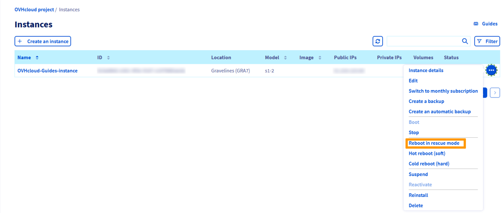
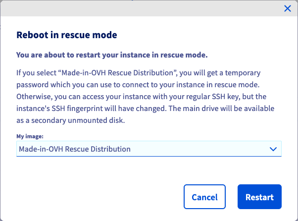
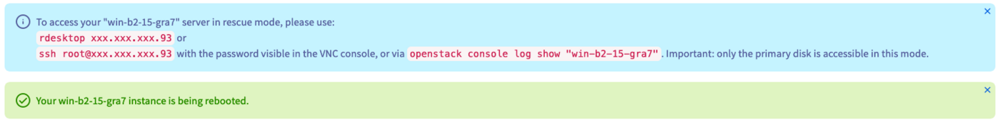
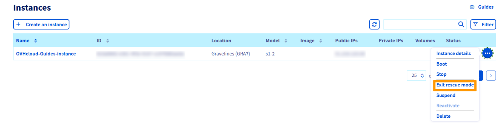

> [!primary]
> Tłumaczenie zostało wygenerowane automatycznie przez system naszego partnera SYSTRAN. W niektórych przypadkach mogą wystąpić nieprecyzyjne sformułowania, na przykład w tłumaczeniu nazw przycisków lub szczegółów technicznych. W przypadku jakichkolwiek wątpliwości zalecamy zapoznanie się z angielską/francuską wersją przewodnika. Jeśli chcesz przyczynić się do ulepszenia tłumaczenia, kliknij przycisk "Zgłóś propozycję modyfikacji" na tej stronie.
> 

## Wprowadzenie

Jeśli instancja została niewłaściwie skonfigurowana lub utracono klucz SSH, instancja może być niedostępna.

W takiej sytuacji można ponownie skonfigurować instancję lub odzyskać dane przy użyciu trybu ratunkowego (rescue). 

**Niniejszy przewodnik wyjaśnia, jak zrestartować Twoją instancję Public Cloud OVHcloud w trybie rescue i uzyskać dostęp do plików.**

## Wymagania początkowe

- [Instancja Public Cloud](https://www.ovhcloud.com/pl/public-cloud/){.external} utworzona na koncie OVHcloud
- dostęp do [Panelu klienta OVHcloud](https://www.ovh.com/auth/?action=gotomanager&from=https://www.ovh.pl/&ovhSubsidiary=pl){.external}

## W praktyce> 

[!alert]
>
> Do tej pory tryb Rescue dla instancji Metal nie jest dostępny w panelu klienta OVHcloud. Aby uzyskać więcej informacji, zapoznaj się z naszym przewodnikiem dotyczącym [trybu Rescue dla instancji Metal](/pages/public_cloud/compute/rescue_mode_metal_instance).

### Aktywacja trybu ratunkowego

Najpierw zaloguj się do [Panelu klienta OVHcloud](https://www.ovh.com/auth/?action=gotomanager&from=https://www.ovh.pl/&ovhSubsidiary=pl){.external} i kliknij menu `Public Cloud`{.action}.

Następnie wybierz projekt Public Cloud z menu bocznego po lewej stronie ekranu i przejdź do pozycji Instancje.

Kliknij ikonę z trzema kropkami (po prawej stronie instancji) i wybierz `Restartuj w trybie ratunkowym`{.action}.

{.thumbnail}

Zostanie wyświetlone okno dialogowe “Restart w trybie ratunkowym”. Kliknij listę rozwijaną, aby wybrać dystrybucję systemu Linux do użycia w trybie ratunkowym, a następnie kliknij przycisk `Uruchom ponownie`{.action}.

{.thumbnail}

Po ponownym uruchomieniu instancji w trybie Rescue wyświetli się okno informacyjne zawierające dostępne metody dostępu.

{.thumbnail}

Twoje **hasło do trybu Rescue** tymczasowego będzie wyświetlane tylko w konsoli VNC. Kliknij Twoją instancję w tabeli, następnie przejdź do zakładki `Konsola VNC`{.action}, aby pobrać instancję.

<table><tbody><tr><td></td><td></td></tr></tbody></table>

### Dostęp do danych

Po aktywacji trybu ratunkowego dane instancji będą widoczne jako dodatkowy dysk. Aby go zamontować, wykonaj następujące kroki.

Po pierwsze nawiąż [połączenie SSH](/pages/bare_metal_cloud/dedicated_servers/ssh_introduction) z instancją. Po nawiązaniu połączenia sprawdź dostępne dyski przy użyciu tego polecenia:

```bash
lsblk
```

Wynik będzie podobny do poniższego przykładu wyjściowego:

```console
NAME    MAJ:MIN RM  SIZE RO TYPE MOUNTPOINTS
sda       8:0    0  2.9G  0 disk
└─sda1    8:1    0  2.9G  0 part /
sdb       8:16   0   25G  0 disk
├─sdb1    8:17   0   24G  0 part
├─sdb14   8:30   0    4M  0 part
├─sdb15   8:31   0  106M  0 part
└─sdb16 259:0    0  913M  0 part
```

W trybie rescue `sda` to dysk w trybie rescue i `sda1` to główna partycja zapasowa zamontowana na `/`.

W tym przykładzie głównym dyskiem jest `sdb`, a partycja systemowa to `sdb1` (określana przez rozmiar).

Zamontuj tę partycję za pomocą polecenia:

```bash
mount /dev/sdb1 /mnt/
```

Dane będą dostępne w folderze `/mnt`.

### Dezaktywacja trybu ratunkowego

Po wykonaniu wszystkich zadań można zdezaktywować tryb ratunkowy przez zrestartowanie instancji w trybie normalnym. Aby to zrobić, kliknij strzałkę menu rozwijanego instancji i wybierz pozycję `Wyjdź z trybu ratunkowego`{.action}.

{.thumbnail}

> [!warning]
> Jeśli przycisk `Wyjdź z trybu ratunkowego`{.action} nie pojawi się po wykonaniu instancji w trybie rescue, zalecamy odświeżenie karty.
>

### Aktywacja trybu ratunkowego przy użyciu interfejsu API OpenStack

Tryb ratunkowy można aktywować także za pośrednictwem interfejsu API OpenStack przy użyciu następującego polecenia:

```bash
nova rescue INSTANCE_ID
```

Aby wyjść z trybu ratunkowego, użyj następującego polecenia:

```bash
nova unrescue INSTANCE_ID
```

## Sprawdź również

[Jak zastąpić parę kluczy SSH na instancji](/pages/public_cloud/compute/replacing_lost_ssh_key)

Dołącz do naszej społeczności użytkowników: <https://community.ovh.com/en/>.