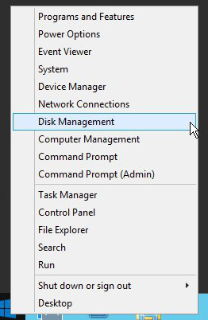
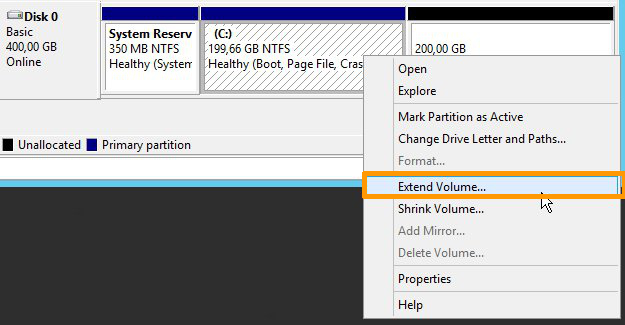
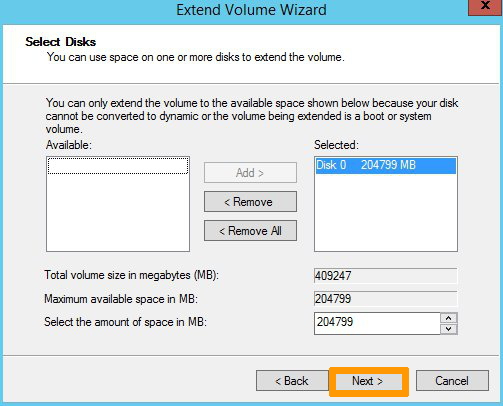
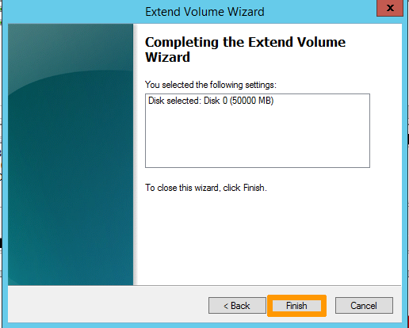
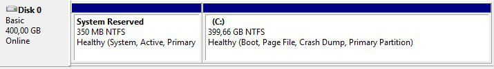

## Objective

If your instance lacks resources due to increased activity or new needs, you can increase its resources in just a few clicks with the Public Cloud.

**This guide explains how to resize your instance from the OVHcloud Control Panel.**

> [!warning]
>
> Only upscaling is possible for classic models.
> In addition, this manipulation causes the instance to be shut down for the time of the operation.
> 

> [!success]
>
> Flex instances allow resizing to higher or lower models due to a locked single disk size.
> 

## Requirements

- A [Public Cloud instance](/links/public-cloud/public-cloud) in your OVHcloud account

<!-- CP-NAV-START:publiccloud-projects -->
---

### OVHcloud Control Panel Access

- **Direct link:** [Public Cloud Projects](/links/control-panel/publiccloud-projects)
- **Navigation path:** `Public Cloud`{.action} > Select your project

---
<!-- CP-NAV-END:publiccloud-projects -->

## Instructions

Click on `Instances`{.action} in the left-hand menu.

Click on `...`{.action} to the right of the instance, and select `Edit`{.action}. You can also access this action from the instance details by clicking on its name, then on `Modify model`{.action}.

In the new tab, scroll down to the **Template** section to select the model of your choice.

> [!primary]
>
> For classic models, you can switch to any flavor that has a similar or bigger disk. You can't switch to a model with a smaller disk. 
>
> Only **Flexible instances** can be upgraded and downgraded while maintaining a fixed disk size of 50GB.
>

If your disk is equal to or smaller than 50GB, you can switch to a `Flexible instance`{.action} if desired.

> [!warning]
> If you are editing a flex instance, you cannot revert to a classic instance via the Control Panel. For more information, consult the guide on [Revert a flex instance](/pages/public_cloud/compute/revert_a_flex_instance).
>

Once the selection has been made, click on `Modify template`{.action} to confirm your choice.

### Resizing a disk in Windows

When performing a resize for a Windows Instance, the partition size is not automatically updated. You must extend it using the **disk manager**:

- Right-click on the `Start`{.action} menu and launch the disk manager by clicking on `Disk Management`{.action}:

{.thumbnail}

- Right-click on the main partition, then click on `Extend Volume`{.action}.

{.thumbnail}

- In the `Extend Volume Wizard` menu, click on `Next`{.action} to proceed. In the next tab, choose the disk resources to extend and click on `Next`{.action}. 

{.thumbnail}

Once done, click on `Finish`{.action} to confirm your choice.

{.thumbnail}

- The new disk size will then be displayed in the disk manager.

{.thumbnail}

## Go further

Join our [community of users](/links/community).