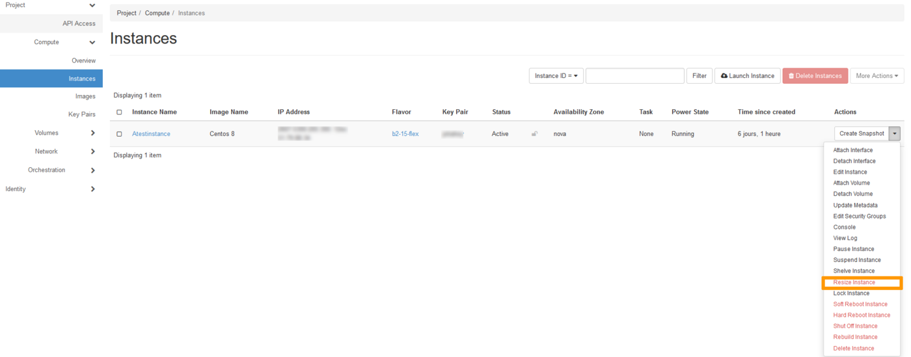
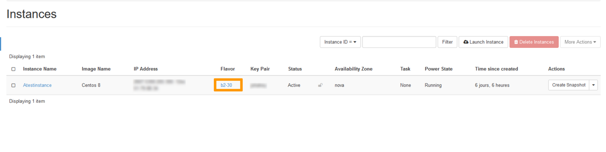

## Objective

A flex instance is a single size disk (50GB) instance which offers a faster process for snapshots. It allows resizing to higher or lower models with a fix storage space, whereas classic models can only be resized to higher models.  As your infrastructure is constantly evolving, you may need to increase the storage space of your instance. In this case, you will need to « revert » your flex instance to a classic model. This action can only be done from the Horizon interface.

 **This guide shows you how to revert and resize your flex instance from the OpenStack Horizon interface.**

## Requirements

- An [OVHcloud Public Cloud instance](/pages/public_cloud/compute/public-cloud-first-steps#step-3-creating-an-instance/) with the flex option
- [Access to the Horizon interface](/pages/public_cloud/compute/introducing_horizon)

## Instructions

Log into the [Horizon interface](https://horizon.cloud.ovh.net/auth/login/) and make sure you are in the correct region. You can verify this on the top left corner. 

{.thumbnail}

Next, click on the `Compute`{.action} menu on the left side and click on `Instances`{.action}. Select `Resize Instance`{.action} in the drop list for the corresponding instance.

{.thumbnail}

**Flavor Choice** 

This section allows you to select the new instance template (flavor). You can either revert your instance to a classic model and maintain the same template or resize your instance by selecting a different template.

In our example, our flavor is « b2-15-flex » , we can either revert to a « b2-15 » flavor or upgrade it to a « b2-30 » flavor. In our case, we want to upgrade our instance to a « b2-30 » classic model.

{.thumbnail}

> [!warning] 
> - You can only switch from a Linux model to another Linux model and from a Windows model to another Windows model.
>
> - The flex option is not available for all models.
>

**Advanced Options**

Use this section to manage the **Disk Partition** and **Server Group**.

{.thumbnail}

To proceed, click on the `Resize`{.action} button.

Once the process is completed, your instance will be reverted to a classic model with a larger storage space.

{.thumbnail}

In case you wish to switch back to a flex model, you can do this by performing the same steps mentioned [above](#flavorchoice) and select a flex « flavor » instead of a classic one. 

Alternatively, you can [edit the configuration of the instance](/pages/public_cloud/compute/first_steps_with_public_cloud_instance#edit-the-configuration-of-an-instance) in the OVHcloud Control Panel.

## Go further

Join our community of users on <https://community.ovh.com/en/>.
