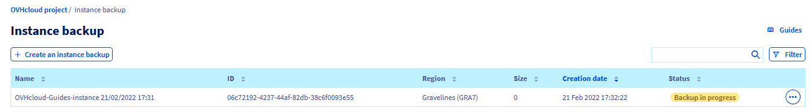
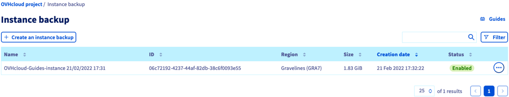
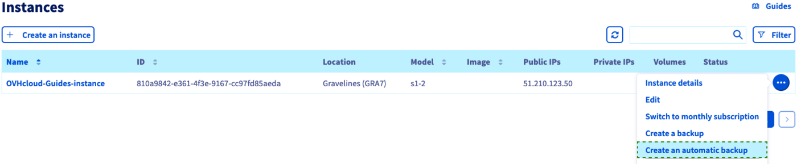
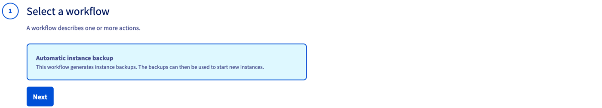
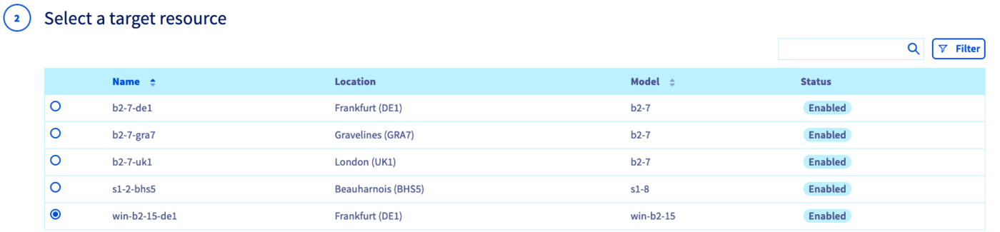
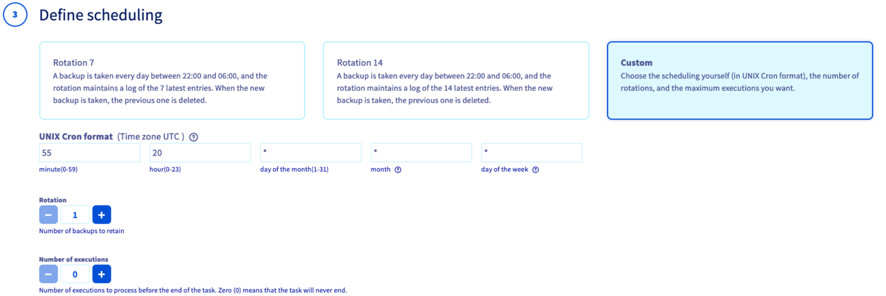
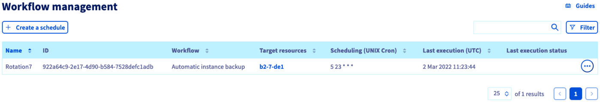
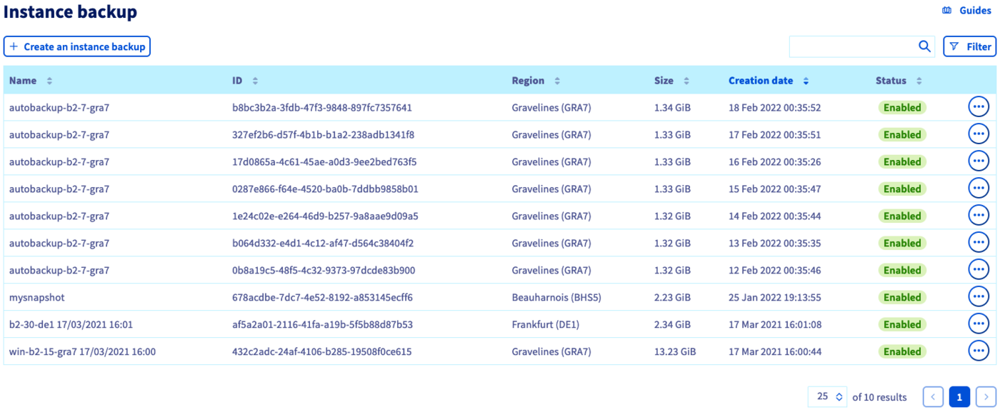

> [!primary]
> Esta tradução foi automaticamente gerada pelo nosso parceiro SYSTRAN. Em certos casos, poderão ocorrer formulações imprecisas, como por exemplo nomes de botões ou detalhes técnicos. Recomendamos que consulte a versão inglesa ou francesa do manual, caso tenha alguma dúvida. Se nos quiser ajudar a melhorar esta tradução, clique em "Contribuir" nesta página.
>

## Objetivo

Pode criar um backup único de uma instância ou configurar um planeamento para automatizar os backups das suas instâncias. Os backups podem ser utilizados para restaurar a sua instância num estado anterior ou para criar uma nova instância idêntica.

**Este guia explica como criar backups manuais e automáticos de uma instância Public Cloud.**

## Requisitos

- Ter uma instância [Public Cloud](https://www.ovhcloud.com/pt/public-cloud/) na sua conta OVHcloud.
- Ter acesso à [Área de Cliente OVHcloud](/links/manager).

## Instruções

### Criar um backup de uma instância

> [!warning]
> Esta opção só está disponível através de um **Cold Snapshot** para as instâncias Metal. A instância Metal passará para o modo rescue e, uma vez efetuado o backup, a instância será reiniciada em modo normal.
>

Ligue-se à sua [Área de Cliente OVHcloud](/links/manager) e abra o seu projeto `Public Cloud`{.action}. A seguir, clique em `Instances`{.action} no menu à esquerda.

Clique no botão `...`{.action} à direita da instância e selecione `Criar um backup`{.action}.

{.thumbnail}

Introduza um nome para o backup na página seguinte. Consulte as informações tarifárias e clique em `Confirmar`{.action}.

{.thumbnail}

Não é possível acompanhar o progresso do backup em tempo real, no entanto, na secção `Instance Backup`{.action} na rubrica `Storage`{.action} no menu à esquerda, o estado será apresentado como "Backup em curso" durante o processo.

{.thumbnail}

Uma vez terminado o backup, este estará disponível na secção `Instance Backup`{.action} na rubrica `Storage`{.action} no menu à esquerda.

{.thumbnail}

### Criar um backup automatizado de uma instância

Clique no botão `...`{.action} à direita da instância e selecione `Criar um backup automatizado`{.action}.

{.thumbnail}

Poderá configurar os seguintes parâmetros de backup:

#### **O workflow** 

Atualmente, existe apenas um workflow. Irá criar um backup para a instância e o seu volume principal.

{.thumbnail}

#### **O recurso** 

Pode selecionar a instância a salvaguardar.

{.thumbnail}

#### **O planeamento** 

Pode definir um planeamento de backup personalizado ou escolher uma das frequências predefinidas:

- Backup diário com retenção dos últimos 7 backups
- Backup diário com retenção dos últimos 14 backups

{.thumbnail}

#### **Nome** 

Introduza um nome para o planeamento do backup automático. Leia as informações de preços e crie o calendário ao clicar no botão `Criar`{.action}.
 
{.thumbnail}

### Gestão dos backups e dos planos

As planificações podem ser criadas e eliminadas na secção `Workflow Management`{.action} que se encontra na rubrica `Storage`{.action} no menu à esquerda.

{.thumbnail}

Os backups das suas instâncias são geridos na secção `Instance Backup`{.action}, que se encontra na secção `Storage`{.action} no menu à esquerda.

{.thumbnail}

> [!warning]
> A opção de backup da instância deve ser eliminada separadamente se já não desejar que esta lhe seja faturada. A eliminação de uma instância não elimina as opções que lhe estão associadas.
>

> [!warning]
> **Tenha em atenção que não é possível eliminar um backup de instância se uma instância gerada a partir deste backup estiver a ser executada no momento da ação de eliminação.**

Saiba como utilizar os backups para clonar ou restaurar instâncias neste [guia](/pages/public_cloud/compute/create_restore_a_virtual_server_with_a_backup).

## Quer saber mais?

[Criar/restaurar um servidor virtual a partir de um backup](/pages/public_cloud/compute/create_restore_a_virtual_server_with_a_backup)

Fale com a nossa comunidade de utilizadores em <https://community.ovh.com/en/>.