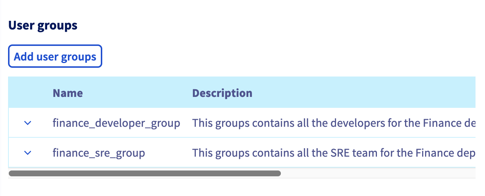
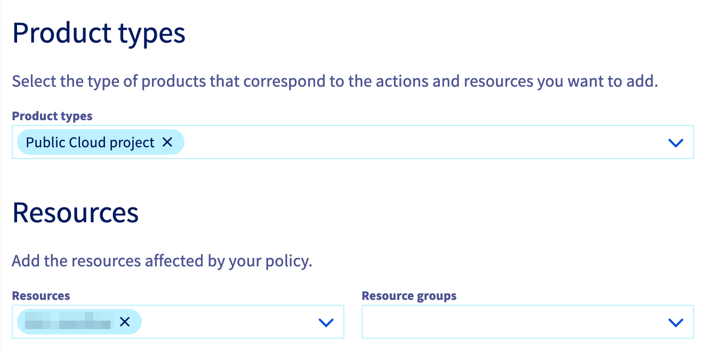
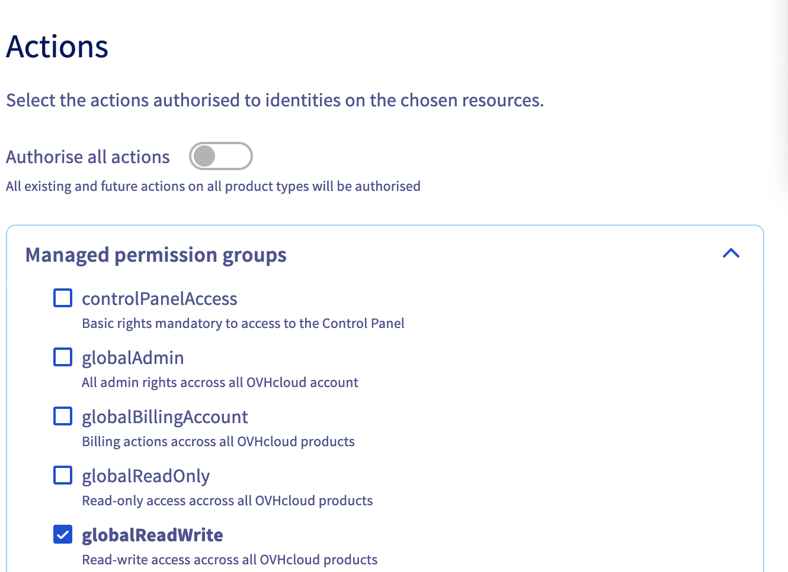

## Objectif

**Ce guide explique comment sécuriser votre compte OVHcloud, gérer les identités, structurer vos projets Public Cloud et utiliser les politiques IAM pour restreindre les droits d'accès.**

Cela peut être utile si vous faites partie d'une équipe plateforme et que votre objectif est de construire une Landing Zone pour votre organisation.

## Prérequis

- Un compte OVHcloud actif
- Accès à l'[espace client OVHcloud](/links/manager)

## En pratique

### Étape 1 : Sécuriser votre compte

Le guide « [Sécuriser mon compte OVHcloud et gérer mes informations personnelles](/pages/account_and_service_management/account_information/all_about_username) » fournit des pratiques générales pour la gestion des comptes et constitue un bon point de départ.

#### Activer l'authentification à deux facteurs (2FA)

- **Ce que cela fait** : Ajoute une couche de sécurité supplémentaire en nécessitant une deuxième forme de vérification (par exemple, une application mobile, une clé de sécurité) en plus de votre mot de passe.
- **Comment l'activer** : Connectez-vous à l'[espace client OVHcloud](/links/manager), cliquez sur votre nom en haut à droite puis sur vos initiales. Accédez à l'onglet `Sécurité`{.action}, et suivez les étapes pour configurer la 2FA via une application mobile ou une clé de sécurité. Assurez-vous de stocker vos codes de secours en toute sécurité. Pour plus de détails, référez-vous au [guide sur la 2FA](/pages/account_and_service_management/account_information/secure-ovhcloud-account-with-2fa).
- **Exemple** : Si vous utilisez une clé de sécurité U2F, vous la brancherez dans votre port USB à chaque connexion, offrant une sécurité supplémentaire au-delà de votre mot de passe.

#### Définir des mots de passe forts

Le [guide de gestion des mots de passe](/pages/account_and_service_management/account_information/manage-ovh-password) fournit des bonnes pratiques en matière de gestion des mots de passe.

#### Ajouter une adresse e-mail de secours

- **Importance** : Aide à récupérer l'accès à votre compte si votre em-ail principal est inaccessible.
- **Configuration** : Ajoutez une adresse e-mail de secours dans le tableau de bord OVHcloud sous les paramètres de votre profil, en vous assurant qu'elle diffère de votre adresse e-mail principale. Voir le [guide sur la gestion des informations personnelles](/pages/account_and_service_management/account_information/all_about_username).

### Étape 2 : Comprendre la gestion des identités et des accès (IAM) et créer des identités

**Définition** : l'IAM est un cadre permettant de gérer les identités des utilisateurs et leur accès aux ressources en toute sécurité.

**Mise en œuvre** : Utilisez les fonctionnalités IAM pour gérer les identités, les groupes et les politiques dans l'IAM d'OVHcloud.

**Principaux composants** :

1. **Identités** : Comptes individuels pour les personnes (utilisateurs) ou comptes de service qui ont besoin d'accéder aux ressources OVHcloud.
2. **Groupes** : Collections d'utilisateurs ou de ressources avec des besoins d'accès communs.
3. **Politiques** : Règles qui définissent les actions que les utilisateurs et les groupes peuvent effectuer sur une ou plusieurs ressources.

**Exemples** :

- **Gestion des identités** : Trois types d’identités sont supportés et présentés dans cette [page de documentation](/pages/manage_and_operate/iam/identities-management) :
    - `Utilisateurs locaux` : identités représentant une personne dans votre organisation et associées à votre compte OVHcloud. Consultez le guide « [Créer et gérer des utilisateurs locaux sur un compte OVHcloud](/pages/account_and_service_management/account_information/ovhcloud-users-management) ».
    - `Comptes de service` : utilisés pour les interactions « machine à machine ». Les comptes de service sont également associés à votre compte OVHcloud.Pour plus d'informations, consultez [Gestion des comptes de service OVHcloud via l'API](/pages/manage_and_operate/api/manage-service-account) et [Comment utiliser des comptes de service pour se connecter aux API OVHcloud](/pages/account_and_service_management/account_information/authenticate-api-with-service-account).
    - `Identités fédérées` : plusieurs protocoles et fournisseurs de fédération sont supportés et documentés : [AD FS](/pages/account_and_service_management/account_information/ovhcloud-account-connect-saml-adfs), [Google Workspace](/pages/account_and_service_management/account_information/ovhcloud-account-connect-saml-google-workspace), [Entra ID](/pages/account_and_service_management/account_information/ovhcloud-account-connect-saml-azure-ad) ou [OKTA](/pages/account_and_service_management/account_information/ovhcloud-account-connect-saml-okta).
- **Groupes d'utilisateurs** : Créez des groupes comme "Développeurs", "Admins" et "Auditeurs" pour simplifier la gestion des permissions. Si vous avez choisi de créer des utilisateurs locaux, consultez ce [guide](/pages/account_and_service_management/account_information/ovhcloud-users-management) pour créer des groupes d’utilisateurs locaux. Si vous avez choisi la fédération d'identité, le groupe doit être défini dans votre fournisseur d'identité, fourni dans le ticket SAML et mappé à un groupe OVHcloud. Cette étape est détaillée dans chaque page de documentation du fournisseur d'identité.
- **Définition des politiques** : Attribuez des politiques aux identités et aux groupes pour restreindre ou accorder l'accès. Par exemple, un développeur pourrait avoir l’autorisation de déployer des applications mais pas de gérer les informations de facturation. Ce [guide](/pages/account_and_service_management/account_information/iam-policy-ui) définit comment utiliser les politiques IAM via le tableau de bord OVHcloud.

### Étape 3 : Bonnes pratiques pour structurer les projets Public Cloud

Les projets Public Cloud permettent de séparer les ressources et les droits d'accès associés à ces ressources.

Le modèle pour scinder les projets peut être :

- **Domaine** : le domaine au sein de votre entreprise, par exemple Finance, Informatique, Marketing, Ventes, etc.
- **ID de l'application** : l'identifiant de l'application. Il peut s'agir de son nom ou d'un identifiant provenant du portefeuille d'applications de votre entreprise.
- **Environnement** : l'environnement, par exemple dev, QA, staging, prod.

Un préfixe peut être utilisé pour faciliter la gestion des ressources. Par exemple, si nous utilisons le modèle défini ci-dessus, nous pourrions avoir les noms de projets cloud suivants :

- cloud_project_finance_invoicing_qa
- cloud_project_it_collaboration_staging
- cloud_project_it_monitoring_prod
- cloud_project_marketing_analytics_dev
- cloud_project_marketing_automation_qa
- cloud_project_sales_cpq_staging
- cloud_project_sales_ecommerce_dev

### Étape 4 : Fournir un contrôle d'accès basé sur les rôles (RBAC) aux projets Public Cloud via les politiques IAM

Maintenant que vous avez des identités et des projets, vous pouvez définir les droits d'accès pour chaque projet. Nous recommandons d'utiliser des groupes et non des identités individuelles lors de la définition des politiques, car cela facilite la gestion du cycle de vie des politiques.

Dans l'exemple suivant, nous utiliserons deux groupes appelés `finance_developer_group` et `finance_SRE_group` qui contiennent les identités des utilisateurs qui développent et ceux qui s'assurent du maintien en condition opérationnelle de l'application financière.

Pour cet exemple, nous prendrons un outil utilisé par l'équipe finance pour effectuer leur planification financière et leur analyse (FPA). Dans ce cas fictif, nous aurons 3 projets Public Cloud gérant les ressources de trois environnements (développement, staging et production). Les projets sont nommés :

- `cloud_project_finance_fpa_dev`
- `cloud_project_finance_fpa_staging`
- `cloud_project_finance_fpa_prod`

Le tableau suivant résume les droits d'accès que nous fournirons à chaque groupe. Les politiques d'accès sont fournies à des fins d'exemple et doivent être adaptées à votre contexte.

| Nom du projet Public Cloud | `finance_developer_group` | `finance_SRE_group` |
|----------------------------|---------------------------|----------------------|
|`cloud_project_finance_fpa_dev`| lecture écriture         | pas d'accès          |
|`cloud_project_finance_fpa_staging`| lecture              | lecture écriture     |
|`cloud_project_finance_fpa_prod`| pas d'accès             | lecture écriture     |

#### Fournir un accès au tableau de bord

Pour fournir un accès à l'espace client OVHcloud, vous devez créer une politique spécifique comme décrit dans ce [guide](/pages/account_and_service_management/account_information/iam-control-panel-access). Dans la section `Ajouter des groupes d'utilisateurs`, choisissez les groupes `finance_developer_group` et `finance_SRE_group`.

{.thumbnail}

Grâce à cette politique, les utilisateurs appartenant à ces deux groupes auront accès au tableau de bord mais, avec cette seule politique, ils n'auront aucun droit (ni lecture ni écriture). Le chapitre suivant ajoute ces droits uniquement sur les projets Public Cloud définis.

#### Fournir des droits spécifiques aux projets Public Cloud

Continuons en créant des politiques pour permettre les droits d'accès décrits ci-dessus. Pour cela, nous créerons 4 politiques résumées ci-dessous.

| Nom de la politique                         | Identités               | Actions            | Ressources                  |
|---------------------------------------------|-------------------------|--------------------|-----------------------------|
| cloud_project_finance_fpa_dev-RW            | finance_developer_group  | globalWriteAccess  | cloud_project_finance_fpa_dev |
| cloud_project_finance_fpa_staging-RO        | finance_developer_group  | globalReadAccess   | cloud_project_finance_fpa_staging |
| cloud_project_finance_fpa_staging-RW        | finance_SRE_group        | globalWriteAccess  | cloud_project_finance_fpa_staging |
| cloud_project_finance_fpa_prod-RW           | finance_SRE_group        | globalWriteAccess  | cloud_project_finance_fpa_prod |

Le nom des politiques suit le modèle suivant : \<Nom de la ressource\>-RO/RW

Voici un guide étape par étape pour créer la première politique :

- Dans la page IAM, cliquez sur `Créer une politique`{.action}, remplissez le nom `cloud_project_finance_fpa_dev-RW` et une description.
- Cliquez ensuite sur `Ajouter des groupes d'utilisateurs`{.action}, choisissez le groupe `finance_developer_group`.
- Sous `Types de produits`, choisissez `Projet Public Cloud`{.action}.
- Sous `Ressources`, sélectionnez le projet Public Cloud cible `cloud_project_finance_fpa_dev`.

{.thumbnail}

- Sous `Actions` dans `Groupes de permissions gérées`{.action}, laissez `Autoriser toutes les actions` décoché et choisissez `globalWriteAccess`{.action}.

{.thumbnail}

Maintenant, les utilisateurs appartenant au `finance_developer_group` auront uniquement accès au tableau de bord et au projet Public Cloud sélectionné en accès écriture.

## Nous voulons vos retours !

Nous serions ravis de vous aider à répondre à vos questions et que vous nous fassiez part de vos commentaires.

Si vous avez besoin d'une formation ou d'une assistance technique pour la mise en oeuvre de nos solutions, contactez votre commercial ou cliquez sur [ce lien](/links/professional-services) pour obtenir un devis et demander une analyse personnalisée de votre projet à nos experts de l’équipe Professional Services.

Êtes-vous sur Discord ? Connectez-vous à notre chaîne sur <https://discord.gg/ovhcloud> et interagissez directement avec l'équipe qui construit nos services !

Échangez avec notre [communauté d'utilisateurs](/links/community).