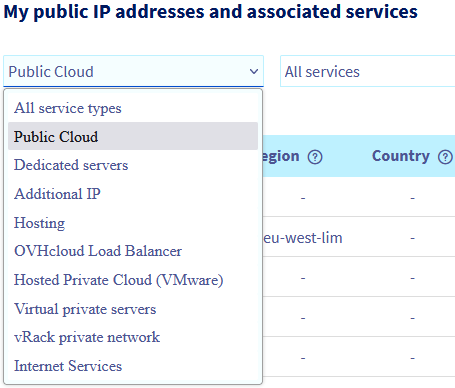
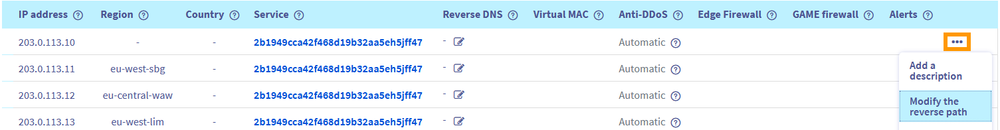

## Ziel

Reverse DNS (*rDNS*) ist das ergänzende Gegenstück zur "*Forward*" DNS-Auflösung, die Domainnamen zu IP-Adressen auflöst. Mit Reverse DNS-Auflösung kann eine IP-Adresse zu dem Domainnamen (oder Hostnamen) aufgelöst werden, dem sie zugeordnet ist. Das bedeutet, dass DNS-Abfragen (*DNS Lookup*) der entsprechenden IP-Adresse diesen Domainnamen zurückgeben.

Die Konfiguration der umgekehrten DNS-Auflösung für eine Public Cloud Instanz ist besonders beim Versand von E-Mails nützlich. Die Validierung eines Mailservers durch Spamschutzsysteme verbessert sich, wenn eine DNS-Abfrage der IP-Adresse passend aufgelöst wird.

**Diese Anleitung erklärt, wie Sie den Reverse DNS-Pfad für die IP-Adresse(n) Ihrer Public Cloud Instanz konfigurieren.**

## Voraussetzungen

- Sie haben eine [Public Cloud Instanz](https://www.ovhcloud.com/de/public-cloud/) in Ihrem Kunden-Account.
- Sie verfügen über einen Domainnamen, dessen `A`-Eintrag die Instanz als Ziel hat.
- Sie haben Zugriff auf Ihr [OVHcloud Kundencenter](/links/manager).

## In der praktischen Anwendung

Loggen Sie sich in Ihr [OVHcloud Kundencenter](/links/manager) ein. Wechseln Sie zum Bereich `Bare Metal Cloud`{.action} und öffnen Sie `Network`{.action}. Klicken Sie dann auf `IP`{.action}.

Im Dropdown-Menü unter **Meine öffentlichen IP-Adressen und dazugehörigen Dienste** können Sie Ihre Dienste nach Kategorien filtern.

{.thumbnail}

Klicken Sie auf `...`{.action} in der Zeile der betreffenden IP-Adresse und wählen Sie dann `Reverse ändern`{.action} aus.

{.thumbnail}

Geben Sie Ihren Reverse-Pfad im neuen Fenster ein und klicken Sie auf `Bestätigen`{.action}.

{.thumbnail}

Sie können den Reverse-Pfad auch direkt mithilfe des Icons in der Spalte "**Reverse**" der Tabelle editieren.

> [!primary]
>
Wenn die Änderung nicht wie erwartet funktioniert, überprüfen Sie, ob der Eintrag vom Typ `A` in der DNS-Zone Ihres Domainnamens korrekt konfiguriert ist. Bedenken Sie, dass es bis zu 24 Stunden dauern kann, bis DNS-Zonenänderungen wirksam sind, falls Sie den `A`-Eintrag erst kürzlich bearbeitet haben.
>
Wenn die Domain von OVHcloud als Registrar verwaltet wird und OVHcloud DNS-Server verwendet, können Sie den Anweisungen in [unserer Anleitung zu DNS](/pages/web_cloud/domains/dns_zone_edit) folgen.
>

## Weiterführende Informationen 

[Erste Schritte mit Ihrer Public Cloud Instanz](/pages/public_cloud/compute/public-cloud-first-steps)

[Bearbeiten der OVHcloud DNS-Zone](/pages/web_cloud/domains/dns_zone_edit)

Treten Sie unserer [User Community](/links/community) bei.