## Objetivo

As instâncias Public Cloud são entregues com um disco de origem copiado a partir de uma imagem de sistema (Debian 12, Windows Server, etc.). Também é possível utilizar volumes suplementares, pois trata-se de discos persistentes que permitirão armazenar dados.

Também pode implementar um sistema operativo de e para um volume. A instância Public Cloud será iniciada nesse volume em vez do disco de origem.

**Este guia explica como iniciar uma instância num volume associado.**

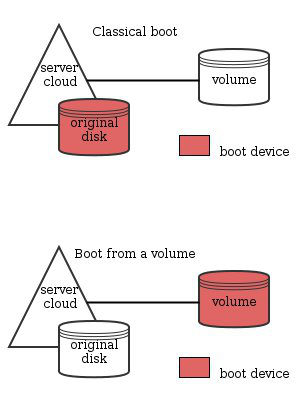{.thumbnail}

> [!success]
>
> OpenStack permite-lhe iniciar nativamente a partir de um volume.
> Trata-se de tornar o volume inicializável e de iniciar a instância a partir desse volume.
> As modificações implicarão o desaparecimento do disco original à medida que o novo volume for substituindo o mesmo.
> As funcionalidades descritas neste guia eliminam a necessidade de aceder ao disco de origem e tiram partido do volume.

> [!warning]
>
> Com a versão atual do OpenStack, o modo rescue-pro não está disponível numa instância iniciada através de um volume inicializável.
>

## Requisitos

- [Acesso à interface Horizon](/pages/public_cloud/public_cloud_cross_functional/introducing_horizon)
- [Carregar as variáveis de ambiente OpenStack](/pages/public_cloud/public_cloud_cross_functional/loading_openstack_environment_variables)

## Instruções

### Criação de um volume de arranque a partir de uma imagem.

> [!tabs]
> **Horizon**
>> Ligue-se à [interface Horizon](https://horizon.cloud.ovh.net/auth/login/).
>>
>> Selecione a região apropriada no menu suspenso no canto superior esquerdo.
>>
>> No separador Projeto, abra o separador `Volumes`{.action} e clique na categoria `Volumes`{.action}.
>>
>> Clique em `Create Volume`{.action}.
>>
>> 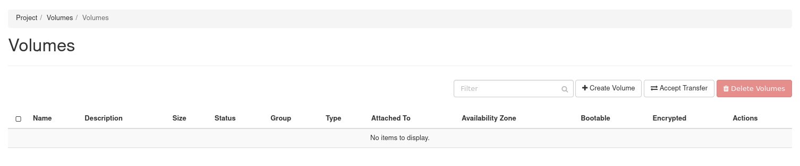{.thumbnail width="800"}
>>
>> Na caixa de diálogo que aparece, insira ou selecione os seguintes valores:
>>
>> | Informação | Descrição |
>> | ---  | ---  |
>> | Volume Name | Especifique um nome para o volume |
>> | Description | Facultativo, fornecer uma breve descrição do volume |
>> | Volume Source | Escolha a opção `Image`.<br><br> 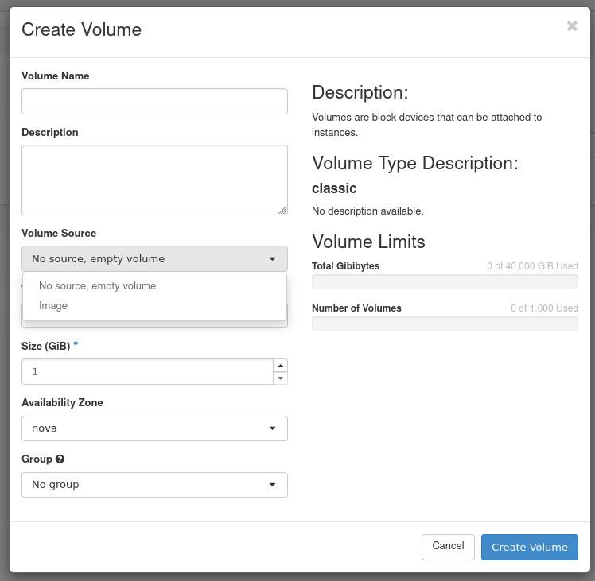{.thumbnail} |
>> | Use image as a source | Pode selecionar a imagem na lista.<br><br> 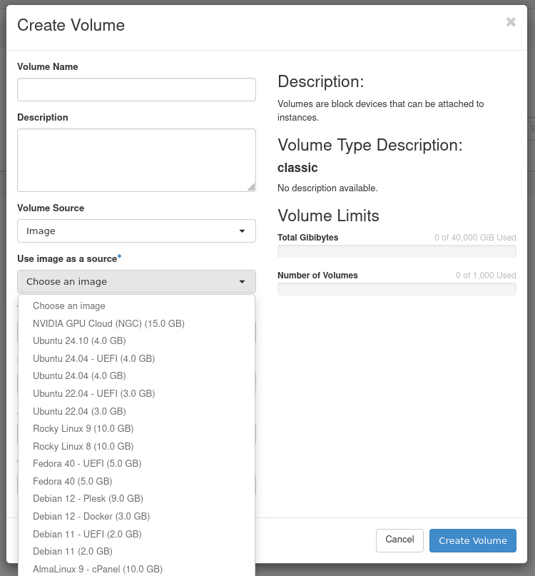{.thumbnail} |
>> | Type | Depende do tipo de volume que pretende utilizar |
>> | Size (GB) | Tamanho do volume em gigabytes (GiB) |
>> | Availability Zone | nova <br><br> 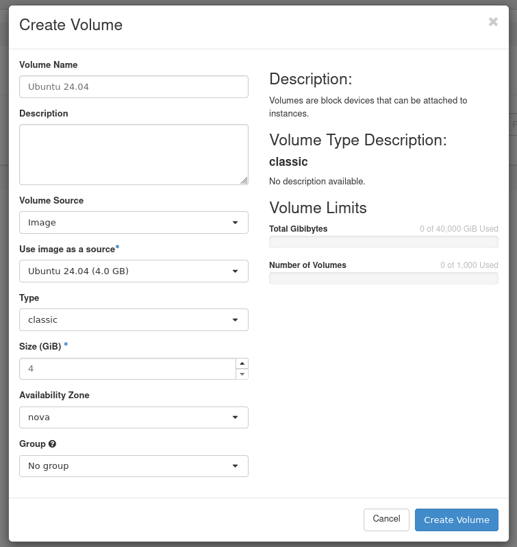{.thumbnail} |
>>
>> Clique em `Create Volume`{.action}.
>>
>> O volume será no estado *`creating`* e depois no estado *`downloading`* antes de estar disponível.
>>
>> 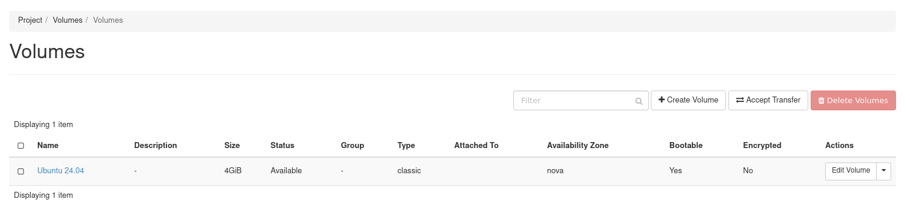{.thumbnail width="800"}
>>
>> Como pode ver na imagem abaixo ou se clicar no nome do volume, este é definido como inicializável (*bootable*).
>>
>> 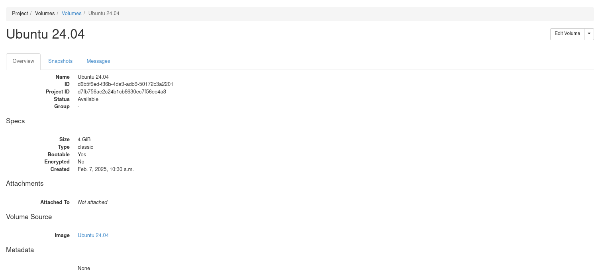{.thumbnail width="800"}
>>
> **Cliente OpenStack**
>> É possível criar um volume de inicialização a partir de uma imagem, volume ou snapshot de volume existente. Este procedimento explica-lhe como criar um volume a partir de uma imagem e utilizar o volume para iniciar uma instância.
>>
>> ```console
>> $ openstack image list
>> ```
>>
>> > [!primary]
>> >
>> > Anote a ID ou o nome da imagem que deseja utilizar.
>>
>> Crie um volume inicializável de 10GB de alta velocidade chamado **volume_ubuntu** a partir de uma imagem Ubuntu 24.04:
>>
>> Pode instalar uma imagem num volume utilizando o argumento `—image` :
>>
>> ```console
>> $ openstack volume create --type high-speed --image 2c2e28dc-9124-49c3-b92d-7f00bd83ac86 --size 10 volume_ubuntu
>> +---------------------+--------------------------------------+
>> | Field | Value |
>> +---------------------+--------------------------------------+
>> | attachments | [] |
>> | availability_zone | nova |
>> | bootable | false |
>> | consistencygroup_id | None |
>> | created_at | 2025-02-06T17:04:34.000000 |
>> | description | None |
>> | encrypted | False |
>> | id | d7611318-fd7b-4b6a-8a7a-8d368049f747 |
>> | multiattach | False |
>> | name | volume_ubuntu |
>> | properties | |
>> | replication_status | None |
>> | size | 20 |
>> | snapshot_id | None |
>> | source_volid | None |
>> | status | creating |
>> | type | high-speed |
>> | updated_at | None |
>> | user_id | 1a67934f87ef481d9cb617a913bfa8bb |
>> +---------------------+--------------------------------------+
>> ```
>>
>> Neste comando, **2c2e28dc-9124-49c3-b92d-7f00bd83ac86** é o ID de imagem Ubuntu 24.04.
>>
>> > [!primary]
>> > 
>> > Cinder faz um volume inicializável quando o parâmetro `--image` é passado.
>>

### Iniciar uma instância utilizando um volume de arranque

> [!tabs]
> **Horizon**
>> Ligue-se à [interface Horizon](https://horizon.cloud.ovh.net/auth/login/).
>>
>> Selecione a região apropriada no menu suspenso no canto superior esquerdo.
>>
>> No separador Projeto, abra o separador `Compute`{.action} e clique em `Instances`{.action} categoria.
>>
>> Clique em `Launch Instance`{.action}.
>>
>> 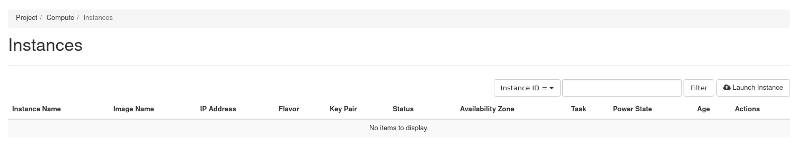{.thumbnail width="800"}
>>
>> Na caixa de diálogo `Launch Instance`, complete as informações necessárias. Consulte o guia [Criar uma instância a partir da interface Horizon](/pages/public_cloud/compute/create_instance_in_horizon) para mais pormenores.
>>
>> No separador Source, escolha « Volume » no campo `Select Boot Source`.
>>
>> 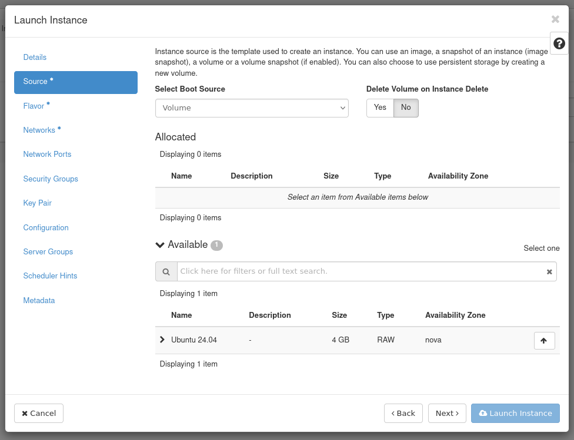{.thumbnail}
>>
>> Aparece um novo campo de seleção de volume. Pode selecionar na lista o volume previamente criado.
>>
>> 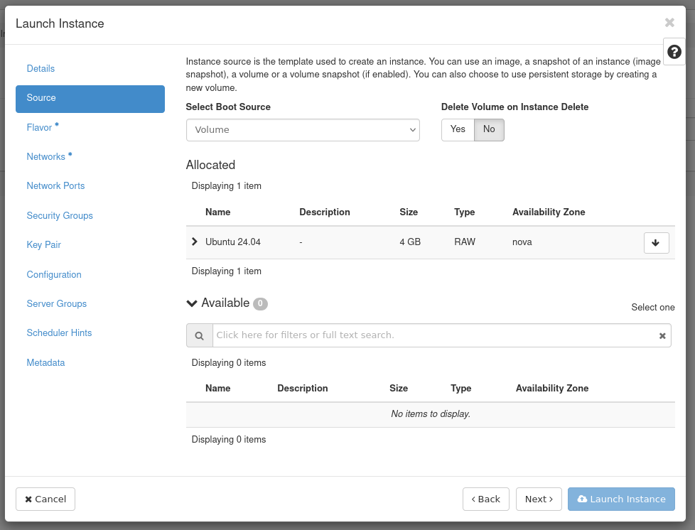{.thumbnail}
>>
>> Clique em `Launch Instance`{.action}.
>>
>> A instância estará no estado `build` e depois no estado `Block Device Mapping` antes de estar disponível.
>>
>> A instância acabará por ter o volume associado.
>>
>> 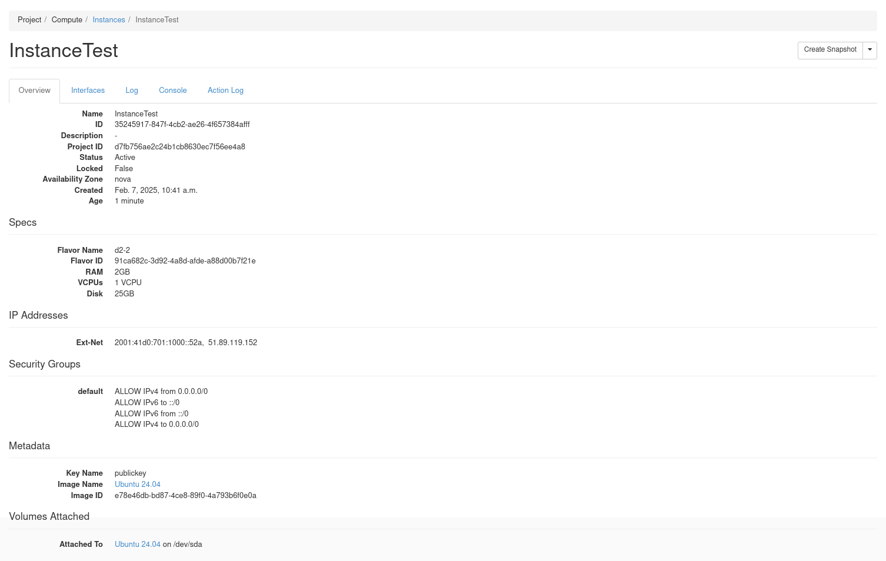{.thumbnail width="800"}
>>
> **Cliente OpenStack**
>> Crie uma instância, especificando o volume de arranque **volume_ubuntu** como o dispositivo de arranque.
>>
>> ```console
>> openstack server create --volume volume_ubuntu --flavor d2-2 --key-name publickey --nic net-id=Ext-Net InstanceTest
>> ```
>>
>> Listar os volumes para garantir que o estado foi alterado para *in-use* e que o volume relata corretamente o apego:
>>
>> ```console
>> $ openstack volume list
>> +--------------------------------------+---------------+--------+------+--------------------------------------+
>> | ID | Name | Status | Size | Attached to |
>> +--------------------------------------+---------------+--------+------+--------------------------------------+
>> | d7611318-fd7b-4b6a-8a7a-8d368049f747 | volume_ubuntu | in-use | 10 | Attached to InstanceTest on /dev/sda |
>> +--------------------------------------+---------------+--------+------+--------------------------------------+
>> ```
>>
>> Listar os volumes associados à instância **InstanceTest** :
>>
>> ```console
>> $ openstack server volume list InstanceTest
>> +--------------------------------------+----------+--------------------------------------+--------------------------------------+------+
>> | ID | Device | Server ID | Volume ID | Tag |
>> +--------------------------------------+----------+--------------------------------------+--------------------------------------+------+
>> | d7611318-fd7b-4b6a-8a7a-8d368049f747 | /dev/sda | 5d97c190-f2e3-4af4-a010-6fa7bffbf88b | d7611318-fd7b-4b6a-8a7a-8d368049f747 | None |
>> +--------------------------------------+----------+--------------------------------------+--------------------------------------+------+
>> ```
>>
>> > [!primary]
>> > 
>> > Também pode criar uma instância, utilizando a imagem escolhida e solicitando o comportamento « boot from volume ».
>>
>> ```console
>> $ openstack server create --flavor d2-2 --key-name publickey --nic net-id=Ext-Net --image b680f0aa-8eb8-4ac8-b008-2a90bb71af4f --boot-from-volume 10 InstanceTest2
>> +-----------------------------+---------------------------------------------+
>> | Field | Value |
>> +-----------------------------+---------------------------------------------+
>> | OS-DCF:diskConfig | MANUAL |
>> | OS-EXT-AZ:availability_zone | |
>> | OS-EXT-STS:power_state | NOSTATE |
>> | OS-EXT-STS:task_state | scheduling |
>> | OS-EXT-STS:vm_state | building |
>> | OS-SRV-USG:launched_at | None |
>> | OS-SRV-USG:terminated_at | None |
>> | accessIPv4 | |
>> | accessIPv6 | |
>> | addresses | |
>> | adminPass | dP4e4iY3eWWC |
>> | config_drive | |
>> | created | 2025-02-06T17:20:06Z |
>> | flavor | d2-2 (dc3fe9e7-e374-4ad8-b200-fa3bdf45069f) |
>> | hostId | |
>> | id | a4632249-e1b4-4047-be1c-87f8b0328f7c |
>> | image | N/A (booted from volume) |
>> | key_name | publickey |
>> | name | InstanceTest2 |
>> | progress | 0 |
>> | project_id | d7fb756ae2c24b1cb8630ec7f56ee4a8 |
>> | properties | |
>> | security_groups | name='default' |
>> | status | BUILD |
>> | updated | 2025-02-06T17:20:06Z |
>> | user_id | 1a67934f87ef481d9cb617a913bfa8bb |
>> | volumes_attached | |
>> +-----------------------------+---------------------------------------------+
>> ```
>>
>> No comando acima, `b680f0aa-8eb8-4ac8-b008-2a90bb71af4f` é o ID de imagem Debian 12.
>>
>> - Listar os volumes:
>>
>> Listar volumes para garantir que o estado é alterado para *in-use* e que o volume corretamente assinala a conexão.
>>
>> ```console
>> $ openstack volume list
>> +--------------------------------------+---------------+--------+------+----------------------------------------+
>> | ID | Name | Status | Size | Attached to |
>> +--------------------------------------+---------------+--------+------+----------------------------------------+
>> | 27f8332d-8bfd-4515-b0a8-18667ae50ff8 | | in-use | 10 | Attached to InstanceTest2 on /dev/sda |
>> | d7611318-fd7b-4b6a-8a7a-8d368049f747 | volume_ubuntu | in-use | 10 | Attached to InstanceTest on /dev/sda |
>> +--------------------------------------+---------------+--------+------+----------------------------------------+
>> ```
>>
>> Listar o volume no servidor para garantir que ele está corretamente anexado.
>>
>> ```console
>> $ openstack server volume list InstanceTest2
>> +--------------------------------------+----------+--------------------------------------+--------------------------------------+------+
>> | ID | Device | Server ID | Volume ID | Tag |
>> +--------------------------------------+----------+--------------------------------------+--------------------------------------+------+
>> | d7611318-fd7b-4b6a-8a7a-8d368049f747 | /dev/sda | 5d97c190-f2e3-4af4-a010-6fa7bffbf88b | d7611318-fd7b-4b6a-8a7a-8d368049f747 | None |
>> +--------------------------------------+----------+--------------------------------------+--------------------------------------+------+
>> ```

## Quer saber mais?

Fale com nossa [comunidade de utilizadores](/links/community).