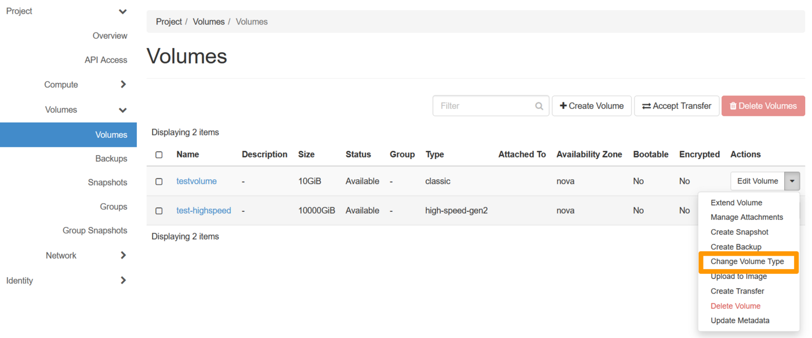

## Objective

The purpose of this guide is to show you how to change a block storage volume type from Classic or High speed to High speed gen2.

## Requirements

- [Access to the Horizon interface](/pages/public_cloud/compute/introducing_horizon)
- A [Block Storage volume](/pages/public_cloud/compute/create_and_configure_an_additional_disk_on_an_instance) created in your [Public Cloud project](https://www.ovhcloud.com/en-gb/public-cloud/)

## Instructions

When trying to change a block storage volume type to a "High speed gen2" one, the migration policy will need to be changed from `Never` to `On-demand`.

The migration policy is set by default to `Never` as the volume stays on the same CEPH cluster. However, for the "High speed gen2" type, the volume will need to be migrated to a new cluster.

This modification can be made via Horizon or the Openstack CLI.

### From the Horizon Interface

Log in to the [Horizon interface](https://horizon.cloud.ovh.net/auth/login/) and make sure you are in the correct region. You can verify this on the top left corner. 

{.thumbnail}

Next, click on the `Volumes`{.action} menu on the left side and click on `Volumes`{.action}.
Click on the drop-down arrow next to `Edit Volume`{.action} and select `Change Volume Type`{.action}.

{.thumbnail}

In the pop-up window, click on the drop-down menu underneath `Type` and select `high-speed-gen-2`{.action}. Next, click on the drop-down arrow underneath `Migration Policy`, and select `On Demand`{.action}.

Once done, click on `Change Volume Type`{.action} to confirm the change.

{.thumbnail}

### From the OpenStack CLI

Make sure to consult the following guide before proceeding:

- [Preparing an environment for using the OpenStack API](/pages/public_cloud/compute/prepare_the_environment_for_using_the_openstack_api).

First, list the type of volumes available in your region with the following command:


```bash
#~$ openstack image list
+--------------------------------------+-----------------------------------------------+----------+
| ID                                   | Name                                          | Is Public |
+--------------------------------------+-----------------------------------------------+----------+
| 27844ef7-1a9a-4944-be59-6e4eb19a71f6 | high-speed-gen2                                    | True |
| 23f75fef-d4f6-416a-a884-95aa3fd45695 | classic                                            | True |
| 2f78e8af-93c9-4e5c-b177-83c4a7ec456a | high-speed                                         | True |
----------------------------------------------------------------------------------------------------
```

> [!warning]
> Please note that if the volume type "high-speed-gen2" does not appear in the list, this means that it is not available in this region.
>

Next, switch volume types with the following command:

```bash
$ openstack volume set --type high-speed-gen2 --retype-policy on-demand VOLUME_NAME_OR_ID
```

## Go further

If you need training or technical assistance to implement our solutions, contact your sales representative or click on [this link](https://www.ovhcloud.com/en-gb/professional-services/) to get a quote and ask our Professional Services experts for assisting you on your specific use case of your project.

Join our community of users on <https://community.ovh.com/en/>.