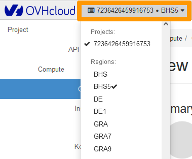
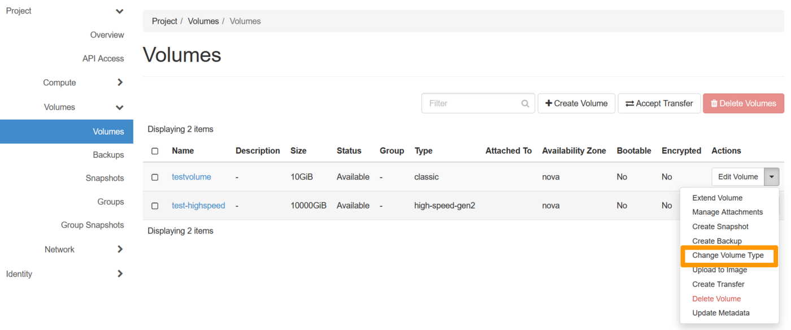
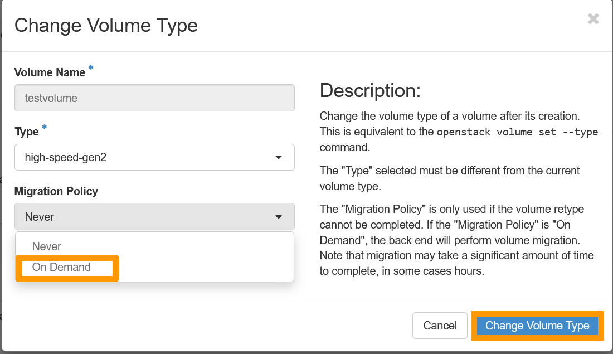

## Objective

The aim of this guide is to show you how to change a Block Storage volume type, from Classic or High speed to High speed gen2 or even to a `luks` (encrypted) version of your storage.

## Requirements

- [Access to the Horizon interface](/pages/public_cloud/public_cloud_cross_functional/introducing_horizon)
- A [Block Storage volume](/pages/public_cloud/compute/create_and_configure_an_additional_disk_on_an_instance) created in your [Public Cloud project](https://www.ovhcloud.com/en-gb/public-cloud/)

## Instructions

> [!primary]
>
> In addition to the Classic, High speed and Highs speed gen2 volumes, three new rest-encrypted versions are now available:
>
> - classic-luks
> - high-speed-luks
> - high-speed-gen2-luks
>

### Why choose an encrypted volume?

Block Storage volumes in the `-luks` (encrypted) version offer the same level of performance as their unencrypted equivalents, with OVHcloud's built-in encryption of data at rest.

Main use cases:

- **Sensitive data:** projects containing personal, financial, medical or confidential information.
- **Regulatory requirements:** compliance with standards such as :
    - RGPD (General Data Protection Regulation)
    - ISO 27001, HIPAA, SOC 2, etc.
- **Critical environments:**
    - Banking systems
    - Healthcare data
    - Business applications with security constraints


Encryption operating principle :

- Encryption is automatic and transparent: no client-side configuration is required.
- Keys are managed by OVHcloud, in a secure system.
- Encryption has no impact on volume performance.

> [!primary]
>
> Opting for an encrypted version allows you to reinforce security without modifying your architecture or processes.
>

### Modify a Block Storage volume

When trying to change a block storage volume type to a "High speed gen2" one, the migration policy will need to be changed from `Never` to `On-demand`.

The migration policy is set by default to `Never` as the volume stays on the same CEPH cluster. However, for the "High speed gen2" type, the volume will need to be migrated to a new cluster.

This modification can be made via Horizon or the Openstack CLI.

> [!warning]
> If the block storage volume is attached to an Instance, you must first detach it before proceeding. For more information, consult [this section](/pages/public_cloud/compute/create_and_configure_an_additional_disk_on_an_instance#detach-a-volume) of the corresponding guide.
>

### From the Horizon Interface

> [!tabs]
> Via the Horizon interface
>> Log in to the [Horizon interface](https://horizon.cloud.ovh.net/auth/login/) and make sure you are in the correct region. You can verify this on the top left corner. 
>>
>> {.thumbnail}
>>
>> Next, click on the `Volumes`{.action} menu on the left side and click on `Volumes`{.action}.
Click on the drop-down arrow next to `Edit Volume`{.action} and select `Change Volume Type`{.action}.
>>
>> {.thumbnail}
>>
>> In the pop-up window, click on the drop-down menu underneath `Type` and select `high-speed-gen-2`{.action}. Next, click on the drop-down arrow underneath `Migration Policy`, and select `On Demand`{.action}.
>>
>> Once done, click on `Change Volume Type`{.action} to confirm the change.
>>
>> {.thumbnail}
>>
> via the OpenStack CLI
>> Make sure to consult the following guide before proceeding:
>>
>> - [Preparing an environment for using the OpenStack API](/pages/public_cloud/public_cloud_cross_functional/prepare_the_environment_for_using_the_openstack_api).
>>
>> First, list the type of volumes available in your region with the following command:
>>
>> ```bash
>> #~$ openstack image list
>> +--------------------------------------+-----------------------------------------------+----------+
>> | ID                                   | Name                                          | Is Public |
>> +--------------------------------------+-----------------------------------------------+----------+
>> | 27844ef7-1a9a-4944-be59-6e4eb19a71f6 | high-speed-gen2                                    | True |
>> | 23f75fef-d4f6-416a-a884-95aa3fd45695 | classic                                            | True |
>> | 2f78e8af-93c9-4e5c-b177-83c4a7ec456a | high-speed                                         | True |
>> | bee392e6-1a9a-4944-be59-e62559be582e | high-speed-gen2-luks                                | True |
>> | 4d1a6718-d4f6-416a-4591-5048fcba6024 | classic-luks                                        | True |
>> | 9facd26c-4a42-4e5c-b177-562ed6bf0de6 | high-speed-luks                                     | True |
>> ----------------------------------------------------------------------------------------------------
>> ```
>>
>> > [!warning]
>> > Please note that if the volume type "high-speed-gen2" does not appear in the list, this means that it is not available in this region.
>> >
>>
>> Next, switch volume types with the following command:
>>
>> ```bash
>> $ openstack volume set --type high-speed-gen2 --retype-policy on-demand VOLUME_NAME_OR_ID
>> ```
>>

## Go further

If you need training or technical assistance to implement our solutions, contact your sales representative or click on [this link](/links/professional-services) to get a quote and ask our Professional Services experts for assisting you on your specific use case of your project.

Join our [community of users](/links/community).