## Objetivo

O Ethereum é uma das redes blockchain mais utilizadas, alimentando contratos inteligentes para ecossistemas de finanças descentralizadas (DeFi) e NFT. Operar o seu próprio nó Ethereum permite-lhe interagir diretamente com a rede sem depender de serviços de terceiros.

Um nó Ethereum totalmente funcional requer dois componentes de software principais a funcionar de forma coordenada:

1. **Execution Client (EL)** — responsável pelo processamento das transações e pela manutenção do estado do Ethereum.
2. **Consensus Client (CL)** — responsável por alcançar o consenso com o resto da rede através do protocolo proof-of-stake do Ethereum.

Estes dois componentes devem funcionar em conjunto e comunicar de forma segura para manter a sincronização com a mainnet do Ethereum.

O ecossistema Ethereum suporta múltiplas implementações de clientes, cada uma desenvolvida de forma independente, mas em conformidade com a especificação Ethereum. As opções mais utilizadas incluem:

**Execution Clients (EL):**

- Geth
- Nethermind
- Reth
- Besu
- Erigon

**Consensus Clients (CL):**

- Lighthouse
- Prysm
- Teku
- Nimbus
- Lodestar

Neste tutorial, utilizaremos a seguinte combinação:

- **Execution Client**: Nethermind
- **Consensus Client**: Lighthouse

**Este tutorial irá guiá-lo na implementação de um nó Ethereum totalmente funcional numa instância Public Cloud da OVHcloud.**

> [!warning]
>
> As medidas de reforço da segurança e as boas práticas operacionais necessárias para proteger completamente um nó Ethereum estão fora do âmbito deste tutorial. É fortemente aconselhado implementar medidas de segurança adicionais — como configuração de firewall, gestão de chaves e monitorização — de acordo com os requisitos da sua organização e as boas práticas do setor.
>

## Requisitos

- Um [projeto Public Cloud](/pages/public_cloud/compute/create_a_public_cloud_project) na sua conta OVHcloud
- Uma [instância Public Cloud](/pages/public_cloud/compute/public-cloud-first-steps) com pelo menos 2 vCores e 30 GB de RAM (por exemplo, R2-30), a executar **Ubuntu 24.04 LTS**
- Um [volume Block Storage](/pages/public_cloud/compute/create_and_configure_an_additional_disk_on_an_instance) de pelo menos 2 TB, utilizando o tipo **High-Speed Gen2**, associado à sua instância
- Acesso administrativo (sudo) à instância via SSH

> [!primary]
>
> De acordo com a documentação da Ethereum Foundation, um nó Ethereum requer no mínimo:
>
> - **Execution client**: 2 cores de CPU, 16 GB de RAM e 1 TB de armazenamento SSD rápido
> - **Consensus client**: 2 cores de CPU, 8 GB de RAM e acesso ao mesmo armazenamento
>
> Para ambientes de produção e estabilidade a longo prazo, são fortemente recomendadas especificações superiores.
>

## Instruções

### Etapa 1 - Montar o volume Block Storage

Depois de ter [criado e associado o seu volume Block Storage](/pages/public_cloud/compute/create_and_configure_an_additional_disk_on_an_instance) à instância, ligue-se à sua instância via SSH:

```bash
ssh -i <caminho-chave-privada> ubuntu@<IP_address>
```

Liste todos os dispositivos de bloco disponíveis para identificar o volume associado:

```bash
lsblk
```

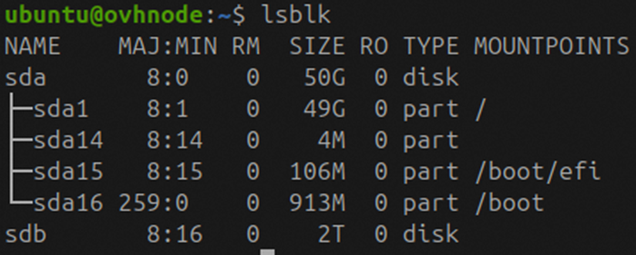{.thumbnail}

Isto apresenta uma vista em árvore de todos os dispositivos de armazenamento. Identifique o dispositivo (por exemplo, `/dev/sdb`) que corresponde ao seu volume de 2 TB. Este será formatado e montado para armazenar os dados da blockchain Ethereum.

Crie uma partição no volume recentemente associado. Substitua `/dev/sdb` pelo nome do dispositivo identificado na etapa anterior, caso seja diferente:

```bash
sudo fdisk /dev/sdb
```

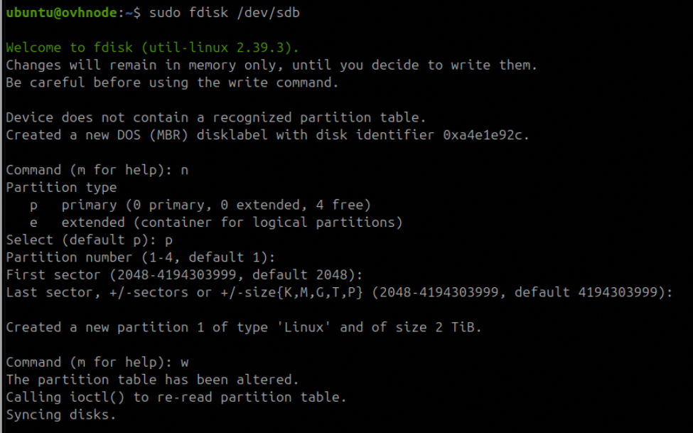{.thumbnail}

Isto abre o utilitário de particionamento para o dispositivo de bloco selecionado. Crie uma nova partição primária que ocupe todo o disco e, em seguida, grave as alterações. Uma vez concluído, a partição estará normalmente disponível como `/dev/sdb1`.

Formate a nova partição com o sistema de ficheiros ext4, que é uma escolha estável e amplamente suportada para armazenar dados da blockchain Ethereum:

```bash
sudo mkfs.ext4 /dev/sdb1
```

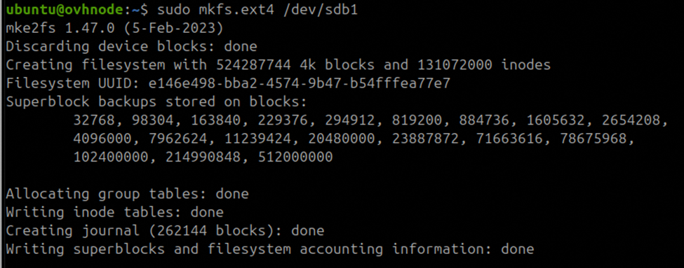{.thumbnail}

Crie um diretório dedicado para servir como ponto de montagem para o volume formatado e, em seguida, monte-o e verifique se foi corretamente associado ao sistema de ficheiros:

```bash
sudo mkdir -p /mnt/chaindata
sudo mount /dev/sdb1 /mnt/chaindata
df -h
```

- `mkdir -p /mnt/chaindata` cria o diretório de montagem (utilizando `-p` para garantir que não ocorre erro se os diretórios intermédios não existirem).
- `mount /dev/sdb1 /mnt/chaindata` monta a partição formatada no diretório.
- `df -h` apresenta todos os sistemas de ficheiros montados num formato legível, permitindo-lhe confirmar que `/dev/sdb1` está corretamente montado em `/mnt/chaindata` com a capacidade esperada (aproximadamente 2 TB).

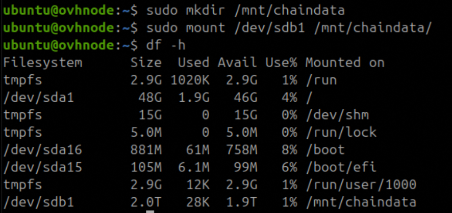{.thumbnail}

O seu disco está agora montado, mas a configuração **não é persistente**: se o servidor reiniciar, o volume terá de ser montado manualmente. Para que seja montado automaticamente no arranque, adicione uma entrada ao ficheiro `/etc/fstab`.

Obtenha o **UUID (Universally Unique Identifier)** do seu volume:

```bash
sudo blkid
```

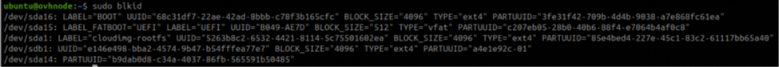{.thumbnail}

Este comando lista todos os dispositivos de bloco e os respetivos atributos associados. Identifique a entrada correspondente à sua nova partição (por exemplo, `/dev/sdb1`) e copie o valor do campo `UUID`.

Edite o ficheiro `/etc/fstab` para configurar a montagem automática:

```bash
sudo nano /etc/fstab
```

```text
UUID=<your-uuid-here> /mnt/chaindata ext4 nofail 0 0
```

A opção `nofail` permite que o sistema continue o arranque mesmo que o dispositivo não esteja disponível.

### Etapa 2 - Criar um utilizador dedicado

Crie uma **conta de utilizador dedicada** para gerir todas as operações do nó Ethereum. Esta prática melhora a segurança ao separar os processos do nó do utilizador predefinido do sistema.

```bash
sudo useradd -s /bin/bash -d /home/node_admin/ -m -G sudo node_admin
```

- `useradd` cria um novo utilizador chamado `node_admin`, com um diretório pessoal, shell bash e pertença ao grupo `sudo`.

Defina uma palavra-passe para o novo utilizador (substitua por uma palavra-passe forte ou configure a autenticação por chave):

```bash
echo 'node_admin:<strong_password>' | sudo chpasswd
```

Configure a **autenticação SSH por chave** para o novo utilizador, adicionando a sua chave pública SSH ao ficheiro `authorized_keys`. Substitua o marcador de posição pela sua chave pública real:

```bash
sudo mkdir -p /home/node_admin/.ssh
sudo sh -c "echo '<your-public-ssh-key>' > /home/node_admin/.ssh/authorized_keys"
```

Isto cria o ficheiro `authorized_keys` em `/home/node_admin/.ssh/` e insere a sua chave pública, permitindo o início de sessão seguro e sem palavra-passe como utilizador `node_admin`.

### Etapa 3 - Instalar o Nethermind (Execution Client)

O Nethermind é um execution client Ethereum responsável pelo processamento das transações e pela manutenção do estado do Ethereum.

Adicione o repositório APT oficial do Nethermind:

```bash
sudo apt-get install software-properties-common -y
sudo add-apt-repository ppa:nethermindeth/nethermind
```

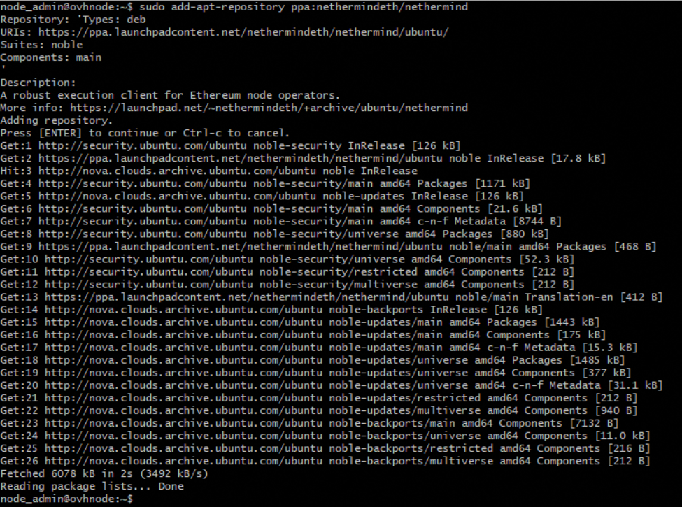{.thumbnail}

Atualize o índice de pacotes:

```bash
sudo apt-get update
```

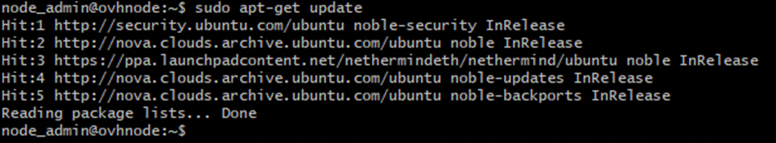{.thumbnail}

Instale o Nethermind:

```bash
sudo apt-get install nethermind -y
```

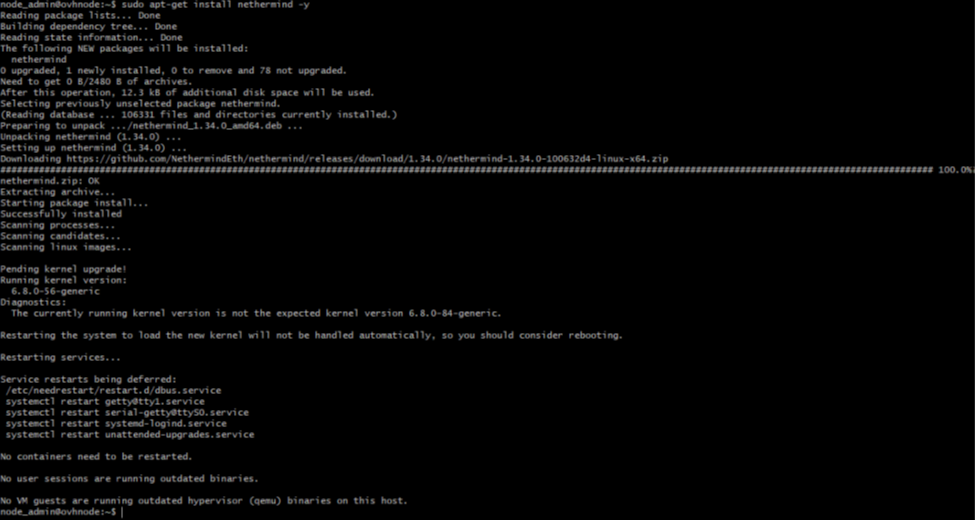{.thumbnail}

### Etapa 4 - Instalar o Lighthouse (Consensus Client)

O Lighthouse é um consensus client Ethereum responsável por alcançar o consenso através do protocolo proof-of-stake.

Transfira a versão estável mais recente a partir da [página de releases do Lighthouse no GitHub](https://github.com/sigp/lighthouse/releases):

```bash
curl -LO https://github.com/sigp/lighthouse/releases/download/v8.1.3/lighthouse-v8.1.3-x86_64-unknown-linux-gnu.tar.gz
```

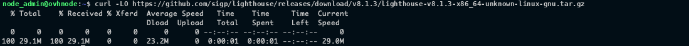{.thumbnail}

Extraia o arquivo:

```bash
tar -xvf lighthouse-v8.1.3-x86_64-unknown-linux-gnu.tar.gz
```

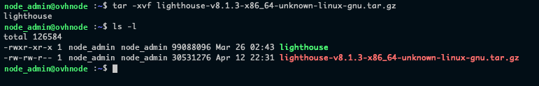{.thumbnail}

Verifique o binário e mova-o para uma localização acessível a todo o sistema:

```bash
./lighthouse --version
sudo cp lighthouse /usr/bin
```

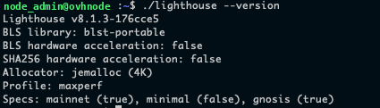{.thumbnail}

### Etapa 5 - Criar o ficheiro de segredo JWT

Um segredo JWT partilhado é necessário para a comunicação segura entre os clientes de execução e de consenso.

```bash
sudo mkdir -p /secrets
openssl rand -hex 32 | tr -d "\n" | sudo tee /secrets/jwt.hex > /dev/null
```

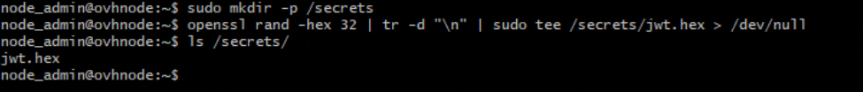{.thumbnail}

### Etapa 6 - Instalar o screen para persistência de sessão

Num servidor remoto, a desconexão do SSH termina os processos em execução. O `screen` mantém-nos em execução em segundo plano, independentemente da sua sessão.

```bash
screen --version
```

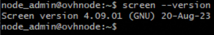{.thumbnail}

Se não estiver já instalado:

```bash
sudo apt-get install screen -y
```

### Etapa 7 - Definir a propriedade dos diretórios

Os clientes Ethereum necessitam de acesso de escrita ao diretório de dados. Atribua a propriedade do ponto de montagem ao seu utilizador atual:

```bash
sudo chown $USER:$USER /mnt/chaindata
```

Isto concede ao seu utilizador a propriedade total de `/mnt/chaindata`, para que os clientes Ethereum possam ler e escrever dados nesse local.

### Etapa 8 - Iniciar o Nethermind

Crie uma sessão screen e inicie o Nethermind:

```bash
screen -S nethermind
```

```bash
nethermind -c mainnet \
  --data-dir /mnt/chaindata/nethermind \
  --JsonRpc.Enabled true \
  --HealthChecks.Enabled true \
  --HealthChecks.UIEnabled true \
  --JsonRpc.EngineHost 127.0.0.1 \
  --JsonRpc.EnginePort 8551 \
  --JsonRpc.JwtSecretFile /secrets/jwt.hex
```

Deverá ver registos a indicar que o cliente está em execução. Eventualmente, a seguinte mensagem será apresentada:

```text
Waiting for Forkchoice message from Consensus Layer
```

Isto indica que o execution client está à espera de emparelhar com o consensus client.

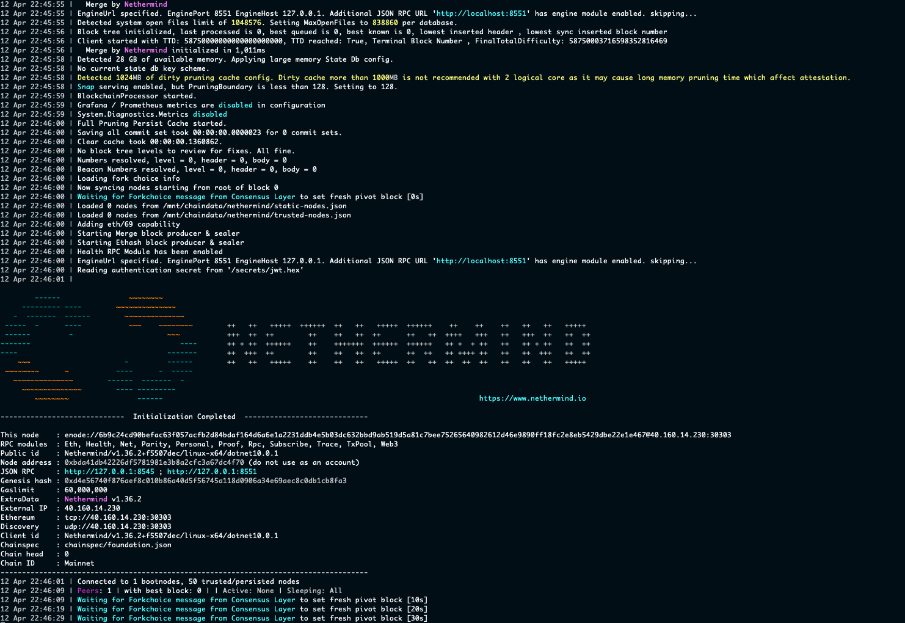{.thumbnail}

Desanexe a sessão premindo `Ctrl+A` e depois `D` para regressar ao shell principal.

Pode listar as sessões ativas com `screen -ls` e voltar a anexar mais tarde com `screen -r nethermind`.

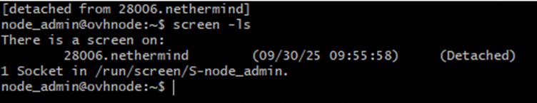{.thumbnail}

### Etapa 9 - Iniciar o Lighthouse

Crie uma nova sessão screen e inicie o Lighthouse:

```bash
screen -S lighthouse
```

```bash
lighthouse bn \
  --network mainnet \
  --execution-endpoint http://127.0.0.1:8551 \
  --execution-jwt /secrets/jwt.hex \
  --checkpoint-sync-url https://mainnet.checkpoint.sigp.io \
  --http \
  --datadir /mnt/chaindata/lighthouse
```

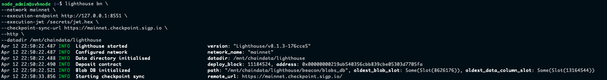{.thumbnail}

Após a configuração inicial, o Lighthouse deverá começar a sincronizar com a rede.

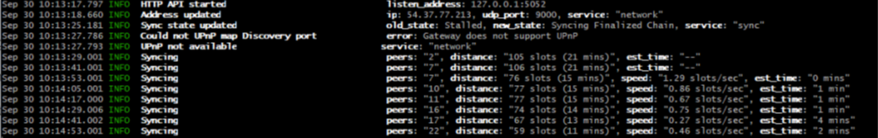{.thumbnail}

Desanexe a sessão premindo `Ctrl+A` e depois `D`.

### Etapa 10 - Verificar a sincronização

Nesta fase, tanto o **execution client** (Nethermind) como o **consensus client** (Lighthouse) devem estar em execução em sessões screen separadas. Para confirmar que estão corretamente ligados e que a sincronização está em curso, volte a anexar à sessão Nethermind e inspecione os registos:

```bash
screen -r nethermind
```

Se o Lighthouse estiver corretamente ligado, a mensagem "Waiting for Forkchoice" deverá desaparecer. Em vez disso, deverá ver registos de comunicação **Engine API** e de processamento de blocos:

```text
Received ForkChoice: ...
Syncing...
```

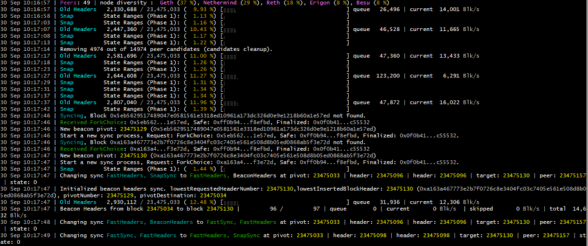{.thumbnail}

Estes registos confirmam que o Nethermind está a receber propostas de blocos e atualizações de fork choice do Lighthouse, e que o nó está a sincronizar com a mainnet do Ethereum.

Embora este tutorial se tenha focado na implementação técnica, é importante complementar a configuração com medidas adequadas de reforço da segurança, monitorização e manutenção para garantir a estabilidade a longo prazo. Com a base agora estabelecida, pode expandir a funcionalidade do seu nó, integrá-lo em infraestruturas maiores ou utilizá-lo como base para investigação, desenvolvimento e operações de staking.

## Quer saber mais?

- [Ethereum Foundation - Run a node](https://ethereum.org/en/run-a-node/)
- [Documentação Nethermind](https://docs.nethermind.io/)
- [Documentação Lighthouse](https://lighthouse-book.sigmaprime.io/)

[Criar uma instância Public Cloud](/pages/public_cloud/compute/public-cloud-first-steps)

[Criar e configurar um disco adicional numa instância](/pages/public_cloud/compute/create_and_configure_an_additional_disk_on_an_instance)

Fale com a nossa [comunidade de utilizadores](/links/community).
