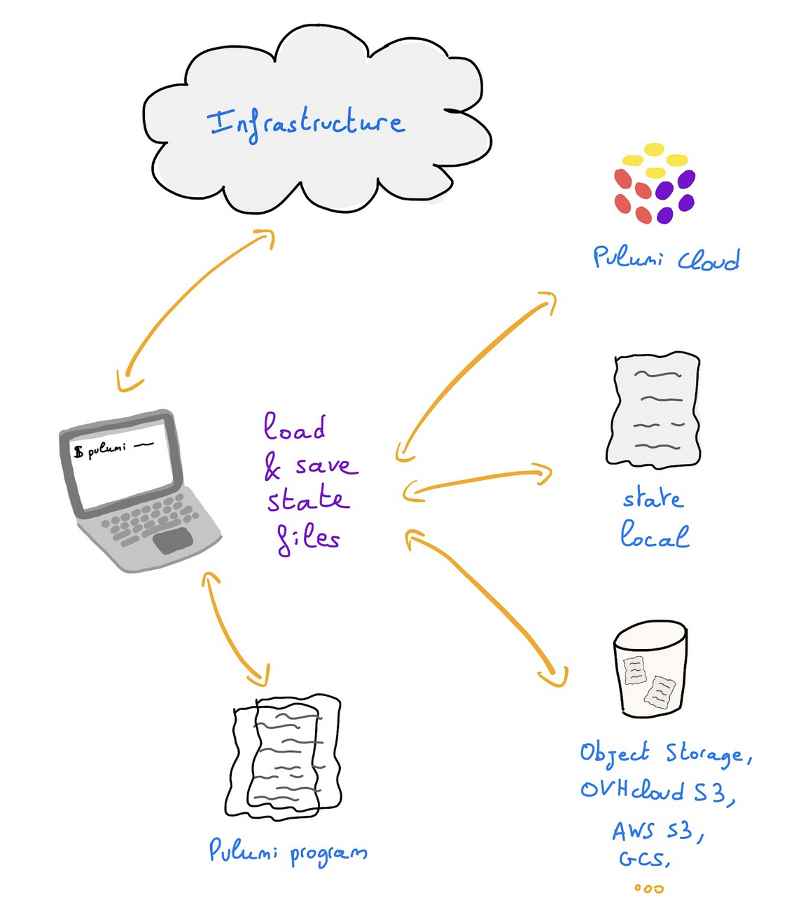
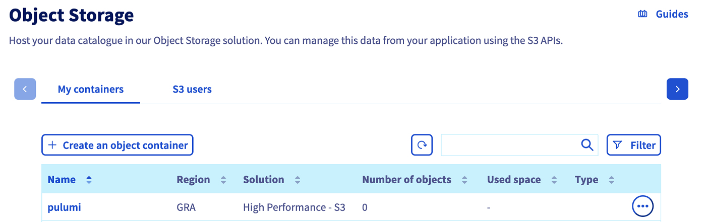
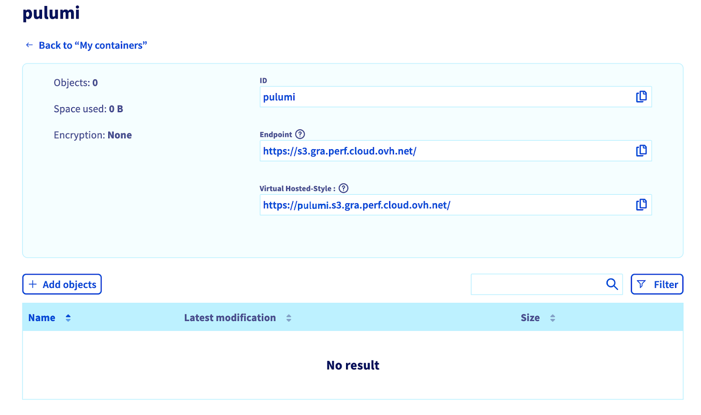
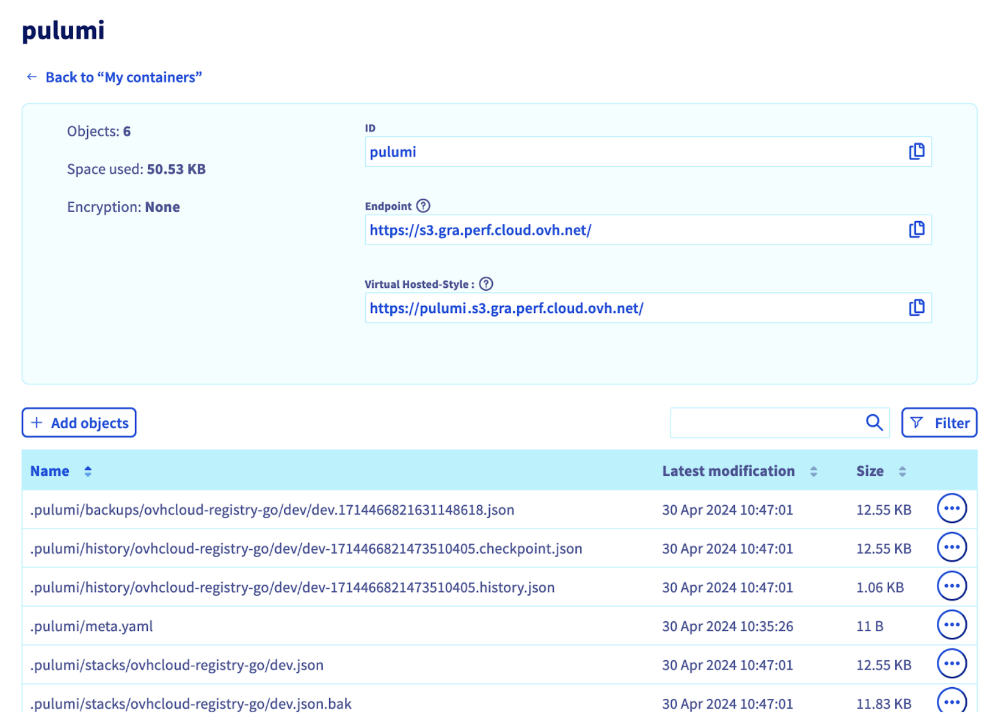

## Objective

It is possible to store Pulumi state on a remote data store/backend like an AWS S3 bucket, a Google Cloud Storage (GCS), etc., but did you know that you can also store your Pulumi states on an OVHcloud Object Storage container (bucket)?

In this tutorial you will:

- create an OVHcloud Object Storage container
- log in to Pulumi and initialise your Pulumi backend

## Requirements

- Access to the [OVHcloud Control Panel](/links/manager)
- A [Public Cloud Instance](https://www.ovhcloud.com/it/public-cloud/) in your OVHcloud account
- [Pulumi CLI](https://www.pulumi.com/docs/install/){.external} installed

**Before you begin**

- You should have installed Pulumi CLI, on your machine. You can install it by following the [detailed installation instructions](https://www.pulumi.com/docs/install/){.external}.

**Pulumi**

{.thumbnail}

[Pulumi](https://www.pulumi.com/){.external} is an Infrastructure as Code (IasC) tool that allows you to build your infrastructures with a programming language, in Golang for example.
Users define the desired state in Pulumi programs and Pulumi creates the desired resources.

Pulumi offers an intuitive command line interface (CLI), to provision, update or delete your infrastructure. If you are familiar with Docker Compose CLI and Terraform CLI, you will adopt [Pulumi CLI](https://www.pulumi.com/docs/cli/){.external} too.

At OVHcloud we created a [Pulumi provider](https://www.pulumi.com/registry/packages/ovh/){.external} that you can use to interact with and manage OVHcloud resources.

**Pulumi states and backend**

Pulumi stores metadata about your infrastructure so that it can manage your cloud resources, for example your OVHcloud resources. This metadata is called `state` and is typically JSON files. Each [stack](https://www.pulumi.com/docs/concepts/stack/){.external} has its own state, and state is how Pulumi knows when and how to create, read, delete, or update cloud resources.

A Pulumi state is updated when you run the `pulumi login`, `pulumi up` or `pulumi destroy` commands.

By default, status files are stored in the Pulumi cloud, and you can also store them locally.
You can store the state remotely in a [self-managed backend](https://www.pulumi.com/docs/concepts/state/#using-a-self-managed-backend).

{.thumbnail}

For example, you can store your Pulumi state on an OVHcloud High Performance (S3) Object Storage container.

There are several ways of doing this: using the `pulumi login` command or configuring a `backend` in your `Pulumi.yaml` file.

A state is composed of several files inside a `.pulumi` folder:

- `meta.yaml`: This is the metadata file. It does not hold information about the stacks but rather information about the backend itself.
- `stacks/`: Active state files for each stack (e.g. `dev.json`).
- `locks/`: Optional lock files for each stack if the stack is currently being operated on by a Pulumi operation (e.g. `dev/$lock.json`).
- `history/`: History for each stack (e.g. `dev/dev-$timestamp.history.json`vwhere $timestamp records the time the history file was created).

## Instructions

### Creating an Object Storage container/bucket

First, you need to have an Object Storage container. If you don't already have one, please consult the guide [Creating an Object Storage container](/pages/storage_and_backup/object_storage/s3_create_bucket).

For this guide, our Object Storage container has the following characteristics:

- a `High Performance Object Storage - S3 API`
- located in the `GRA` region
- with a newly created user
- named `pulumi`

{.thumbnail}

> [!primary]
> Save the S3 credentials, you will use the `S3 access key` and the `S3 secret key` in the coming `export` commands.
> 

Click on `pulumi`{.action} to access the bucket and to display its information, including the useful `Endpoint`.

{.thumbnail}

Export your S3 credentials in environment variables:

```bash
export AWS_ACCESS_KEY_ID=<S3 access key>
export AWS_SECRET_ACCESS_KEY=<S3 secret key>
```

### Set-up Pulumi backend and login

There are several ways to define the backend for storing a Pulumi report in a remote backend.
Follow the one you prefer.

> [!tabs]
> Pulumi login with backend URL
>> Execute the `pulumi login` command and pass in parameter directly the S3 backend URL:
>> ```bash
>> $ pulumi login 's3://pulumi?endpoint=s3.gra.perf.cloud.ovh.net&region=gra'
>>
>> Logged in to ovh-tuto-27gm21h6v46 as gitpod (s3://pulumi?endpoint=s3.gra.perf.cloud.ovh.net&region=gra)
>> ```
> Backend configuration in the `Pulumi.yaml` file
>> Or if you don't want to type the URL every time, you can define a backend property in the `Pulumi.yaml` config file as below:
>>
>> ```bash
>> ...
>> backend
>>   url: s3://pulumi?endpoint=s3.gra.perf.cloud.ovh.net&region=gra
>> ...
>> ```
>>
>> Then you can simply run the `pulumi login` command to log in and store/retrieve the state:
>>
>> ```bash
>> $ pulumi login
>>
>> Logged in to ovh-tuto-27gm21h6v46 as gitpod (s3://pulumi?endpoint=s3.gra.perf.cloud.ovh.net&region=gra)
>>```

As you can see, in both solutions, we defined all the needed parameters to access to the existing OVHcloud S3 bucket:

- endpoint=s3.gra.perf.cloud.ovh.net
- region=gra (or the region of your OVHcloud Object Storage bucket)

Now you can code your Pulumi program and after running the `pulumi up` command, your Pulumi state file will be stored in an OVHcloud Object Storage container.

{.thumbnail}

## Go further

Join our [community of users](/links/community).
