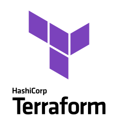
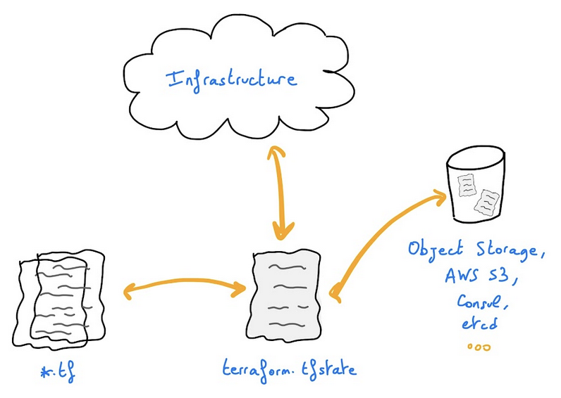
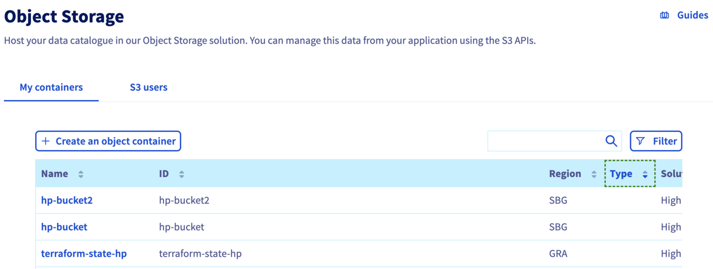

<style>
 pre {
     font-size: 14px;
 }
 pre.console {
   background-color: #300A24; 
   color: #ccc;
   font-family: monospace;
   padding: 5px;
   margin-bottom: 5px;
 }
 pre.console code {
   border: solid 0px transparent;
   font-family: monospace !important;
   font-size: 0.75em;
   color: #ccc;
 }
 .small {
     font-size: 0.75em;
 }
</style>


## Objectif

Il est possible de stocker l’état de Terraform sur un datastore/backend distant comme un bucket AWS S3, un Google Cloud Storage (GCS), etc. Mais savez-vous que vous pouvez également stocker vos états Terraform sur un conteneur Object Storage OVHcloud ?

Dans ce tutoriel, vous allez :

- Créer un conteneur Object Storage
- Créer un backend Terraform distant
- Initialiser votre backend Terraform

## Prérequis

- Être connecté votre [espace client OVHcloud](https://www.ovh.com/auth?onsuccess=https%3A%2F%2Fwww.ovh.com%2Fmanager%2Fpublic-cloud&ovhSubsidiary=fr)
- Une instance [Public Cloud](https://www.ovhcloud.com/fr/public-cloud/) dans votre compte OVHcloud
- Installation de la CLI [Terraform](https://www.terraform.io/downloads){.external}

## Avant de commencer

* Vous devez avoir installé Terraform CLI, version 0.12.x minimum, sur votre machine. Vous pouvez l'installer en suivant les instructions d'installation [détaillées](https://www.terraform.io/docs/cli/index.html){.external} ou avec l'outil [tfenv](https://github.com/tfutils/tfenv){.external}.

## Terraform

[Terraform](https://www.terraform.io/) est un outil open source d’Infrastructure as Code (IaC) créé par [Hashicorp](https://www.hashicorp.com/) en 2014 et écrit en Go. Il a pour but de construire, de modifier et de contrôler la version de votre infrastructure. Vous pouvez définir et provisionner votre infrastructure en écrivant la définition de vos ressources dans **Hashicorp Configuration Language** (HCL).

{.thumbnail}

Cet outil dispose d’une interface de ligne de commande (CLI) puissante et très intuitive.
Si vous souhaitez tirer parti de vos connaissances sur Terraform CLI, consultez [l'aide-mémoire](https://github.com/scraly/terraform-cheat-sheet/blob/master/terraform-cheat-sheet.pdf){.external}.

Chez OVHcloud, nous avons créé un [provider Terraform](https://registry.terraform.io/providers/ovh/ovh/latest){.external} qui vous permet d'interagir et de gérer les ressources OVHcloud.

### Terraform states et backend

Terraform a plusieurs concepts, dont celui de `state` (état).

Un état Terraform est un snapshot de votre infrastructure depuis la dernière exécution de la commande `terraform apply`.
Par défaut, le fichier d'état est stocké localement dans un fichier `terraform.tfstate`.
Mais l’usage courant, en environnement de production, est de le stocker à distance.

{.thumbnail}

Par exemple, vous pouvez stocker votre état Terraform sur un conteneur Object Storage High Performance (S3) d’OVHcloud.

Pour ce faire, vous devez configurer un `backend` dans vos fichiers de configuration Terraform HCL.

> [!primary]
> 
> Les états Terraform ne sont pas chiffrés lorsqu'ils sont stockés dans un conteneur Object Storage.

## Instructions

### Création d'un conteneur/bucket Object Storage

Vous devez d’abord disposer d’un conteneur Object Storage. Si ce n’est pas le cas, suivez le tutoriel de [création d’un conteneur Object Storage](/pages/storage_and_backup/object_storage/s3_getting_started_with_object_storage).

Pour ce guide, notre conteneur Object Storage est nommé `terraform-state-hp`, sa classe de stockage est `High Performance` et sa région est `GRA`.

{.thumbnail}

Afin de stocker vos états Terraform sur un Object Storage, et généralement si vous souhaitez interagir avec l'Object Storage, vous devez avoir les droits pour gérer un Object Storage.

À cette étape de ce tutoriel, vous devez donc disposer d'un conteneur High Performance Object Storage et d'un utilisateur. Vous devez également pouvoir interagir avec la CLI aws et lister les conteneurs High Performance Object Storage d’OVHcloud auxquels l’utilisateur est lié :

```
$ aws s3 ls
2022-07-11 16:20:48 my-container
2022-07-11 16:55:20 terraform-state-hp
```

### Initialisation de la configuration de Terraform

Créez un fichier `backend.tf` avec le contenu suivant :

```yaml
terraform {
    backend "s3" {
      bucket = "terraform-state-hp"
      key = "terraform.tfstate"
      region = "gra"
 #or sbg or any activated high performance storage region
      endpoint = "s3.gra.perf.cloud.ovh.net"
      skip_credentials_validation = true
      skip_region_validation = true
    }
}
```

Dans ce fichier, vous définissez un backend [Swift Terraform](https://www.terraform.io/language/settings/backends/s3) dans la région `gra`. N'hésitez pas à modifier ce paramètre si vous avez créé un conteneur Object Storage dans une autre région.


### Terraform Init

Vous pouvez maintenant initialiser votre configuration Terraform avec la commande `terraform init`.

La commande [terraform init](https://www.terraform.io/cli/commands/init) permet d'initialiser un répertoire de travail contenant les fichiers de configuration Terraform. Il s’agit de la première commande à exécuter après l’écriture d’une nouvelle configuration Terraform ou le clonage d’une configuration existante à partir du contrôle de version. Il est sûr d'exécuter cette commande plusieurs fois.

Cette commande initialise le backend (état distant ou local).

Après avoir exécuté cette commande, vous devriez obtenir un résultat comme ceci :

<pre class="console"><code>$ terraform init

Initializing the backend...

Successfully configured the backend "s3"! Terraform will automatically
use this backend unless the backend configuration changes.

Terraform has been successfully initialized!

You may now begin working with Terraform. Try running "terraform plan" to see
any changes that are required for your infrastructure. All Terraform commands
should now work.

If you ever set or change modules or backend configuration for Terraform,
rerun this command to reinitialize your working directory. If you forget, other
commands will detect it and remind you to do so if necessary.
</code></pre>

Il est maintenant possible de définir vos fichiers de configuration et providers/fournisseurs Terraform et, après l'exécution de la commande `terraform apply`, votre fichier d'état Terraform sera stocké dans un conteneur de l'Object Storage d'OVHcloud.

## Aller plus loin

Échangez avec notre communauté d'utilisateurs sur <https://community.ovh.com/>.
