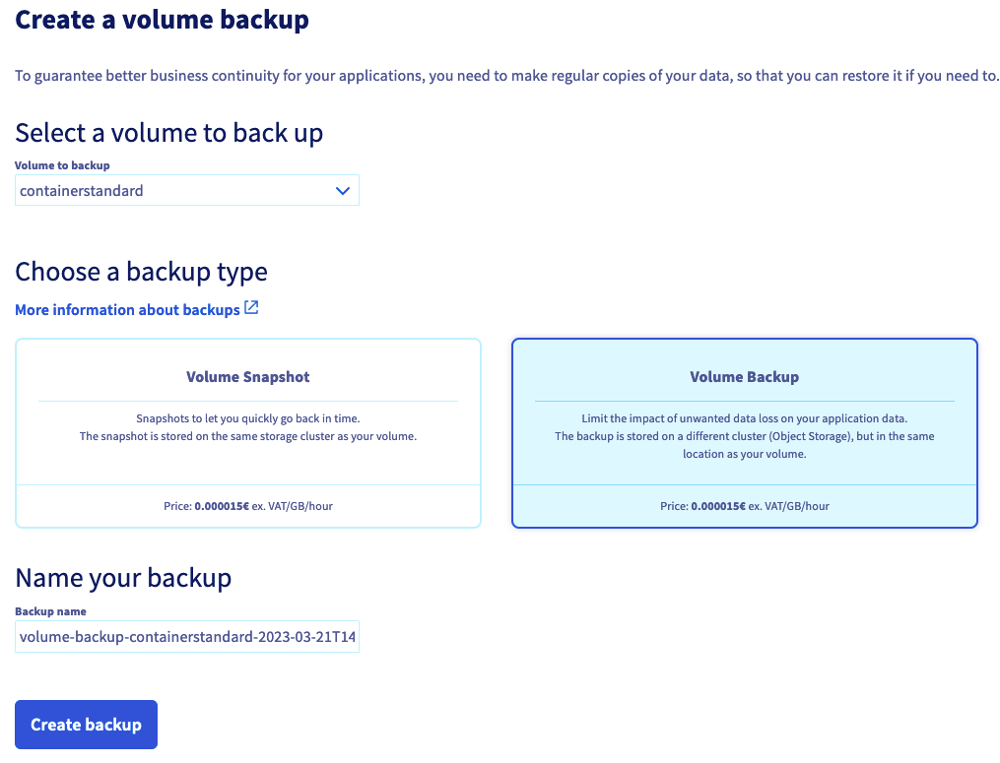
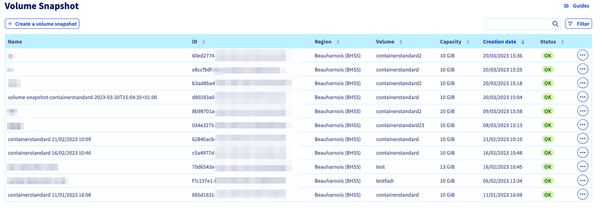
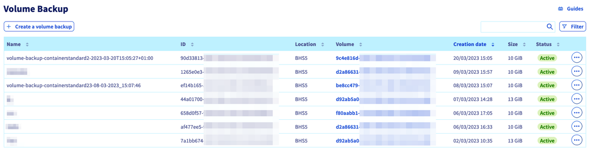
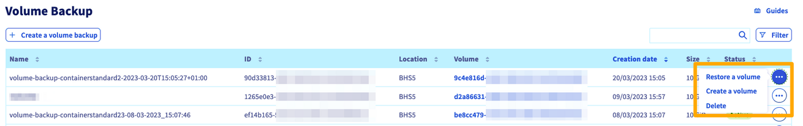

## Objectif

Si vous accordez de l'importance aux données stockées dans vos volumes Block Storage, il convient d'en organiser la sauvegarde afin de limiter l'impact potentiel de tout problème sur ces données, qu'il s'agisse d'une erreur humaine ou d'un incident au niveau du cluster.

Un **Volume Snapshot** est un point de récupération stocké dans le même cluster de stockage que le volume d'origine. Les opérations de création et de restauration sont rapides, mais en cas d'incident sur le cluster, le volume et Volume Snapshot peuvent être indisponibles. 
La création d'un Volume Snapshot ne nécessite pas que le volume soit détaché de l'instance.

Un **Volume Backup** est une image créée à partir de votre volume, cette dernière est stockée dans le cluster Object Storage de la localisation du volume d'origine.
Ce niveau de résilience est idéal et vous permettra de réagir rapidement à tout incident sur votre volume, en créant un autre volume à partir de la sauvegarde. 
La création d'une sauvegarde de volume nécessite que le volume soit détaché de l'instance.

Le Volume Snapshot et le Volume Backup vous permettent de :

- créer des sauvegardes de votre volume en quelques clics et les conserver aussi longtemps que nécessaire ;
- utiliser les sauvegardes pour restaurer l'état de votre volume ;
- utiliser les sauvegardes comme modèle pour créer des volumes identiques.

**Ce guide vous explique comment créer une sauvegarde de votre volume Block Storage depuis votre espace client OVHcloud.**

## Prérequis

- Être connecté à votre [espace client OVHcloud](https://www.ovh.com/auth/?action=gotomanager&from=https://www.ovh.com/fr/&ovhSubsidiary=fr)
- Un volume [Block storage](/pages/public_cloud/compute/create_and_configure_an_additional_disk_on_an_instance) créé dans votre projet [Public Cloud](https://www.ovhcloud.com/fr/public-cloud/)

## En pratique

Connectez-vous à votre [espace client OVHcloud](https://www.ovh.com/auth/?action=gotomanager&from=https://www.ovh.com/fr/&ovhSubsidiary=fr), rendez-vous dans la section `Public Cloud`{.action} et sélectionnez le projet Public Cloud concerné.

Ouvrez ensuite le menu `Block Storage`{.action} dans la barre de navigation à gauche sous **Storage**.

A droite du volume concerné, cliquez sur le bouton `...`{.action} puis sur `Créer une sauvegarde`{.action}. Il n'est pas nécessaire de détacher d'abord le volume de son instance. Cependant, si vous souhaitez détacher votre volume de son instance, consultez cette [section](/pages/public_cloud/compute/create_and_configure_an_additional_disk_on_an_instance#sous-linux) du guide correspondant pout Linux, et cette [section](/pages/public_cloud/compute/create_and_configure_an_additional_disk_on_an_instance#sous-windows) pour Windows.

{.thumbnail}

Si vous venez de la section Block Storage, le volume concerné est indiqué. Sinon, sélectionnez le volume que vous souhaitez sauvegarder.

Sélectionnez ensuite le type de sauvegarde que vous souhaitez créer : **Volume Snapshot** ou **Volume Backup**.

- En choisissant **Volume Snapshot**, vous aurez la possibilité de modifier le nom du Volume Snapshot à créer avant de valider via le bouton `Créer la sauvegarde`{.action}.
- En choisissant **Volume Backup**, il vous sera demandé de détacher votre volume de l'instance afin de pouvoir continuer. Vous pourrez alors modifier le nom du Volume Snapshot à créer avant de valider via le bouton `Créer la sauvegarde`{.action}.

{.thumbnail}

Le temps de création de la sauvegarde, qu'il s'agisse d'un Volume Snapshot ou d'un Volume Backup, peut prendre plusieurs heures, en fonction de la quantité de données présentes sur le volume, de l'utilisation des ressources de l'instance pour le Volume Snapshot, ainsi que d'autres facteurs spécifiques au host.

> [!primary]
> **Bonnes pratiques :**
>
> - effectuez vos sauvegardes de volume en dehors de vos heures de production ;
> - évitez de créer des snapshots aux heures de pointe (entre 04h00 et 22h00, heure de Paris) ;
> - installez l’agent qemu-guest si ce n’est pas fait ou essayez de le désactiver si nécessaire ;
> - essayez de ne pas trop « solliciter » le serveur pendant la phase de création du snapshot (limitation des I/O, consommation de RAM, etc.)
> - même si ce n'est pas obligatoire, il est préférable de détacher votre volume lors de la création d'un Volume Snapshot ;
> - vérifiez régulièrement que vous êtes en mesure de récupérer vos données à partir de votre Volume Snapshot ou de votre Volume Backup.
>

Un Volume Snapshot ou un Volume Backup étant un clone de l’ensemble du disque, il aura la taille maximale du volume d’origine, quelle que soit l’allocation réelle d’espace disque.

Vous trouverez la liste de vos Volume Snapshots dans la section `Volume Snapshot`{.action} dans la barre de navigation à gauche.
Dès que le Volume Snapshot est créé, il apparaît dans cette liste.

{.thumbnail}

Vous trouverez la liste de vos Volume Backups dans la section `Volume Backup`{.action} dans la barre de navigation à gauche.
Dès que la création du Volume Backup a été demandée, il est ajouté à la liste.

{.thumbnail}

Cliquez sur le bouton `...`{.action} pour `Supprimer`{.action} ou `Créer un volume`{.action} à partir du Volume Snapshot ou du Volume Backup correspondant.

Retrouvez plus d’informations à ce sujet dans [notre guide sur la création d'un volume depuis une sauvegarde](/pages/public_cloud/compute/create-volume-from-snapshot).

{.thumbnail}

## Aller plus loin

[Créer un volume à partir d’une sauvegarde](/pages/public_cloud/compute/create-volume-from-snapshot)

[Créer et configurer un disque supplementaire sur une instance](/pages/public_cloud/compute/create_and_configure_an_additional_disk_on_an_instance)

[Augmenter la taille d’un disque supplémentaire](/pages/public_cloud/compute/increase_the_size_of_an_additional_disk)

Échangez avec notre communauté d'utilisateurs sur <https://community.ovh.com/>.
