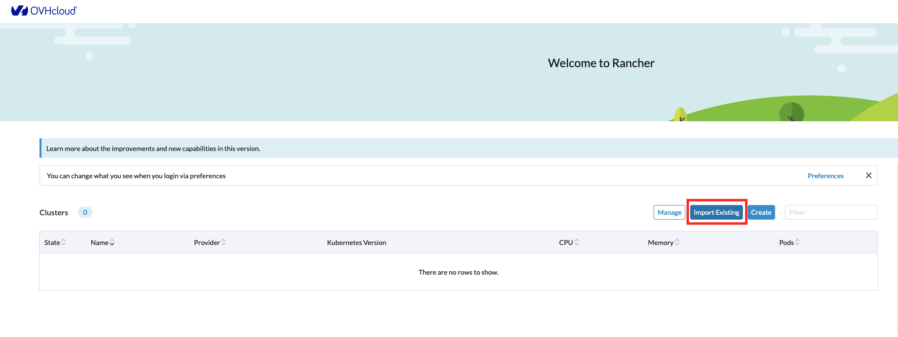
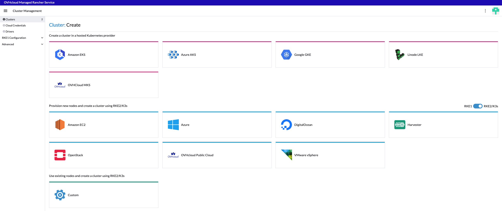
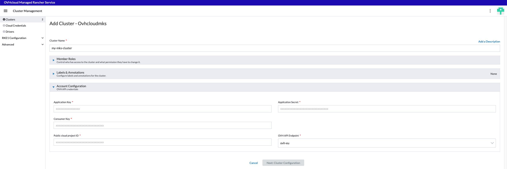
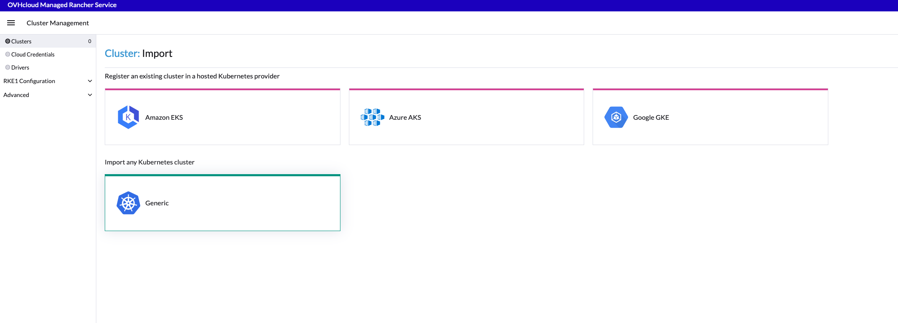
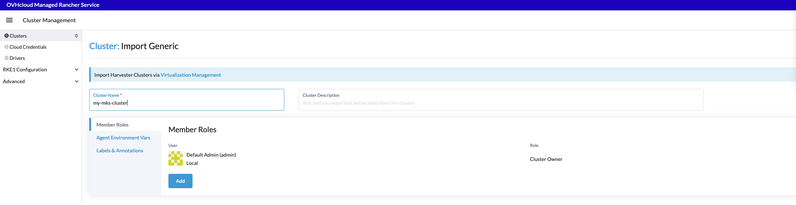
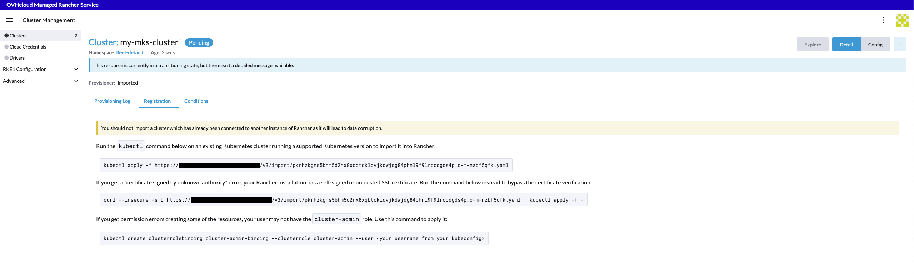
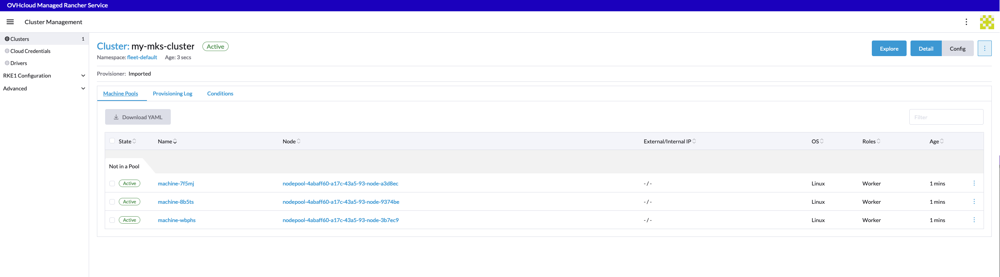
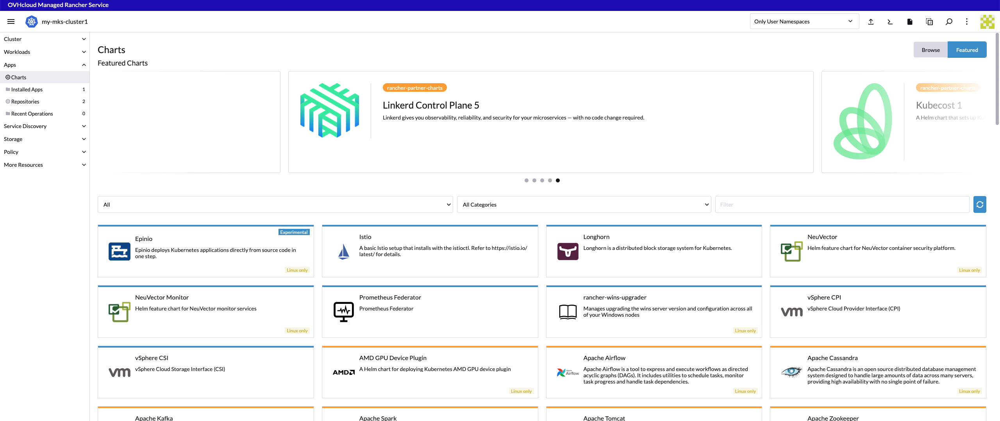

> [!warning]
>
> Usage of [Managed Rancher Service](https://labs.ovhcloud.com/en/managed-rancher-service/) is currently in Beta phase.
> This guide may be incomplete and will be extended during the beta phase. Our team remains available on our dedicated Discord Channel, do not hesitate do join and reach us : <https://discord.gg/ovhcloud>. Ask questions, provide feedback and interact directly with the team that builds our Container and Orchestration services.
>

## Objective

Container orchestration has become a cornerstone of modern application deployment, offering scalability, flexibility, and resource efficiency. Rancher is an open-source container management platform that simplifies the deployment and management of Kubernetes clusters.
Managed Rancher Service by OVHcloud, provides a powerful platform for orchestrating Kubernetes clusters seamlessly. In this detailed guide, we will explore the intricacies of setting up and managing containerized workloads.


### Rancher Creation and Access
> [!warning]
>
> During the Alpha phase, Rancher access are directly provided by OVHcloud team. Manager implementation will be available at Beta release phase. Please ignore this part for now.
>

To initiate your journey, log in to the OVHcloud Manager and access the _Managed Rancher Service_ under the _Container & Orchestration_ section.
Using the OVHcloud Manager you can trigger the creation of a Rancher which will be operated and managed by OVHcloud.

Simply click on the 'create' button at the top right of the manager and follow the steps below:

1. Define your Rancher's name
2. Select your Plan between "OVHcloud Edition" (coming soon) and "Standard"
3. Select the Rancher version
4. Click on Create
5. Wait for your Rancher to be created
6. Access the details of your newly created Rancher by click on its name
7. On the "Security and Access" section, click on "Generate access details", confirm, then click on "access Rancher UI"
8. Copy/Paste the provided credentials on the Rancher login page. Note: you will to change your password at first login. If you lose your password you have the possibility to generate a new one by using the "Generate access details" action button.

You now have access to the Rancher dashboard, it is designed to offer an intuitive and comprehensive view of your containerized environment.
This web-based interface serves as your command center for orchestrating containers & clusters, visualizing cluster health, and managing various aspects of your Kubernetes infrastructure. Explore the navigation menu, which includes sections for clusters, projects, applications, and Rancher settings.

As it is a brand new Rancher instance you do not have any downstream Kubernetes clusters, next step is to add some of them. To do so you have two options: Import existing Kubernetes clusters or Create new clusters using Rancher.

### Create or Import your Kubernetes clusters :
####  - Create a Kubernetes cluster with Rancher

Using this option you will be able to create Kubernetes cluster from scratch. Rancher simplifies the creation of clusters by allowing you to create them through the Rancher UI rather than more complex alternatives.
You can use Rancher to launch a Kubernetes cluster using any nodes you want. Rancher can launch Kubernetes on any computers, including:
  - Hosted Kubernetes provider (ex: OVHcloud Managed Kubernetes Service, AWS EKS, GCP GKE,... )
  - Infrastructure Provider - Public Cloud or Private Cloud (vSphere, Nutanix,...)
  -  Bare-metal servers, cloud hosted or on premise
  -  Virtual machines, cloud hosted or on premise


For the last three options, when Rancher deploys Kubernetes onto these nodes, you can choose between Rancher Kubernetes Engine RKE2 or k3s distributions.
Follow the official Rancher documentation on [How to launch Kubernetes with Rancher](https://ranchermanager.docs.rancher.com/how-to-guides/new-user-guides/launch-kubernetes-with-rancher) explaining how to define cluster settings, number of nodes (master, worker, etcd), authentication, and any additional configurations.

We will detail bellow how to use OVHcloud as a Hosted Kubernetes provider and Infrastructure Provider using our official OVHcloud Drivers.


##### 1/ Use OVHcloud as a **Hosted Kubernetes Provider**

> [!warning]
>
> Deploying to OVHcloud will incur charges. For more information, refer to the [MKS](https://www.ovhcloud.com/en/public-cloud/prices/#568) and [Compute](https://www.ovhcloud.com/en/public-cloud/prices/) pricing pages.
>

  On this part we will detail how to use Rancher to create and federate [OVHcloud Managed Kubernetes Service](https://www.ovhcloud.com/en-gb/public-cloud/kubernetes/) clusters.

  From the Rancher Homepage, click on 'Create'
  

  Then you can use the OVHcloud 'Hosted Kubernetes provider'
  


  Under the 'hosted Kubernetes provider' section click on 'OVHcloud MKS'
  

  You need to provide the following parameters:

  | Field                   | Mandatory                           | Description                                                                                                                                                                                                                                                                                                                                                                                                                           |
|-------------------------|-------------------------------------|---------------------------------------------------------------------------------------------------------------------------------------------------------------------------------------------------------------------------------------------------------------------------------------------------------------------------------------------------------------------------------------------------------------------------------------|
| Name                    | Yes                                 | Name of the Managed Kubernetes Service Cluster that will be created.                                                                                                                                                                                                                                                                                                                                                                 |
| Member Roles            | Yes, default value is ok| Configure user authorization for the cluster. Click Add Member to add users that can access the cluster. Use the Role drop-down to set permissions for each user.                                                                                                                                                                                                                                                                     |
| Label & Annotations     | No                                  | Add Kubernetes labels or annotations to the cluster.                                                                                                                                                                                                                                                                                                                                                                                  |
| Account Configuration   | Yes                                 | Section dedicated to provide your OVH API credentials, you can follow the guide on how to [Generation your OVHcloud API Keys](https://help.ovhcloud.com/csm/en-ie-api-getting-started-ovhcloud-api?id=kb_article_view&sysparm_article=KB0042786#advanced-usage-pair-ovhcloud-apis-with-an-application). Please refer to the table bellow to set the required rights on APIs routes.                                                                                                                      |
| Application Key         | Yes                                 | cf. guide provided above. Value is provided at APIs Keys generation step on https://www.ovh.com/auth/api/createToken                                                                                                                                                                                                                                                                                                                  |
| Consumer Key            | Yes                                 | cf. guide provided above. Value is provided at APIs Keys generation step on https://www.ovh.com/auth/api/createToken                                                                                                                                                                                                                                                                                                                  |
| Application Secret      | Yes                                 | cf. guide provided above. Value is provided at APIs Keys generation step on https://www.ovh.com/auth/api/createToken                                                                                                                                                                                                                                                                                                                  |
| Public cloud project ID | Yes                                 | The projectID of your OVHcloud project were your MKS cluster will be deployed. You can follow the guide on [How to create your first Project](https://help.ovhcloud.com/csm/en-public-cloud-compute-create-project?id=kb_article_view&sysparm_article=KB0050599) or if already existing you can copy/paste it from OVHcloud Manager or [APIs](https://eu.api.ovh.com/console-preview/?section=%2Fcloud&branch=v1#get-/cloud/project)  |
| OVH API Endpoint        | Yes                                 | Select the OVHcloud subsidiary (EU, US, CA)                                                                                                                                                                                  |

Minimum required access rights on API routes

| Method              | API Route                                             |
|---------------------|-------------------------------------------------------|
| POST                | /cloud/project/{PROJECT-ID}/kube                      |
| POST/GET/PUT/DELETE | /cloud/project/{PROJECT-ID}/kube/*                    |
| GET                 | /cloud/project/{PROJECT-ID}/capabilities/kube/flavors |
| GET                 | /cloud/project/{PROJECT-ID}/capabilities/kube/regions |
| GET                 | /cloud/project/{PROJECT-ID}/network/private           |
| GET                 | /cloud/project                                        |


##### 2. Use OVHcloud as an **Infrastructure Provider** by using Rancher to build a Kubernetes clusters using [OVHcloud computes instances](https://www.ovhcloud.com/en-ie/public-cloud/compute/) as nodes.

  > [!warning]
  >
  > Deploying to OVHcloud will incur charges. For more information, refer to the [MKS](https://www.ovhcloud.com/en/public-cloud/prices/#568) and [Compute](https://www.ovhcloud.com/en/public-cloud/prices/) pricing pages.
  >


#### - Import an existing Kubernetes cluster

For organizations with pre-existing Kubernetes clusters, Rancher simplifies integration. Import your clusters seamlessly, wherever they are deployed, allowing Rancher to take over the management responsibilities. This process facilitates the transition to Rancher without disrupting your existing infrastructure.

You can refer to the official Rancher documentation on how to [Register Existing Cluster](https://ranchermanager.docs.rancher.com/how-to-guides/new-user-guides/kubernetes-clusters-in-rancher-setup/register-existing-clusters).

#### - Import an existing OVHcloud [Managed Kubernetes Service](https://www.ovhcloud.com/en-gb/public-cloud/kubernetes/) cluster

If you already use our [OVHcloud Managed Kubernetes Service](https://www.ovhcloud.com/en-gb/public-cloud/kubernetes/) , you can easily import existing cluster.
The workflow is similar to the one described on the official Rancher documentation on [how to register a cluster](https://ranchermanager.docs.rancher.com/how-to-guides/new-user-guides/kubernetes-clusters-in-rancher-setup/register-existing-clusters#registering-a-cluster) and it takes only few minutes.

1. From the Rancher Homepage, click on 'Import Existing'

2. Select 'Generic'

3. Set the Cluster Name (it is not mandatory to match the name of your existing MKS cluster) then click on 'Create'

4. Follow the instructions provided on the 'Registration' tab
  

  Run the provided kubectl command on an existing Managed Kubernetes Service cluster that is running a supported Kubernetes version to import it into Rancher:
  ``` shell
  $ kubectl apply -f https://rancher.ovh.net/v3/import/file.yaml
  clusterrole.rbac.authorization.k8s.io/proxy-clusterrole-kubeapiserver unchanged
  clusterrolebinding.rbac.authorization.k8s.io/proxy-role-binding-kubernetes-master unchanged
  namespace/cattle-system created
  serviceaccount/cattle created
  clusterrolebinding.rbac.authorization.k8s.io/cattle-admin-binding created
  secret/cattle-credentials-ac3c0a4 created
  clusterrole.rbac.authorization.k8s.io/cattle-admin created
  deployment.apps/cattle-cluster-agent created
  service/cattle-cluster-agent created
  ```
5. wait until your cluster becomes available:

6. Tada ! Your cluster is now federated on your Rancher. You can click on 'Explore' to manage your MKS Cluster.


###  Exploring OVHcloud-Specific Integrations

//TODO explain public cloud and MKS drivers. CSI and storage offers

###  Deploying Applications with Rancher

Now that your clusters are set up, leverage Rancher's user-friendly interface to deploy applications effortlessly. Define workloads, services, and deployment strategies within the Rancher UI. Explore the extensive catalog of pre-configured application templates to simplify and expedite your application deployment process.
To access the applications catalogs, explore your federated downstream Kubernetes cluster and click on Apps/Charts of the left panel.



###  Managing Resources

Rancher empowers you with robust tools for resource management. Monitor the health of nodes, track resource utilization, and scale applications dynamically as demand fluctuates. The centralized control provided by Rancher ensures efficient resource allocation across your Kubernetes clusters.

###  Monitoring and Troubleshooting

Dive into Rancher's monitoring capabilities to gain real-time insights into the performance of your clusters and applications. Utilize logging features and diagnostic tools to troubleshoot issues promptly. Rancher's comprehensive monitoring suite ensures you can proactively address potential challenges.


###  Regular Updates and Maintenance

Stay informed about updates to Rancher and OVHcloud Manager Rancher Service features. Regularly check for new releases, security patches, and optimizations. This proactive approach ensures that your container orchestration environment remains secure, efficient, and aligned with the latest industry standards.

//TODO explanation on upgrade policy
//TODO explanation regarding the fact that clusters created through rancher should not be manually updated (using API or manager)

### Conclusion

Rancher, when managed within the OVHcloud Cloud environment, offers a comprehensive solution for container orchestration. By following these detailed steps, you'll not only establish a robust Kubernetes infrastructure but also harness the full potential of Rancher's features within the unique context of OVHcloud Cloud.
Happy Ranchering!


## Go further

To have an overview of OVHcloud Managed Kubernetes service, you can go to the [OVHcloud Managed Kubernetes page](https://www.ovhcloud.com/en-gb/public-cloud/kubernetes/).

- If you need training or technical assistance to implement our solutions, contact your sales representative or click on [this link](https://www.ovhcloud.com/en-gb/professional-services/) to get a quote and ask our Professional Services experts for assisting you on your specific use case of your project.

- Join our community of users on <https://community.ovh.com/en/>.
