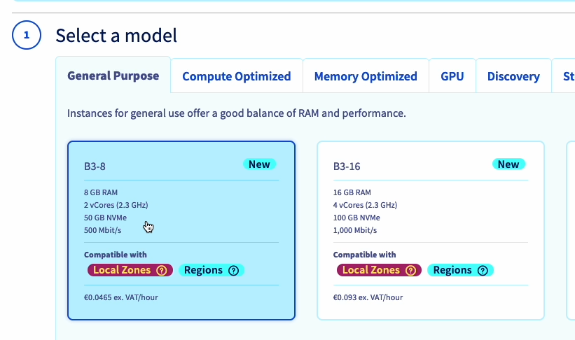
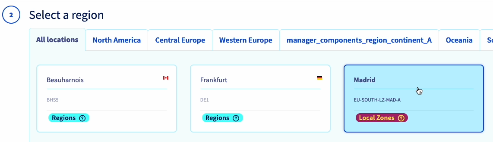
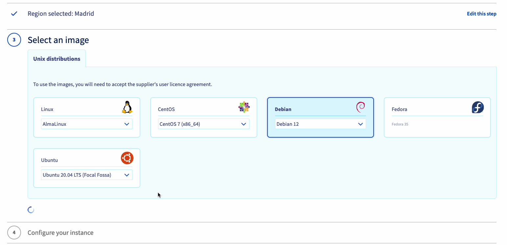
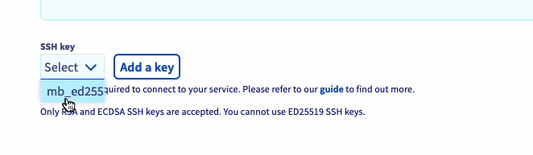
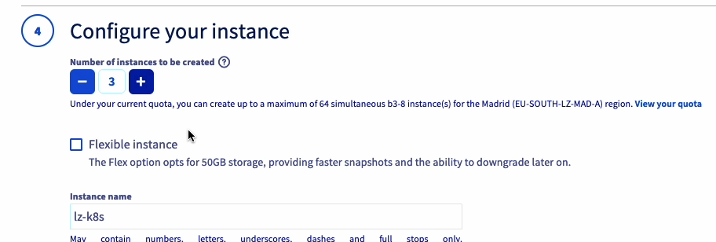
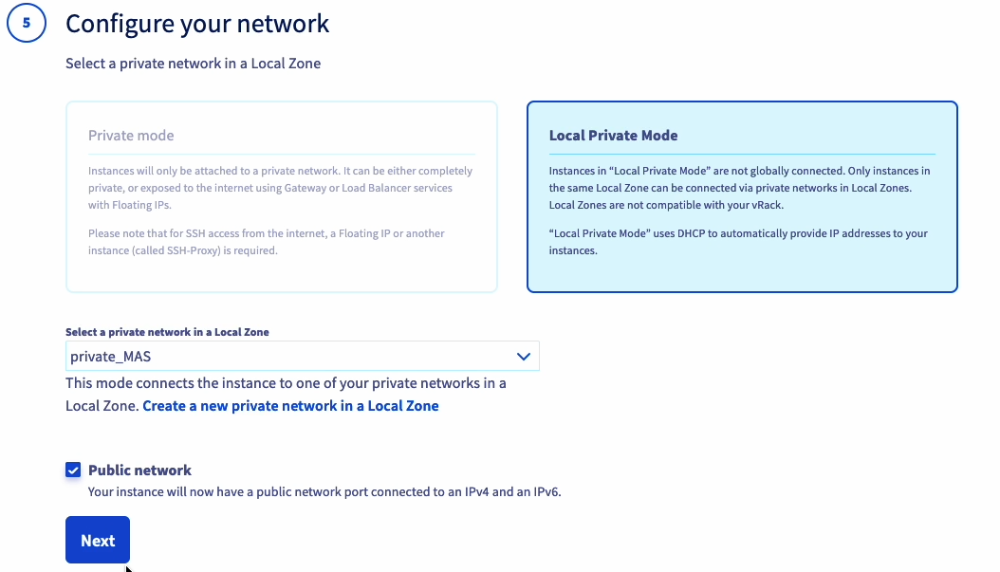
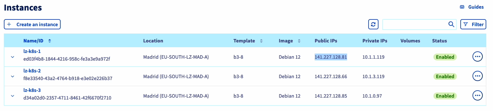

## Objectif

**Découvrez comment déployer un cluster Kubernetes en utilisant Rancher sur une Local Zone d'OVHcloud.**

## Prérequis

- Avoir un projet OVHcloud avec des instances disponibles.
- Référez-vous aux guides suivants :
  - [Débuter avec l’API OpenStack](/pages/public_cloud/compute/starting_with_nova)
  - [Attacher une adresse Floating IP à une instance Public Cloud](/pages/public_cloud/public_cloud_network_services/getting-started-03-attach-floating-ip-to-instance)
  - [Gestion des règles de firewall et port security sur les réseaux utilisant OpenStack CLI](/pages/public_cloud/compute/security_group_private_network)

## En pratique

### Étape 1 : Créer des instances

1. Connectez-vous au panneau de contrôle OVHcloud et ouvrez la section **Public Cloud**.
2. Accédez à **Instances** sous la section **Compute**.
3. Cliquez sur le bouton **Create an instance**.
4. Suivez les instructions du guide [OVHcloud Public Cloud Compute Getting Started](https://help.ovhcloud.com/csm/fr-public-cloud-compute-getting-started?id=kb_article_view&sysparm_article=KB0051011) pour créer votre clé SSH si nécessaire.
5. Choisissez un modèle d'instance . 
6. Sélectionnez une Local Zone. 
7. Choisissez une image.  
8. Sélectionnez votre clé SSH.
9. Indiquez `3` comme nombre d'instances à créer et changez le nom des instances (`lz-kube` par exemple).
10. Cochez les cases **Private network** et **Public network** (pour avoir une IP publique).
11. Les instances prendront quelques minutes pour se créer.

### Étape 2 : Déployer un Managed Rancher

1. Dans le panneau de contrôle OVHcloud, cliquez sur le bouton **Create a Managed Rancher Service**.
2. Remplissez un nom (`my_lz_rancher` par exemple), choisissez le plan **Standard**, la version recommandée, puis cliquez sur le bouton **Create a Managed Rancher Service**.
3. Une fois le service créé, dans la liste des Managed Rancher Service, cliquez sur votre instance, puis cliquez sur le bouton **Generate access code** pour générer le login et le mot de passe pour accéder à Rancher. Enregistrez le login et le mot de passe et cliquez sur le bouton **Go to Rancher**.
4. Copiez/collez le mot de passe dans le champ **password** et cliquez sur le bouton **Log in with Local User**.
5. Un nouveau mot de passe sera généré, enregistrez-le ! Enregistrez également l'URL du serveur, cochez la case **End User License Agreement** et cliquez sur le bouton **Continue**.

### Étape 3 : Configurer Rancher pour déployer un cluster Kubernetes

#### Créer un cluster

1. Dans l'interface Rancher, cliquez sur le bouton **Create** puis sur le driver **Custom**.
2. Remplissez un nom de cluster (`lz-k3s` par exemple).
3. Dans la liste des versions de Kubernetes, choisissez la version `1.27.14` de k3s.
4. Cliquez sur le bouton **Create**.

#### Configurer le cluster

- **Pour le nœud etcd et control plane :**
  - Cochez les cases **etcd** et **control plane**.
  - Copiez la commande d'enregistrement proposée par Rancher.

1. Récupérez l'IP publique de la première instance dans le panneau de contrôle OVHcloud.
2. Connectez-vous en SSH à la première instance depuis votre terminal local et exécutez la commande d'enregistrement.

```bash
$ ssh root@xxx.xxx.xxx.xxx
The authenticity of host 'xxx.xxx.xxx.xxx (xxx.xxx.xxx.xxx)' can't be established.
ED25519 key fingerprint is SHA256:dqsdqsdqsdqsd/dqsdqsdqsdqsdqsdqsdq.
This key is not known by any other names
Are you sure you want to continue connecting (yes/no/[fingerprint])? yes
...
root@lz-kube-1:~# curl -fL https://dsqdsqdqsd.p7mg.rancher.ovh.net/system-agent-install.sh | sudo  sh -s - --server https://dsqdsqdqsd.p7mg.rancher.ovh.net --label 'cattle.io/os=linux' --token kbv5k48vc8thhgqqhmtd8tn55qtlpgw7jp4llm4m4tvnp9sznscmpf --etcd --controlplane
  % Total    % Received % Xferd  Average Speed   Time    Time     Time  Current
                                 Dload  Upload   Total   Spent    Left  Speed
100 30794    0 30794    0     0   156k      0 --:--:-- --:--:-- --:--:--  157k
[INFO]  Label: cattle.io/os=linux
...
```

### Pour les nœuds worker :

1. Décochez les cases et cochez uniquement la case **Worker**.
2. Copiez la commande d'enregistrement proposée par Rancher.
3. Récupérez les IP publiques des deux autres instances dans le panneau de contrôle OVHcloud.
4. Connectez-vous en SSH à chaque instance depuis votre terminal local et exécutez la commande d'enregistrement pour les nœuds worker.
   
```bash
$ ssh root@xxx.xxx.xxx.xxx
The authenticity of host 'xxx.xxx.xxx.xxx (xxx.xxx.xxx.xxx)' can't be established.
ED25519 key fingerprint is SHA256:dqsdqsdqsdqsd/dqsdqsdqsdqsdqsdqsdq.
This key is not known by any other names
Are you sure you want to continue connecting (yes/no/[fingerprint])? yes
...

root@lz-kube-2:~# curl -fL https://dsqdsqdqsd.p7mg.rancher.ovh.net/system-agent-install.sh | sudo  sh -s - --server https://dsqdsqdqsd.p7mg.rancher.ovh.net --label 'cattle.io/os=linux' --token kbv5k48vc8thhgqqhmtd8tn55qtlpgw7jp4llm4m4tvnp9sznscmpf --worker
  % Total    % Received % Xferd  Average Speed   Time    Time     Time  Current
                                 Dload  Upload   Total   Spent    Left  Speed
100 30794    0 30794    0     0   156k      0 --:--:-- --:--:-- --:--:--  157k
[INFO]  Label: cattle.io/os=linux
...

```

1. Attendez que le cluster soit en état **Active**.

### Étape 4 : Se connecter au cluster avec la CLI kubectl

1. Dans l'interface Rancher, cliquez sur le cluster **lz-k3s**.
2. Cliquez sur l'icône **Download KubeConfig** pour télécharger le fichier kubeconfig et enregistrez le chemin du kubeconfig dans une variable d'environnement.

```bash
export KUBE_CLUSTER=$(pwd)/lz_k3s.yml
```
3.  Testez la connexion au cluster Kubernetes :

```bash
kubectl --kubeconfig=$KUBE_CLUSTER cluster-info
```
4.  Listez les nœuds pour vérifier la configuration :

```bash

kubectl --kubeconfig=$KUBE_CLUSTER get no

NAME        STATUS   ROLES                       AGE     VERSION
lz-kube-1   Ready    control-plane,etcd,master   9m9s    v1.27.14+k3s1
lz-kube-2   Ready    worker                      8m59s   v1.27.14+k3s1
lz-kube-3   Ready    worker                      9m      v1.27.14+k3s1

```

5. Vérifiez les ressources déployées dans le cluster :


```bash
6. kubectl --kubeconfig=$KUBE_CLUSTER get all
```

Vous devriez voir la liste des pods, services et autres ressources déployées dans votre cluster Kubernetes.

### Conclusion

En suivant ce guide, vous avez créé un cluster Kubernetes dans une Local Zone via Rancher. Vous avez maintenant un cluster fonctionnel que vous pouvez gérer et utiliser pour vos besoins de développement et de production.

N'hésitez pas à consulter les ressources supplémentaires fournies au début de ce guide pour en savoir plus sur l'utilisation de Rancher et des Local Zones d'OVHcloud.
