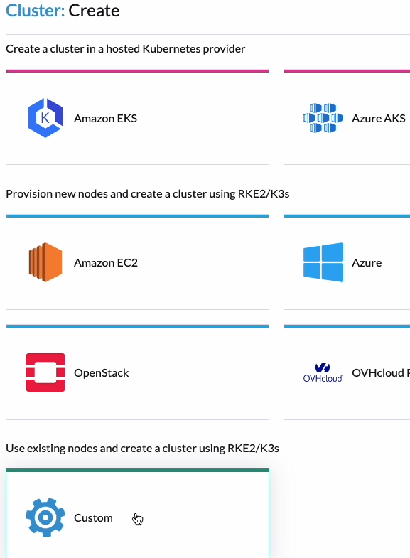

## Objectif

**Découvrez comment déployer un cluster Kubernetes avec Rancher dans une Local Zone d'OVHcloud.**

## Pré-requis

- Avoir un projet OVHcloud avec des instances disponibles.
- Avoir un Rancher existant. Référez-vous au guide suivant pour créer un service Rancher géré :
  - [Guide de démarrage avec le service Rancher géré](/pages/public_cloud/containers_orchestration/managed_rancher_service/getting-started/)
- Référez-vous au guide suivant pour créer des instances :
  - [Démarrage avec OVHcloud Public Cloud Compute](/pages/public_cloud/compute/public-cloud-first-steps)

### Pré-Configuration

#### Comprendre le Processus

Dans ce guide, nous allons créer des instances dans une Local Zone d'OVHcloud, qui seront ensuite utilisées par Rancher pour déployer un cluster Kubernetes en mode "custom cluster". Les étapes clés sont :

1. **Créer des Instances dans la Local Zone** : Nous allons commencer par créer des instances virtuelles dans une Local Zone spécifique au sein d'OVHcloud. Une Local Zone est une zone géographique spécifique avec ses propres ressources et infrastructures dédiées, offrant une informatique à faible latence et haute performance.

2. **Déployer un Rancher géré** : Après avoir créé les instances, nous déploierons un service Rancher géré. Rancher est une puissante plateforme open-source qui fournit une suite complète d'outils pour gérer les clusters Kubernetes.

3. **Configurer un Cluster Kubernetes personnalisé** : Avec Rancher, nous configurerons un cluster Kubernetes en mode personnalisé. Cela implique d'enregistrer nos instances créées précédemment avec Rancher, qui les configurera en tant que nœuds Kubernetes.

#### Pourquoi cette Approche ?

Cette méthode est une solution temporaire en attendant la disponibilité d'un driver Local Zone dédié. Un driver Local Zone permettrait à Rancher de gérer et de déployer directement les ressources et instances dans la Local Zone sans intervention manuelle. En attendant, ce processus étape par étape permet de tirer parti des avantages des Local Zones pour vos clusters Kubernetes.

#### Avantages des Local Zones

- **Faible Latence** : En exécutant les workloads dans une Local Zone, vous bénéficiez d'une latence réduite, cruciale pour les applications et services en temps réel.
- **Performances Élevées** : Les Local Zones sont conçues pour offrir des performances de calcul élevées avec des ressources dédiées.
- **Proximité Géographique** : Elles permettent de placer vos applications plus près de vos utilisateurs, améliorant ainsi l'expérience utilisateur.

#### Améliorations Futures

À l'avenir, avec l'introduction d'un driver Local Zone, le processus sera simplifié :
- Rancher pourra gérer directement le cycle de vie des instances dans les Local Zones.
- La mise à l'échelle et la gestion automatisées des ressources seront possibles, réduisant l'intervention manuelle.

En suivant ce guide, vous pouvez configurer un environnement Kubernetes robuste dans une Local Zone d'OVHcloud, en profitant des capacités actuelles tout en anticipant les améliorations futures.

## En pratique

### Étape 1 : Créer des instances

1. Connectez-vous au panneau de contrôle OVHcloud et ouvrez la section **Public Cloud**.
2. Accédez à **Instances** sous la section **Compute**.
3. Cliquez sur le bouton **Create an instance**.
4. Suivez les instructions du guide [OVHcloud Public Cloud Compute Getting Started](/pages/public_cloud/compute/public-cloud-first-steps) pour créer votre clé SSH si nécessaire.

5. Choisissez un modèle d'instance . 


6. Sélectionnez une Local Zone. 


7. Choisissez une image.  


8. Sélectionnez votre clé SSH.


9. Indiquez `3` comme nombre d'instances à créer et changez le nom des instances (`lz-kube` par exemple).


10. Cochez les cases **Private network** et **Public network** (pour avoir une IP publique).


11. Les instances prendront quelques minutes pour se créer.


### Étape 2 : Configurer Rancher pour Déployer un Cluster Kubernetes

#### Créer un Cluster

1. Dans l'interface Rancher, cliquez sur le bouton **Create** puis sur le driver **Custom**.
2. Remplissez le nom du cluster (par ex., `lz-k3s`).
3. Dans la liste des versions de Kubernetes, choisissez la version `1.27.14` de k3s.
4. Cliquez sur le bouton **Create**.



#### Configurer le Cluster

- **Pour les nœuds du plan de contrôle et etcd** :
  - Pour la production, suivez les bonnes pratiques et utilisez au moins 3 nœuds pour le plan de contrôle et etcd.
  - Cochez les cases **etcd** et **control plane**.
  - Copiez la commande d'enregistrement fournie par Rancher.

1. Récupérez l'IP publique de la première instance dans le panneau de contrôle OVHcloud.
2. SSH dans la première instance depuis votre terminal local et exécutez la commande d'enregistrement.

```bash
$ ssh root@xxx.xxx.xxx.xxx
The authenticity of host 'xxx.xxx.xxx.xxx (xxx.xxx.xxx.xxx)' can't be established.
ED25519 key fingerprint is SHA256:dqsdqsdqsdqsd/dqsdqsdqsdqsdqsdqsdq.
This key is not known by any other names
Are you sure you want to continue connecting (yes/no/[fingerprint])? yes
...
root@lz-kube-1:~# curl -fL https://dsqdsqdqsd.p7mg.rancher.ovh.net/system-agent-install.sh | sudo  sh -s - --server https://dsqdsqdqsd.p7mg.rancher.ovh.net --label 'cattle.io/os=linux' --token kbv5k48vc8thhgqqhmtd8tn55qtlpgw7jp4llm4m4tvnp9sznscmpf --etcd --controlplane
  % Total    % Received % Xferd  Average Speed   Time    Time     Time  Current
                                 Dload  Upload   Total   Spent    Left  Speed
100 30794    0 30794    0     0   156k      0 --:--:-- --:--:-- --:--:--  157k
[INFO]  Label: cattle.io/os=linux
...
```

### Pour les nœuds worker :

1. Décochez les cases et cochez uniquement la case **Worker**.
2. Copiez la commande d'enregistrement proposée par Rancher.
3. Récupérez les IP publiques des deux autres instances dans le panneau de contrôle OVHcloud.
4. Connectez-vous en SSH à chaque instance depuis votre terminal local et exécutez la commande d'enregistrement pour les nœuds worker.
   
```bash
$ ssh root@xxx.xxx.xxx.xxx
The authenticity of host 'xxx.xxx.xxx.xxx (xxx.xxx.xxx.xxx)' can't be established.
ED25519 key fingerprint is SHA256:dqsdqsdqsdqsd/dqsdqsdqsdqsdqsdqsdq.
This key is not known by any other names
Are you sure you want to continue connecting (yes/no/[fingerprint])? yes
...

root@lz-kube-2:~# curl -fL https://dsqdsqdqsd.p7mg.rancher.ovh.net/system-agent-install.sh | sudo  sh -s - --server https://dsqdsqdqsd.p7mg.rancher.ovh.net --label 'cattle.io/os=linux' --token kbv5k48vc8thhgqqhmtd8tn55qtlpgw7jp4llm4m4tvnp9sznscmpf --worker
  % Total    % Received % Xferd  Average Speed   Time    Time     Time  Current
                                 Dload  Upload   Total   Spent    Left  Speed
100 30794    0 30794    0     0   156k      0 --:--:-- --:--:-- --:--:--  157k
[INFO]  Label: cattle.io/os=linux
...

```

1. Attendez que le cluster soit en état **Active**.

### Étape 4 : Se connecter au cluster avec la CLI kubectl

1. Dans l'interface Rancher, cliquez sur le cluster **lz-k3s**.
2. Cliquez sur l'icône **Download KubeConfig** pour télécharger le fichier kubeconfig et enregistrez le chemin du kubeconfig dans une variable d'environnement.

```bash
export KUBE_CLUSTER=$(pwd)/lz_k3s.yml
```
3.  Testez la connexion au cluster Kubernetes :

```bash
kubectl --kubeconfig=$KUBE_CLUSTER cluster-info
```
4.  Listez les nœuds pour vérifier la configuration :

```bash

kubectl --kubeconfig=$KUBE_CLUSTER get no

NAME        STATUS   ROLES                       AGE     VERSION
lz-kube-1   Ready    control-plane,etcd,master   9m9s    v1.27.14+k3s1
lz-kube-2   Ready    worker                      8m59s   v1.27.14+k3s1
lz-kube-3   Ready    worker                      9m      v1.27.14+k3s1

```

5. Vérifiez les ressources déployées dans le cluster :


```bash
6. kubectl --kubeconfig=$KUBE_CLUSTER get all
```

Vous devriez voir la liste des pods, services et autres ressources déployées dans votre cluster Kubernetes.

## Aller plus loin
 
Échangez avec notre communauté d'utilisateurs sur <https://community.ovh.com/>.
