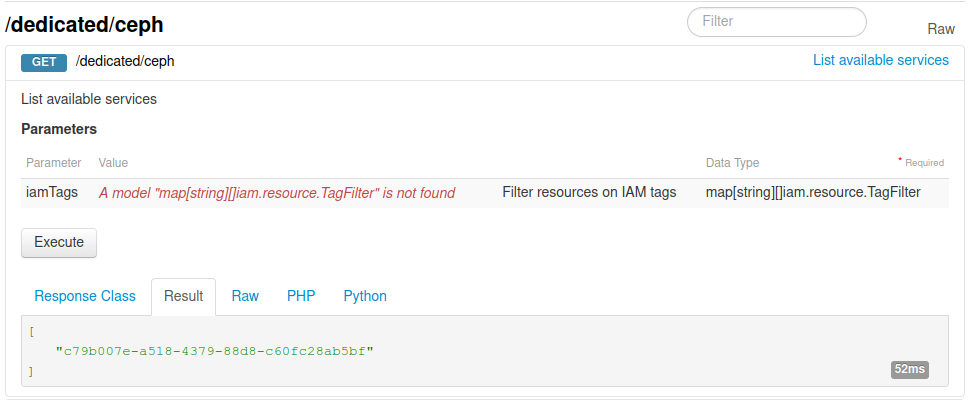
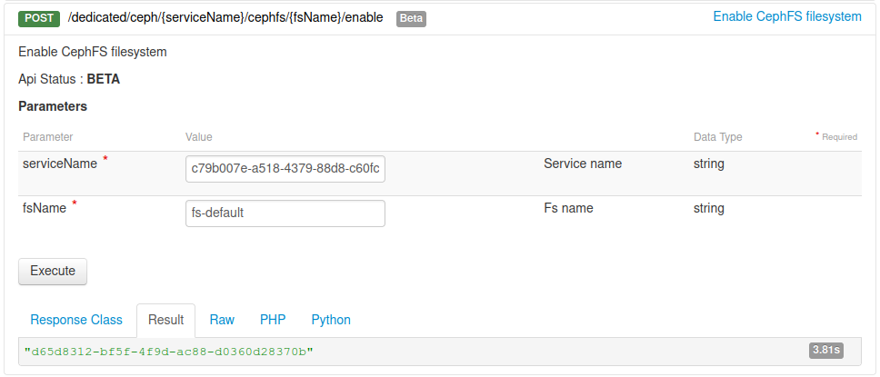
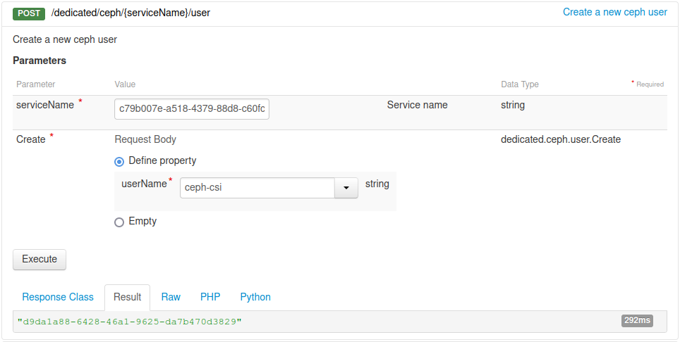
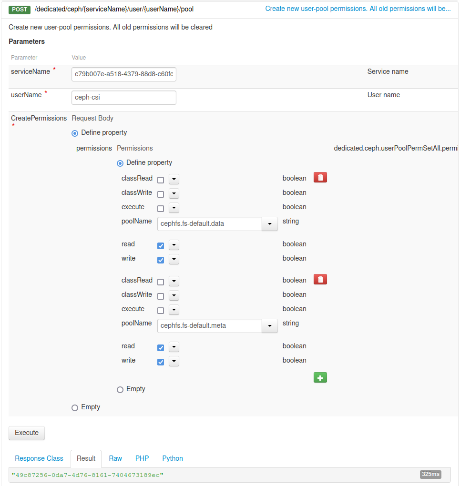
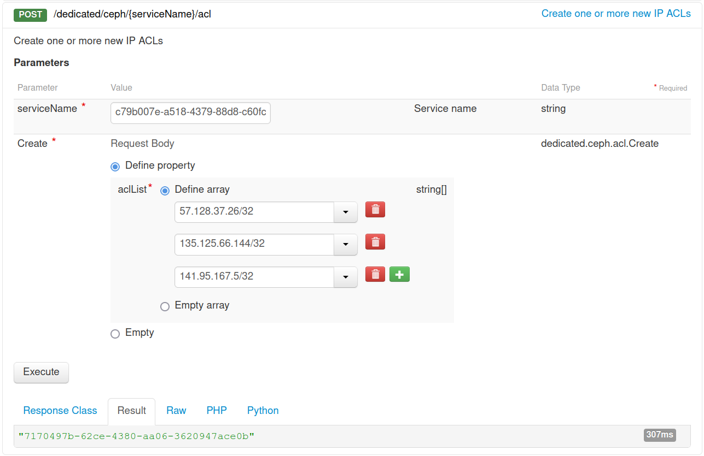
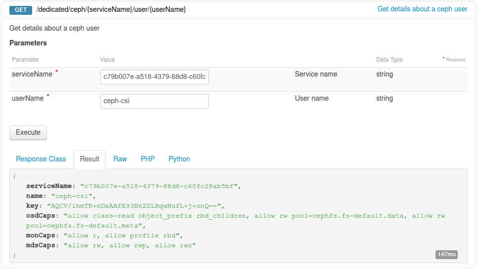
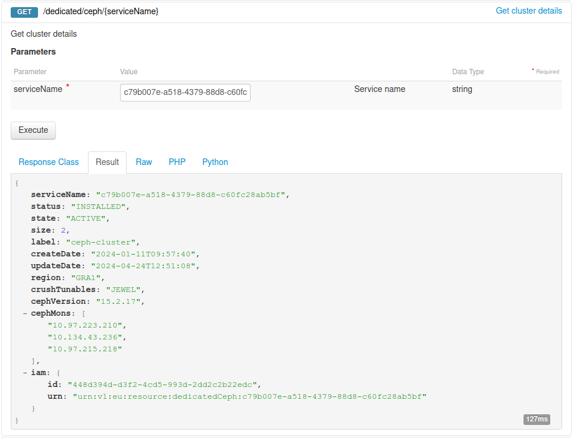

## Objective

OVHcloud Managed Kubernetes natively integrates Block Storage as persistent volumes. This technology may however not be suited to some legacy or non cloud-native applications, often requiring to share this persistent data accross different pods on multiple worker nodes (ReadWriteMany or RWX). If you would need to do this for some of your workloads, one solution is to use CephFS volumes.<br>
[OVHcloud Cloud Disk Array](https://www.ovh.com/fr/cloud-disk-array/) is a managed solution that lets you easily configure a Ceph cluster and multiple CephFS volumes. In this tutorial we are going to see how to configure your OVHcloud Managed Kubernetes cluster to use [OVHcloud Cloud Disk Array](https://www.ovh.com/fr/cloud-disk-array/) as a CephFS provider for [Kubernetes Persistent Volumes](https://kubernetes.io/docs/concepts/storage/persistent-volumes/).

## Requirements

This tutorial assumes that you already have a working [OVHcloud Managed Kubernetes](/links/public-cloud/kubernetes) cluster, and some basic knowledge of how to operate it. If you want to know more on those topics, please look at the [deploying a Hello World application](/pages/public_cloud/containers_orchestration/managed_kubernetes/deploying-hello-world) documentation.

It also assumes you have an OVHcloud Cloud Disk Array already available. If you don't, you can [order one in the OVHcloud Control Panel](/links/manager).

You also need to have [Helm](https://docs.helm.sh/) installed on your workstation, please refer to the [How to install Helm on OVHcloud Managed Kubernetes Service](/pages/public_cloud/containers_orchestration/managed_kubernetes/installing-helm) tutorial.

## Instructions

To configure OVHcloud Cloud Disk Array, you need to use the [OVHcloud API](https://ca.api.ovh.com/console/). If you have never used it, you can find the basics here: [First steps with the OVHcloud API](/pages/manage_and_operate/api/first-steps).

### Step 1 - Creating a partition and granting your Managed Kubernetes Service access to it

- List you available Cloud Disk Array cluster:

> [!api]
>
> @api {v1} /dedicated/ceph GET /dedicated/ceph
>

{.thumbnail}

- Create a file system on your Cloud Disk Array:

> [!api]
>
> @api {v1} /dedicated/ceph POST /dedicated/ceph/{serviceName}/cephfs/{fsName}/enable
>

{.thumbnail}

- Create a user for the CephFS CSI that will be used by your Kubernetes cluster:

> [!api]
>
> @api {v1} /dedicated/ceph POST /dedicated/ceph/{serviceName}/user
>

{.thumbnail}

- Add permissions on default-fs for the Ceph CSI user:

> [!api]
>
> @api {v1} /dedicated/ceph POST /dedicated/ceph/{serviceName}/user/{userName}/pool
>

{.thumbnail}

- Get your Kubernetes nodes IP:

```bash
kubectl get nodes -o jsonpath='{ $.items[*].status.addresses[?(@.type=="InternalIP")].address }'
```

```console
kubectl get nodes -o jsonpath='{ $.items[*].status.addresses[?(@.type=="InternalIP")].address }'
57.128.37.26 135.125.66.144 141.95.167.5
```

- Add the list of nodes IP to allow access to the Cloud Disk Array cluster:

> [!api]
>
> @api {v1} /dedicated/ceph POST /dedicated/ceph/{serviceName}/acl
>

{.thumbnail}

- Get the key for the CephFS CSI user:

> [!api]
>
> @api {v1} /dedicated/ceph GET /dedicated/ceph/{serviceName}/user/{userName}
>

{.thumbnail}

- Get the Ceph monitors IP:

> [!api]
>
> @api {v1} /dedicated/ceph GET /dedicated/ceph/{serviceName}
>

{.thumbnail}

- Create a Ubuntu pod on your Kubernetes cluster

```bash
kubectl run -it ubuntu --image=ubuntu
```

- Install the Ceph client and vim inside the Ubuntu pod:

```bash
apt-get update
apt-get install ceph-common vim
```

- Configure the Ceph client with the monitors IP and the key:

```bash
vim ceph.conf

[global]
mon_host = <your_ceph_monitor_ip_1>,<your_ceph_monitor_ip_2>,<your_ceph_monitor_ip_3>
keyring = /root/ceph.client.ceph-csi.keyring
```

```bash
vim ceph.client.ceph-csi.keyring

[client.ceph-csi]
key = <your_ceph_csi_user_key>
```

- Test the Ceph client configuration:

```bash
ceph --conf ceph.conf --id ceph-csi fs ls
```

```console
ceph --conf ceph.conf --id ceph-csi fs ls
name: fs-default, metadata pool: cephfs.fs-default.meta, data pools: [cephfs.fs-default.data ]
```

- Add a subvolumegroup to fs-default:

```bash
ceph --conf ceph.conf --id ceph-csi fs subvolumegroup create fs-default csi
```

- Exit the Ubuntu pod:

```bash
exit
```

- Destroy the Ubuntu pod:

```bash
kubectl delete pod ubuntu
```

### Step 2 - Configuring Kubernetes to use our newly created CephFS partition

- Install the Ceph CSI helmchart repository:

```bash
helm repo add ceph-csi https://ceph.github.io/csi-charts
```

- Create a configuration file for the Ceph CSI helmchart:

```bash
vim values.yaml

csiConfig:
  - clusterID: "abcd123456789" # You can change this, but it needs to have at least one letter character
    monitors:
      - "<your_ceph_monitor_ip_1>:6789"
      - "<your_ceph_monitor_ip_2>::6789"
      - "<your_ceph_monitor_ip_3>::6789"
storageClass:
  create: true
  name: "cephfs"
  clusterID: "abcd123456789" # This should be the ID you chose above
  fsName: "fs-default"
secret:
  create: true
  adminID: "ceph-csi"
  adminKey: "<your_ceph_csi_user_key>"

```

- Install the Ceph CSI on the Managed Kubernetes cluster:

```bash
helm install --namespace "ceph-csi-cephfs" "ceph-csi-cephfs" ceph-csi/ceph-csi-cephfs --create-namespace -f ./values.yaml
```

### Step 3 - Create and use a CephFS persistent volume

Let’s create a `cephfs-persistent-volume-claim.yaml` file:

```yaml
kind: PersistentVolumeClaim
apiVersion: v1
metadata:
  name: cephfs-pvc
  namespace: default
spec:
  accessModes:
  - ReadWriteMany
  storageClassName: cephfs
  resources:
    requests:
      storage: 1Gi
```

And apply this to create the persistent volume claim:

```bash
kubectl apply -f cephfs-persistent-volume-claim.yaml
```

Let’s now create two Nginx pods using the persistent volume claim as their webroot folder on two different kubernetes nodes. In this example the kubernetes nodes are called `kubernetes-node-1` and `kubernetes-node-2`, please modify this accordingly. Let’s create a `cephfs-nginx-pods.yaml` file:

```yaml
apiVersion: v1
kind: Pod
metadata:
  name: cephfs-nginx-1
  namespace: default
spec:
  nodeName: kubernetes-node-1
  volumes:
    - name: cephfs-volume
      persistentVolumeClaim:
        claimName: cephfs-pvc
  containers:
    - name: nginx
      image: nginx
      ports:
        - containerPort: 80
          name: "http-server"
      volumeMounts:
        - mountPath: "/usr/share/nginx/html"
          name: cephfs-volume

---

apiVersion: v1
kind: Pod
metadata:
  name: cephfs-nginx-2
  namespace: default
spec:
  nodeName: kubernetes-node-2
  volumes:
    - name: cephfs-volume
      persistentVolumeClaim:
        claimName: cephfs-pvc
  containers:
    - name: nginx
      image: nginx
      ports:
        - containerPort: 80
          name: "http-server"
      volumeMounts:
        - mountPath: "/usr/share/nginx/html"
          name: cephfs-volume
```

And apply this to create the Nginx pods:

```bash
kubectl apply -f cephfs-nginx-pods.yaml
```

Let’s enter inside the first Nginx container to create a file on the NFS persistent volume:

```bash
kubectl exec -it cephfs-nginx-1 -n default -- bash
```

Create a new `index.html` file:

```bash
echo "CEPHFS volume!" > /usr/share/nginx/html/index.html
```

And exit the Nginx container:

```bash
exit
```

Let’s try to access our new web page:

```bash
kubectl proxy
```

And open the URL <http://localhost:8001/api/v1/namespaces/default/pods/http:cephfs-nginx-1:/proxy/>

Now let’s try to see if the data is shared with the second pod. Open the URL <http://localhost:8001/api/v1/namespaces/default/pods/http:cephfs-nginx-2:/proxy/>

As you can see the data is correctly shared between the two Nginx pods running on two different Kubernetes nodes.
Congratulations, you have successfully set up a multi-attach persistent volume with OVHcloud Cloud Disk Array!

## Go further

To learn more about using your Kubernetes cluster the practical way, we invite you to look at our [OVHcloud Managed Kubernetes documentation](/products/public-cloud-containers-orchestration-managed-kubernetes-k8s).

- If you need training or technical assistance to implement our solutions, contact your sales representative or click on [this link](/links/professional-services) to get a quote and ask our Professional Services experts for assisting you on your specific use case of your project.

- Join our [community of users](/links/community).
