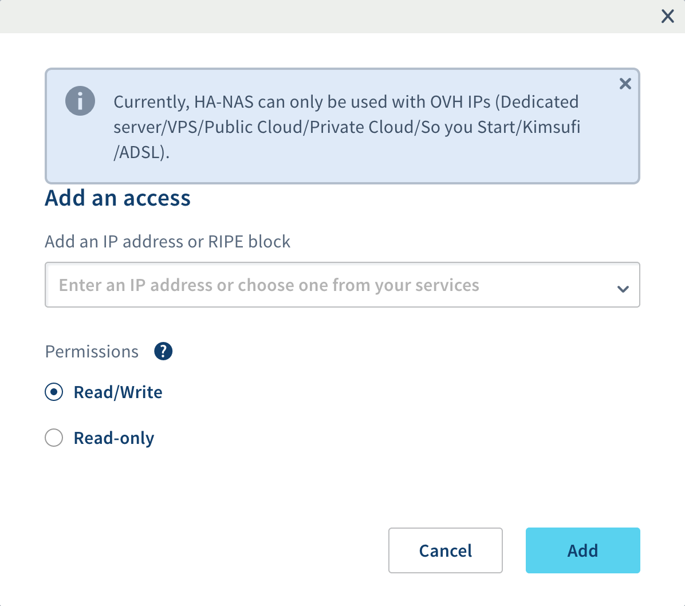

<style>
 pre {
     font-size: 14px;
 }
 pre.console {
   background-color: #300A24;
   color: #ccc;
   font-family: monospace;
   padding: 5px;
   margin-bottom: 5px;
 }
 pre.console code {
   border: solid 0px transparent;
   font-family: monospace !important;
   font-size: 0.75em;
   color: #ccc;
 }
 .small {
     font-size: 0.75em;
 }
</style>


## Objective

OVHcloud Managed Kubernetes natively integrates Block Storage as persistent volumes. This technology may however not be suited to some legacy or non cloud-native applications, often requiring to share this persistent data accross different pods on multiple worker nodes (ReadWriteMany or RWX). If you would need to do this for some of your workloads, one solution is to use NFS volumes. [OVHcloud NAS-HA](https://www.ovh.co.uk/nas/) is a managed solution that lets you easily configure an NFS server and multiple NFS volumes. In this tutorial we are going to see how to configure your OVHcloud Managed Kubernetes cluster to use [OVHcloud NAS-HA](https://www.ovh.co.uk/nas/) as an NFS provider for [Kubernetes Persistent Volumes](https://kubernetes.io/docs/concepts/storage/persistent-volumes/).

## Requirements

This tutorial assumes that you already have a working [OVHcloud Managed Kubernetes](https://www.ovhcloud.com/fr/public-cloud/kubernetes/) cluster, and some basic knowledge of how to operate it. If you want to know more on those topics, please look at the [deploying a Hello World application](/pages/public_cloud/containers_orchestration/managed_kubernetes/deploying-hello-world/) documentation.

It also assumes you have an OVHcloud NAS-HA already available. If you don't, you can [order one in the OVHcloud Control Panel](https://www.ovh.com/manager/dedicated/#/configuration/nas).

You also need to have [Helm](https://docs.helm.sh/) installed on your workstation, please refer to the [How to install Helm on OVHcloud Managed Kubernetes Service](/pages/public_cloud/containers_orchestration/managed_kubernetes/installing-helm/) tutorial.

## Instructions

### Step 1 - Creating a partition and granting your Managed Kubernetes Service access to it

Your NAS-HA can expose multiple partitions, and supports a variety of protocols. Each partition is accessible only from a specific range of IPs. We will create one exposing NFS and make it accessible from your Kubernetes worker nodes.

Access the UI for OVHcloud NAS-HA by clicking the *NAS and CDN* menu in the [Server section of the OVHcloud Control Panel](https://www.ovh.com/manager/dedicated)

Create a new NFS partition in your Zpool:

{.thumbnail}

#### Your cluster is installed with Public Network or with a private network without a gateway
Once the partition is created, we need to allow our Kubernetes nodes to access our newly created partition.

Get our Kubernetes nodes IP:
```bash
kubectl get nodes -o jsonpath='{ $.items[*].status.addresses[?(@.type=="InternalIP")].address }'
```

```console
$ kubectl get nodes -o jsonpath='{ $.items[*].status.addresses[?(@.type=="InternalIP")].address }'
51.77.204.175 51.77.205.79
```

#### Your cluster is installed with Private Network with a gateway

Because your nodes are configured to be routed by the private network gateway, you need to allow the gateway IP address to the ACLs.
By using Public Cloud Gateway through our Managed Kubernetes Service, Public IPs on nodes are only for management purposes : [MKS Known Limits](/pages/public_cloud/containers_orchestration/managed_kubernetes/known-limits)

Get your Gateway's Public IP :

Public Cloud > Select your tenant > Network / Gateway > Public IP

Click on the *Manage Access* menu of our newly created partition:
{.thumbnail}

Add either the nodes' IPs one by one or the Gateway's Public IP depending on your configuration:
{.thumbnail}

You should now have something similar to this:
{.thumbnail}

In this example our `ZPOOL_IP` is `10.201.18.33`, our `ZPOOL_NAME` is `zpool-127659`, and our `PARTITION_NAME` is `kubernetes`. Please modify this accordingly in the later steps.

### Step 2 - Configuring Kubernetes to use our newly created NFS partition

Your Kubernetes cluster needs some additionnal piece of software to make use of the NFS partition. We will install those and then create a first volume, shared accross multiple pods.

To do so, you can install the [csi-driver-nfs](https://github.com/kubernetes-csi/csi-driver-nfs):

```bash
helm repo add csi-driver-nfs https://raw.githubusercontent.com/kubernetes-csi/csi-driver-nfs/master/charts
helm install csi-driver-nfs csi-driver-nfs/csi-driver-nfs --namespace kube-system --version v4.7.0 --set driver.name="nfs2.csi.k8s.io" --set controller.name="csi-nfs2-controller" --set rbac.name=nfs2
```

```console
$ helm install csi-driver-nfs -n kube-system csi-driver-nfs/csi-driver-nfs --version v4.7.0 --set driver.name="nfs2.csi.k8s.io" --set rbac.name=nfs --set controller.name="csi-nfs2-controller"
NAME: csi-driver-nfs
LAST DEPLOYED: Thu Jul 11 15:13:34 2024
NAMESPACE: kube-system
STATUS: deployed
REVISION: 1
TEST SUITE: None
NOTES:
The CSI NFS Driver is getting deployed to your cluster.

To check CSI NFS Driver pods status, please run:

  kubectl --namespace=kube-system get pods --selector="app.kubernetes.io/instance=csi-driver-nfs" --watch
```

Let's verify our installation:

```bash
kubectl --namespace=kube-system get pods --selector="app.kubernetes.io/instance=csi-driver-nfs"
```

```console
$ kubectl --namespace=kube-system get pods --selector="app.kubernetes.io/instance=csi-driver-nfs"
NAME                                   READY   STATUS    RESTARTS   AGE
csi-nfs-node-2qczs                     3/3     Running   0          16s
csi-nfs-node-tw77p                     3/3     Running   0          16s
csi-nfs2-controller-58b8b4cf7f-nk727   4/4     Running   0          16s
```

### Step 3 - Create the NFS StorageClass Object

Let's create a `nfs-storageclass.yaml` file:

```yaml
apiVersion: storage.k8s.io/v1
kind: StorageClass
metadata:
  name: nfs-csi
provisioner: nfs2.csi.k8s.io
parameters:
  server: '[ZPOOL_IP]'
  share: '/[ZPOOL_NAME]/[PARTITION_NAME]'
reclaimPolicy: Delete
volumeBindingMode: Immediate
mountOptions:
  - nfsvers=4.1
  - tcp
  - rsize=1048576
  - wsize=1048576
```

> [!primary]
>
> The `rsize` parameter and `wsize` parameters defines the maximum number of bytes of data that the NFS client can receive for each READ or WRITE request.
>
> The `tcp` parameter instructs the NFS mount to use the TCP protocol.
>

Then apply the YAML file to create the StorageClass 

```bash
kubectl apply -f nfs-storageclass.yaml
```

### Step 4 - Create and use an NFS persistent volume

Let’s create a `nfs-persistent-volume-claim.yaml` file:

```yaml
kind: PersistentVolumeClaim
apiVersion: v1
metadata:
  name: nfs-pvc
  namespace: default
spec:
  accessModes:
  - ReadWriteOnce
  storageClassName: nfs
  resources:
    requests:
      storage: 1Gi
```

And apply this to create the persistent volume claim:

```bash
kubectl apply -f nfs-persistent-volume-claim.yaml
```

You can find more information about the PVC by running this command:

```bash
kubectl describe pvc nfs-pvc
```

```console $ kubectl describe pvc nfs-pvc
Name:          nfs-pvc
Namespace:     default
StorageClass:  nfs-csi
Status:        Pending
Volume:
[...]
Events:
  Type    Reason                 Age                   From                                                                                             Message
  ----    ------                 ----                  ----                                                                                             -------
  Normal  Provisioning           2m25s                 nfs2.csi.k8s.io_nodepool-c7ef08a9-2a22-40fd-9c-node-993f96_7078d019-f44a-42a1-8e7f-c6ee36f3f466  External provisioner is provisioning volume for claim "default/nfs-pvc"
  Normal  ExternalProvisioning   15s (x10 over 2m25s)  persistentvolume-controller                                                                      Waiting for a volume to be created either by the external provisioner 'nfs2.csi.k8s.io' or manually by the system administrator. If volume creation is delayed, please verify that the provisioner is running and correctly registered.
```

The external provisioner (here the HA-NAS) is provisioning your volume. Wait a bit and the volume should appear:

```console $ kubectl describe pvc nfs-pvc
Name:          nfs-pvc
Namespace:     default
StorageClass:  nfs-csi
Status:        Bound
Volume:        pvc-a213e1a9-2fee-4632-ae9e-c952fab74e38
[...]
Events:
  Type    Reason                 Age                   From                                                                                             Message
  ----    ------                 ----                  ----                                                                                             -------
  Normal  Provisioning           2m25s                 nfs2.csi.k8s.io_nodepool-c7ef08a9-2a22-40fd-9c-node-993f96_7078d019-f44a-42a1-8e7f-c6ee36f3f466  External provisioner is provisioning volume for claim "default/nfs-pvc"
  Normal  ExternalProvisioning   15s (x10 over 2m25s)  persistentvolume-controller                                                                      Waiting for a volume to be created either by the external provisioner 'nfs2.csi.k8s.io' or manually by the system administrator. If volume creation is delayed, please verify that the provisioner is running and correctly registered.
  Normal  ProvisioningSucceeded  14s                   nfs2.csi.k8s.io_nodepool-c7ef08a9-2a22-40fd-9c-node-993f96_7078d019-f44a-42a1-8e7f-c6ee36f3f466  Successfully provisioned volume pvc-a213e1a9-2fee-4632-ae9e-c952fab74e38
```


If you have errors like: 
```console
Warning  ProvisioningFailed    3s (x3 over 7s)  nfs2.csi.k8s.io_nodepool-c7ef08a9-2a22-40fd-9c-node-993f96_7078d019-f44a-42a1-8e7f-c6ee36f3f466  failed to provision volume with StorageClass "nfs-csi": rpc error: code = Internal desc = failed to make subdirectory: mkdir /tmp/pvc-31210848-7f3f-40e6-aa7a-fafa616da4e7/pvc-31210848-7f3f-40e6-aa7a-fafa616da4e7: input/output error
```
or like this:
```console
Warning  ProvisioningFailed    1s (x3 over 4s)  nfs2.csi.k8s.io_nodepool-8bdec3f1-f54a-4de8-ad-node-091e7d_15634ab1-b7e2-45b5-9565-3a775490c4e3  failed to provision volume with StorageClass "nfs-csi": rpc error: code = Internal desc = failed to mount nfs server: rpc error: code = Internal desc = mount failed: exit status 32
Mounting command: mount
Mounting arguments: -t nfs -o nfsvers=4.1 [ZPOOL_IP]:/[ZPOOL_NAME]/[PARTITION_NAME] /tmp/pvc-f7693542-a817-472d-bb55-de7af91306b5
Output: mount.nfs: access denied by server while mounting [ZPOOL_IP]:/[ZPOOL_NAME]/[PARTITION_NAME]
```

It mostly means that something went wrong with the HA-NAS ACLs. Check the authorized IPs which can access the wanted partition on the ACLs list.

> [!warning]
> If the number of __PersistentVolumes__ to schedule simultaneously is too important, some slowness can be encountered and volume creation delayed

Let’s now create a DaemonSet of Nginx pods using the persistent volume claim as their webroot folder.
Using a DaemonSet will create a pod on each deployed node and makes troubleshoot easier in case of a misconfiguration or to isolate a node issue. 
Let's create a file named `nginx-daemonset.yaml`

```yaml
apiVersion: apps/v1
kind: DaemonSet
metadata:
    name: nfs-nginx-1
    namespace: default
spec:
    selector:
      matchLabels:
        name: nginx
    template:
        metadata:
          labels:
            name: nginx
        spec:
          volumes:
          - name: nfs-volume
            persistentVolumeClaim:
              claimName: nfs-pvc
          containers:
          - name: nginx
            image: nginx
            ports:
            - containerPort: 80
              name: "http-server"
            volumeMounts:
            - mountPath: "/usr/share/nginx/html"
              name: nfs-volume
```

And apply this to create the Nginx DaemonSet:

```bash
kubectl apply -f nginx-daemonset.yaml
```

Both pods should be running: 

```bash 
kubectl get pods
NAME          READY   STATUS    RESTARTS   AGE
nfs-nginx-1   1/1     Running   0          14m
nfs-nginx-2   1/1     Running   0          14m
```

Let’s enter inside the first Nginx container to check if the zpool is properly mounted and create a file on the NFS persistent volume:

```bash
kubectl exec -it nfs-nginx-1 -n default -- bash
```

Check if the zpool is mounted on the Nginx pod:

```bash
root@nfs-nginx-1:/# mount -l | grep zpool
[ZPOOL_IP]:/[ZPOOL_NAME]/[PARTITION_NAME]/[PV_NAME] on /usr/share/nginx/html type nfs4 (rw,relatime,vers=4.1,rsize=131072,wsize=131072,namlen=255,hard,proto=tcp,timeo=600,retrans=2,sec=sys,clientaddr=[NODE_IP],local_lock=none,addr=[ZPOOL_IP])
```

You can test HA-NAS IOPS and speed by installing and running FIO tool:
```bash
apt update
apt install fio
```

and then running those commands (don't forget to move into the folder mounted from the HA-NAS):

```bash
cd /usr/share/nginx/html/
fio --randrepeat=1 --ioengine=libaio --direct=1 --gtod_reduce=1 --name=testfiofrommks --filename=random_read_write.fio --bs=128k --iodepth=64 --size=10G --readwrite=randrw --rwmixread=75
```

At the end of the test, you should have an output like this:
```console
End of the FIO test:

testfiofrommks: Laying out IO file (1 file / 10240MiB)
Jobs: 1 (f=1): [m(1)][100.0%][r=117MiB/s,w=36.1MiB/s][r=933,w=289 IOPS][eta 00m:00s]
testfiofrommks: (groupid=0, jobs=1): err= 0: pid=748: Tue May 21 15:22:14 2024
  read: IOPS=931, BW=116MiB/s (122MB/s)(7683MiB/65965msec)
   bw (  KiB/s): min=119040, max=119824, per=100.00%, avg=119333.25, stdev=106.46, samples=131
   iops        : min=  930, max=  936, avg=932.29, stdev= 0.83, samples=131
  write: IOPS=310, BW=38.8MiB/s (40.7MB/s)(2557MiB/65965msec); 0 zone resets
  [...]
```

Now, we will test if the HA-NAS is properly shared between the deployed pods.
Create a new `index.html` file:

```bash
echo "NFS volume!" > /usr/share/nginx/html/index.html
```

And exit the Nginx container:

```bash
exit
```

Let’s try to access our new web page:

```bash
kubectl proxy
```

And open the URL [http://localhost:8001/api/v1/namespaces/default/pods/http:nfs-nginx-1:/proxy/](http://localhost:8001/api/v1/namespaces/default/pods/http:nfs-nginx-1:/proxy/)

Now let’s try to see if the data is shared with the second pod (if you have more than one node deployed). Open the URL [http://localhost:8001/api/v1/namespaces/default/pods/http:nfs-nginx-2:/proxy/](http://localhost:8001/api/v1/namespaces/default/pods/http:nfs-nginx-2:/proxy/)

As you can see the data is correctly shared between the two Nginx pods running on two different Kubernetes nodes.
Congratulations, you have successfully set up a multi-attach persistent volume with OVHcloud NAS-HA!

## Go further

To learn more about using your Kubernetes cluster the practical way, we invite you to look at our [OVHcloud Managed Kubernetes doc site](/products/public-cloud-containers-orchestration-managed-kubernetes-k8s).

- If you need training or technical assistance to implement our solutions, contact your sales representative or click on [this link](https://www.ovhcloud.com/fr/professional-services/) to get a quote and ask our Professional Services experts for assisting you on your specific use case of your project.

Join our [community of users](https://community.ovh.com/en/).
