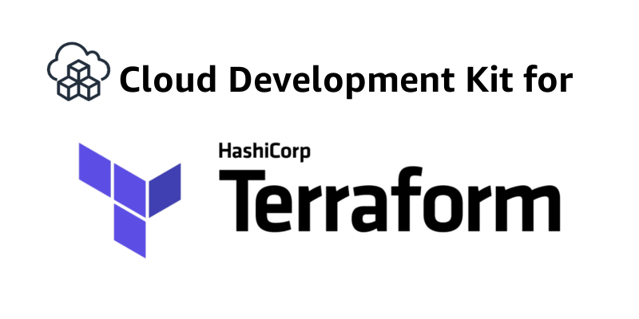
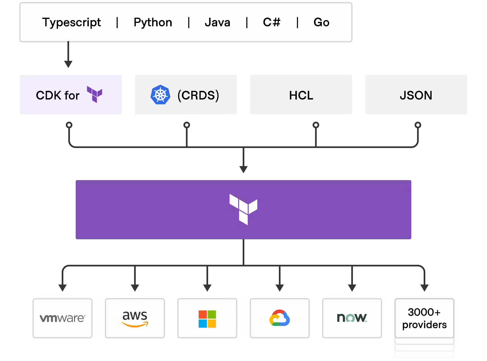
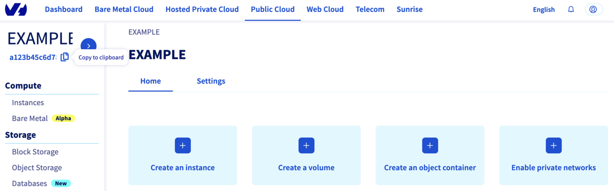
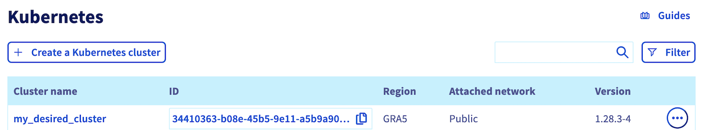
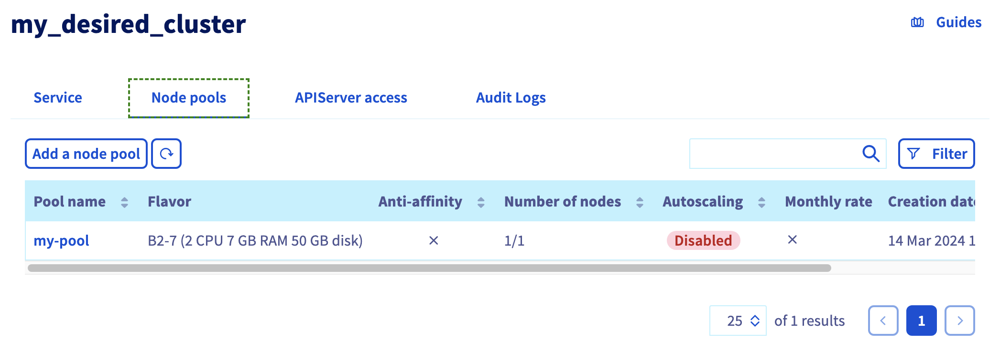

## Objective

Creating an OVHcloud Managed Kubernetes cluster via Terraform, the de-facto standard in the world of Infrastructure as Code, is very powerful. But sometimes teams want to do the same thing, not in Hashicorp Configuration Language (HCL) but in their preferred programming languages. Did you know that you can do this with a programming language via Terraform?

## CDK for Terraform

{.thumbnail}

[Cloud Development Kit for Terraform](https://developer.hashicorp.com/terraform/cdktf), also called CDKTF, converts the definitions you write in your preferred programming language to Terraform configuration files. It uses Terraform to provision and manage your infrastructure when you deploy your application.

It supports several programming languages: Go, Python, Java, TypeScript and C#. There is no need to define your infrastructures in HCL (Hashicorp Configuration Language) and it supports all existing Terraform providers and modules.

{.thumbnail}

Read the [official documentation of CDK for Terraform](https://developer.hashicorp.com/terraform/cdktf) if you need further information. 

## Requirements

- A [Public Cloud project](/pages/public_cloud/compute/create_a_public_cloud_project) in your OVHcloud account
- [Kubernetes CLI](https://kubernetes.io/docs/tasks/tools/){.external} installed
- [Cloud Development Kit for Terraform CLI](https://developer.hashicorp.com/terraform/tutorials/cdktf/cdktf-install){.external} installed
- [Go](https://go.dev/doc/install) installed

### OVHcloud Terraform provider

In order to create a Kubernetes cluster and other resources, OVHcloud provides a [Terraform provider](https://registry.terraform.io/providers/ovh/ovh/latest){.external} which is available in the official Terraform registry.

All available resources and data sources have their own definition and documentation.

CDKTF will "translate" your code into an HCL configuration file and then call `terraform` and use the existing OVHcloud Terraform provider.

In this guide, we will create two resources:

* a [cloud_project_kube](https://registry.terraform.io/providers/ovh/ovh/latest/docs/resources/cloud_project_kube){.external}, that represents an OVHcloud managed Kubernetes cluster.
* a [cloud_project_kube_nodepool](https://registry.terraform.io/providers/ovh/ovh/latest/docs/resources/cloud_project_kube_nodepool){.external}, that represents a Kubernetes Node Pool.

{.thumbnail}

### Getting your cluster/API tokens information

The "OVH provider" needs to be configured with a set of credentials:

* an `endpoint`
* an `application_key`
* an `application_secret`
* a `consumer_key`
* a `service_name`

This is because, behind the scenes, the "OVH Terraform provider" is doing requests to OVHcloud APIs.

To retrieve the necessary information, please follow the tutorial [First steps with the OVHcloud APIs](/pages/manage_and_operate/api/first-steps).

Concretely, you have to generate these credentials via the [OVH token generation page](https://api.ovh.com/createToken/?GET=/*&POST=/*&PUT=/*&DELETE=/*) with the following rights:

{.thumbnail}

Once you have successfully generated your OVH tokens, keep them. You will need to define them later.

The last piece of information you need is the `service_name`: this is the ID of your Public Cloud project.

How do you get it?

In the Public Cloud section, you can retrieve your Public Cloud project ID thanks to the `Copy to clipboard`{.action} button.

{.thumbnail}

Summary of the needed environment variables:

| Provider Argument | Environment Variables    | Description                                                                                                           | Mandatory |
| ----------------- | ------------------------ | --------------------------------------------------------------------------------------------------------------------- | --------- |
| `endpoint`      | `OVH_ENDPOINT`         | OVHcloud Endpoint. Possible value are: `ovh-eu`, `ovh-ca`, `ovh-us`, `soyoustart-eu`, `soyoustart-ca`, `kimsufi-ca`, `kimsufi-eu`, `runabove-ca`                                       | ✅        |
| `application_key`      | `OVH_APPLICATION_KEY`         | OVHcloud Access Key                                       | ✅        |
| `application_secret`      | `OVH_APPLICATION_SECRET`         | OVHcloud Secret Key                               | ✅        |
| `consumer_key`      | `OVH_CONSUMER_KEY` | OVHcloud Consumer Key | ✅        |
| `service_name`      | `OVH_CLOUD_PROJECT_SERVICE` | OVHcloud Public Cloud project ID| ✅        |

These keys can be generated via the [OVHcloud token generation page](https://api.ovh.com/createToken/?GET=/*&POST=/*&PUT=/*&DELETE=/*).

Example:

```bash
# OVHcloud provider needed keys
export OVH_ENDPOINT="ovh-eu"
export OVH_APPLICATION_KEY="xxx"
export OVH_APPLICATION_SECRET="xxx"
export OVH_CONSUMER_KEY="xxx"
export OVH_CLOUD_PROJECT_SERVICE="xxx"
```

### Deploying an OVHcloud Managed Kubernetes cluster and a node pool in Go / Golang

In this guide, we want to create, in Go:

* an OVHcloud managed Kubernetes cluster
* a node pool

#### Project initialization

Create a folder and access it:

```bash
$ mkdir ovhcloud-kube
$ cd ovhcloud-kube
```

Initialize your project with cdktf CLI:

```bash
$ cdktf init --template=go --providers="ovh/ovh@~>0.37.0" "hashicorp/local" --providers-force-local --local --project-name=ovhcloud-kube --project-description="Go app that deploy an OVHcloud Managed Kubernetes cluster and a node pool" --enable-crash-reporting

Note: By providing the '--local' option, you have chosen local storage mode to store your stack state.
This means that your Terraform state file will be stored locally on disk in a file 'terraform.<STACK NAME>.tfstate' at the root of your project.
go: upgraded github.com/aws/jsii-runtime-go v1.67.0 => v1.94.0
========================================================================================================

  Your cdktf go project is ready!

  cat help                Prints this message

  Compile:
    go build              Builds your go project

  Synthesize:
    cdktf synth [stack]   Synthesize Terraform resources to cdktf.out/

  Diff:
    cdktf diff [stack]    Perform a diff (terraform plan) for the given stack

  Deploy:
    cdktf deploy [stack]  Deploy the given stack

  Destroy:
    cdktf destroy [stack] Destroy the given stack

  Learn more about using modules and providers https://cdk.tf/modules-and-providers

Use Providers:

  Use the add command to add providers:
  
  cdktf provider add "aws@~>3.0" null kreuzwerker/docker

  Learn more: https://cdk.tf/modules-and-providers

========================================================================================================
[2024-03-14T10:46:23.030] [INFO] default - Adding local provider registry.terraform.io/ovh/ovh with version constraint ~>0.37.0 to cdktf.json
[2024-03-14T10:46:23.032] [INFO] default - Adding local provider registry.terraform.io/hashicorp/local with version constraint undefined to cdktf.json
Local providers have been updated. Running cdktf get to update...
Generated go constructs in the output directory: generated

The generated code depends on jsii-runtime-go. If you haven't yet installed it, you can run go mod tidy to automatically install it.
Run 'go mod tidy' after adding imports for any needed modules such as prebuilt providers
```

The command initializes the application in the programming language you have specified (Go in our case) with the list of existing Terraform providers you have defined (OVHcloud and Hashicorp local) and stores the Terraform State locally (thanks to the `--local` flag).

The code organization of your project is created:

```bash
-rw-r--r-- 1 gitpod gitpod  265 Mar 14 10:15 cdktf.json
-rwxr-xr-x 3 gitpod gitpod   62 Mar 14 10:16 generated/
-rw-r--r-- 1 gitpod gitpod  354 Mar 14 10:15 .gitignore
-rw-r--r-- 1 gitpod gitpod  265 Mar 14 10:15 go.mod
-rw-r--r-- 1 gitpod gitpod 1238 Mar 14 10:15 go.sum
-rw-r--r-- 1 gitpod gitpod  902 Mar 14 10:15 help
-rw-r--r-- 1 gitpod gitpod  401 Mar 14 10:15 main.go
-rw-r--r-- 1 gitpod gitpod  974 Mar 14 10:15 main_test.go
```

Let's explain the different generated files:

- `cdktf.json` contains configuration settings for your application
- `generated` folder contains the OVHcloud Terraform provider translated in Go
- `.gitignore` contains the gitignore file
- `go.mod` and `go.sum` files contain the dependencies of your Go application
- `help` contains useful cdktf commands to execute
- `main.go` is the Go program
- `main_test.go` is for declaring unit test for your Go program

#### Resources definition

Edit the `main.go` file and replace the existing content with the following content:

```go
package main

import (
	"os"
	"path"

	"cdk.tf/go/stack/generated/hashicorp/local/file"
	local "cdk.tf/go/stack/generated/hashicorp/local/provider"
	"cdk.tf/go/stack/generated/ovh/ovh/cloudprojectkube"
	"cdk.tf/go/stack/generated/ovh/ovh/cloudprojectkubenodepool"

	ovh "cdk.tf/go/stack/generated/ovh/ovh/provider"
	"github.com/aws/constructs-go/constructs/v10"
	"github.com/aws/jsii-runtime-go"
	"github.com/hashicorp/terraform-cdk-go/cdktf"
)

func NewMyStack(scope constructs.Construct, id string) cdktf.TerraformStack {
	stack := cdktf.NewTerraformStack(scope, &id)

	// Initialize the OVH provider
	ovh.NewOvhProvider(stack, jsii.String("ovh"), &ovh.OvhProviderConfig{
		Endpoint: jsii.String("ovh-eu"), //required
	})

	// Initialize the Local provider
	local.NewLocalProvider(stack, jsii.String("local"), &local.LocalProviderConfig{})

	// Get serviceName from the env var OVH_CLOUD_PROJECT_SERVICE
	serviceName := os.Getenv("OVH_CLOUD_PROJECT_SERVICE")

	// Deploy a new Kubernetes cluster
	kube := cloudprojectkube.NewCloudProjectKube(stack, jsii.String("my_desired_cluster"), &cloudprojectkube.CloudProjectKubeConfig{
		ServiceName: jsii.String(serviceName),
		Name:        jsii.String("my_desired_cluster"),
		Region:      jsii.String("GRA5"),
	})

	cdktf.NewTerraformOutput(stack, jsii.String("cluster_version"), &cdktf.TerraformOutputConfig{
		Value: kube.Version(),
	})

	//Save the kubeconfig file in your current directory
	pwd, _ := os.Getwd()
	file.NewFile(stack, jsii.String("kubeconfig"), &file.FileConfig{
		Filename: jsii.String(path.Join(pwd, "kubeconfig.yaml")),
		Content:  kube.Kubeconfig(),
		FilePermission: jsii.String("0644"),
	})

	// Deploy a Node Pool
	nodePool := cloudprojectkubenodepool.NewCloudProjectKubeNodepool(stack, jsii.String("my-pool"), &cloudprojectkubenodepool.CloudProjectKubeNodepoolConfig{
		ServiceName:  kube.ServiceName(),
		KubeId:       kube.Id(),
		Name:         jsii.String("my-pool"),
		DesiredNodes: jsii.Number(1),
		MaxNodes:     jsii.Number(3),
		MinNodes:     jsii.Number(1),
		FlavorName:   jsii.String("b2-7"),
	})

	cdktf.NewTerraformOutput(stack, jsii.String("nodePoolID"), &cdktf.TerraformOutputConfig{
		Value: nodePool.Id(),
	})

	return stack
}

func main() {
	app := cdktf.NewApp(nil)

	NewMyStack(app, "ovhcloud")

	app.Synth()
}
```

In this resource configuration, we ask Terraform to create a Kubernetes cluster, in the GRA5 region, using the latest recommended version of Kubernetes.

We tell Terraform to create a node pool with 3 nodes with machine type B2-7.

And we tell Terraform to save the Kubernetes cluster configuration in a local file named `kubeconfig.yaml`. This information is needed to connect to the new Kubernetes cluster.

For your information, outputs are useful for retrieving and displaying specific information after resources have been created.

### Creating a cluster through CDKTF

We can now use Terraform, via the CDK, to deploy our Kubernetes cluster and its node pool.

The following command will generate the Terraform plan. If you aprove it, the changes will be applied.

```bash
$ cdktf deploy

ovhcloud  Initializing the backend...
ovhcloud  Initializing provider plugins...
          - Reusing previous version of ovh/ovh from the dependency lock file
ovhcloud  - Reusing previous version of hashicorp/local from the dependency lock file
ovhcloud  - Using previously-installed ovh/ovh v0.37.0
ovhcloud  - Using previously-installed hashicorp/local v2.5.1

          Terraform has been successfully initialized!
          
          You may now begin working with Terraform. Try running "terraform plan" to see
          any changes that are required for your infrastructure. All Terraform commands
ovhcloud  should now work.

          If you ever set or change modules or backend configuration for Terraform,
          rerun this command to reinitialize your working directory. If you forget, other
          commands will detect it and remind you to do so if necessary.
ovhcloud  Terraform used the selected providers to generate the following execution plan.
          Resource actions are indicated with the following symbols:
            + create

          Terraform will perform the following actions:

            # local_file.kubeconfig (kubeconfig) will be created
            + resource "local_file" "kubeconfig" {
                + content              = (sensitive value)
                + content_base64sha256 = (known after apply)
                + content_base64sha512 = (known after apply)
                + content_md5          = (known after apply)
                + content_sha1         = (known after apply)
                + content_sha256       = (known after apply)
                + content_sha512       = (known after apply)
                + directory_permission = "0777"
                + file_permission      = "0644"
                + filename             = "/workspace/guide/ovhcloud-kube/kubeconfig.yaml"
                + id                   = (known after apply)
              }
ovhcloud    # ovh_cloud_project_kube.my_desired_cluster (my_desired_cluster) will be created
            + resource "ovh_cloud_project_kube" "my_desired_cluster" {
                + control_plane_is_up_to_date = (known after apply)
                + id                          = (known after apply)
                + is_up_to_date               = (known after apply)
                + kube_proxy_mode             = (known after apply)
                + kubeconfig                  = (sensitive value)
                + kubeconfig_attributes       = (sensitive value)
                + name                        = "my_desired_cluster"
                + next_upgrade_versions       = (known after apply)
                + nodes_url                   = (known after apply)
                + region                      = "GRA5"
                + service_name                = "xxxxxxxxxxxxxxxxxxxxxxxxxxxx"
                + status                      = (known after apply)
                + update_policy               = (known after apply)
                + url                         = (known after apply)
                + version                     = (known after apply)
              }

            # ovh_cloud_project_kube_nodepool.my-pool (my-pool) will be created
            + resource "ovh_cloud_project_kube_nodepool" "my-pool" {
                + anti_affinity                                = (known after apply)
                + autoscale                                    = (known after apply)
                + autoscaling_scale_down_unneeded_time_seconds = (known after apply)
                + autoscaling_scale_down_unready_time_seconds  = (known after apply)
                + autoscaling_scale_down_utilization_threshold = (known after apply)
                + available_nodes                              = (known after apply)
                + created_at                                   = (known after apply)
                + current_nodes                                = (known after apply)
                + desired_nodes                                = 1
                + flavor                                       = (known after apply)
                + flavor_name                                  = "b2-7"
                + id                                           = (known after apply)
                + kube_id                                      = (known after apply)
                + max_nodes                                    = 3
                + min_nodes                                    = 1
                + monthly_billed                               = (known after apply)
                + name                                         = "my-pool"
                + project_id                                   = (known after apply)
                + service_name                                 = "xxxxxxxxxxxxxxxxxxxxxxxxxxxx"
                + size_status                                  = (known after apply)
                + status                                       = (known after apply)
                + up_to_date_nodes                             = (known after apply)
                + updated_at                                   = (known after apply)
              }

          Plan: 3 to add, 0 to change, 0 to destroy.
          
          Changes to Outputs:
            + cluster_version = (known after apply)
            + nodePoolID      = (known after apply)
          
          Do you want to perform these actions?
            Terraform will perform the actions described above.
            Only 'yes' will be accepted to approve.
ovhcloud  Enter a value: yes
ovhcloud  ovh_cloud_project_kube.my_desired_cluster: Creating...
ovhcloud  ovh_cloud_project_kube.my_desired_cluster: Still creating... [10s elapsed]
ovhcloud  ovh_cloud_project_kube.my_desired_cluster: Still creating... [20s elapsed]
ovhcloud  ovh_cloud_project_kube.my_desired_cluster: Still creating... [30s elapsed]
ovhcloud  ovh_cloud_project_kube.my_desired_cluster: Still creating... [40s elapsed]
ovhcloud  ovh_cloud_project_kube.my_desired_cluster: Still creating... [50s elapsed]
ovhcloud  ovh_cloud_project_kube.my_desired_cluster: Still creating... [1m0s elapsed]
ovhcloud  ovh_cloud_project_kube.my_desired_cluster: Still creating... [1m10s elapsed]
ovhcloud  ovh_cloud_project_kube.my_desired_cluster: Still creating... [1m20s elapsed]
ovhcloud  ovh_cloud_project_kube.my_desired_cluster: Still creating... [1m30s elapsed]
ovhcloud  ovh_cloud_project_kube.my_desired_cluster: Still creating... [1m40s elapsed]
ovhcloud  ovh_cloud_project_kube.my_desired_cluster: Still creating... [1m50s elapsed]
ovhcloud  ovh_cloud_project_kube.my_desired_cluster: Still creating... [2m0s elapsed]
ovhcloud  ovh_cloud_project_kube.my_desired_cluster: Still creating... [2m10s elapsed]
ovhcloud  ovh_cloud_project_kube.my_desired_cluster: Still creating... [2m20s elapsed]
ovhcloud  ovh_cloud_project_kube.my_desired_cluster: Still creating... [2m30s elapsed]
ovhcloud  ovh_cloud_project_kube.my_desired_cluster: Still creating... [2m40s elapsed]
ovhcloud  ovh_cloud_project_kube.my_desired_cluster: Still creating... [2m50s elapsed]
ovhcloud  ovh_cloud_project_kube.my_desired_cluster: Still creating... [3m0s elapsed]
ovhcloud  ovh_cloud_project_kube.my_desired_cluster: Still creating... [3m10s elapsed]
ovhcloud  ovh_cloud_project_kube.my_desired_cluster: Still creating... [3m20s elapsed]
ovhcloud  ovh_cloud_project_kube.my_desired_cluster: Still creating... [3m30s elapsed]
ovhcloud  ovh_cloud_project_kube.my_desired_cluster: Still creating... [3m40s elapsed]
ovhcloud  ovh_cloud_project_kube.my_desired_cluster: Still creating... [3m50s elapsed]
ovhcloud  ovh_cloud_project_kube.my_desired_cluster: Still creating... [4m0s elapsed]
ovhcloud  ovh_cloud_project_kube.my_desired_cluster: Still creating... [4m10s elapsed]
ovhcloud  ovh_cloud_project_kube.my_desired_cluster: Still creating... [4m20s elapsed]
ovhcloud  ovh_cloud_project_kube.my_desired_cluster: Still creating... [4m30s elapsed]
ovhcloud  ovh_cloud_project_kube.my_desired_cluster: Still creating... [4m40s elapsed]
ovhcloud  ovh_cloud_project_kube.my_desired_cluster: Still creating... [4m50s elapsed]
ovhcloud  ovh_cloud_project_kube.my_desired_cluster: Still creating... [5m0s elapsed]
ovhcloud  ovh_cloud_project_kube.my_desired_cluster: Still creating... [5m10s elapsed]
ovhcloud  ovh_cloud_project_kube.my_desired_cluster: Still creating... [5m20s elapsed]
ovhcloud  ovh_cloud_project_kube.my_desired_cluster: Still creating... [5m30s elapsed]
ovhcloud  ovh_cloud_project_kube.my_desired_cluster: Still creating... [5m40s elapsed]
ovhcloud  ovh_cloud_project_kube.my_desired_cluster: Still creating... [5m50s elapsed]
ovhcloud  ovh_cloud_project_kube.my_desired_cluster: Still creating... [6m0s elapsed]
ovhcloud  ovh_cloud_project_kube.my_desired_cluster: Still creating... [6m10s elapsed]
ovhcloud  ovh_cloud_project_kube.my_desired_cluster: Still creating... [6m20s elapsed]
ovhcloud  ovh_cloud_project_kube.my_desired_cluster: Still creating... [6m30s elapsed]
ovhcloud  ovh_cloud_project_kube.my_desired_cluster: Still creating... [6m40s elapsed]
ovhcloud  ovh_cloud_project_kube.my_desired_cluster: Still creating... [6m50s elapsed]
ovhcloud  ovh_cloud_project_kube.my_desired_cluster: Still creating... [7m0s elapsed]
ovhcloud  ovh_cloud_project_kube.my_desired_cluster: Still creating... [7m10s elapsed]
ovhcloud  ovh_cloud_project_kube.my_desired_cluster: Creation complete after 7m15s [id=xxxxxxxx-xxxx-xxxx-xxxx-xxxxxxxxxx]
ovhcloud  ovh_cloud_project_kube_nodepool.my-pool: Creating...
ovhcloud  local_file.kubeconfig: Creating...
ovhcloud  local_file.kubeconfig: Creation complete after 0s [id=xxxxxxxxxxxxxxxxxxxxx]
ovhcloud  ovh_cloud_project_kube_nodepool.my-pool: Still creating... [10s elapsed]
ovhcloud  ovh_cloud_project_kube_nodepool.my-pool: Still creating... [20s elapsed]
ovhcloud  ovh_cloud_project_kube_nodepool.my-pool: Still creating... [30s elapsed]
ovhcloud  ovh_cloud_project_kube_nodepool.my-pool: Still creating... [40s elapsed]
ovhcloud  ovh_cloud_project_kube_nodepool.my-pool: Still creating... [50s elapsed]
ovhcloud  ovh_cloud_project_kube_nodepool.my-pool: Still creating... [1m0s elapsed]
ovhcloud  ovh_cloud_project_kube_nodepool.my-pool: Still creating... [1m10s elapsed]
ovhcloud  ovh_cloud_project_kube_nodepool.my-pool: Still creating... [1m20s elapsed]
ovhcloud  ovh_cloud_project_kube_nodepool.my-pool: Still creating... [1m30s elapsed]
ovhcloud  ovh_cloud_project_kube_nodepool.my-pool: Still creating... [1m40s elapsed]
ovhcloud  ovh_cloud_project_kube_nodepool.my-pool: Still creating... [1m50s elapsed]
ovhcloud  ovh_cloud_project_kube_nodepool.my-pool: Still creating... [2m0s elapsed]
ovhcloud  ovh_cloud_project_kube_nodepool.my-pool: Still creating... [2m10s elapsed]
ovhcloud  ovh_cloud_project_kube_nodepool.my-pool: Still creating... [2m20s elapsed]
ovhcloud  ovh_cloud_project_kube_nodepool.my-pool: Still creating... [2m30s elapsed]
ovhcloud  ovh_cloud_project_kube_nodepool.my-pool: Still creating... [2m40s elapsed]
ovhcloud  ovh_cloud_project_kube_nodepool.my-pool: Still creating... [2m50s elapsed]
ovhcloud  ovh_cloud_project_kube_nodepool.my-pool: Still creating... [3m0s elapsed]
ovhcloud  ovh_cloud_project_kube_nodepool.my-pool: Still creating... [3m10s elapsed]
ovhcloud  ovh_cloud_project_kube_nodepool.my-pool: Still creating... [3m20s elapsed]
ovhcloud  ovh_cloud_project_kube_nodepool.my-pool: Still creating... [3m30s elapsed]
ovhcloud  ovh_cloud_project_kube_nodepool.my-pool: Still creating... [3m40s elapsed]
ovhcloud  ovh_cloud_project_kube_nodepool.my-pool: Still creating... [3m50s elapsed]
ovhcloud  ovh_cloud_project_kube_nodepool.my-pool: Still creating... [4m0s elapsed]
ovhcloud  ovh_cloud_project_kube_nodepool.my-pool: Still creating... [4m10s elapsed]
ovhcloud  ovh_cloud_project_kube_nodepool.my-pool: Still creating... [4m20s elapsed]
ovhcloud  ovh_cloud_project_kube_nodepool.my-pool: Still creating... [4m30s elapsed]
ovhcloud  ovh_cloud_project_kube_nodepool.my-pool: Still creating... [4m40s elapsed]
ovhcloud  ovh_cloud_project_kube_nodepool.my-pool: Still creating... [4m50s elapsed]
ovhcloud  ovh_cloud_project_kube_nodepool.my-pool: Still creating... [5m0s elapsed]
ovhcloud  ovh_cloud_project_kube_nodepool.my-pool: Still creating... [5m10s elapsed]
ovhcloud  ovh_cloud_project_kube_nodepool.my-pool: Still creating... [5m20s elapsed]
ovhcloud  ovh_cloud_project_kube_nodepool.my-pool: Still creating... [5m30s elapsed]
ovhcloud  ovh_cloud_project_kube_nodepool.my-pool: Creation complete after 5m33s [id=xxxxxxxx-xxxx-xxxx-xxxx-xxxxxxxxxx]
ovhcloud  
          Apply complete! Resources: 3 added, 0 changed, 0 destroyed.
          
          Outputs:

          cluster_version = "1.28"
          nodePoolID = "xxxxxxxx-xxxx-xxxx-xxxx-xxxxxxxxxx"

  ovhcloud
  cluster_version = 1.28
  nodePoolID = xxxxxxxx-xxxx-xxxx-xxxx-xxxxxxxxxx
```

Log in to the [OVHcloud Control Panel](/links/manager), go to the `Public Cloud`{.action} section and click on `Managed Kubernetes Service`. <br>
As you can see, your cluster has been successfuly created:

{.thumbnail}

Click on `my_desired_cluster`, then on the `Node pools`{.action} tab:

{.thumbnail}

Our node pool is also created.

### Connect to the Kubernetes cluster

Our cluster has been created, we now need to connect to it to check our nodes and existing pods and deploy our applications.

In order to do this, the kubeconfig file was created locally:

You can define it in your `$KUBECONFIG` environment variable or you can use it directly in the `kubectl` command with `--kubeconfig` option.

List of our Node Pool:

```bash
$ kubectl --kubeconfig=kubeconfig.yaml get nodepool
NAME      FLAVOR   AUTOSCALED   MONTHLYBILLED   ANTIAFFINITY   DESIRED   CURRENT   UP-TO-DATE   AVAILABLE   MIN   MAX   AGE
my-pool   b2-7     false        false           false          1         1         1            1           1     3     80m
```

Display the list of Nodes:

```bash
$ kubectl --kubeconfig=kubeconfig.yaml get node
NAME                  STATUS   ROLES    AGE   VERSION
my-pool-node-0784ed   Ready    <none>   76m   v1.28.3
```

You can now deploy your applications and/or create new clusters through Terraform.

### Known issues

#### "not enough xxx quotas"

By default, Public Cloud projects as well as the total resources (RAM, CPU, disk space, number of instances, etc.) that you can use are limited for security reasons.

When you create a new Kubernetes Node pool, if you run out of resources in your available quota, the Nodes might be in error.

You may get the following error message: `"not enough xxx quotas".`
"xxx" can be: RAM, CPU, VM, Disk or Port.

If this is the case, the quotas must be increased. In order to check your quotas and increase them, please follow this tutorial:

[Increasing Public Cloud quotas](/pages/public_cloud/compute/increasing_public_cloud_quota){.external}.

### Destroy (cleanup)

If you want to easily destroy created resources, you can use the `cdktf destroy` command.

```bash
$ cdktf destroy

ovhcloud  Initializing the backend...
ovhcloud  Initializing provider plugins...
          - Reusing previous version of hashicorp/local from the dependency lock file
ovhcloud  - Reusing previous version of ovh/ovh from the dependency lock file
ovhcloud  - Using previously-installed hashicorp/local v2.5.1
ovhcloud
ovhcloud  - Using previously-installed ovh/ovh v0.37.0
ovhcloud  Terraform has been successfully initialized!
          
          You may now begin working with Terraform. Try running "terraform plan" to see
          any changes that are required for your infrastructure. All Terraform commands
          should now work.

          If you ever set or change modules or backend configuration for Terraform,
          rerun this command to reinitialize your working directory. If you forget, other
          commands will detect it and remind you to do so if necessary.
ovhcloud  ovh_cloud_project_kube.my_desired_cluster: Refreshing state... [id=xxxxxxxx-xxxx-xxxx-xxxx-xxxxxxxxxx]
ovhcloud  ovh_cloud_project_kube_nodepool.my-pool: Refreshing state... [id=xxxxxxxx-xxxx-xxxx-xxxx-xxxxxxxxxx]
ovhcloud  local_file.kubeconfig: Refreshing state... [id=xxxxxxxx-xxxx-xxxx-xxxx-xxxxxxxxxx]
ovhcloud  Terraform used the selected providers to generate the following execution plan.
          Resource actions are indicated with the following symbols:
            - destroy

          Terraform will perform the following actions:
ovhcloud    # local_file.kubeconfig (kubeconfig) will be destroyed
            - resource "local_file" "kubeconfig" {
                - content              = (sensitive value) -> null
                - content_base64sha256 = "sk91kA2+oGCg2PmlfkpGRKdY2Zo4PCRHx3DMywcUksQ=" -> null
                - content_base64sha512 = "1lJHwzWN5BY+dnXW/eQXg+7su89rAOakt8gSN0cK1obxQV8B0ElKPDkHWXXcsM0aUpQKCHRBSvpumKpapfYkTw==" -> null
                - content_md5          = "2f46756dbc613886932627a666b21c5b" -> null
                - content_sha1         = "82cc5e86199e7c7e80a9797fd7ccb641898cd9c7" -> null
                - content_sha256       = "b24f75900dbea060a0d8f9a57e4a4644a758d99a383c2447c770cccb071492c4" -> null
                - content_sha512       = "d65247c3358de4163e7675d6fde41783eeecbbcf6b00e6a4b7c81237470ad686f1415f01d0494a3c39075975dcb0cd1a52940a0874414afa6e98aa5aa5f6244f" -> null
                - directory_permission = "0777" -> null
                - file_permission      = "0644" -> null
                - filename             = "/workspace/guide/ovhcloud-kube/kubeconfig.yaml" -> null
                - id                   = "xxxxxxxxxxxxxxxxxxx" -> null
              }

            # ovh_cloud_project_kube.my_desired_cluster (my_desired_cluster) will be destroyed
            - resource "ovh_cloud_project_kube" "my_desired_cluster" {
                - control_plane_is_up_to_date = true -> null
                - id                          = "xxxxxxxx-xxxx-xxxx-xxxx-xxxxxxxxxx" -> null
                - is_up_to_date               = true -> null
                - kube_proxy_mode             = "iptables" -> null
                - kubeconfig                  = (sensitive value) -> null
                - kubeconfig_attributes       = (sensitive value) -> null
                - name                        = "my_desired_cluster" -> null
                - next_upgrade_versions       = [] -> null
                - nodes_url                   = "xxxxxx.nodes.c2.gra.k8s.ovh.net" -> null
                - region                      = "GRA5" -> null
                - service_name                = "xxxxxxxxxxxxxxxxxxxxxxxxxxxx" -> null
                - status                      = "READY" -> null
                - update_policy               = "ALWAYS_UPDATE" -> null
                - url                         = "xxxxxx.c2.gra.k8s.ovh.net" -> null
                - version                     = "1.28" -> null

                - customization_apiserver {
                    - admissionplugins {
                        - disabled = [] -> null
                        - enabled  = [
                            - "AlwaysPullImages",
                            - "NodeRestriction",
                          ] -> null
                      }
                  }
              }

            # ovh_cloud_project_kube_nodepool.my-pool (my-pool) will be destroyed
            - resource "ovh_cloud_project_kube_nodepool" "my-pool" {
                - anti_affinity                                = false -> null
                - autoscale                                    = false -> null
                - autoscaling_scale_down_unneeded_time_seconds = 600 -> null
                - autoscaling_scale_down_unready_time_seconds  = 1200 -> null
                - autoscaling_scale_down_utilization_threshold = 0.5 -> null
                - available_nodes                              = 1 -> null
ovhcloud  - created_at                                   = "2024-03-14T10:56:35Z" -> null
                - current_nodes                                = 1 -> null
                - desired_nodes                                = 1 -> null
                - flavor                                       = "b2-7" -> null
                - flavor_name                                  = "b2-7" -> null
                - id                                           = "xxxxxxxx-xxxx-xxxx-xxxx-xxxxxxxxxx" -> null
                - kube_id                                      = "xxxxxxxx-xxxx-xxxx-xxxx-xxxxxxxxxx" -> null
                - max_nodes                                    = 3 -> null
                - min_nodes                                    = 1 -> null
                - monthly_billed                               = false -> null
                - name                                         = "my-pool" -> null
                - project_id                                   = "xxxxxxxxxxxxxxxxxxxxxxxxxxxx" -> null
                - service_name                                 = "xxxxxxxxxxxxxxxxxxxxxxxxxxxx" -> null
                - size_status                                  = "CAPACITY_OK" -> null
                - status                                       = "READY" -> null
                - up_to_date_nodes                             = 1 -> null
                - updated_at                                   = "2024-03-14T11:02:04Z" -> null
              }

          Plan: 0 to add, 0 to change, 3 to destroy.
          
          Changes to Outputs:
            - cluster_version = "1.28" -> null
            - nodePoolID      = "xxxxxxxx-xxxx-xxxx-xxxx-xxxxxxxxxx" -> null
          
          Do you really want to destroy all resources?
            Terraform will destroy all your managed infrastructure, as shown above.
            There is no undo. Only 'yes' will be accepted to confirm.
ovhcloud  Enter a value: yes
ovhcloud  local_file.kubeconfig: Destroying... [id=xxxxxxxxxxxxxxxxxxx]
ovhcloud  local_file.kubeconfig: Destruction complete after 0s
ovhcloud  ovh_cloud_project_kube_nodepool.my-pool: Destroying... [id=xxxxxxxx-xxxx-xxxx-xxxx-xxxxxxxxxx]
ovhcloud  ovh_cloud_project_kube_nodepool.my-pool: Still destroying... [id=xxxxxxxx-xxxx-xxxx-xxxx-xxxxxxxxxx, 10s elapsed]
ovhcloud  ovh_cloud_project_kube_nodepool.my-pool: Still destroying... [id=xxxxxxxx-xxxx-xxxx-xxxx-xxxxxxxxxx, 20s elapsed]
ovhcloud  ovh_cloud_project_kube_nodepool.my-pool: Still destroying... [id=xxxxxxxx-xxxx-xxxx-xxxx-xxxxxxxxxx, 30s elapsed]
ovhcloud  ovh_cloud_project_kube_nodepool.my-pool: Still destroying... [id=xxxxxxxx-xxxx-xxxx-xxxx-xxxxxxxxxx, 40s elapsed]
ovhcloud  ovh_cloud_project_kube_nodepool.my-pool: Still destroying... [id=xxxxxxxx-xxxx-xxxx-xxxx-xxxxxxxxxx, 50s elapsed]
ovhcloud  ovh_cloud_project_kube_nodepool.my-pool: Still destroying... [id=xxxxxxxx-xxxx-xxxx-xxxx-xxxxxxxxxx, 1m0s elapsed]
ovhcloud  ovh_cloud_project_kube_nodepool.my-pool: Still destroying... [id=xxxxxxxx-xxxx-xxxx-xxxx-xxxxxxxxxx, 1m10s elapsed]
ovhcloud  ovh_cloud_project_kube_nodepool.my-pool: Still destroying... [id=xxxxxxxx-xxxx-xxxx-xxxx-xxxxxxxxxx, 1m20s elapsed]
ovhcloud  ovh_cloud_project_kube_nodepool.my-pool: Still destroying... [id=xxxxxxxx-xxxx-xxxx-xxxx-xxxxxxxxxx, 1m30s elapsed]
ovhcloud  ovh_cloud_project_kube_nodepool.my-pool: Still destroying... [id=xxxxxxxx-xxxx-xxxx-xxxx-xxxxxxxxxx, 1m40s elapsed]
ovhcloud  ovh_cloud_project_kube_nodepool.my-pool: Destruction complete after 1m46s
ovhcloud  ovh_cloud_project_kube.my_desired_cluster: Destroying... [id=xxxxxxxx-xxxx-xxxx-xxxx-xxxxxxxxxx]
ovhcloud  ovh_cloud_project_kube.my_desired_cluster: Still destroying... [id=xxxxxxxx-xxxx-xxxx-xxxx-xxxxxxxxxx, 10s elapsed]
ovhcloud  ovh_cloud_project_kube.my_desired_cluster: Still destroying... [id=xxxxxxxx-xxxx-xxxx-xxxx-xxxxxxxxxx, 20s elapsed]
ovhcloud  ovh_cloud_project_kube.my_desired_cluster: Still destroying... [id=xxxxxxxx-xxxx-xxxx-xxxx-xxxxxxxxxx, 30s elapsed]
ovhcloud  ovh_cloud_project_kube.my_desired_cluster: Still destroying... [id=xxxxxxxx-xxxx-xxxx-xxxx-xxxxxxxxxx, 40s elapsed]
ovhcloud  ovh_cloud_project_kube.my_desired_cluster: Still destroying... [id=xxxxxxxx-xxxx-xxxx-xxxx-xxxxxxxxxx, 50s elapsed]
ovhcloud  ovh_cloud_project_kube.my_desired_cluster: Still destroying... [id=xxxxxxxx-xxxx-xxxx-xxxx-xxxxxxxxxx, 1m0s elapsed]
ovhcloud  ovh_cloud_project_kube.my_desired_cluster: Still destroying... [id=xxxxxxxx-xxxx-xxxx-xxxx-xxxxxxxxxx, 1m10s elapsed]
ovhcloud  ovh_cloud_project_kube.my_desired_cluster: Destruction complete after 1m16s
ovhcloud  
          Destroy complete! Resources: 3 destroyed.
```

Your Kubernetes cluster and associated resources (Nodes, Pods...) have been correctly destroyed!

## Go further

To have an overview of OVHcloud Managed Kubernetes service, you can go to the [OVHcloud Managed Kubernetes page](https://www.ovhcloud.com/asia/public-cloud/kubernetes/).

To deploy your first application on your Kubernetes cluster, we invite you to follow our guide to [configuring default settings for `kubectl`](/pages/public_cloud/containers_orchestration/managed_kubernetes/configuring-kubectl-on-an-ovh-managed-kubernetes-cluster) and [deploying a Hello World application](/pages/public_cloud/containers_orchestration/managed_kubernetes/deploying-hello-world).

- If you need training or technical assistance to implement our solutions, contact your sales representative or click on [this link](https://www.ovhcloud.com/asia/professional-services/) to get a quote and ask our Professional Services experts for assisting you on your specific use case of your project.

- Join our community of users on <https://community.ovh.com/en/>.
