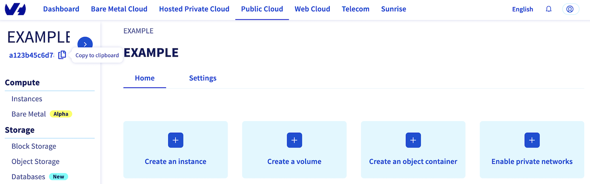
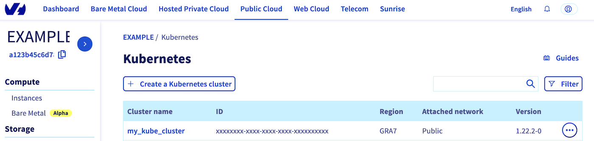
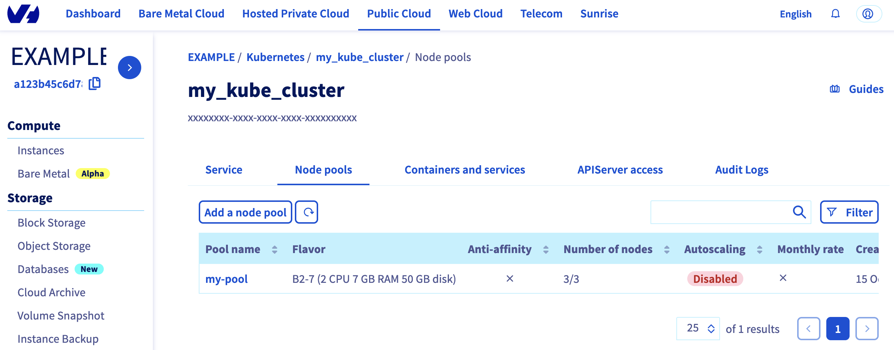

<style>
 pre {
     font-size: 14px;
 }
 pre.console {
   background-color: #300A24; 
   color: #ccc;
   font-family: monospace;
   padding: 5px;
   margin-bottom: 5px;
 }
 pre.console code {
   border: solid 0px transparent;
   font-family: monospace !important;
   font-size: 0.75em;
   color: #ccc;
 }
 .small {
     font-size: 0.75em;
 }
</style>

## Objective

You can create an OVHcloud Managed Kubernetes cluster through the OVHcloud Control Panel, but you can also deploy a cluster programmatically, with  Infrastructure as Code (IaC) tools. This can be done through Terraform thanks to our OVHcloud provider, and now also with Pulumi.

### Pulumi


[Pulumi](https://www.pulumi.com/) is an Infrastructure as code (IasC) tool that allows you to build your infrastructures with a programming language, in Golang for example.
Users define the desired state in Pulumi programs and Pulumi create the desired resources.

Pulumi offers an intuitive command line interface (CLI), to provision, update or delete your infrastructure. If you are familiar with Docker Compose CLI and Terraform CLI, you will adopt [Pulumi CLI](https://www.pulumi.com/docs/cli/) too.

## Requirements

- A [Public Cloud project](/pages/public_cloud/compute/create_a_public_cloud_project) in your OVHcloud account
- Installing [Pulumi CLI](https://www.pulumi.com/docs/install/){.external}
- An account in [Pulumi](https://www.pulumi.com/)
- A [Pulumi access token](https://app.pulumi.com/account/tokens)
- Installing [kubectl CLI](https://kubernetes.io/docs/tasks/tools/)

### Before you begin

You should have installed Pulumi CLI on your machine. Verify the Pulumi CLI is successfully installed in your machine with the `pulumi version` command.

You should have a result like this:

<pre class="console"><code>$ pulumi version
v3.81.0
</code></pre>

#### OVHcloud Pulumi provider

In order to create a Kubernetes cluster and other resources, you will use the [OVHcloud Pulumi provider](https://github.com/ovh/pulumi-ovh). This provider is a bridge to our official [Terraform provider](https://registry.terraform.io/providers/ovh/ovh/latest){.external}.

All available Pulumi resources have their definition and [documentation](https://www.pulumi.com/registry/packages/ovh).

In this guide, we will create two resources:

- a [Kube resource](https://www.pulumi.com/registry/packages/ovh/api-docs/cloudproject/kube/){.external} that represents an OVHcloud managed Kubernetes cluster
- a [KubeNodePool resource](https://www.pulumi.com/registry/packages/ovh/api-docs/cloudproject/kubenodepool/){.external} that represents a Kubernetes Node Pool

{.thumbnail}

#### Getting your cluster/API tokens information

The “OVH provider” needs to be configured with a set of credentials, which can be set using [Pulumi stack configuration](https://www.pulumi.com/docs/concepts/config/) or environment variables:

- `ovh:endpoint` (environment variable: `OVH_ENDPOINT`)
- `ovh:applicationKey` (environment variable: `OVH_APPLICATION_KEY`)
- `ovh:applicationSecret` (secret) (environment variable: `OVH_APPLICATION_SECRET`)
- `ovh:consumerKey` (environment variable: `OVH_CONSUMER_KEY`)

**Why?**

Behind the scenes, the provider is doing requests to OVHcloud APIs. 

In order to retrieve this necessary information, please follow our [first steps with the OVHcloud APIs](/pages/manage_and_operate/api/first-steps) guide.

In concrete terms, you have to generate these credentials via the [OVH token generation page](https://api.ovh.com/createToken/?GET=/*&POST=/*&PUT=/*&DELETE=/*) with the following rights:

{.thumbnail}

When you have successfully generated your OVH tokens, please save them as you will have to use them in the coming minutes.

The last needed information is the `serviceName`: it is the ID of your Public Cloud project.

**How to get it?**

In the Public Cloud section, you can retrieve your service name ID thanks to the `Copy to clipboard`{.action} button.

{.thumbnail}

Define the secret keys as environment variables:

```bash
export OVH_ENDPOINT="ovh-eu"
export OVH_APPLICATION_KEY="xxx"
export OVH_APPLICATION_SECRET="xxx"
export OVH_CONSUMER_KEY="xxx"
```

> [!primary]
>
> Replace `xxx` by the correct values and `ovh-eu` with the correct endpoint.

## Instructions

One advantage of Pulumi is that it allows you to build your infrastructures with the programming language of your choice. It supports a variety of programming languages.

In this tutorial you will be able to deploy your Kubernetes cluster and its node pool in the Go/Golang programming language.
For your information, our OVH Pulumi provider currently supports Go but also Python, Node.js/Typescript and C#/Dotnet.

Examples:

- [Python](https://github.com/ovh/pulumi-ovh/tree/main/examples/ovh-python)
- [Typescript](https://github.com/ovh/pulumi-ovh/tree/main/examples/ovh-typescript)
- [C#](https://github.com/ovh/pulumi-ovh/tree/main/examples/ovh-csharp)
- [Go](https://github.com/ovh/pulumi-ovh/tree/main/examples/ovh-go)

### Deploy your Kubernetes cluster in Go / Golang

#### Pulumi project creation and initialization

In Pulumi, the infrastructure is organized into projects. In the Pulumi ecosystem, a project represents a Pulumi program which, when run, declares the desired infrastructure for Pulumi to manage.

First, create a folder named `pulumi_ovh_kube` which represents our project and go into it.

```bash
mkdir pulumi_ovh_kube
cd pulumi_ovh_kube
```

Initialize your project:

```bash
pulumi new go -y
```

The output should be like this:

<pre class="console"><code>$ pulumi new go -y
Created project 'pulumi_ovh_kube'

Please enter your desired stack name.
To create a stack in an organization, use the format <org-name>/<stack-name> (e.g. `acmecorp/dev`).
Created stack 'dev'

Installing dependencies...

Finished installing dependencies

Your new project is ready to go! 

To perform an initial deployment, run `pulumi up`
</code></pre>

The command creates a `dev` stack and the code organization of your project:

<pre class="console"><code>$ tree
.
├── go.mod
├── go.sum
├── main.go
└── Pulumi.yaml
</code></pre>

Now you need to install the Pulumi OVH provider.

```bash
go get github.com/ovh/pulumi-ovh/sdk/go/...
```

In order to create an OVHcloud Managed Kubernetes cluster, you need to define the `serviceName`.
Edit the `Pulumi.yaml` file with the following content:

```yaml
config:
 serviceName: <your-service-name>
```

> [!primary]
>
> Replace `<your-service-name>` by your Public Cloud project.

Then, edit the `main.go` file and replace the content with the following:

```go
package main

import (
	"github.com/pulumi/pulumi/sdk/v3/go/pulumi"
	"github.com/pulumi/pulumi/sdk/v3/go/pulumi/config"
	"github.com/ovh/pulumi-ovh/sdk/go/ovh/cloudproject"
)

func main() {
	pulumi.Run(func(ctx *pulumi.Context) error {

		serviceName := config.Require(ctx, "serviceName")

		// Deploy a new Kubernetes cluster
		myKube, err := cloudproject.NewKube(ctx, "my_desired_cluster", &cloudproject.KubeArgs{
			ServiceName: pulumi.String(serviceName),
			Name:        pulumi.String("my_desired_cluster"),
			Region:      pulumi.String("GRA5"),
		})
		if err != nil {
			return err
		}

		// Export kubeconfig file to a secret
		ctx.Export("kubeconfig", pulumi.ToSecret(myKube.Kubeconfig))

		//Create a Node Pool
		nodePool, err := cloudproject.NewKubeNodePool(ctx, "my-desired-pool", &cloudproject.KubeNodePoolArgs{
			ServiceName:  pulumi.String(serviceName),
			KubeId:       myKube.ID(),
			Name:         pulumi.String("my-desired-pool"),
			DesiredNodes: pulumi.Int(1),
			MaxNodes:     pulumi.Int(3),
			MinNodes:     pulumi.Int(1),
			FlavorName:   pulumi.String("b2-7"),
		})
		if err != nil {
			return err
		}

		ctx.Export("nodePoolID", nodePool.ID())

		return nil
	})
}
```

This Go program will create an OVHcloud Managed Kubernetes cluster:

- named `my-desired-cluster`
- in the `GRA5` region
- in your Public Cloud project (depending on the `serviceName` you defined)

And a Kubernetes Node Pool:

- named `my-desired-pool`
- with `b2-7` flavor/machine type
- with 1 desired node, 2 node minimum and 3 node maximum

Then, run the `go mod tidy` command to ask Go to download and install the necessary Go providers and dependencies.

```
go mod tidy
```

#### Create your Kubernetes cluster through Pulumi

Now you can deploy your cluster and the node pool. To do that, just execute the `pulumi up` comand.
This will display the plan/the preview of the desireed state. You will be prompted to choose the stack (`dev` by default) and to confirm that you want to perform/apply the changes.

```
$ pulumi up
Previewing update (dev)

View in Browser (Ctrl+O): https://app.pulumi.com/scraly/pulumi_ovh_kube/dev/previews/xxxxxxxx-xxxx-xxxx-xxxx-xxxxxxxxxxxx

Downloading plugin: 18.02 MiB / 18.02 MiB [=========================] 100.00% 5s
                                                                                [resource plugin ovh-0.34.0] installing
     Type                              Name                  Plan
 +   pulumi:pulumi:Stack               pulumi_ovh_kube-dev   create
 +   ├─ ovh:CloudProject:Kube          my_desired_cluster    create
 +   └─ ovh:CloudProject:KubeNodePool  my-desired-pool       create


Outputs:
    kubeconfig: [secret]
    nodePoolID: output<string>

Resources:
    + 3 to create

Do you want to perform this update? yes
Updating (dev)

View in Browser (Ctrl+O): https://app.pulumi.com/scraly/pulumi_ovh_kube/dev/updates/1

     Type                              Name                 Status             
 +   pulumi:pulumi:Stack               pulumi_ovh_kube-dev  created (394s)     
 +   ├─ ovh:CloudProject:Kube          my_desired_cluster   created (241s)    
 +   └─ ovh:CloudProject:KubeNodePool  my-desired-pool      created (150s)     


Outputs:
    kubeconfig: [secret]
    nodePoolID: "xxxxxxxx-xxxx-xxxx-xxxx-xxxxxxxxxxxx"

Resources:
    + 3 created

Duration: 6m37s
```

Log in to the [OVHcloud Control Panel](https://ca.ovh.com/auth/?action=gotomanager&from=https://www.ovh.com/asia/&ovhSubsidiary=asia), go to the `Public Cloud`{.action} section and click on `Managed Kubernetes Service`. <br>
As you can see, your cluster has been successfuly created:

{.thumbnail}

Now, click on `my_kube_cluster` then on the `Node pools` tab:

{.thumbnail}

YOur node pool is created too.

#### Connect to the cluster

YOur cluster is created, you now need to connect to it in order to check your nodes, existing pods and to deploy your applications.

In order to do this, retrieve the kubeconfig file locally from the `dev` Pulumi stack:

```bash
pulumi stack output kubeconfig --show-secrets -s dev > kubeconfig.yaml
```

You can define it in your `$KUBECONFIG` environment variable or you can use it directly in the `kubectl` command with the `--kubeconfig` option.

List your Node Pools:

```
$ kubectl --kubeconfig=kubeconfig.yaml get nodepool
NAME              FLAVOR   AUTOSCALED   MONTHLYBILLED   ANTIAFFINITY   DESIRED   CURRENT   UP-TO-DATE   AVAILABLE   MIN   MAX   AGE
my-desired-pool   b2-7     false        false           false          1         1         1            1           1     3     3m25s
```

Display the list of Nodes:

```
$ kubectl --kubeconfig=kubeconfig.yaml get node
NAME                          STATUS   ROLES    AGE    VERSION
my-desired-pool-node-a90c09   Ready    <none>   115s   v1.27.4
```

You can now deploy your applications and/or create new clusters through Pulumi.

## Known issues

### "Provider is missing a required configuration key"

If you encounter the following error, it means you forgot to export the needed OVHcloud environment variables.

```bash
$ pulumi up
Previewing update (dev)

View in Browser (Ctrl+O): https://app.pulumi.com/scraly/pulumi_ovh_kube/dev/previews/xxxxxxxx-xxxx-xxxx-xxxx-xxxxxxxxxxxx

     Type                     Name                                              Plan       Info
 +   pulumi:pulumi:Stack      pulumi_ovh_kube-dev                              create     1 message
     └─ pulumi:providers:ovh  default_github_/api.github.com/ovh/pulumi-ovh             1 error


Diagnostics:
  pulumi:providers:ovh (default_github_/api.github.com/ovh/pulumi-ovh):
    error: pulumi:providers:ovh resource 'default_github_/api.github.com/ovh/pulumi-ovh' has a problem: Provider is missing a required configuration key, try `pulumi config set ovh:endpoint`: The OVH API endpoint to target (ex: "ovh-eu").

  pulumi:pulumi:Stack (pulumi_ovh_kube-dev):
    2023/08/10 07:04:39 {0xc0001e25b0}
```

The solution is to export the missing required configuration:

```bash
export OVH_ENDPOINT="ovh-eu"
export OVH_APPLICATION_KEY="xxx"
export OVH_APPLICATION_SECRET="xxx"
export OVH_CONSUMER_KEY="xxx"
```

> [!primary]
>
> Replace `xxx` by the correct values and `ovh-eu` with the correct endpoint.

### "Node pool name xxx is invalid, only lowercase characters, digits and '-' are accepted"

Have you defined the node pool you want to create? If so, it's time to enter  the `pulumi up` command.

```bash
     Type                              Name                 Status                  Info
 +   pulumi:pulumi:Stack               pulumi_ovh_kube-dev  **creating failed**     1 error
 +   ├─ ovh:CloudProject:Kube          my_desired_cluster   created (222s)          
 +   └─ ovh:CloudProject:KubeNodePool  my_desired_pool      **creating failed**     1 error


Diagnostics:
  pulumi:pulumi:Stack (pulumi_ovh_kube-dev):
    error: update failed

  ovh:CloudProject:KubeNodePool (my_desired_pool):
    error: 1 error occurred:
        * calling Post /cloud/project/xxxxxxxxxx/kube/xxxxxxxxx-xxxx-xxxx-xxxx-xxxxxxxxxxxx/nodepool with params my_desired_pool(b2-7): 1/1/3:
         OVHcloud API error (status code 400): Client::BadRequest: "[InvalidDataError] 400: Node pool name my_desired_pool is invalid, only lowercase characters, digits and '-' are accepted (regex: '^[a-z0-9]([-a-z0-9]*[a-z0-9])?$') (request ID: xxxxxx-xxxx-xxxx-xxxx-xxxxxxxxxx)" (X-OVH-Query-Id: EU.ext-3.xxxxxxxx.xxxxx.xxxxxxxxxxxxxxxxx)

Resources:
    + 2 created

Duration: 3m47s
```

If you get this error message, the issue is that you named the flavor or the node pool with an invalid character: "_" or ".".

The API don't support these characters so that's the reason why you obtained this error message.
In order to fix this, change the flavor name and/or the pool name to a correct one, for example in Go:

```go
nodePool, err := cloudproject.NewKubeNodePool(ctx, "my-desired-pool", &cloudproject.KubeNodePoolArgs{
			ServiceName:  pulumi.String(serviceName),
			KubeId:       myKube.ID(),
			Name:         pulumi.String("my-desired-pool"),
			DesiredNodes: pulumi.Int(1),
			MaxNodes:     pulumi.Int(3),
			MinNodes:     pulumi.Int(1),
			FlavorName:   pulumi.String("b2-7"),
		})
```

### "not enough xxx quotas"

By default, the Public Cloud projects as well as the resources total (RAM, CPU, disk space, number of instances, etc.) you can use are limited for security reasons.

When you create a new Kubernetes Node Pool, if you run out of resources in your available quota, the Nodes might be in error.

You may get the following error message: "not enough xxx quotas".
"xxx" can be RAM, CPU, VM, Disk or Port.

If this is the case, the quotas must be increased.
In order to check your quotas and increase them, please follow this tutorial:

[Increasing Public Cloud quotas](/pages/public_cloud/compute/increasing_public_cloud_quota).

## Destroy (cleanup)

If you want to easily destroy created resources, you can use the `pulumi destroy` command.

```
$ pulumi destroy
Previewing destroy (dev)

View in Browser (Ctrl+O): https://app.pulumi.com/scraly/pulumi_ovh_kube/dev/previews/xxxxxxxx-xxxx-xxxx-xxxx-xxxxxxxxxxxx

     Type                              Name                  Plan
 -   pulumi:pulumi:Stack               pulumi_ovh_kube-dev   delete
 -   ├─ ovh:CloudProject:KubeNodePool  my-desired-pool       delete
 -   └─ ovh:CloudProject:Kube          my_desired_cluster    delete


Outputs:
  - kubeconfig: [secret]
  - nodePoolID: "xxxxxxxx-xxxx-xxxx-xxxx-xxxxxxxxxxxx"

Resources:
    - 3 to delete

Do you want to perform this destroy? yes
Destroying (dev)

View in Browser (Ctrl+O): https://app.pulumi.com/scraly/pulumi_ovh_kube/dev/updates/2

     Type                              Name                 Status            
     pulumi:pulumi:Stack               pulumi_ovh_kube-dev                    
 -   ├─ ovh:CloudProject:KubeNodePool  my-desired-pool      deleted (66s)     
 -   └─ ovh:CloudProject:Kube          my_desired_cluster   deleted (96s)     


Outputs:
  - kubeconfig: [secret]
  - nodePoolID: "xxxxxxxx-xxxx-xxxx-xxxx-xxxxxxxxxxxx"

Resources:
    - 3 deleted

Duration: 2m45s

The resources in the stack have been deleted, but the history and configuration associated with the stack are still maintained.
If you want to remove the stack completely, run `pulumi stack rm dev`.
```

Your Kubernetes cluster and associated resources (Nodes, Pods...) have been correctly destroyed.

## Go further

To have an overview of the OVHcloud Managed Kubernetes service, visit the [OVHcloud Managed Kubernetes page](https://www.ovhcloud.com/en/public-cloud/kubernetes/).

To deploy your first application on your Kubernetes cluster, we invite you to follow our guides to [configure default settings for `kubectl`](/ppages/public_cloud/containers_orchestration/managed_kubernetes/configuring-kubectl-on-an-ovh-managed-kubernetes-cluster) and to [deploy a Hello World application](/pages/public_cloud/containers_orchestration/managed_kubernetes/deploying-hello-world).

- If you need training or technical assistance to implement our solutions, contact your sales representative or click on [this link](https://www.ovhcloud.com/asia/professional-services/) to get a quote and ask our Professional Services experts for assisting you on your specific use case of your project.

- Join our community of users on <https://community.ovh.com/en/>.
