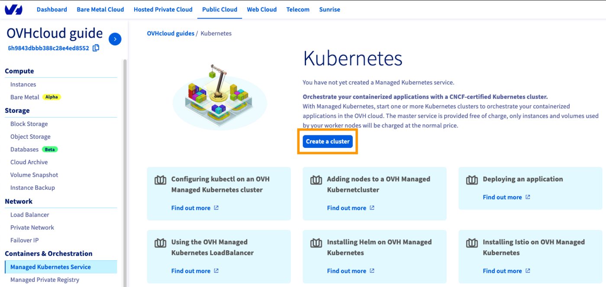
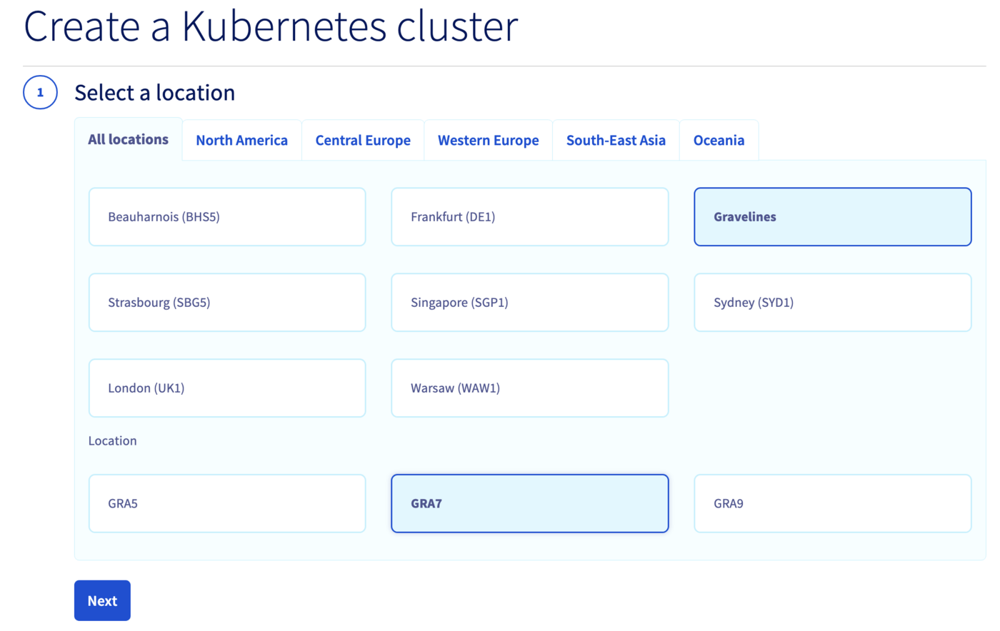
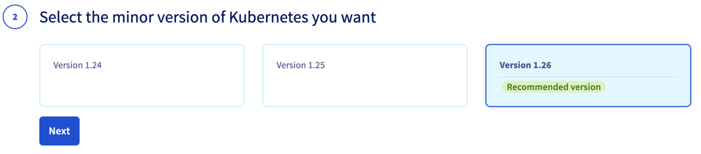
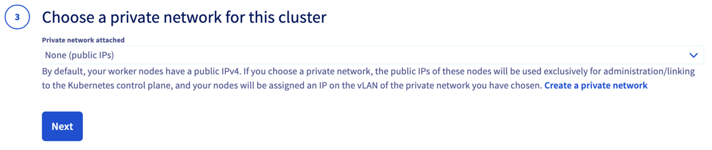
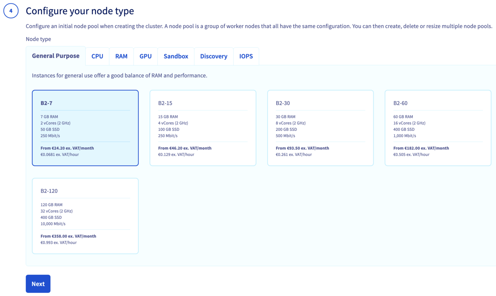
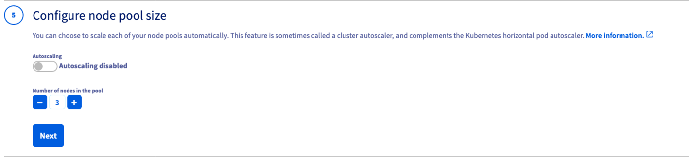
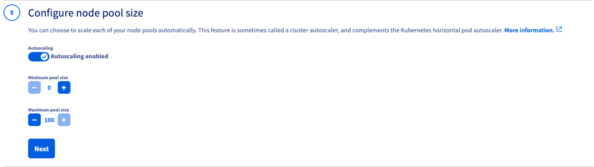
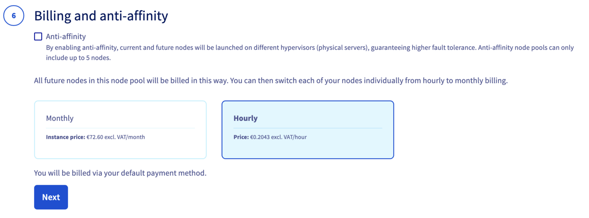
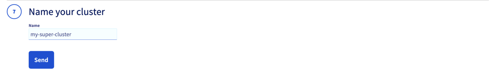

## Objective

The OVHcloud Managed Kubernetes service lets you deploy production-ready clusters without the operational overhead of setting them up or maintaining them. Create a cluster through the OVHcloud Control Panel, API, or CLI, or automate the process using Infrastructure as Code tools like Terraform, Pulumi or CDK for Terraform.

## Requirements

- A [Public Cloud project](/pages/public_cloud/public_cloud_cross_functional/create_a_public_cloud_project) in your OVHcloud account

> [!success]
> Take advantage of reduced prices by committing to a period of 1 to 36 months on your Public Cloud resources. More information on our [Savings Plans](/links/public-cloud/savings-plan) page.

<!-- CP-NAV-START:publiccloud-projects -->
---

### OVHcloud Control Panel Access

- **Direct link:** [Public Cloud Projects](/links/control-panel/publiccloud-projects)
- **Navigation path:** `Public Cloud`{.action} > Select your project

---
<!-- CP-NAV-END:publiccloud-projects -->

> [!primary]
> The OVHcloud API, CLI, Terraform, CDK for Terraform, and Pulumi all require OVHcloud API credentials (`application_key`, `application_secret`, `consumer_key`). Follow [First steps with the OVHcloud APIs](/pages/manage_and_operate/api/first-steps) to generate them.

## Instructions

> [!tabs]
> Via the OVHcloud Control Panel
>> <iframe class="video" width="560" height="315" src="https://www.youtube-nocookie.com/embed/ApfujBFT82g" title="YouTube video player" frameborder="0" allow="accelerometer; autoplay; clipboard-write; encrypted-media; gyroscope; picture-in-picture" allowfullscreen></iframe>
>>
>> Click on `Managed Kubernetes Service`{.action} in the left-hand menu and click `Create a cluster`{.action}.
>>
>> {.thumbnail}
>>
>> Select a location for your new cluster.
>>
>> {.thumbnail}
>>
>> Choose the minor version of Kubernetes.
>>
>> {.thumbnail}
>>
>> > [!primary]
>> > We recommend always using the latest stable version. Please read our [End of life / end of support](/pages/public_cloud/containers_orchestration/managed_kubernetes/eos-eol-policies) page to understand our version policy.
>>
>> Optionally, integrate your cluster into a private network using OVHcloud vRack. For more information, read our guide [Using the vRack](/pages/public_cloud/containers_orchestration/managed_kubernetes/using-vrack).
>>
>> {.thumbnail}
>>
>> Configure the default node pool. A node pool is a group of nodes sharing the same configuration. Read the [Managing node pools](/pages/public_cloud/containers_orchestration/managed_kubernetes/managing-nodes) guide for more information.
>>
>> {.thumbnail}
>>
>> Define the size of the default node pool.
>>
>> {.thumbnail}
>>
>> Optionally, enable `Autoscaling`{.action} and define the minimum and maximum pool size.
>>
>> {.thumbnail}
>>
>> Choose the billing mode (monthly or hourly) and optionally enable anti-affinity mode.
>>
>> {.thumbnail}
>>
>> > [!primary]
>> > Anti-affinity distributes nodes across different hypervisors for higher fault tolerance. Anti-affinity node pools are limited to 5 nodes. Monthly billing cannot be switched to hourly afterwards.
>>
>> Enter a name for your cluster and click `Send`{.action}.
>>
>> {.thumbnail}
>>
>> The cluster will be available within a few minutes.
>>
>> > [!warning]
>> > After a cluster is created, the region and private network ID cannot be changed.
>>
> Via the OVHcloud API
>> Log in to the [OVHcloud API Explorer](/links/api).
>>
>> **Create the cluster:**
>>
>> Call `POST /cloud/project/{serviceName}/kube` with the following body:
>>
>> ```json
>> {
>>   "name": "my-cluster",
>>   "region": "GRA7",
>>   "version": "1.34"
>> }
>> ```
>>
>> > [!primary]
>> > We recommend always using the latest stable version. Please read our [End of life / end of support](/pages/public_cloud/containers_orchestration/managed_kubernetes/eos-eol-policies) page to understand our version policy.
>>
>> Note the `id` in the response — you will need it to create the node pool.
>>
>> **Create a node pool:**
>>
>> Call `POST /cloud/project/{serviceName}/kube/{kubeId}/nodepool` with the following body:
>>
>> ```json
>> {
>>   "name": "my-pool",
>>   "flavorName": "b2-7",
>>   "desiredNodes": 3,
>>   "minNodes": 3,
>>   "maxNodes": 3
>> }
>> ```
>>
>> > [!warning]
>> > Node pool names only accept lowercase characters, digits and `-`. Underscores and dots are not supported.
>>
>> > [!warning]
>> > After a cluster is created, the region and private network ID cannot be changed.
>>
> Via the OVHcloud CLI
>> > [!primary]
>> > Install the [OVHcloud CLI](https://github.com/ovh/ovhcloud-cli) and configure your credentials before proceeding.
>>
>> **Create the cluster:**
>>
>> ```bash
>> ovhcloud cloud kube create \
>>   --cloud-project <serviceName> \
>>   --name my-cluster \
>>   --region GRA7 \
>>   --version 1.34
>> ```
>>
>> > [!primary]
>> > We recommend always using the latest stable version. Please read our [End of life / end of support](/pages/public_cloud/containers_orchestration/managed_kubernetes/eos-eol-policies) page to understand our version policy.
>>
>> Note the `id` in the output — you will need it to create the node pool.
>>
>> **Create a node pool:**
>>
>> ```bash
>> ovhcloud cloud kube nodepool create <kubeId> \
>>   --cloud-project <serviceName> \
>>   --name my-pool \
>>   --flavor-name b2-7 \
>>   --desired-nodes 3 \
>>   --min-nodes 3 \
>>   --max-nodes 3
>> ```
>>
>> > [!warning]
>> > Node pool names only accept lowercase characters, digits and `-`. Underscores and dots are not supported.
>>
>> > [!warning]
>> > After a cluster is created, the region and private network ID cannot be changed.
>>
> Via Terraform
>> > [!primary]
>> > Install [Terraform CLI](https://www.terraform.io/docs/cli/index.html) (version 0.12.x minimum) before proceeding.
>>
>> OVHcloud provides a [Terraform provider](https://registry.terraform.io/providers/ovh/ovh/latest) available in the official Terraform registry.
>>
>> Your Public Cloud project ID is the `service_name`. Retrieve it using the `Copy to clipboard`{.action} button in the Public Cloud section.
>>
>> {.thumbnail}
>>
>> **provider.tf:**
>>
>> ```bash
>> terraform {
>>   required_providers {
>>     ovh = {
>>       source = "ovh/ovh"
>>     }
>>   }
>> }
>>
>> provider "ovh" {
>>   endpoint           = "ovh-eu"
>>   application_key    = "<your_access_key>"
>>   application_secret = "<your_application_secret>"
>>   consumer_key       = "<your_consumer_key>"
>> }
>> ```
>>
>> Alternatively, use environment variables to avoid storing secrets in source code: `OVH_ENDPOINT`, `OVH_APPLICATION_KEY`, `OVH_APPLICATION_SECRET`, `OVH_CONSUMER_KEY`.
>>
>> **variables.tf:**
>>
>> ```bash
>> variable service_name {
>>   type    = string
>>   default = "<your_service_name>"
>> }
>> ```
>>
>> **ovh_kube_cluster.tf:**
>>
>> ```bash
>> resource "ovh_cloud_project_kube" "my_kube_cluster" {
>>    service_name = "${var.service_name}"
>>    name         = "my_kube_cluster"
>>    region       = "GRA7"
>>    version      = "1.34"
>> }
>>
>> resource "ovh_cloud_project_kube_nodepool" "node_pool" {
>>    service_name  = "${var.service_name}"
>>    kube_id       = ovh_cloud_project_kube.my_kube_cluster.id
>>    name          = "my-pool"
>>    flavor_name   = "b2-7"
>>    desired_nodes = 3
>>    max_nodes     = 3
>>    min_nodes     = 3
>> }
>> ```
>>
>> **output.tf:**
>>
>> ```bash
>> output "kubeconfig" {
>>   value     = ovh_cloud_project_kube.my_kube_cluster.kubeconfig
>>   sensitive = true
>> }
>> ```
>>
>> > [!warning]
>> > Node pool names only accept lowercase characters, digits and `-`. Underscores and dots cause a `gzip: invalid header` error.
>>
>> Deploy:
>>
>> ```bash
>> terraform init && terraform apply
>> ```
>>
> Via CDK for Terraform
>> > [!primary]
>> > You need [kubectl](https://kubernetes.io/docs/tasks/tools/), [CDK for Terraform CLI](https://developer.hashicorp.com/terraform/tutorials/cdktf/cdktf-install) and [Go](https://go.dev/doc/install) installed.
>>
>> {.thumbnail}
>>
>> CDKTF translates Go code into Terraform HCL and uses the OVHcloud Terraform provider. Set the required credentials as environment variables:
>>
>> ```bash
>> export OVH_ENDPOINT="ovh-eu"
>> export OVH_APPLICATION_KEY="xxx"
>> export OVH_APPLICATION_SECRET="xxx"
>> export OVH_CONSUMER_KEY="xxx"
>> export OVH_CLOUD_PROJECT_SERVICE="xxx"
>> ```
>>
>> Initialize the project:
>>
>> ```bash
>> mkdir ovhcloud-kube && cd ovhcloud-kube
>> cdktf init --template=go --providers="ovh/ovh@~>0.37.0" "hashicorp/local" --providers-force-local --local --project-name=ovhcloud-kube
>> ```
>>
>> Edit `main.go`:
>>
>> ```go
>> package main
>>
>> import (
>>     "os"
>>     "path"
>>
>>     "cdk.tf/go/stack/generated/hashicorp/local/file"
>>     local "cdk.tf/go/stack/generated/hashicorp/local/provider"
>>     "cdk.tf/go/stack/generated/ovh/ovh/cloudprojectkube"
>>     "cdk.tf/go/stack/generated/ovh/ovh/cloudprojectkubenodepool"
>>     ovh "cdk.tf/go/stack/generated/ovh/ovh/provider"
>>     "github.com/aws/constructs-go/constructs/v10"
>>     "github.com/aws/jsii-runtime-go"
>>     "github.com/hashicorp/terraform-cdk-go/cdktf"
>> )
>>
>> func NewMyStack(scope constructs.Construct, id string) cdktf.TerraformStack {
>>     stack := cdktf.NewTerraformStack(scope, &id)
>>
>>     ovh.NewOvhProvider(stack, jsii.String("ovh"), &ovh.OvhProviderConfig{
>>         Endpoint: jsii.String("ovh-eu"),
>>     })
>>     local.NewLocalProvider(stack, jsii.String("local"), &local.LocalProviderConfig{})
>>
>>     serviceName := os.Getenv("OVH_CLOUD_PROJECT_SERVICE")
>>
>>     kube := cloudprojectkube.NewCloudProjectKube(stack, jsii.String("my_desired_cluster"), &cloudprojectkube.CloudProjectKubeConfig{
>>         ServiceName: jsii.String(serviceName),
>>         Name:        jsii.String("my_desired_cluster"),
>>         Region:      jsii.String("GRA5"),
>>     })
>>
>>     cdktf.NewTerraformOutput(stack, jsii.String("cluster_version"), &cdktf.TerraformOutputConfig{
>>         Value: kube.Version(),
>>     })
>>
>>     pwd, _ := os.Getwd()
>>     file.NewFile(stack, jsii.String("kubeconfig"), &file.FileConfig{
>>         Filename:       jsii.String(path.Join(pwd, "kubeconfig.yaml")),
>>         Content:        kube.Kubeconfig(),
>>         FilePermission: jsii.String("0644"),
>>     })
>>
>>     nodePool := cloudprojectkubenodepool.NewCloudProjectKubeNodepool(stack, jsii.String("my-pool"), &cloudprojectkubenodepool.CloudProjectKubeNodepoolConfig{
>>         ServiceName:  kube.ServiceName(),
>>         KubeId:       kube.Id(),
>>         Name:         jsii.String("my-pool"),
>>         DesiredNodes: jsii.Number(1),
>>         MaxNodes:     jsii.Number(3),
>>         MinNodes:     jsii.Number(1),
>>         FlavorName:   jsii.String("b2-7"),
>>     })
>>
>>     cdktf.NewTerraformOutput(stack, jsii.String("nodePoolID"), &cdktf.TerraformOutputConfig{
>>         Value: nodePool.Id(),
>>     })
>>
>>     return stack
>> }
>>
>> func main() {
>>     app := cdktf.NewApp(nil)
>>     NewMyStack(app, "ovhcloud")
>>     app.Synth()
>> }
>> ```
>>
>> Deploy:
>>
>> ```bash
>> cdktf deploy
>> ```
>>
> Via Pulumi
>> > [!primary]
>> > You need [Pulumi CLI](https://www.pulumi.com/docs/install/), a [Pulumi account](https://www.pulumi.com/) with an [access token](https://app.pulumi.com/account/tokens), and [kubectl](https://kubernetes.io/docs/tasks/tools/) installed.
>>
>> {.thumbnail}
>>
>> The OVH Pulumi provider supports Go, Python, Node.js/TypeScript, C#, and Java. See [examples](https://github.com/ovh/pulumi-ovh/tree/main/examples/kubernetes).
>>
>> Set credentials as environment variables:
>>
>> ```bash
>> export OVH_ENDPOINT="ovh-eu"
>> export OVH_APPLICATION_KEY="xxx"
>> export OVH_APPLICATION_SECRET="xxx"
>> export OVH_CONSUMER_KEY="xxx"
>> ```
>>
>> Create and initialize the project:
>>
>> ```bash
>> mkdir pulumi_ovh_kube && cd pulumi_ovh_kube
>> pulumi new go -y
>> go get github.com/ovh/pulumi-ovh/sdk/go/...
>> ```
>>
>> Edit `Pulumi.yaml` to add the service name:
>>
>> ```yaml
>> config:
>>  serviceName: <your-service-name>
>> ```
>>
>> Edit `main.go`:
>>
>> ```go
>> package main
>>
>> import (
>>     "github.com/pulumi/pulumi/sdk/v3/go/pulumi"
>>     "github.com/pulumi/pulumi/sdk/v3/go/pulumi/config"
>>     "github.com/ovh/pulumi-ovh/sdk/go/ovh/cloudproject"
>> )
>>
>> func main() {
>>     pulumi.Run(func(ctx *pulumi.Context) error {
>>         serviceName := config.Require(ctx, "serviceName")
>>
>>         myKube, err := cloudproject.NewKube(ctx, "my_desired_cluster", &cloudproject.KubeArgs{
>>             ServiceName: pulumi.String(serviceName),
>>             Name:        pulumi.String("my_desired_cluster"),
>>             Region:      pulumi.String("GRA5"),
>>         })
>>         if err != nil {
>>             return err
>>         }
>>
>>         ctx.Export("kubeconfig", pulumi.ToSecret(myKube.Kubeconfig))
>>
>>         nodePool, err := cloudproject.NewKubeNodePool(ctx, "my-desired-pool", &cloudproject.KubeNodePoolArgs{
>>             ServiceName:  pulumi.String(serviceName),
>>             KubeId:       myKube.ID(),
>>             Name:         pulumi.String("my-desired-pool"),
>>             DesiredNodes: pulumi.Int(1),
>>             MaxNodes:     pulumi.Int(3),
>>             MinNodes:     pulumi.Int(1),
>>             FlavorName:   pulumi.String("b2-7"),
>>         })
>>         if err != nil {
>>             return err
>>         }
>>
>>         ctx.Export("nodePoolID", nodePool.ID())
>>         return nil
>>     })
>> }
>> ```
>>
>> Run `go mod tidy` then deploy:
>>
>> ```bash
>> pulumi up
>> ```
>>

## Connect to the cluster

> [!tabs]
> Via the OVHcloud Control Panel
>> In your cluster page, open the `Service`{.action} tab and download the `kubectl` configuration file to connect to your cluster.
>>
> Via the OVHcloud API
>> Call `GET /cloud/project/{serviceName}/kube/{kubeId}/kubeconfig` to retrieve the kubeconfig content and save it to a file:
>>
>> ```bash
>> kubectl --kubeconfig=kubeconfig.yaml get nodes
>> ```
>>
> Via the OVHcloud CLI
>> ```bash
>> ovhcloud cloud kube kubeconfig generate <kubeId> \
>>   --cloud-project <serviceName> > kubeconfig.yaml
>> kubectl --kubeconfig=kubeconfig.yaml get nodes
>> ```
>>
> Via Terraform
>> ```bash
>> terraform output -raw kubeconfig > ~/.kube/my_kube_cluster.yml
>> kubectl --kubeconfig=~/.kube/my_kube_cluster.yml get nodes
>> ```
>>
> Via CDK for Terraform
>> The kubeconfig file was saved locally as `kubeconfig.yaml` during deployment:
>>
>> ```bash
>> kubectl --kubeconfig=kubeconfig.yaml get nodes
>> ```
>>
> Via Pulumi
>> ```bash
>> pulumi stack output kubeconfig --show-secrets -s dev > kubeconfig.yaml
>> kubectl --kubeconfig=kubeconfig.yaml get nodes
>> ```
>>

## Known issues

### "not enough xxx quotas"

By default, Public Cloud resource quotas (RAM, CPU, disk space, number of instances, etc.) are limited for security reasons. If you run out of resources when creating a node pool, follow [Increasing Public Cloud quotas](/pages/public_cloud/public_cloud_cross_functional/increasing_public_cloud_quota) to increase them.

> [!tabs]
> Via Terraform
>> **"gzip: invalid header"**
>>
>> This error occurs when a node pool name or flavor name contains `_` or `.`. Only lowercase characters, digits and `-` are accepted:
>>
>> ```bash
>> name        = "my-pool"
>> flavor_name = "b2-7"
>> ```
>>
> Via Pulumi
>> **"Provider is missing a required configuration key"**
>>
>> You forgot to export the required OVHcloud environment variables:
>>
>> ```bash
>> export OVH_ENDPOINT="ovh-eu"
>> export OVH_APPLICATION_KEY="xxx"
>> export OVH_APPLICATION_SECRET="xxx"
>> export OVH_CONSUMER_KEY="xxx"
>> ```
>>
>> **"Node pool name xxx is invalid"**
>>
>> Only lowercase characters, digits and `-` are accepted in node pool names. Rename your node pool using a valid value:
>>
>> ```go
>> Name: pulumi.String("my-desired-pool"),
>> ```
>>

## Destroy (cleanup)

> [!tabs]
> Via the OVHcloud Control Panel
>> In the `Managed Kubernetes Service`{.action} section, click the `...`{.action} button next to your cluster and select `Delete`{.action}.
>>
> Via the OVHcloud API
>> Call `DELETE /cloud/project/{serviceName}/kube/{kubeId}` to delete the cluster and all its associated resources.
>>
> Via the OVHcloud CLI
>> ```bash
>> ovhcloud cloud kube delete <kubeId> --cloud-project <serviceName>
>> ```
>>
> Via Terraform
>> ```bash
>> terraform destroy
>> ```
>>
> Via CDK for Terraform
>> ```bash
>> cdktf destroy
>> ```
>>
> Via Pulumi
>> ```bash
>> pulumi destroy
>> ```
>>
>> To also remove the Pulumi stack history:
>>
>> ```bash
>> pulumi stack rm dev
>> ```
>>

## Go further

To have an overview of OVHcloud Managed Kubernetes service, you can go to the [OVHcloud Managed Kubernetes page](/links/public-cloud/kubernetes).

To deploy your first application on your Kubernetes cluster, we invite you to follow our guide to [configuring default settings for `kubectl`](/pages/public_cloud/containers_orchestration/managed_kubernetes/configuring-kubectl-on-an-ovh-managed-kubernetes-cluster) and [deploying a Hello World application](/pages/public_cloud/containers_orchestration/managed_kubernetes/deploying-hello-world).

- If you need training or technical assistance to implement our solutions, contact your sales representative or click on [this link](/links/professional-services) to get a quote and ask our Professional Services experts for assisting you on your specific use case of your project.

- Join our [community of users](/links/community).
