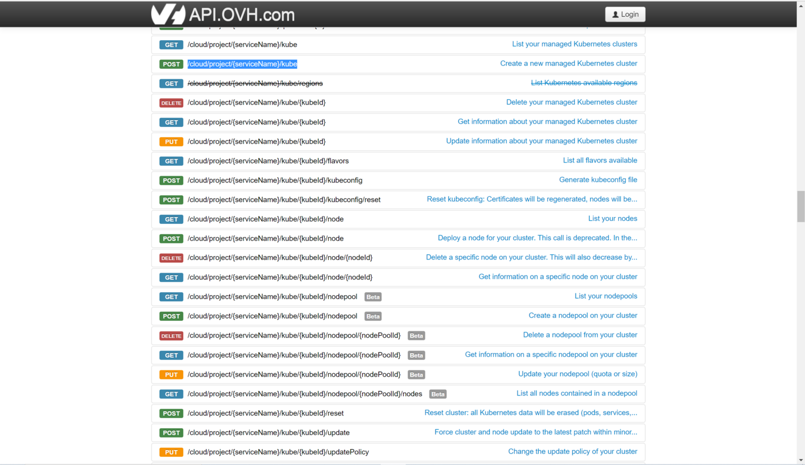
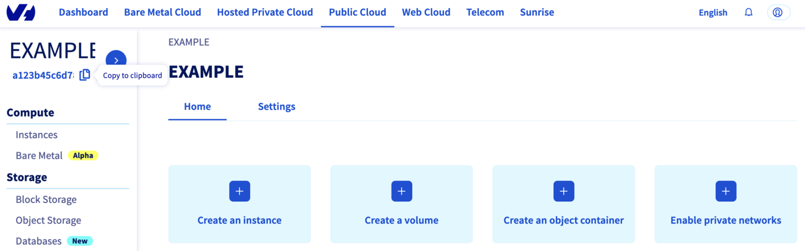

<style>
 pre {
     font-size: 14px;
 }
 pre.console {
   background-color: #300A24; 
   color: #ccc;
   font-family: monospace;
   padding: 5px;
   margin-bottom: 5px;
 }
 pre.console code {
   border: solid 0px transparent;
   font-family: monospace !important;
   font-size: 0.75em;
   color: #ccc;
 }
 .small {
     font-size: 0.75em;
 }
</style>

## Objective

The OVHcloud Managed Kubernetes service provides you with Kubernetes clusters without the hassle of installing or operating them.

The kube-proxy Kubernete's component (which runs on each Node and allows network communication to Pods) with iptables is actually a bottleneck to scale the cluster to a high number of Nodes so at OVHcloud we decided to reduce this bottleneck and allow you to use kube-proxy with IPVS.

[IPVS (IP Virtual Server)](https://kubernetes.io/blog/2018/07/09/ipvs-based-in-cluster-load-balancing-deep-dive/) is built on top of the Netfilter and implements transport-layer Load Balancing as part of the Linux kernel.

At OVHcloud, we listen to our users and improve our products and services accordingly, which is why we give you the ability to customize the kube-proxy configuration.

## Requirements 

- An OVHcloud Managed Kubernetes cluster

## Instructions

### Configure kube-proxy through the API

#### The API Explorer

To simplify things, we are using the [API Explorer](https://api.ovh.com/) which allows to explore, learn and interact with the API in an interactive way.

Log in to the API Explorer using your OVHcloud NIC handle.

{.thumbnail}

If you go to the [Kubernetes section](https://api.ovh.com/console/#/cloud/project/%7BserviceName%7D/kube~GET) of the API Explorer, you will see the available endpoints:

{.thumbnail}

#### API endpoints

- Get an existing cluster's customization:

> [!api]
>
> @api {v1} /cloud GET /cloud/project/{serviceName}/kube/{kubeID}/customization
>

**Result:**

```json
{
    "apiServer": {
      "admissionPlugins": {
        "disabled": [],
        "enabled": ["AlwaysPullImages", "NodeRestriction"]
      }
    },
    "kubeProxy": {
      "iptables": {
        "minSyncPeriod": "PT1S",
        "syncPeriod": "PT30S"
      },
      "ipvs": {
        "minSyncPeriod": "PT0S",
        "scheduler": "rr",
        "syncPeriod": "PT30S",
        "tcpFinTimeout": "PT0S",
        "tcpTimeout": "PT0S",
        "udpTimeout": "PT0S",
      }
    }
}
```

- Create a Kubernetes cluster in the GRA5 region with IPVS kube-proxy mode:

> [!api]
>
> @api {v1} /cloud POST /cloud/project/{serviceName}/kube
>

```json
{
    "region": "GRA5",
    "name": "my-super-cluster",
    "kubeProxyMode": "ipvs",
    "customization": {
      "kubeProxy":{
          // All fields are optional
          "iptables":{
            "minSyncPeriod":"PT1S",
            "syncPeriod":"PT30S"
         },
         "ipvs":{
            "minSyncPeriod":"PT0S",
            "scheduler":"rr",
            "syncPeriod":"PT30S",
            "tcpFinTimeout":"PT0S",
            "tcpTimeout":"PT0S",
            "udpTimeout":"PT0S"
         }
      }
   }
}
```

> [!primary]
>
> This API call generate a `configMap` that will be used by the kube-proxy component.
>
> To access this `configMap` you can execute the `kubectl get cm kube-proxy -n kube-system -o yaml` command.
>
> The kube-proxy `configMap` in new Kubernetes clusters includes `config.conf` entry.

Both IPVS and iptables specific configuration can be set at the same time and kube-proxy will select the one to use according to the mode value.

If a field is not specified in the API payload, it will not be present in the config file and let kube-proxy use its default value (`kubeProxyMode` default is 'iptables').

You can take a look to the [Kube-proxy default values](https://github.com/kubernetes/kubernetes/blob/master/pkg/proxy/apis/config/v1alpha1/defaults.go#L38) for more information.

- Reset a Kubernetes cluster (all Kubernetes data will be erased (pods, services, configuration, etc), nodes will be either deleted or reinstalled)

> [!primary]
>
> `kubeProxyMode` cannot be modified, you need to reset your Kubernetes cluster.
>

> [!api]
>
> @api {v1} /cloud POST /cloud/project/{serviceName}/kube/{kubeID}/reset
> 

```json
{
    "region": "GRA5",
    "name": "my-super-cluster",
    "kubeProxyMode": "ipvs",
    "customization": {
      "kubeProxy":{
         "iptables":{
            "minSyncPeriod":"PT1S",
            "syncPeriod":"PT30S"
         },
         "ipvs":{
            "minSyncPeriod":"PT0S",
            "scheduler":"rr",
            "syncPeriod":"PT30S",
            "tcpFinTimeout":"PT0S",
            "tcpTimeout":"PT0S",
            "udpTimeout":"PT0S"
         }
      }
   }
}
```

Both `kubeProxyMode` and `customization` fields can be modified on cluster reset with the same payload used for creation.

If these fields are not specified, it will reset to default value (ipvs for kubeProxyMode and empty customization).

- Update only `kubeProxy` and keep existing `apiServer` customization if any:

> [!primary]
>
> `kubeProxyMode` cannot be modified by updating an existing cluster, it can only be set on cluster creation and reset.

> [!api]
>
> @api {v1} /cloud PUT /cloud/project/{serviceName}/kube/{kubeID}/customization
> 

```json
{
	"kubeProxy": {
		"iptables": {
			"minSyncPeriod": "PT60S"
			"syncPeriod": "PT60S"
		}
	}
}
```

- Update both apiServer and override kubeProxy configuration:

> [!api]
>
> @api {v1} /cloud PUT /cloud/project/{serviceName}/kube/{kubeID}/customization
> 

```json
{
	"apiServer": {
		"admissionPlugins": {
			"enabled": [],
			"disabled": [
				"AlwaysPullImages"
			]
		}
	},
	// kubeProxy customization will be OVERRIDDEN (minSyncPeriod will be removed in this example)
	"kubeProxy": {
		"iptables": {
			"syncPeriod": "PT120S"
		}
	}
}
```

> [!primary]
>
> Updating the `customization.kubeProxy` field will trigger the following actions:
>
> - apply updated configMap
> - then rollout restart kube-proxy so it uses the new configuration

### Configure kube-proxy through Terraform

Since the version 0.28.1+ of our [OVH Terraform provider](https://registry.terraform.io/providers/ovh/ovh/latest/docs), you can configure the kube proxy of your Kubernetes cluster through Terraform.

#### Getting your cluster/API tokens information

The "OVH provider" needs to be configured with a set of credentials:

- an `application_key`
- an `application_secret`
- a `consumer_key`

**Why?**

Because, behind the scenes, the "OVH Terraform provider" is doing requests to OVHcloud APIs. 

In order to retrieve this necessary information, please follow our [First steps with the OVHcloud APIs](/pages/manage_and_operate/api/first-steps) tutorial.

Specifically, you have to generate these credentials via the [OVHcloud token generation page](https://api.ovh.com/createToken/?GET=/*&POST=/*&PUT=/*&DELETE=/*) with the following rights:

{.thumbnail}

When you have successfully generated your OVHcloud tokens, please save them as you will need to use them very soon.

The last needed information is the `service_name`: it is the ID of your Public Cloud project.

**How to get it?**

In the Public Cloud section, you can retrieve your service name ID thanks to the `Copy to clipboard`{.action} button.

{.thumbnail}

You will also use this information in Terraform resources definition files.

#### Terraform instructions

First, create a `provider.tf` file with the minimum version, european endpoint ("ovh-eu") and the keys previously retrieved in this guide.

Terraform 0.13 and later:

```bash
terraform {
  required_providers {
    ovh = {
      source  = "ovh/ovh"
    }
  }
}

provider "ovh" {
  endpoint           = "ovh-eu"
  application_key    = "<your_access_key>"
  application_secret = "<your_application_secret>"
  consumer_key       = "<your_consumer_key>"
}
```

Terraform 0.12 and earlier:

```bash
# Configure the OVHcloud Provider
provider "ovh" {
  endpoint           = "ovh-eu"
  application_key    = "<your_access_key>"
  application_secret = "<your_application_secret>"
  consumer_key       = "<your_consumer_key>"
}
```

Alternatively the secret keys can be retrieved from your environment.

- `OVH_ENDPOINT`
- `OVH_APPLICATION_KEY`
- `OVH_APPLICATION_SECRET`
- `OVH_CONSUMER_KEY`

This later method (or a similar alternative) is recommended to avoid storing secret data in a source repository.

Here, we defined the `ovh-eu` endpoint because we want to call the OVHcloud Europe API, but other endpoints exist, depending on your needs:

- `ovh-eu` for OVHcloud Europe API
- `ovh-us` for OVHcloud US API
- `ovh-ca` for OVHcloud North-America API

Then, create a `variables.tf` file with the service_name:

```bash
variable service_name {
  type        = string
  default     = "<your_service_name>"
}
```

Define the resources you want to create in a new file called `ovh_kube_cluster.tf`:

```bash
resource "ovh_cloud_project_kube" "mycluster" {
  service_name    = var.service_name
  name            = "my_kube_cluster"
  region          = "GRA5"
  kube_proxy_mode = "ipvs" # or "iptables"	
	
  customization_kube_proxy {
    iptables {
      min_sync_period = "PT0S"
      sync_period = "PT0S"
    }
        
    ipvs {
      min_sync_period = "PT0S"
      sync_period = "PT0S"
      scheduler = "rr"
      tcp_timeout = "PT0S"
      tcp_fin_timeout = "PT0S"
      udp_timeout = "PT0S"
    }
  }
}
```

In this resources configuration, we ask Terraform to create a Kubernetes cluster, in the GRA5 region, using the latest version of Kubernetes, with Kube proxy configuration, by specifying ipvs for the kube proxy mode.

Now we need to initialise Terraform, generate a plan, and apply it.

```bash
$ terraform init

Initializing the backend...

Initializing provider plugins...
- Finding latest version of ovh/ovh...
- Installing ovh/ovh v0.28.1...
- Installed ovh/ovh v0.28.1 (signed by a HashiCorp partner, key ID F56D1A6CBDAAADA5)

Partner and community providers are signed by their developers.
If you’d like to know more about provider signing, you can read about it here:
https://www.terraform.io/docs/cli/plugins/signing.html

Terraform has created a lock file .terraform.lock.hcl to record the provider
selections it made above. Include this file in your version control repository
so that Terraform can guarantee to make the same selections by default when
you run "terraform init" in the future.

Terraform has been successfully initialized!

You may now begin working with Terraform. Try running "terraform plan" to see
any changes that are required for your infrastructure. All Terraform commands
should now work.

If you ever set or change modules or backend configuration for Terraform,
rerun this command to reinitialize your working directory. If you forget, other
commands will detect it and remind you to do so if necessary.
```

The `init` command will initialize your working directory which contains `.tf` configuration files.

It’s the first command to execute for a new configuration, or after doing a checkout of an existing configuration in a given git repository for example.

The `init` command will:

- Download and install Terraform providers/plugins
- Initialize the backend (if defined)
- Download and install modules (if defined)

Now, we can generate our plan:

```bash
$ terraform plan

Terraform used the selected providers to generate the following execution plan. Resource actions are indicated with the following symbols:
  + create

Terraform will perform the following actions:

  # ovh_cloud_project_kube.mycluster will be created
  + resource "ovh_cloud_project_kube" "mycluster" {
      + control_plane_is_up_to_date = (known after apply)
      + id                          = (known after apply)
      + is_up_to_date               = (known after apply)
      + kube_proxy_mode             = "ipvs"
      + kubeconfig                  = (sensitive value)
      + kubeconfig_attributes       = (sensitive value)
      + name                        = "my_kube_cluster"
      + next_upgrade_versions       = (known after apply)
      + nodes_url                   = (known after apply)
      + region                      = "GRA5"
      + service_name                = "xxxxxxxxxxxxxxxxxxxxx"
      + status                      = (known after apply)
      + update_policy               = (known after apply)
      + url                         = (known after apply)
      + version                     = (known after apply)

      + customization {
          + apiserver {
              + admissionplugins {
                  + disabled = (known after apply)
                  + enabled  = (known after apply)
                }
            }
        }

      + customization_apiserver {
          + admissionplugins {
              + disabled = (known after apply)
              + enabled  = (known after apply)
            }
        }

      + customization_kube_proxy {
          + iptables {
              + min_sync_period = "PT0S"
              + sync_period     = "PT0S"
            }

          + ipvs {
              + min_sync_period = "PT0S"
              + scheduler       = "rr"
              + sync_period     = "PT0S"
              + tcp_fin_timeout = "PT0S"
              + tcp_timeout     = "PT0S"
              + udp_timeout     = "PT0S"
            }
        }
    }

Plan: 1 to add, 0 to change, 0 to destroy.

───────────────────────────────────────────────────────────────────────────────────────────────────────────────────────────────────────────────────────────────────────────────────────────────────────────

Note: You didn’t use the -out option to save this plan, so Terraform can’t guarantee to take exactly these actions if you run "terraform apply" now.
```

Thanks to the `plan` command, we can check what Terraform wants to create, modify or remove.

The plan is OK for us, so let's apply it:

```bash
$ terraform apply

Terraform used the selected providers to generate the following execution plan. Resource actions are indicated with the following symbols:
  + create

Terraform will perform the following actions:

  # ovh_cloud_project_kube.mycluster will be created
  + resource "ovh_cloud_project_kube" "mycluster" {
      + control_plane_is_up_to_date = (known after apply)
      + id                          = (known after apply)
      + is_up_to_date               = (known after apply)
      + kube_proxy_mode             = "ipvs"
      + kubeconfig                  = (sensitive value)
      + kubeconfig_attributes       = (sensitive value)
      + name                        = "my_kube_cluster"
      + next_upgrade_versions       = (known after apply)
      + nodes_url                   = (known after apply)
      + region                      = "GRA5"
      + service_name                = "xxxxxxxxxxxxxxxxxxxxxxx"
      + status                      = (known after apply)
      + update_policy               = (known after apply)
      + url                         = (known after apply)
      + version                     = (known after apply)

      + customization {
          + apiserver {
              + admissionplugins {
                  + disabled = (known after apply)
                  + enabled  = (known after apply)
                }
            }
        }

      + customization_apiserver {
          + admissionplugins {
              + disabled = (known after apply)
              + enabled  = (known after apply)
            }
        }

      + customization_kube_proxy {
          + iptables {
              + min_sync_period = "PT0S"
              + sync_period     = "PT0S"
            }

          + ipvs {
              + min_sync_period = "PT0S"
              + scheduler       = "rr"
              + sync_period     = "PT0S"
              + tcp_fin_timeout = "PT0S"
              + tcp_timeout     = "PT0S"
              + udp_timeout     = "PT0S"
            }
        }
    }

Plan: 1 to add, 0 to change, 0 to destroy.

Do you want to perform these actions?
  Terraform will perform the actions described above.
  Only 'yes' will be accepted to approve.

  Enter a value: yes

ovh_cloud_project_kube.mycluster: Creating...
ovh_cloud_project_kube.mycluster: Still creating... [10s elapsed]
ovh_cloud_project_kube.mycluster: Still creating... [20s elapsed]
ovh_cloud_project_kube.mycluster: Still creating... [30s elapsed]
ovh_cloud_project_kube.mycluster: Still creating... [40s elapsed]
ovh_cloud_project_kube.mycluster: Still creating... [50s elapsed]
ovh_cloud_project_kube.mycluster: Still creating... [1m0s elapsed]
ovh_cloud_project_kube.mycluster: Still creating... [1m10s elapsed]
ovh_cloud_project_kube.mycluster: Still creating... [1m20s elapsed]
ovh_cloud_project_kube.mycluster: Still creating... [1m30s elapsed]
ovh_cloud_project_kube.mycluster: Still creating... [1m40s elapsed]
ovh_cloud_project_kube.mycluster: Still creating... [1m50s elapsed]
ovh_cloud_project_kube.mycluster: Still creating... [2m0s elapsed]
ovh_cloud_project_kube.mycluster: Still creating... [2m10s elapsed]
ovh_cloud_project_kube.mycluster: Still creating... [2m20s elapsed]
ovh_cloud_project_kube.mycluster: Still creating... [2m30s elapsed]
ovh_cloud_project_kube.mycluster: Still creating... [2m40s elapsed]
ovh_cloud_project_kube.mycluster: Still creating... [2m50s elapsed]
ovh_cloud_project_kube.mycluster: Still creating... [3m0s elapsed]
ovh_cloud_project_kube.mycluster: Still creating... [3m10s elapsed]
ovh_cloud_project_kube.mycluster: Still creating... [3m20s elapsed]
ovh_cloud_project_kube.mycluster: Still creating... [3m30s elapsed]
ovh_cloud_project_kube.mycluster: Still creating... [3m40s elapsed]
ovh_cloud_project_kube.mycluster: Still creating... [3m50s elapsed]
ovh_cloud_project_kube.mycluster: Creation complete after 3m56s [id=xxxxxxxx-xxxx-xxxx-xxxx-xxxxxxxxxx]

Apply complete! Resources: 1 added, 0 changed, 0 destroyed.
```

#### Destroy

If you want to delete the Kubernetes cluster you added through Terraform, you have to execute the `terraform destroy` command:

```bash
$ terraform destroy

ovh_cloud_project_kube.mycluster: Refreshing state... [id=xxxxxxxx-xxxx-xxxx-xxxx-xxxxxxxxxx]

Terraform used the selected providers to generate the following execution plan. Resource actions are indicated with the following symbols:
  - destroy

Terraform will perform the following actions:

  # ovh_cloud_project_kube.mycluster will be destroyed
  - resource "ovh_cloud_project_kube" "mycluster" {
      - control_plane_is_up_to_date = true -> null
      - id                          = "xxxxxxxx-xxxx-xxxx-xxxx-xxxxxxxxxx" -> null
      - is_up_to_date               = true -> null
      - kube_proxy_mode             = "ipvs" -> null
      - kubeconfig                  = (sensitive value)
      - kubeconfig_attributes       = (sensitive value)
      - name                        = "my_kube_cluster" -> null
      - next_upgrade_versions       = [] -> null
      - nodes_url                   = "xxxxxx.nodes.c1.gra.k8s.ovh.net" -> null
      - region                      = "GRA5" -> null
      - service_name                = "xxxxxxxxxxxxxxxxxxxxxxx" -> null
      - status                      = "READY" -> null
      - update_policy               = "ALWAYS_UPDATE" -> null
      - url                         = "xxxxxx.c1.gra.k8s.ovh.net" -> null
      - version                     = "1.25" -> null

      - customization_apiserver {
          - admissionplugins {
              - disabled = [] -> null
              - enabled  = [
                  - "AlwaysPullImages",
                  - "NodeRestriction",
                ] -> null
            }
        }

      - customization_kube_proxy {
          - iptables {
              - min_sync_period = "PT0S" -> null
              - sync_period     = "PT0S" -> null
            }

          - ipvs {
              - min_sync_period = "PT0S" -> null
              - scheduler       = "rr" -> null
              - sync_period     = "PT0S" -> null
              - tcp_fin_timeout = "PT0S" -> null
              - tcp_timeout     = "PT0S" -> null
              - udp_timeout     = "PT0S" -> null
            }
        }
    }

Plan: 0 to add, 0 to change, 1 to destroy.

Do you really want to destroy all resources?
  Terraform will destroy all your managed infrastructure, as shown above.
  There is no undo. Only 'yes' will be accepted to confirm.

  Enter a value: yes

ovh_cloud_project_kube.mycluster: Destroying... [id=xxxxxxxx-xxxx-xxxx-xxxx-xxxxxxxxxx]
ovh_cloud_project_kube.mycluster: Still destroying... [id=xxxxxxxx-xxxx-xxxx-xxxx-xxxxxxxxxx, 10s elapsed]
ovh_cloud_project_kube.mycluster: Still destroying... [id=xxxxxxxx-xxxx-xxxx-xxxx-xxxxxxxxxx, 20s elapsed]
ovh_cloud_project_kube.mycluster: Still destroying... [id=xxxxxxxx-xxxx-xxxx-xxxx-xxxxxxxxxx, 30s elapsed]
ovh_cloud_project_kube.mycluster: Destruction complete after 36s

Destroy complete! Resources: 1 destroyed.
```

## Go further

To have an overview of OVHcloud Managed Kubernetes service, you can go to the [OVHcloud Managed Kubernetes page](https://www.ovhcloud.com/fr-ca/public-cloud/kubernetes/).

- If you need training or technical assistance to implement our solutions, contact your sales representative or click on [this link](https://www.ovhcloud.com/fr-ca/professional-services/) to get a quote and ask our Professional Services experts for assisting you on your specific use case of your project.

- Join our community of users on <https://community.ovh.com/>.