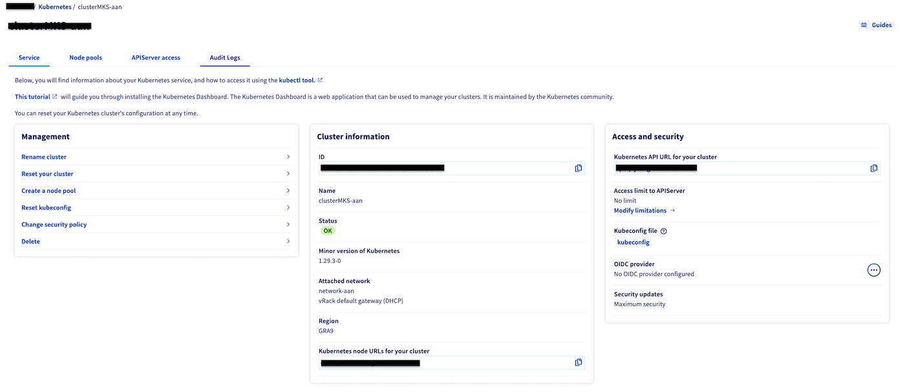
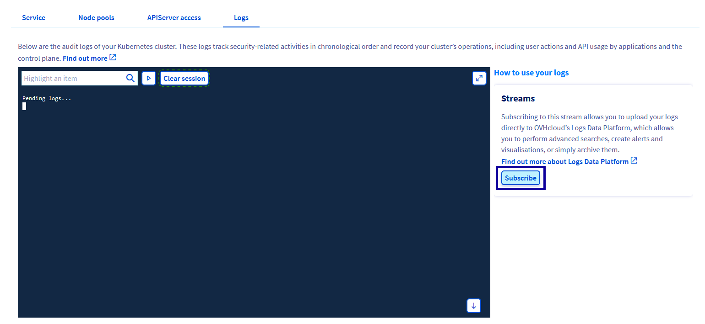
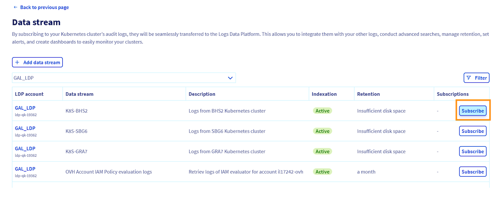

 
## Objective

In this guide, you will learn how to enable the forwarding of audit logs from your OVHcloud Managed Kubernetes Service (MKS) cluster to Logs Data Platform (LDP), a platform that helps you store, archive, query and visualize your logs.
If you want to discover Logs Data Platform before reading this guide, please refer to the [Log Data Platform introduction guide](/pages/manage_and_operate/observability/logs_data_platform/getting_started_introduction_to_LDP).

## Glossary

- **Logs Data Platform:** a fully managed and secured log management platform by OVHcloud. Find more information on the [Logs Data Platform service page](https://www.ovhcloud.com/en-ie/logs-data-platform/).
- **Data Stream:** a logical partition of logs that you create in an LDP account that you will use when ingesting, visualizing or querying your logs. Multiple sources can be stored in the same data stream, and it is the unit for defining a logs pipeline (retention policy, archiving, live streaming...), access rights and alert policies.
- **Logs forwarding:** feature integrated in an OVHcloud product to ingest logs from its services to a *Data Stream* of a LDP account in the same OVHcloud account. The feature has to be enabled by the customer and per service.
- **Logs forwarding Subscription:** when enabling the logs forwarding for a given OVHcloud service to a given LDP *Data Stream*, a *Subscription* is created and attached to the *Data Stream* for further management by the customer.
- **Request Stage and Audit Level:**  audit records begin their lifecycle inside the kube-apiserver component. Each request on each stage of its execution generates an audit event, which is then pre-processed according to the policy defined by the OVHcloud Managed Kubernetes Service. This policy defines which audit events as well as which audit level (meaning which events data) are forwarded through the Audit logs of your Kubernetes cluster. For more details, refer to the [Kubernetes Auditing documentation](https://kubernetes.io/docs/tasks/debug/debug-cluster/audit/).

## Concept

What are audit logs of a Managed Kubernetes cluster?

Managed Kubernetes audit logs provide a security-relevant, chronological set of records documenting the sequence of actions in your cluster.

The cluster audits the activities generated by users, by applications that use the Kubernetes API, and by the control plane itself. Auditing allows cluster administrators to know what happened, when, who initiated it from where, on what did it happen and to where was it going. For further details about cluster audits, refer to the [Kubernetes auditing documentation](https://kubernetes.io/docs/tasks/debug/debug-cluster/audit/).

> [!warning]
> Managed Kubernetes Audit Logs does NOT include logs of your applications running on your Kubernetes pods. If you want to retrieve your data plan logs in one of your Logs Data Platform’s data stream, read this guide: [Pushing logs from a Kubernetes cluster to Logs Data Platform using Fluent Bit](/pages/manage_and_operate/observability/logs_data_platform/ingestion_kubernetes_fluent_bit)

The OVHcloud Managed Kubernetes Service has defined an audit policy, enabling you to retrieve logs pertaining to:

- requests to authorization resources to help troubleshoot authentication issues
- configmap and secret changes in all namespaces at the Metadata audit level
- changes to resources at RequestResponse level (maximum verbosity) to create, patch, update and delete verbs
- changes to resources at Request level for other verbs
- all other requests at the Metadata level

Note:

- No logs for requests by the "system:kube-proxy" on endpoints or services
- Low level of verbosity (level Metadata) for endpoints containing sensitive data like tokenreview
- No logs for any request in the RequestReceived stage
- No logs for health checks and requests for apiserver metrics

For details about information captured in Kubernetes Audit logs you can refer to the [Kubernetes public documentation](https://kubernetes.io/docs/reference/config-api/apiserver-audit.v1/).

Below is an example of an audit log generated by a Kubernetes cluster. *Note the example is not exhaustive.*

```json
{
   "kind":"Event",
   "apiVersion":"audit.k8s.io/v1",
   "level":"Metadata",
   "auditID":"XXXXXXX-XXXX-XXXX-XXXX-XXXXXXXX",
   "stage":"ResponseStarted",
   "requestURI":"/api/v1/namespaces/searching-worker/configmaps?......",
   "verb":"watch",
   "user":{
      "username":"system:node:search-workers-node-81097c",
      "groups":[
         "system:nodes",
         "system:authenticated"
      ]
   },
   "sourceIPs":[
      "10.10.0.43"
   ],
   "userAgent":"kubelet/v1.26.4 (linux/amd64) kubernetes/f89670c",
   "objectRef":{
      "resource":"configmaps",
      "namespace":"searching-worker",
      "name":"kube-root-ca.crt",
      "apiVersion":"v1"
   },
   "responseStatus":{
      "metadata":{

      },
      "code":200
   },
   "requestReceivedTimestamp":"2024-01-01T11:59:06.428015Z",
   "stageTimestamp":"2024-01-01T11:59:06.428962Z",
   "annotations":{
      "authorization.k8s.io/decision":"allow",
      "authorization.k8s.io/reason":""
   }
}
```

## Requirements

To follow this guide, you will need:

- a Logs Data Platform (LDP) account with at least one active *Stream* configured. This guide will walk you through all the necessary steps: [Quick start for Logs Data Platform](/pages/manage_and_operate/observability/logs_data_platform/getting_started_quick_start).
    - If you are not familiar with all the LDP *Stream* configuration possibilities, simply create a new one with the default options (indexing & websocket enabled, long-term storage disabled) for the purpose of this guide.
- an up-and-running Managed Kubernetes Service (MKS) cluster. This guide will walk you through the steps as well.
- Both LDP account and MKS cluster must belong to the same OVHcloud account.

## Instructions

### Enabling Audit Log Forwarding using the OVHcloud Control Panel

#### Step 1 - Access the Audit Logs section of your Managed Kubernetes Service cluster

Log in to the [OVHcloud Control Panel](https://www.ovh.com/auth/?action=gotomanager&from=https://www.ovh.ie/&ovhSubsidiary=ie), go to the `Public Cloud`{.action} section and select the Public Cloud project concerned.

Access the administration UI for your OVHcloud Managed Kubernetes clusters by clicking on `Managed Kubernetes Service`{.action} in the left-hand menu.

{.thumbnail}

Access your MKS cluster details (by clicking on the cluster name in the MKS clusters list) and click the `Audit Logs`{.action} tab.

#### Step 2 - Create a Logs Data Plaform Subscription

In the `Audit Logs`{.action} tab, you can view live audit logs from your cluster.

In order to activate logs forwarding to LDP, simply click the `Subscribe`{.action} button on the right-hand side of your screen.

{.thumbnail}

#### Step 3 - Select your LDP Account and Data stream

From the dropdown list select the LDP Accounts you want, then select the Data Stream you would like to use from the list and click the `Subscribe`{.action} button.

{.thumbnail}

Your subscription is now created and your MKS audit logs are forwarded !

### Enabling Audit Log Forwarding using APIs

You will have to define the targeted *Stream* of one of your LDP account on which you want your logs to be forwarded to. The enablement of the forwarding will create a subscription for this stream id.
Note that the forwarding activation is free of charge, but you will be charged for the usage of the Logs Data Platform service as per standard price plan. For LDP pricing, refer to the [Logs Data Platform product page](https://www.ovhcloud.com/en-ie/logs-data-platform/).

You can retrieve the API specifications in the [OVH API Portal](https://eu.api.ovh.com/console-preview/?section=%2Fdbaas%2Flogs&branch=v1#post-/dbaas/logs/-serviceName-/output/graylog/stream)

#### Step 1 - Retrieve your target Stream (and ID)

List data streams of your Logs Data Platform account:

> [!api]
>
> @api {v1} /cloud GET /dbaas/logs/{serviceName}/output/graylog/stream
>

Get the details of a data stream:

> [!api]
>
> @api {v1} /cloud GET /dbaas/logs/{serviceName}/output/graylog/stream/{streamId}
>

#### Step 2 - Create your subscription

As in the example above, the POST request has a payload containing a streamId, which is the target data stream of your LDP account where you want your Kubernetes cluster Audit logs to be forwarded to. You also need to specify the 'kind' of log you want to forward. Note that the only currently supported value for Managed Kubernetes Service is 'audit' (you can find available kinds using the [dedicated API](https://eu.api.ovh.com/console-preview/?section=%2Fcloud&branch=v1#get-/cloud/project/-serviceName-/capabilities/kube/log/kind) call) :

> [!api]
>
> @api {v1} /cloud POST /cloud/project/{serviceName}/kube/{kubeId}/log/subscription
>

```json
{
  "kind": "string", // The only supported value currently is 'audit'.
  "streamId": "18d602ec-af40-4000-8e59-41ecc8c23f80" // The streamID of the targeted Stream.
}
```

**Result:**
```json
{
  "operationId": "f550aa1c-89ab-4b1a-81ae-4fba4959966f",
  "serviceName": "string"
}
```

So you can use it to retrieve the subscriptionid for further management purposes using Logs Data Platform read operation endpoint:

> [!api]
>
> @api {v1} /cloud GET /cloud/project/{serviceName}/kube/{kubeId}/log/subscription/{subscriptionId}
>

**Result:**

```json
{
  "createdAt": "2024-01-31T15:45:25.286Z",
  "kind": "string",
  "resource": {
    "name": "string",
    "type": "string"
  },
  "serviceName": "string",
  "streamId": "string",
  "subscriptionId": "18d60324-b260-4000-83db-b484f4db6e80",
  "updatedAt": "2024-01-31T15:45:25.286Z"
}
```

### How to use your Kubernetes Audit logs?

Now that your Kubernetes instance Audit logs are ingested and stored in your Logs Data Platform data stream, you can query your logs and build dashboards to have a graphical representation of your logs using the web-based UI of Graylog.

- Through the OVHcloud Control Panel, retrieve the LDP username (ex: logs-xxxx) and its password in your Logs Data Platform account home page. You can refer to the [Quick start for Logs Data Platform](/pages/manage_and_operate/observability/logs_data_platform/getting_started_quick_start) documentation.
- Open the Graylog web-ui. You can retrieve the link in your account home page or using your Access point depending on your account region (for example: Gravelines region is https://gra1.logs.ovh.com/ )
- Log into Graylog using your Logs Data Platform Username and Password
- Search through your logs across the data stream of your Logs Data Platform account. You can refer to [Graylog writing search queries documentation](https://go2docs.graylog.org/4-x/making_sense_of_your_log_data/writing_search_queries.html) for details on search syntax.

Refer to the following documentation: [Logs Data Platform - Visualizing, querying and exploiting your logs](/products/observability-logs-data-platform-visualizing-querying-exploiting) for more details about how to use your logs with Logs Data Platform, including how to:

- setup alerts,
- view the logs in real time through a WebSocket,
- build visualization with OpenSearch Dashboards,
- integrate with OpenSearch API,
- connect with Grafana.
 
### How to manage your subscriptions?

At any point, you can retrieve subscriptions attached to your Logs Data Platform data stream and choose to disable the forwarding by cancelling your subscription on your stream so that your Logs Data Platform stream doesn't receive your audit logs anymore.

Note that this doesn't delete the logs that have been stored prior to the subscription cancellation, as data stored in a logs stream is immutable unless you delete the entire stream.

To delete your subscription you can use the dedicated section in the OVHcloud Control Panel. Go to the `Audit logs`{.action} tab of your MKS cluster and click on `Unsubscribe`{.action} or use the following API route:

> [!api]
>
> @api {v1} /cloud DELETE /cloud/project/{serviceName}/kube/{kubeId}/log/subscription/{subscriptionId}
>

**Result:**

```json
{
  "operationId": "a550aa1c-89ab-4b1a-81ae-4fba4959966c",
  "serviceName": "string"
}
```

## Go further

- If you need training or technical assistance to implement our solutions, contact your sales representative or click on [this link](https://www.ovhcloud.com/en-ie/professional-services/) to get a quote and ask our Professional Services experts for assisting you on your specific use case of your project.

- Join our community of users on <https://community.ovh.com/en/>.
