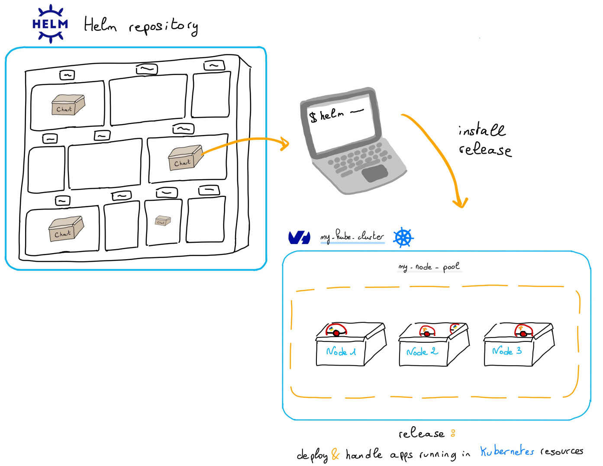

[Helm](https://docs.helm.sh/){.external} is a package manager for Kubernetes. It works with packages of pre-configured Kubernetes resources, called Helm charts. 

With Helm you can:

- find, deploy and manage software in Kubernetes [using a growing catalog of Helm charts in ArtifactHUB](https://artifacthub.io/){.external}
- create and share your own Helm charts

## Before you begin

This tutorial assumes that you already have a working OVHcloud Managed Kubernetes cluster, and some basic knowledge of how to operate it. If you want to know more on those topics, please look at the [OVHcloud Managed Kubernetes Service Quickstart](/pages/public_cloud/containers_orchestration/managed_kubernetes/deploying-hello-world).

We are assuming that you have the `KUBECONFIG` environment variable pointing to your kubectl configuration file, as described in the Quickstarter. If that's not the case, you can use the `--kubeconfig [LOCATION_OF_CONFIG_FILE]` option in both `kubectl` and `helm` commands. 

## Helm concepts

Helm is built around three big concepts: charts, repositories and releases.

{.thumbnail}

A *chart* is a Helm package. Inside the chart you have all the resource definitions necessary to run an application, tool, or service inside of a Kubernetes cluster. It's the Helm equivalent of a Debian pkg for linux, a Maven file for Java or a `package.json` for Node.js.

Charts are stored in *repositories*, where they can be shared. Repositories are the Helm equivalent of the NPM registry for Node.js or Maven Central for Java.

When a chart is installed in a Kubernetes cluster, the running instance is called a *release*. Multiple releases of a single chart can be installed at the same time in a cluster (think for example several instance of the WordPress chart for several different blogs instances running in the cluster). 

## Installing Helm

> [!warning]
> This guide supposes you're using Helm 3, the latest major version of Helm.
> The precedent version, Helm 2, is legacy and considered deprecated.
> If you want to use Helm 2, please refer to the [official documentation](https://v2.helm.sh/)

Install, the Helm CLI in your machine, from a package manager:

> [!tabs]
> Homebrew (macOS)
>> ```console
>> brew install helm
>> ```
> Apt (Debian/Ubuntu)
>> ```console
>> curl https://baltocdn.com/helm/signing.asc | gpg --dearmor | sudo tee /usr/share/keyrings/helm.gpg > /dev/null
>> sudo apt-get install apt-transport-https --yes
>> echo "deb [arch=$(dpkg --print-architecture) signed-by=/usr/share/keyrings/helm.gpg] https://baltocdn.com/helm/stable/debian/ all main" | sudo tee /etc/apt/sources.list.d/helm-stable-debian.list
>> sudo apt-get update
>> sudo apt-get install helm
>> ```
> Scoop (Windows)
>> ```console
>> scoop install helm
>> ```

Or you can install [Helm CLI from the binary releases](https://helm.sh/docs/intro/install/#from-the-binary-releases).

To check if the `helm` CLI is correctly installed locally, you can display its version:

```bash
helm version
```

You can show the installed version:

```console
$ helm version
version.BuildInfo{Version:"v3.14.2", GitCommit:"c309b6f0ff63856811846ce18f3bdc93d2b4d54b", GitTreeState:"clean", GoVersion:"go1.22.0"}
```

## Usage

You installed the Helm CLI in your machine, now you can use it to deploy applications in an OVHcloud Managed Kubernetes cluster.

### Add a Helm Chart Repository

Once you have Helm installed in your machine, you can add a chart repository. The easiest way to begin with Helm is to add the [Bitnami repository](https://github.com/bitnami/charts/):

```bash
helm repo add bitnami https://charts.bitnami.com/bitnami
```

Once the repository added, run `helm repo update` to make sure we get the latest list of charts.

```console
$ helm repo add bitnami https://charts.bitnami.com/bitnami
"bitnami" has been added to your repositories

$ helm repo update
Hang tight while we grab the latest from your chart repositories...
...Successfully got an update from the "bitnami" chart repository
Update Complete. ⎈ Happy Helming!⎈
```

### Install an example chart in an OVHcloud MKS

Let's validate your Helm installation by installing an example chart, the official Redis one, with no persistence, in your OVHcloud Managed Kubernetes cluster:

```bash
helm install test-redis bitnami/redis --set master.persistence.enabled=false
```

This will install the `test-redis` application in the Kubernetes cluster and give you useful commands and parameters for your new Redis database:

```console
$ helm install test-redis bitnami/redis --set master.persistence.enabled=false
NAME: test-redis
LAST DEPLOYED: Tue Mar 12 13:51:24 2024
NAMESPACE: default
STATUS: deployed
REVISION: 1
TEST SUITE: None
NOTES:
CHART NAME: redis
CHART VERSION: 18.19.2
APP VERSION: 7.2.4

** Please be patient while the chart is being deployed **

Redis&reg; can be accessed on the following DNS names from within your cluster:

    test-redis-master.default.svc.cluster.local for read/write operations (port 6379)
    test-redis-replicas.default.svc.cluster.local for read-only operations (port 6379)


To get your password run:

    export REDIS_PASSWORD=$(kubectl get secret --namespace default test-redis -o jsonpath="{.data.redis-password}" | base64 -d)

To connect to your Redis&reg; server:

1. Run a Redis&reg; pod that you can use as a client:

   kubectl run --namespace default redis-client --restart='Never'  --env REDIS_PASSWORD=$REDIS_PASSWORD  --image docker.io/bitnami/redis:7.2.4-debian-12-r9 --command -- sleep infinity

   Use the following command to attach to the pod:

   kubectl exec --tty -i redis-client \
   --namespace default -- bash

2. Connect using the Redis&reg; CLI:
   REDISCLI_AUTH="$REDIS_PASSWORD" redis-cli -h test-redis-master
   REDISCLI_AUTH="$REDIS_PASSWORD" redis-cli -h test-redis-replicas

To connect to your database from outside the cluster execute the following commands:

    kubectl port-forward --namespace default svc/test-redis-master 6379:6379 &
    REDISCLI_AUTH="$REDIS_PASSWORD" redis-cli -h 127.0.0.1 -p 6379

WARNING: There are "resources" sections in the chart not set. Using "resourcesPreset" is not recommended for production. For production installations, please set the following values according to your workload needs:
  - master.resources
  - replica.resources
+info https://kubernetes.io/docs/concepts/configuration/manage-resources-containers/
```

### Verify your Redis

After installing the chart in the MKS cluster, follow the instructions on your console to test your Redis deployment and delete it when your tests are finished.

```console
$ export REDIS_PASSWORD=$(kubectl get secret --namespace default test-redis -o jsonpath="{.data.redis-password}" | base64 -d)

$ kubectl run --namespace default redis-client --restart='Never'  --env REDIS_PASSWORD=$REDIS_PASSWORD  --image docker.io/bitnami/redis:7.2.4-debian-12-r9 --command -- sleep infinity
pod/redis-client created

$ kubectl exec --tty -i redis-client --namespace default -- bash

I have no name!@redis-client:/$ REDISCLI_AUTH="$REDIS_PASSWORD" redis-cli -h test-redis-master
test-redis-master:6379> ping
PONG
test-redis-master:6379> exit
I have no name!@redis-client:/$

I have no name!@redis-client:/$ exit
exit

$ kubectl delete pod redis-client
pod "redis-client" deleted
```

### Cleaning up

To clean up your cluster, simply delete your Redis installation. You can use `helm list` to get the Redis release, in the current namespace, and then use `helm delete [REDIS_RELEASE]` to uninstall it.

```console
$ helm list
NAME      	NAMESPACE	REVISION	UPDATED                             	STATUS  	CHART        	APP VERSION
test-redis	default  	1       	2024-03-12 13:51:24.430156 +0100 CET	deployed	redis-18.19.2	7.2.4

$ helm uninstall test-redis
release "test-redis" uninstalled
```

## Go further

- If you need training or technical assistance to implement our solutions, contact your sales representative or click on [this link](https://www.ovhcloud.com/fr-ca/professional-services/) to get a quote and ask our Professional Services experts for assisting you on your specific use case of your project.

- Join our community of users on <https://community.ovh.com/en/>.
