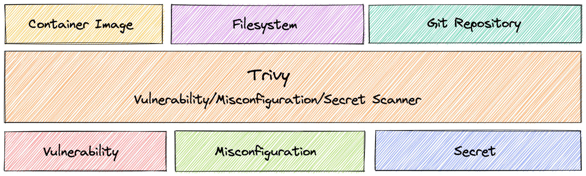

## Objective

[Trivy](https://github.com/aquasecurity/trivy) is a tool that scans for vulnerabilities, secrets and misconfigurations for containers and other artifacts.


Trivy detects vulnerabilities in:

- container images
- filesystems
- Git repositories (a GitHub action exists)
- Kubernetes clusters
- Terraform and CloudFormation Infrastructure as Code (IaC) files
- ...

Trivy also scans hardcoded secrets like passwords, API keys and tokens.



More than a simple Docker container image, Trivy can now scan a wide range of different data like Kubernetes clusters.

For your information, Trivy is a read-only tool, it only retrieves informations in order to help you to secure and sanitize your cluster. It does not modify or delete resources on a Kubernetes cluster.

Read more about [Trivy here](https://aquasecurity.github.io/trivy/v0.28.1/docs/).

At OVHcloud, we like to provide you with the best products and services. For us, security is important, that's why we want to help you discover Trivy which will help you secure your OVHcloud Managed Kubernetes with helpful reports.

In this guide you will:

- Install Trivy CLI
- Generate and export reports
- Install the Trivy Kubernetes Operator

You can use the *Reset cluster* function in the Public Cloud section of the [OVHcloud Control Panel](/links/manager){.external} to reinitialize your cluster before following this tutorial.

## Requirements

This tutorial presupposes that you already have a working OVHcloud Managed Kubernetes cluster, and some basic knowledge of how to operate it.

Moreover, follow the [deploying a Hello World application](/pages/public_cloud/containers_orchestration/managed_kubernetes/deploying-an-application) documentation in order to have an example application running on your cluster.

At this time you should have a running Kubernetes cluster with hello-world deployment and pod like below:

```console
$ kubectl get po,deploy
NAME                                          READY   STATUS    RESTARTS   AGE
pod/hello-world-deployment-559d658ffb-q5t7j   1/1     Running   0          35m

NAME                                     READY   UP-TO-DATE   AVAILABLE   AGE
deployment.apps/hello-world-deployment   1/1     1            1           35m
```

## Instructions

### Installing Trivy CLI

You can [install Trivy](https://aquasecurity.github.io/trivy/latest/getting-started/installation/) CLI on your computer from the binaries, the source, HomeBrew, Arch Linux, Ubuntu, etc. and even use it directly from a Docker image.

For this tutorial you will install it via HomeBrew:

```bash
brew install aquasecurity/trivy/trivy
```

The output should be like this:

```console
$ brew install aquasecurity/trivy/trivy
Running `brew update --preinstall`...
==> Auto-updated Homebrew!
Updated 2 taps (homebrew/core and homebrew/cask).
==> New Formulae
dtrx                                     glider                                   hatch                                    terramate                                yorkie
==> Updated Formulae
Updated 326 formulae.
==> New Casks
bili-downloader                                    roam-research                                      rustdesk                                           swiftcord
==> Updated Casks
Updated 194 casks.
==> Deleted Casks
crystax-ndk

==> Tapping aquasecurity/trivy
Cloning into '/opt/homebrew/Library/Taps/aquasecurity/homebrew-trivy'...
remote: Enumerating objects: 285, done.
remote: Counting objects: 100% (174/174), done.
remote: Compressing objects: 100% (64/64), done.
remote: Total 285 (delta 57), reused 158 (delta 52), pack-reused 111
Receiving objects: 100% (285/285), 40.87 KiB | 747.00 KiB/s, done.
Resolving deltas: 100% (92/92), done.
Tapped 1 formula (12 files, 54.2KB).
==> Downloading https://github.com/aquasecurity/trivy/releases/download/v0.28.1/trivy_0.28.1_macOS-ARM64.tar.gz
==> Downloading from https://objects.githubusercontent.com/github-production-release-asset-2e65be/180687624/f79fc5e4-30f4-461f-be69-598e11d7b81d?X-Amz-Algorithm=AWS4-HMAC-SHA256&X-Amz-Credential=AKIAIWNJY
######################################################################## 100.0%
==> Installing trivy from aquasecurity/trivy
Warning: A newer Command Line Tools release is available.
Update them from Software Update in System Preferences or run:
  softwareupdate --all --install --force

If that doesn't show you any updates, run:
  sudo rm -rf /Library/Developer/CommandLineTools
  sudo xcode-select --install

Alternatively, manually download them from:
  https://developer.apple.com/download/all/.
You should download the Command Line Tools for Xcode 13.3.

🍺  /opt/homebrew/Cellar/trivy/0.28.1: 5 files, 76.1MB, built in 1 second
==> Running `brew cleanup trivy`...
Disable this behaviour by setting HOMEBREW_NO_INSTALL_CLEANUP.
Hide these hints with HOMEBREW_NO_ENV_HINTS (see `man brew`).
```

After the installation, check that the `trivy` CLI is working correctly:

```bash
trivy version
```

You should have a behavior like this:

```console
$ trivy version
Version: 0.50.1
```

Trivy CLI is correctly installed on your computer, you can now use it to scan your Kubernetes cluster and display a report with existing vulnerabilities and misconfigurations.

### Generate Trivy reports

The `trivy` CLI contains several commands and subcommands, here is an extract:

```bash
Scanning Commands
  aws         [EXPERIMENTAL] Scan AWS account
  config      Scan config files for misconfigurations
  filesystem  Scan local filesystem
  image       Scan a container image
  kubernetes  [EXPERIMENTAL] Scan kubernetes cluster
  repository  Scan a repository
  rootfs      Scan rootfs
  sbom        Scan SBOM for vulnerabilities and licenses
  vm          [EXPERIMENTAL] Scan a virtual machine image

Management Commands
  module      Manage modules
  plugin      Manage plugins

Utility Commands
  completion  Generate the autocompletion script for the specified shell
  convert     Convert Trivy JSON report into a different format
  help        Help about any command
  server      Server mode
  version     Print the version
```

As you can see, the `trivy` CLI contains a lot of commands and options, as you can scan vulnerabilities in container images, file systemes, Git repositories, configuration issues, etc. For this tutorial we will focus on the `k8s` command (it's an alias for the `kubernetes` command).

When you execute `trivy k8s`, the command works like the `kubectl` command. So when you execute the CLI, it searches your Kubernetes cluster configuration.

First, you will ask Trivy to generate a summary report only on the `default` namespace.

To generate this report, simply execute the CLI:

```bash
trivy k8s -n default --report summary all
```

This command runs tests on all nodes in the `default` namespace and displays a summary report:

```console
$ trivy k8s -n default --report summary all
5 / 5 [--------------------------------------------------------------------------------------------------------------------------------------------------------------------------------------] 100.00% 2 p/s

Summary Report for kubernetes-admin@my-kube


Workload Assessment
┌───────────┬───────────────────────────────────┬────────────────────┬───────────────────┬───────────────────┐
│ Namespace │             Resource              │  Vulnerabilities   │ Misconfigurations │      Secrets      │
│           │                                   ├───┬───┬────┬───┬───┼───┬───┬───┬───┬───┼───┬───┬───┬───┬───┤
│           │                                   │ C │ H │ M  │ L │ U │ C │ H │ M │ L │ U │ C │ H │ M │ L │ U │
├───────────┼───────────────────────────────────┼───┼───┼────┼───┼───┼───┼───┼───┼───┼───┼───┼───┼───┼───┼───┤
│ default   │ Deployment/hello-world-deployment │ 5 │ 7 │ 20 │ 2 │   │   │ 2 │ 4 │ 9 │   │   │   │   │   │   │
└───────────┴───────────────────────────────────┴───┴───┴────┴───┴───┴───┴───┴───┴───┴───┴───┴───┴───┴───┴───┘
Severities: C=CRITICAL H=HIGH M=MEDIUM L=LOW U=UNKNOWN


Infra Assessment
┌───────────┬──────────┬───────────────────┬───────────────────┬───────────────────┐
│ Namespace │ Resource │  Vulnerabilities  │ Misconfigurations │      Secrets      │
│           │          ├───┬───┬───┬───┬───┼───┬───┬───┬───┬───┼───┬───┬───┬───┬───┤
│           │          │ C │ H │ M │ L │ U │ C │ H │ M │ L │ U │ C │ H │ M │ L │ U │
└───────────┴──────────┴───┴───┴───┴───┴───┴───┴───┴───┴───┴───┴───┴───┴───┴───┴───┘
Severities: C=CRITICAL H=HIGH M=MEDIUM L=LOW U=UNKNOWN


RBAC Assessment
┌───────────┬──────────┬───────────────────┐
│ Namespace │ Resource │  RBAC Assessment  │
│           │          ├───┬───┬───┬───┬───┤
│           │          │ C │ H │ M │ L │ U │
└───────────┴──────────┴───┴───┴───┴───┴───┘
Severities: C=CRITICAL H=HIGH M=MEDIUM L=LOW U=UNKNOWN
```

As you can see, in our `default` namespace, our OVHcloud Managed Kubernetes cluster (and with an "hello world" application deployed) has several vulnerabilities and misconfigurations.

We will take a closer look at theses vulnerabilities and misconfigurations. For that, you will ask Trivy to generate a full report, still in the `default` namespace.

To generate this full report, simply execute the CLI:

```bash
trivy k8s -n default --report=all all
```

You should obtain a report and a list of vulnerabilities and misconfigurations like this:

```console
$ trivy k8s -n default --report=all all

5 / 5 [--------------------------------------------------------------------------------------------------------------------------------------------------------------------------------------] 100.00% 2 p/s

namespace: default, deployment: hello-world-deployment

Total: 34 (UNKNOWN: 0, LOW: 2, MEDIUM: 20, HIGH: 7, CRITICAL: 5)

┌───────────────┬────────────────┬──────────┬────────┬───────────────────┬───────────────┬──────────────────────────────────────────────────────────────┐
│    Library    │ Vulnerability  │ Severity │ Status │ Installed Version │ Fixed Version │                            Title                             │
├───────────────┼────────────────┼──────────┼────────┼───────────────────┼───────────────┼──────────────────────────────────────────────────────────────┤
│ libbz2        │ CVE-2019-12900 │ CRITICAL │ fixed  │ 1.0.6-r6          │ 1.0.6-r7      │ bzip2: out-of-bounds write in function BZ2_decompress        │
│               │                │          │        │                   │               │ https://avd.aquasec.com/nvd/cve-2019-12900                   │
├───────────────┼────────────────┼──────────┤        ├───────────────────┼───────────────┼──────────────────────────────────────────────────────────────┤
│ libcrypto1.0  │ CVE-2018-0734  │ MEDIUM   │        │ 1.0.2p-r0         │ 1.0.2q-r0     │ openssl: timing side channel attack in the DSA signature     │
│               │                │          │        │                   │               │ algorithm                                                    │
│               │                │          │        │                   │               │ https://avd.aquasec.com/nvd/cve-2018-0734                    │
│               ├────────────────┤          │        │                   │               ├──────────────────────────────────────────────────────────────┤
│               │ CVE-2018-5407  │          │        │                   │               │ openssl: Side-channel vulnerability on SMT/Hyper-Threading   │
│               │                │          │        │                   │               │ architectures (PortSmash)                                    │
│               │                │          │        │                   │               │ https://avd.aquasec.com/nvd/cve-2018-5407                    │
│               ├────────────────┤          │        │                   ├───────────────┼──────────────────────────────────────────────────────────────┤
│               │ CVE-2019-1547  │          │        │                   │ 1.0.2t-r0     │ openssl: side-channel weak encryption vulnerability          │
│               │                │          │        │                   │               │ https://avd.aquasec.com/nvd/cve-2019-1547                    │
│               ├────────────────┤          │        │                   ├───────────────┼──────────────────────────────────────────────────────────────┤
│               │ CVE-2019-1551  │          │        │                   │ 1.0.2u-r0     │ openssl: Integer overflow in RSAZ modular exponentiation on  │
│               │                │          │        │                   │               │ x86_64                                                       │
│               │                │          │        │                   │               │ https://avd.aquasec.com/nvd/cve-2019-1551                    │
│               ├────────────────┤          │        │                   ├───────────────┼──────────────────────────────────────────────────────────────┤
│               │ CVE-2019-1559  │          │        │                   │ 1.0.2r-r0     │ openssl: 0-byte record padding oracle                        │
│               │                │          │        │                   │               │ https://avd.aquasec.com/nvd/cve-2019-1559                    │
│               ├────────────────┼──────────┤        │                   ├───────────────┼──────────────────────────────────────────────────────────────┤
│               │ CVE-2019-1563  │ LOW      │        │                   │ 1.0.2t-r0     │ openssl: information disclosure in PKCS7_dataDecode and      │
│               │                │          │        │                   │               │ CMS_decrypt_set1_pkey                                        │
│               │                │          │        │                   │               │ https://avd.aquasec.com/nvd/cve-2019-1563                    │
├───────────────┼────────────────┼──────────┤        ├───────────────────┼───────────────┼──────────────────────────────────────────────────────────────┤
...
...
├───────────────┼────────────────┼──────────┤        ├───────────────────┼───────────────┼──────────────────────────────────────────────────────────────┤
│ musl          │ CVE-2019-14697 │ CRITICAL │        │ 1.1.19-r10        │ 1.1.19-r11    │ musl libc through 1.1.23 has an x87 floating-point stack     │
│               │                │          │        │                   │               │ adjustment im ......                                         │
│               │                │          │        │                   │               │ https://avd.aquasec.com/nvd/cve-2019-14697                   │
├───────────────┤                │          │        │                   │               │                                                              │
│ musl-utils    │                │          │        │                   │               │                                                              │
│               │                │          │        │                   │               │                                                              │
│               │                │          │        │                   │               │                                                              │
└───────────────┴────────────────┴──────────┴────────┴───────────────────┴───────────────┴──────────────────────────────────────────────────────────────┘


namespace: default, deployment: hello-world-deployment (kubernetes)

Tests: 135 (SUCCESSES: 120, FAILURES: 15, EXCEPTIONS: 0)
Failures: 15 (UNKNOWN: 0, LOW: 9, MEDIUM: 4, HIGH: 2, CRITICAL: 0)

MEDIUM: Container 'hello-world' of Deployment 'hello-world-deployment' should set 'securityContext.allowPrivilegeEscalation' to false
════════════════════════════════════════════════════════════════════════════════════════════════════════════════════════════════════════════════════════════════════════════════════════════════════════════
A program inside the container can elevate its own privileges and run as root, which might give the program control over the container and node.

See https://avd.aquasec.com/misconfig/ksv001
────────────────────────────────────────────────────────────────────────────────────────────────────────────────────────────────────────────────────────────────────────────────────────────────────────────
 namespace: default, deployment: hello-world-deployment:20-23
────────────────────────────────────────────────────────────────────────────────────────────────────────────────────────────────────────────────────────────────────────────────────────────────────────────
  20 ┌                 - image: ovhplatform/hello
  21 │                   name: hello-world
  22 │                   ports:
  23 └                     - containerPort: 80
────────────────────────────────────────────────────────────────────────────────────────────────────────────────────────────────────────────────────────────────────────────────────────────────────────────
...
...
HIGH: deployment hello-world-deployment in default namespace should not set spec.template.spec.containers.ports.containerPort to less than 1024
════════════════════════════════════════════════════════════════════════════════════════════════════════════════════════════════════════════════════════════════════════════════════════════════════════════
The ports which are lower than 1024 receive and transmit various sensitive and privileged data. Allowing containers to use them can bring serious implications.

See https://avd.aquasec.com/misconfig/ksv117
────────────────────────────────────────────────────────────────────────────────────────────────────────────────────────────────────────────────────────────────────────────────────────────────────────────
```

The report can be very big. So, in order to take a look at our vulnerabilities and misconfigurations in a new report, you can also display only URGENT vulnerabilities:

```console
$ trivy k8s --namespace default --report=all all --severity MEDIUM,HIGH,CRITICAL
5 / 5 [--------------------------------------------------------------------------------------------------------------------------------------------------------------------------------------] 100.00% 2 p/s

namespace: default, deployment: hello-world-deployment

Total: 32 (MEDIUM: 20, HIGH: 7, CRITICAL: 5)

...

namespace: default, deployment: hello-world-deployment (kubernetes)

Tests: 75 (SUCCESSES: 69, FAILURES: 6, EXCEPTIONS: 0)
Failures: 6 (MEDIUM: 4, HIGH: 2, CRITICAL: 0)

MEDIUM: Container 'hello-world' of Deployment 'hello-world-deployment' should set 'securityContext.allowPrivilegeEscalation' to false
════════════════════════════════════════════════════════════════════════════════════════════════════════════════════════════════════════════════════════════════════════════════════════════════════════════
A program inside the container can elevate its own privileges and run as root, which might give the program control over the container and node.

See https://avd.aquasec.com/misconfig/ksv001
────────────────────────────────────────────────────────────────────────────────────────────────────────────────────────────────────────────────────────────────────────────────────────────────────────────
 namespace: default, deployment: hello-world-deployment:20-23
────────────────────────────────────────────────────────────────────────────────────────────────────────────────────────────────────────────────────────────────────────────────────────────────────────────
  20 ┌                 - image: ovhplatform/hello
  21 │                   name: hello-world
  22 │                   ports:
  23 └                     - containerPort: 80
────────────────────────────────────────────────────────────────────────────────────────────────────────────────────────────────────────────────────────────────────────────────────────────────────────────
...
...


MEDIUM: container "hello-world" of deployment "hello-world-deployment" in "default" namespace should specify a seccomp profile
════════════════════════════════════════════════════════════════════════════════════════════════════════════════════════════════════════════════════════════════════════════════════════════════════════════
A program inside the container can bypass Seccomp protection policies.

See https://avd.aquasec.com/misconfig/ksv104
────────────────────────────────────────────────────────────────────────────────────────────────────────────────────────────────────────────────────────────────────────────────────────────────────────────


HIGH: deployment hello-world-deployment in default namespace should not set spec.template.spec.containers.ports.containerPort to less than 1024
════════════════════════════════════════════════════════════════════════════════════════════════════════════════════════════════════════════════════════════════════════════════════════════════════════════
The ports which are lower than 1024 receive and transmit various sensitive and privileged data. Allowing containers to use them can bring serious implications.

See https://avd.aquasec.com/misconfig/ksv117
────────────────────────────────────────────────────────────────────────────────────────────────────────────────────────────────────────────────────────────────────────────────────────────────────────────
```

And, finally, for this part, you can also scan only a specific resource, only a specific deployment for example:

```
trivy k8s --namespace default --report=summary deployments/hello-world-deployment
```

You should obtain a result like this:

```console
$ trivy k8s --namespace default --report=summary deployments/hello-world-deployment
1 / 1 [--------------------------------------------------------------------------------------------------------------------------------------------------------------------------------------] 100.00% 0 p/s

Summary Report for kubernetes-admin@my-kube


Workload Assessment
┌───────────┬───────────────────────────────────┬────────────────────┬───────────────────┬───────────────────┐
│ Namespace │             Resource              │  Vulnerabilities   │ Misconfigurations │      Secrets      │
│           │                                   ├───┬───┬────┬───┬───┼───┬───┬───┬───┬───┼───┬───┬───┬───┬───┤
│           │                                   │ C │ H │ M  │ L │ U │ C │ H │ M │ L │ U │ C │ H │ M │ L │ U │
├───────────┼───────────────────────────────────┼───┼───┼────┼───┼───┼───┼───┼───┼───┼───┼───┼───┼───┼───┼───┤
│ default   │ Deployment/hello-world-deployment │ 5 │ 7 │ 20 │ 2 │   │   │ 2 │ 4 │ 9 │   │   │   │   │   │   │
└───────────┴───────────────────────────────────┴───┴───┴────┴───┴───┴───┴───┴───┴───┴───┴───┴───┴───┴───┴───┘
Severities: C=CRITICAL H=HIGH M=MEDIUM L=LOW U=UNKNOWN


Infra Assessment
┌───────────┬──────────┬───────────────────┬───────────────────┬───────────────────┐
│ Namespace │ Resource │  Vulnerabilities  │ Misconfigurations │      Secrets      │
│           │          ├───┬───┬───┬───┬───┼───┬───┬───┬───┬───┼───┬───┬───┬───┬───┤
│           │          │ C │ H │ M │ L │ U │ C │ H │ M │ L │ U │ C │ H │ M │ L │ U │
└───────────┴──────────┴───┴───┴───┴───┴───┴───┴───┴───┴───┴───┴───┴───┴───┴───┴───┘
Severities: C=CRITICAL H=HIGH M=MEDIUM L=LOW U=UNKNOWN


RBAC Assessment
┌───────────┬──────────┬───────────────────┐
│ Namespace │ Resource │  RBAC Assessment  │
│           │          ├───┬───┬───┬───┬───┤
│           │          │ C │ H │ M │ L │ U │
└───────────┴──────────┴───┴───┴───┴───┴───┘
Severities: C=CRITICAL H=HIGH M=MEDIUM L=LOW U=UNKNOWN
```

### Export reports locally

You can generate and save a report, for all your namespaces, with the `-o` command

```bash
trivy k8s -A --report=summary all -o trivy-report.txt
```

This will save the report in your working directory:

```console
$ trivy k8s -A --report=summary all -o trivy-report.txt

94 / 94 [------------------------------------------------------------------------------------------------------------------------------------------------------------------------------------] 100.00% 3 p/s

$ ls -l trivy-report.txt
-rw-r--r--  1 avache  staff  7933 11 avr 14:02 trivy-report.txt
```

### Installing Trivy Kubernetes Operator

Trivy can also be run as a native Kubernetes Operator, which is designed to be used in CI/CD pipelines.

This Kubernetes Operator continuously scans your Kubernetes cluster for security issues, and generates security reports as Kubernetes Custom Resources. It watches Kubernetes for state changes and automatically triggers scans in response to changes, for example initiating a vulnerability scan when a new Pod is created.

For this tutorial we are using the [Trivy Helm chart](https://github.com/aquasecurity/trivy/tree/main/helm/trivy).

Add the Trivy Helm repository:

```bash
helm repo add aqua https://aquasecurity.github.io/helm-charts/
helm repo update
```

These commands will add the Trivy Helm repository to your local Helm chart repository and update the installed chart repositories:

```console
$ helm repo add aqua https://aquasecurity.github.io/helm-charts/
helm repo update
"aqua" has been added to your repositories
Hang tight while we grab the latest from your chart repositories...
...Successfully got an update from the "aqua" chart repository
Update Complete. ⎈Happy Helming!⎈
```

Install the latest version of Trivy with `helm install` command:

```bash
helm install trivy-operator aqua/trivy-operator \
   --namespace trivy-system \
   --create-namespace \
   --set="trivy.ignoreUnfixed=true"
```

This command will install the latest version of the Trivy Kubernetes Operator, create a new `trivy-system` namespace and configure it to scan all namespaces, except kube-system and trivy-system:

```console
$ helm install trivy-operator aqua/trivy-operator \
   --namespace trivy-system \
   --create-namespace \
   --set="trivy.ignoreUnfixed=true"
NAME: trivy-operator
LAST DEPLOYED: Thu Apr 11 14:03:59 2024
NAMESPACE: trivy-system
STATUS: deployed
REVISION: 1
TEST SUITE: None
NOTES:
You have installed Trivy Operator in the trivy-system namespace.
It is configured to discover Kubernetes workloads and resources in
all namespace(s).

Inspect created VulnerabilityReports by:

    kubectl get vulnerabilityreports --all-namespaces -o wide

Inspect created ConfigAuditReports by:

    kubectl get configauditreports --all-namespaces -o wide

Inspect the work log of trivy-operator by:

    kubectl logs -n trivy-system deployment/trivy-operator
```

You can check if the Trivy pod is correctly running:

```console
$ kubectl get pod -n trivy-system
NAME                              READY   STATUS    RESTARTS   AGE
trivy-operator-84b86599cb-tzmg4   1/1     Running   0          89s
```

Now you can inspect `VulnerabilityReports` for all your namespaces, with the following command:

```bash
kubectl get vulnerabilityreports --all-namespaces -o wide
```

You should obtain a result like this:

```console
$ kubectl get vulnerabilityreports --all-namespaces -o wide
NAMESPACE       NAME                                                          REPOSITORY                               TAG                                        SCANNER   AGE   CRITICAL   HIGH   MEDIUM   LOW   UNKNOWN
default         replicaset-hello-world-deployment-c7584d4f5-hello-world       ovhplatform/hello                        latest                                     Trivy     34s   5          7      20       2     0
...
...
```

You can check your deployments for several critical, high, medium and low vulnerabilities.

The Kubernetes operator also generates `ConfigAuditReports`:

```
kubectl get configauditreports --all-namespaces -o wide
```

You should obtain a result like this:

```console
$ kubectl get configauditreports --all-namespaces -o wide
NAMESPACE       NAME                                                SCANNER   AGE     CRITICAL   HIGH   MEDIUM   LOW
default         replicaset-hello-world-deployment-c7584d4f5         Trivy     2m56s   0          3      4        9
default         service-hello-world                                 Trivy     3m50s   0          0      0        0
default         service-kubernetes                                  Trivy     3m44s   0          0      0        0
...
```

Thanks to the Kubernetes Operator, it's possible to integrate Trivy into your CI/CD pipeline to check cluster vulnerabilities and misconfiguration issues.
It thus allows you to automate a way to access reports, export the metrics from the vulnerability reports into Prometheus, add dashboards into Grafana, set up alerting, etc.

## Go further

- If you need training or technical assistance to implement our solutions, contact your sales representative or click on [this link](https://www.ovhcloud.com/fr/professional-services/) to get a quote and ask our Professional Services experts for assisting you on your specific use case of your project.

- Join our community of users on <https://community.ovh.com/en/>.
