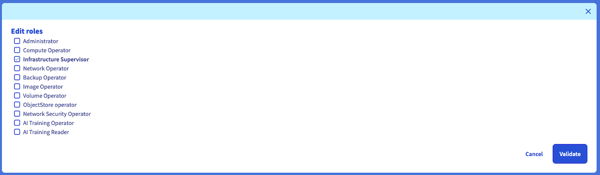

## Objective

This tutorial show you how to configure the Prometheus operator to monitor static exporter, OVHcloud VPS, OVHcloud dedicated servers or Public Cloud OpenStack instances.

## Before you begin

This tutorial presupposes the following:

- That you already have a working Prometheus operator running on an OVHcloud Managed Kubernetes cluster. If you want to know more on those topics, take a look at the [Monitoring apps with Prometheus and Grafana on an OVHcloud Managed Kubernetes Service](https://help.ovhcloud.com/csm/en-ie-public-cloud-kubernetes-monitoring-apps-prometheus-grafana?id=kb_article_view&sysparm_article=KB0049902) tutorial
- That you have retrieved the `kubeconfig.yml` file [matching your Kubernetes cluster](https://help.ovhcloud.com/csm/en-public-cloud-kubernetes-configure-kubectl?id=kb_article_view&sysparm_article=KB0049661)
- That you have exported the KUBECONFIG environment variable to your `kubeconfig.yml` file
- That a node exporter agent is listening on the instances you want to monitor on public IP and port 9100

> [!warning]
> **Important information:**
>
> This node exporter process should be secured, this is not the subject of this tutorial.

> [!warning]
> **Important information:**
>
> Use at least the version `0.75.1` of the Prometheus operator [prometheus-community/kube-prometheus-stack](https://github.com/prometheus-community/helm-charts). You can use the option `--set prometheusOperator.image.tag="v0.75.1"` when installing the chart to set it.

> [!primary]
>
> This tutorial use as an example a node-exporter to scrape but it can be adapted to any exporter, by adjusting the IP and listening port.

In the next step, you need the release name of your chart. To get it, just use the following command:

```console
helm list -A
NAME                                NAMESPACE     REVISION    UPDATED                                 STATUS      CHART                           APP VERSION
kube-prometheus-stack-1720169205    prometheus    1           2024-07-05 10:47:00.03314 +0200 CEST    deployed    kube-prometheus-stack-61.2.0    v0.75.0
```

Here the release name is `kube-prometheus-stack-1720169205`, referenced in the next steps under the form `<release_name>`.

## Instructions

### Generate the configuration for static exporter

Let's assume you want to scrape the following exporter `prometheus.demo.do.prometheus.io:9090`.

Create a file named `static.yaml` with the following content:

```yaml
apiVersion: monitoring.coreos.com/v1alpha1
kind: ScrapeConfig
metadata:
    name: static-config
    namespace: prometheus
    labels:
        release: <release_name>
spec:
    staticConfigs:
        - labels:
              job: prometheus
          targets:
              - prometheus.demo.do.prometheus.io:9090
```

apply this custom resource (CR) using the following command:

```console
$ kubectl apply -f static.yaml
scrapeconfig.monitoring.coreos.com/static-config created

$ kubectl get -A scrapeconfig -n prometheus
NAMESPACE    NAME            AGE
prometheus   static-config   7m51s
```

It could take a couple of minutes before reloading the Prometheus configuration automatically.

After a few minutes, by checking the Prometheus targets HTTP interface, you should be able to observe something like this inside the Prometheus User Interface (UI):

{.thumbnail}

### Generate the configuration for OpenStack

Create a **dedicated** user inside your PCI project with the `Infrastructure Supervisor` role.

{.thumbnail}

{.thumbnail}

Create a file `openstack_user_password.yaml` with the following content:

```yaml
apiVersion: v1
kind: Secret
metadata:
    name: openstack-user-password
    namespace: prometheus
type: Opaque
stringData:
    password: <user_password>
```

Apply this secret to your Prometheus namespace inside your Kubernetes cluster with the following command:

```bash
kubectl apply -f openstack_user_password.yaml -n prometheus
```

Retrieve your OpenStack user info from the command-line tool (refer to https://help.ovhcloud.com/csm/fr-public-cloud-compute-set-openstack-environment-variables?id=kb_article_view&sysparm_article=KB0050935) for the region you want to scrape. This example use GRA11 region.

{.thumbnail}

```console
$ source openrc.sh
Enter your OpenStack Password:

$ openstack user show user-xxxxxxx
+---------------------+----------------------------------+
| Field               | Value                            |
+---------------------+----------------------------------+
| default_project_id  | <project_id>                     |
| description         | Prometheus Operator.             |
| domain_id           | default                          |
| enabled             | True                             |
| id                  | <user_id>                        |
| name                | user-xxxxxxx                     |
| options             | {}                               |
| password_expires_at | None                             |
+---------------------+----------------------------------+
```

The `id` is used as `userid` in the openstack_sd_config

Create a file named openstack.yaml with the following content:

```yaml
apiVersion: monitoring.coreos.com/v1alpha1
kind: ScrapeConfig
metadata:
    name: openstack-sd-config
    namespace: prometheus
    labels:
        release: <release_name>
spec:
    openstackSDConfigs:
        - role: instance
          # specify the PCI region to scrape
          region: "GRA11"
          identityEndpoint: "https://auth.cloud.ovh.net/v3"
          # userid can be found using the previously exposed command
          userid: "<user_id>"
          # password is exposed at user creation and can be reset from the OVHcloud Manager
          password:
              name: openstack-user-password
              key: password
    relabelings:
        # This section is used to keep only IPv4 IPs to avoid double scrape with IPv6
        - sourceLabels: [__address__]
          action: keep
          regex: ^((25[0-5]|(2[0-4]|1\d|[1-9]|)\d)\.?\b){4}:\d{1,5}$
        # This section is to force the listen port of the exporter to 9100
        - sourceLabels: [__address__]
          action: replace
          regex: "(.*)((?::))(?:[0-9]+)$"
          replacement: $1:9100
          targetLabel: __address__
```

For more information, refer to [the official Prometheus documentation](https://prometheus.io/docs/prometheus/latest/configuration/configuration/#openstack_sd_config).

Apply this CR using the following command:

```console
$ kubectl apply -f openstack.yaml
scrapeconfig.monitoring.coreos.com/openstack-sd-config created

$ kubectl get -A scrapeconfig -n prometheus
NAMESPACE    NAME                  AGE
prometheus   openstack-sd-config   20s
prometheus   static-config         8m7s
```

It could take a couple of minutes before reloading the Prometheus configuration automatically.

After a few minutes, by checking the Prometheus targets HTTP interface, you should be able to observe something like this inside the Prometheus UI:

{.thumbnail}

### Generate the configuration for OVHcloud VPS

Create a **dedicated** _script credentials_ as [described here](https://github.com/ovh/go-ovh#supported-apis) as follow:

{.thumbnail}

> [!warning]
> **Important information:**
>
> Subject is not covered in this tutorial but you **should** restrict the API routes the token have access to.

Create a file named `ovhcloud_api_credentials.yaml` containing your API secrets:

```yaml
apiVersion: v1
kind: Secret
metadata:
    name: ovhcloud-api-credentials
    namespace: prometheus
type: Opaque
stringData:
    consumerKey: xxxxxxxxxxxxxxxxxxxxxxxxx
    applicationSecret: xxxxxxxxxxxxxxxxxxxxxxxxxx
```

Apply this secret to your Prometheus namespace inside your Kubernetes cluster with the following command:

```bash
kubectl apply -f ovhcloud_api_credentials.yaml -n prometheus
```

Create a file named `ovhcloud.yaml` with the following content:

```yaml
apiVersion: monitoring.coreos.com/v1alpha1
kind: ScrapeConfig
metadata:
    name: ovhcloud
    namespace: prometheus
    labels:
        release: <release_name>
spec:
    ovhcloudSDConfigs:
        - applicationKey: "xxxxxxxxxxxxxxxx"
          applicationSecret:
              name: ovhcloud-api-credentials
              key: applicationSecret
          consumerKey:
              name: ovhcloud-api-credentials
              key: consumerKey
          service: "VPS"
          endpoint: "ovh-eu"
    relabelings:
        - sourceLabels: [__address__]
          action: replace
          regex: ([^:]+)(?::\d+)?
          replacement: $1:9100
          targetLabel: __address__
```

For more information, please refer to [the official Prometheus documentation](https://prometheus.io/docs/prometheus/latest/configuration/configuration/#ovhcloud_sd_config).

apply this CR using the following command:

```console
$ kubectl apply -f ovhcloud.yaml
scrapeconfig.monitoring.coreos.com/ovhcloud created

$ kubectl get -A scrapeconfig -n prometheus
NAMESPACE    NAME                  AGE
prometheus   openstack-sd-config   6m44s
prometheus   ovhcloud              14s
prometheus   static-config         14m
```

It could take a couple of minutes before reloading the Prometheus configuration automatically.

After a few minutes, by checking the Prometheus targets HTTP interface, you should be able to observe something like this inside the Prometheus UI:

{.thumbnail}

## Go further

For more information, please read the following links

- [Scrape configuration Custom Resource documentation](https://prometheus-operator.dev/docs/developer/scrapeconfig/)
- [Prometheus operator ScrapeConfig API Reference](https://prometheus-operator.dev/docs/api-reference/api/#monitoring.coreos.com/v1alpha1.ScrapeConfigSpec)
- [Prometheus operator StaticConfig API Reference](https://prometheus-operator.dev/docs/api-reference/api/#monitoring.coreos.com/v1alpha1.StaticConfig)
- [Prometheus operator OpenStackSDConfig API Reference](https://prometheus-operator.dev/docs/api-reference/api/#monitoring.coreos.com/v1alpha1.OpenStackSDConfig)
- [Prometheus operator OVHCloudSDConfig API Reference](https://prometheus-operator.dev/docs/api-reference/api/#monitoring.coreos.com/v1alpha1.OVHCloudSDConfig)
