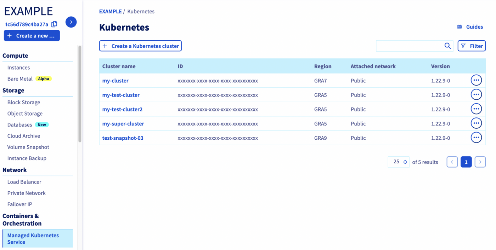
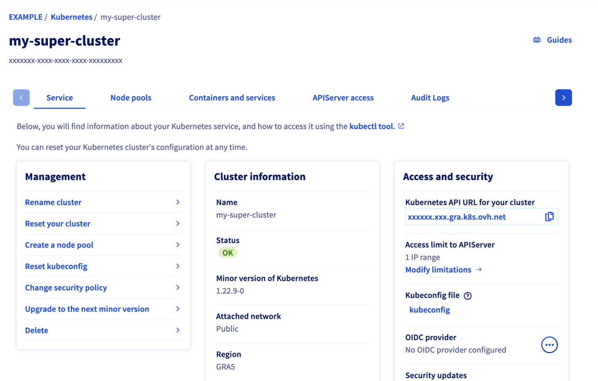
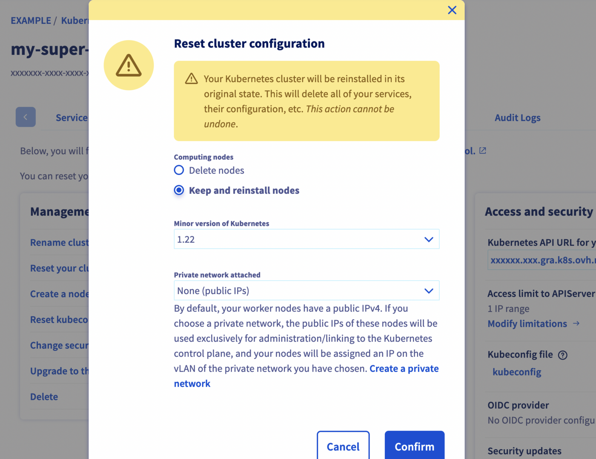
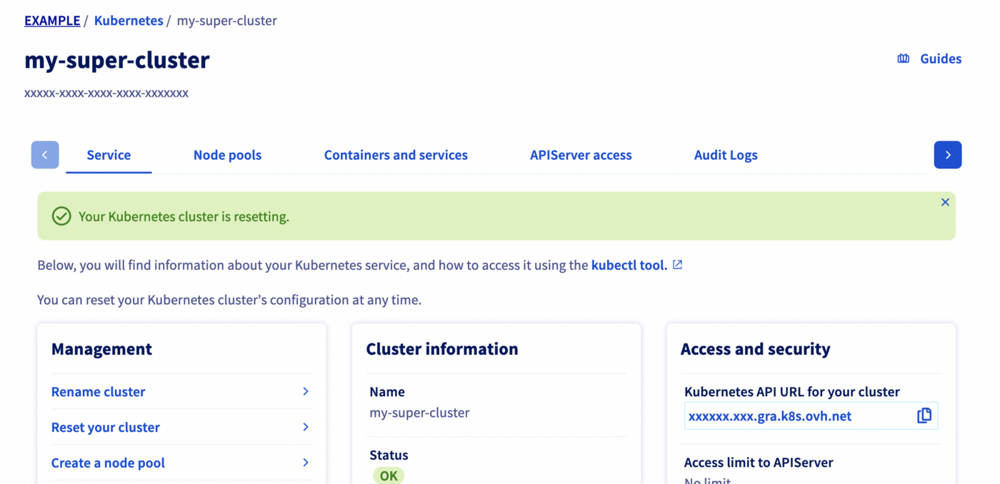
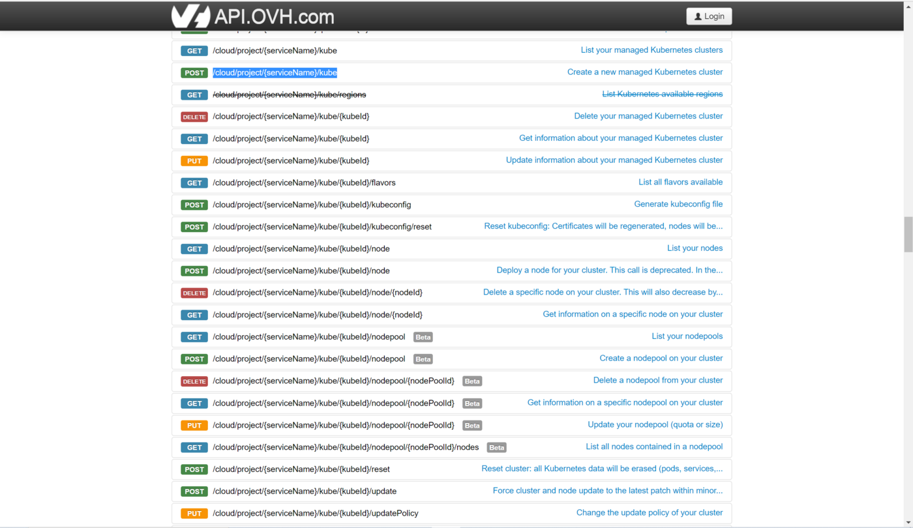

<style>
 pre {
     font-size: 14px;
 }
 pre.console {
   background-color: #300A24; 
   color: #ccc;
   font-family: monospace;
   padding: 5px;
   margin-bottom: 5px;
 }
 pre.console code {
   border: solid 0px transparent;
   font-family: monospace !important;
 }
 .small {
     font-size: 0.75em;
 }
</style>

## Objective

OVHcloud Managed Kubernetes service provides you Kubernetes clusters without the hassle of installing or operating them.

Through the OVHcloud Control Panel and the API, you can reset your OVHcloud Managed Kubernetes cluster.

> [!primary]
>
> During a reset, all data in the ETCD will be deleted (pods, deployments, services, secrets, CRDs, etc.). Similarly, load balancers and also all PVC (Persistent Volume Claim) with their PCI cinder volumes will be deleted.
> Nodes will be either deleted or reinstalled (depending on the option you set during the reset).

The whole cluster configuration is reset but some values can be defined (optional):

- workerNodesPolicy: reinstall|delete
- minor_version: for ex. 1.25
- updatePolicy: "ALWAYS_UPDATE" by default
- customization: API Server & kube proxy configuration
- privateNetworkId: private network openstack UUID
- privateNetworkConfiguration: true|false
- defaultVrackGateway: gateway IP
- kubeProxyMode: ipvs|iptables

## Requirements

- an OVHcloud Managed Kubernetes cluster

## Instructions

### Reset a Kubernetes cluster on the OVHcloud Control Panel

#### Step 1 - Ask for cluster reset on the OVHcloud Control Panel 

Log in to the [OVHcloud Control Panel](https://www.ovh.com/auth/?action=gotomanager&from=https://www.ovh.pl/&ovhSubsidiary=pl), go to the `Public Cloud`{.action} section and select the Public Cloud project concerned.

Access the administration UI for your OVHcloud Managed Kubernetes clusters by clicking on `Managed Kubernetes Service`{.action} in the left-hand menu.

{.thumbnail}

Click on your Kubernetes cluster.

{.thumbnail}

In the *Service* tab of the administration UI, click on *Reset your cluster*.

#### Step 2 - Choose the type of reset you want

You have two options on the reset menu, *Delete* and *Reinstall*. 

- Choosing *Delete nodes* means that the current cluster nodes are deleted, and the cluster is reinitialized to an empty state.

- Choosing *Keep and reinstall nodes* means that the cluster is reinitialized without destroying the nodes.

{.thumbnail}

You can also choose the minor version of the cluster and the private network attached.

Click on the `Confirm`{.action} button to continue.

#### Step 3 - Wait for the resetting to end 

Depending on the chosen kind of reset, the process can take several minutes. During that time, a message on the manager warns you that the cluster is under resetting:

{.thumbnail}

### Reset a Kubernetes cluster through the API

#### The API Explorer

To simplify things, we are using the [API Explorer](https://api.ovh.com/) which allows to explore, learn and interact with the API in an interactive way.

Log in to the API Explorer using your OVHcloud NIC handle.

{.thumbnail}

If you go to the [Kubernetes section](https://api.ovh.com/console/#/cloud/project/%7BserviceName%7D/kube~GET) of the API Explorer, you will see the available endpoints:

{.thumbnail}

#### API endpoints

- Reset a Kubernetes cluster:

> [!api]
>
> @api {v1} /cloud POST /cloud/project/{serviceName}/kube/{kubeId}/reset
>

**Input:**
```json
{
  "name": "my-test-cluster",
  "updatePolicy": "ALWAYS_UPDATE",
  "version": "1.25"
}
```

**Result:**
```json
null
```

By default, if you don't specify it, the `workerNodesPolicy` option will be equivalent to `delete`. If you don't want your Nodes deleted but reinstalled instead, you have to specify `"workerNodesPolicy": "reinstall"`.

> [!primary]
>
> You should receive a response with `null` content. This message will be improved in the future with the same information you have after a Kubernetes cluster creation.

- Check the Kubernetes cluster is resetting:

> [!api]
>
> @api {v1} /cloud GET /cloud/project/{serviceName}/kube/{kubeId}
>

**Result:**
```json
{
  "id": "xxxxxxxx-xxxx-xxxx-xxxx-xxxxxxxxxx",
  "region": "GRA5",
  "name": "my-test-cluster",
  "url": "xxxxxx.xx.gra.k8s.ovh.net",
  "nodesUrl": "xxxxxx.nodes.c1.gra.k8s.ovh.net",
  "version": "1.25.4-2",
  "nextUpgradeVersions": [],
  "kubeProxyMode": "iptables",
  "customization": {
    "apiServer": {
      "admissionPlugins": {
        "enabled": [
          "AlwaysPullImages",
          "NodeRestriction"
        ],
        "disabled": []
      }
    }
  },
  "status": "REDEPLOYING",
  "updatePolicy": "ALWAYS_UPDATE",
  "isUpToDate": true,
  "controlPlaneIsUpToDate": true,
  "privateNetworkId": null,
  "createdAt": "2023-03-21T10:53:35Z",
  "updatedAt": "2023-03-22T09:16:34Z"
}
```

## Go further

To have an overview of OVHcloud Managed Kubernetes service, you can go to the [OVHcloud Managed Kubernetes page](https://www.ovhcloud.com/pl/public-cloud/kubernetes/).

Otherwise to skip it and learn more about using your Kubernetes cluster the practical way, we invite you to look at our [tutorials](/products/public-cloud-containers-orchestration-managed-kubernetes-k8s).

- If you need training or technical assistance to implement our solutions, contact your sales representative or click on [this link](https://www.ovhcloud.com/pl/professional-services/) to get a quote and ask our Professional Services experts for assisting you on your specific use case of your project.

- Join our [community of users](https://community.ovh.com/en/).
