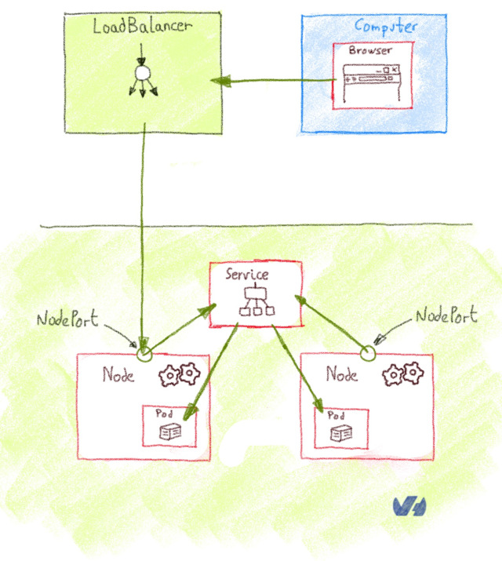
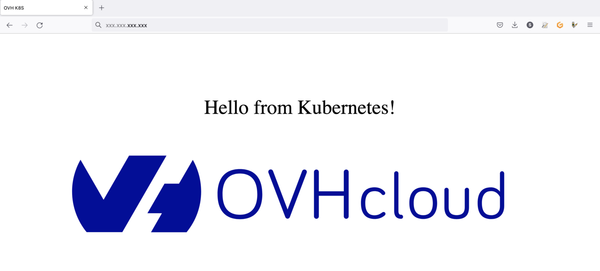

> [!warning]
> This documentation is about "LoadBalancer for K8s". If you want to benefit from the future MKS LoadBalancer implementation based on Octavia LoadBalancer, please refer to [this page](/pages/public_cloud/containers_orchestration/managed_kubernetes/expose_your_applications_using_a_load_balancer/).
>
> To force the usage of "LoadBalancer for K8s" in your MKS cluster, add this annotation `loadbalancer.ovhcloud.com/class: iolb` to your K8s Service.
>
> Note: "LoadBalancer for K8s" will be replaced by the Octavia implementation.
>

## Objective

In this tutorial we are explaining how to use services on OVHcloud Managed Kubernetes service to expose your app by getting external traffic into your cluster. We will begin by listing the main methods to expose Kubernetes services outside the cluster, with its advantages and disadvantages. Then we will see a complete example of `LoadBalancer` service deployment.

## Before you begin

This tutorial presupposes that you already have a working OVHcloud Managed Kubernetes cluster, and some basic knowledge of how to operate it. If you want to know more on those topics, please look at the [OVHcloud Managed Kubernetes Service Quickstart](/pages/public_cloud/containers_orchestration/managed_kubernetes/deploying-hello-world).

> [!warning]
> When a **LoadBalancer** Service resource is created inside a Managed Kubernetes cluster, a Load Balancer for a Managed Kubernetes Service is automatically created, allowing public access to your Kubernetes application.
> The Load Balancer for a Managed Kubernetes Service is hourly charged and will appear in your Public Cloud project. For more information, please refer to the following [page](https://www.ovhcloud.com/es-es/public-cloud/prices/#2034).

## Some concepts: ClusterIP, NodePort, Ingress and LoadBalancer

When you begin to use Kubernetes for real applications, one of the first questions is how to get external traffic into your cluster. The [official doc](https://kubernetes.io/docs/concepts/services-networking/service/#publishing-services-service-types){.external} gives you a good but rather dry explanation on the topic, but here we are trying to explain the concepts in a minimal, need-to-know way.

There are several ways to route the external traffic into your cluster:

- Using Kubernetes proxy and `ClusterIP`: The default Kubernetes `ServiceType` is `ClusterIP`, that exposes the `Service` on a cluster-internal IP. To reach the `ClusterIP` from an external source, you can open a Kubernetes proxy between the external source and the cluster. Its is usually only used for development.

- Exposing services as `NodePort`: Declaring a `Service` of type `NodePort` exposes the service on each Node’s IP at a static port (the `NodePort`). You can then access the `Service` from the outside of the cluster by requesting `<NodeIp>:<NodePort>`. It can be used for production, with some limitations.

- Exposing services as `LoadBalancer`: Declaring a `Service` of type `LoadBalancer` exposes it externally using a cloud provider’s load balancer. The cloud provider will provision a load balancer for the `Service`, and map it to its automatically assigned `NodePort`. It is the most widely used method in production environments.

### Using Kubernetes proxy and ClusterIP

The default Kubernetes `ServiceType` is `ClusterIP`, that exposes the `Service` on a cluster-internal IP. To reach the `ClusterIP` from an external computer, you can open a Kubernetes proxy between the external computer and the cluster.

You can use `kubectl` to create such a proxy. When the proxy is up, you're directly connected to the cluster, and you can use the `Services` internal IP (ClusterIP).

{.thumbnail}

This method isn't suited for a production environment, but it's interesting for development, debugging or other quick-and-dirty operations.

### Exposing services as NodePort

Declaring a service of type `NodePort` exposes the `Service` on each Node’s IP at a static port, the `NodePort` (a fixed port for that `Service`, in the default range of 30000-32767). You can then access the `Service` from the outside of the cluster by requesting `<NodeIp>:<NodePort>`. Every service you deploy as `NodePort` will be exposed in its own port, on every Node.

{.thumbnail}

It's rather cumbersome to use `NodePort` `Services` in production. As you are using non-standard ports, you often need to set up an external load balancer that listens on standard ports and redirects the traffic to the `<NodeIp>:<NodePort>`.

> [!warning]
> In our OVHcloud Managed Kubernetes you have an easy way to access `NodePort` services. You need to get the *nodes* URL, an URL solving via round-robin DNS to one random node of your cluster. As `NodePort` services are exposed in the same port on every Node, you can use this *nodes* URL to access them.
> 
> In order to get the nodes URL, you get the *control plane* URL (the one given on `kubectl cluster-info`) and add the `nodes` element between the first and the second element of the URL
> 
> Example:
> 
> ```
> $ kubectl cluster-info
> Kubernetes control plane is running at https://xxxxxx.c1.gra9.k8s.ovh.net
> CoreDNS is running at https://xxxxxxx.c1.gra9.k8s.ovh.net/api/v1/namespaces/kube-system/services/kube-dns:dns/proxy
> Metrics-server is running at https://xxxxxx.c1.gra9.k8s.ovh.net/api/v1/namespaces/kube-system/services/https:metrics-server:/proxy
> ```
>
> In this case the *nodes* URL will be `https://xxxxxx.nodes.c1.gra9.k8s.ovh.net` and a service deployed on NodePort 30123 can be accessed on `https://xxxxxx.nodes.c1.gra9.k8s.ovh.net:30123`.

> [!warning]
> If your OVHcloud Managed Kubernetes is connected to a vRack, the `NodePort` is only exposed on your private subnet. So you have to check your private IPs on your nodes in your Nodepool and connect via one of these private IPs.

### Exposing services as LoadBalancer

Declaring a service of type `LoadBalancer` exposes it externally using a cloud provider’s load balancer. The cloud provider will provision a load balancer for the `Service`, and map it to its automatically assigned `NodePort`. How the traffic from that external load balancer is routed to the `Service` pods depends on the cluster provider.

{.thumbnail}

The `LoadBalancer` is the best option for a production environment, with two caveats:

- Every `Service` of type `LoadBalancer` you deploy will get its own IP.
- The `LoadBalancer` is usually billed by the number of exposed services, it can be expensive.

> [!primary]
> There is a limit of 200 active `LoadBalancer` per Openstack project (also named Openstack tenant). This limit can be exceptionally raised upon request through our support team.

### Supported Load Balancers

OVHcloud currently provides two types of load balancers that can be used with Managed Kubernetes Services:

- [Load Balancer for Managed Kubernetes](https://www.ovhcloud.com/es-es/public-cloud/load-balancer-kubernetes/), this load balancer type can only be used to expose resources of a Managed Kubernetes Service. It supports up to 2000 requests/second and a 200Mbits/s bandwidth.  
- [Public Load Balancer](https://www.ovhcloud.com/es-es/public-cloud/load-balancer/), based on the OpenStack Octavia project, this load balancer type can also be used with standard OVHcloud instances. You can choose between three Load Balancer sizes (S,M,L), providing up to 40k requests/second and a 2 Gbits/second bandwidth. Other advantages are the capability to expose your Load Balancer privately (private-to-private) or publicly (public-to-private or public-to-public) using [Floating IPs](https://www.ovhcloud.com/es-es/public-cloud/floating-ip/), the possibility to collect metrics and TCP/UDP protocols.

> [!warning] 
> Usage of the [Public Load Balancer](https://www.ovhcloud.com/es-es/public-cloud/load-balancer/) with a Managed Kubernetes Service is currently in Beta phase, you can retrieve all the related information and request an access by joining our [Container & Orchestration dedicated Discord channel](https://discord.com/channels/850031577277792286/1143208429872226325).

### Supported annotations

> [!primary] 
> This part of the documentation applies to [Load Balancer for Managed Kubernetes](https://www.ovhcloud.com/es-es/public-cloud/load-balancer-kubernetes/).
>
> A dedicated documentation for [Public Load Balancer](https://www.ovhcloud.com/es-es/public-cloud/load-balancer/) will be published with the release of the Beta phase.

There are several annotations available to customize your load balancer:

- `service.beta.kubernetes.io/ovh-loadbalancer-proxy-protocol`: Used on the service to enable the proxy protocol on all backends. Supported values: `v1`, `v2`, `v2_ssl`, `v2_ssl_cn`.

OVHcloud Load Balancer services handle 4 ProxyProtocol modes:

|Mode|Description|
|---|---|
|v1|Version 1 in text format. This is the most widely supported version.|
|v2|Version 2 in binary format without any options. This is an optimized version of version 1.|
|v2-ssl|Version 2, with a field describing the SSL connection, if applicable.|
|v2-ssl-cn|Version 2 with SSL (v2-ssl), with the "Common Name" field of the certificate used, if applicable.|

- `service.beta.kubernetes.io/ovh-loadbalancer-allowed-sources`: Used on the service to specify allowed client IP source ranges. Value: comma separated list of CIDRs. For example: `10.0.0.0/24,172.10.0.1`. **Deprecated**, please use `loadBalancerSourceRanges` spec instead, see [Restrict Access For LoadBalancer Service](https://kubernetes.io/docs/home/){.external}.

- `service.beta.kubernetes.io/ovh-loadbalancer-balance`: Used on the service to set the algorithm to use for load balancing. Supported values: `first`, `leastconn`, `roundrobin`, `source`. Default: `roundrobin`.

### What about Ingress

According to the [official documentation](https://kubernetes.io/docs/concepts/services-networking/ingress/){.external}, an `Ingress` is an API object that manages external access to the services in a cluster, typically HTTP. What is the difference with the `LoadBalancer` or `NodePort`?

`Ingress` isn't a type of `Service`, but an object that acts as a [reverse proxy](https://en.wikipedia.org/wiki/Reverse_proxy){.external}, and single entrypoint to your cluster that routes the request to the different services. The most basic `Ingress` is the [NGINX Ingress Controller](https://github.com/kubernetes/ingress-nginx){.external}, where the NGINX take the role of reverse proxy, but also functions as SSL.

An Ingress is exposed to the outside of the cluster either via `ClusterIP` and Kubernetes proxy, `NodePort` or `LoadBalancer`, and it routes incoming traffic according to configured rules.

The main advantage of using an `Ingress` behind a `LoadBalancer` is the cost: you can have lots of services behind a single `LoadBalancer`.

## Deploying LoadBalancer Services on OVHcloud Managed Kubernetes clusters

In our OVHcloud Managed Kubernetes we propose a load balancing service enabling you to use `LoadBalancer` `ServiceType`.

## Deploying a Hello World LoadBalancer service

Create a `hello.yml` file for our `ovhplatform/hello` Docker image, defining the service type as `LoadBalancer`:

```yaml
apiVersion: v1
kind: Service
metadata:
  name: hello-world
  labels:
    app: hello-world
spec:
  type: LoadBalancer
  ports:
  - port: 80
    targetPort: 80
    protocol: TCP
    name: http
  selector:
    app: hello-world
---
apiVersion: apps/v1
kind: Deployment
metadata:
  name: hello-world-deployment
  labels:
    app: hello-world
spec:
  replicas: 1
  selector:
    matchLabels:
      app: hello-world
  template:
    metadata:
      labels:
        app: hello-world
    spec:
      containers:
      - name: hello-world
        image: ovhplatform/hello:1.1
        ports:
        - containerPort: 80
```

And apply the file:

```bash
kubectl apply -f hello.yml
```

After applying the YAML file, a new `hello-world` service and the corresponding `hello-world-deployment` deployment are created:

```console
$ kubectl apply -f hello.yml

service/hello-world unchanged
deployment.apps/hello-world-deployment configured
```

> [!primary]
> The application you have just deployed is a simple Nginx server with a single static *Hello World* page. 
> Basically it just deploys the Docker image [`ovhplatform/hello`](https://hub.docker.com/r/ovhplatform/hello/)

### List the services

And now you're going to use `kubectl` to see your service:

```bash
kubectl get service hello-world -w
```

You should see your newly created service:

```console
$ kubectl get services
NAME          TYPE           CLUSTER-IP    EXTERNAL-IP     PORT(S)            AGE
hello-world   LoadBalancer   10.3.81.234   <pending>       80:31699/TCP       9s
```

As the `LoadBalancer` creation is asynchronous, and the provisioning of the load balancer can take several minutes, you will surely get a `<pending> EXTERNAL-IP`.

If you try again in a few minutes you should get an `EXTERNAL-IP`:

```console
$ kubectl get service hello-world
NAME          TYPE           CLUSTER-IP    EXTERNAL-IP       PORT(S)        AGE
hello-world   LoadBalancer   10.3.81.234   xxx.xxx.xxx.xxx   80:31699/TCP   4m
```

For each service you deploy with `LoadBalancer` type, you will get a new IPv4 with the `xxx.xxx.xxx.xxx` format to access the service.

### Testing your service

If you point your web browser to the `EXTERNAL-IP` value, the `hello-world` service will answer you:

{.thumbnail}

### Cleaning up

At the end you can proceed to clean up by deleting the service and the deployment.

Let's begin by deleting the service:

```bash
kubectl delete service hello-world
```

If you list the services you will see that `hello-world` doesn't exist anymore:

```console
$ kubectl delete service hello-world
service "hello-world" deleted

$ kubectl get services -l app=hello-world
No resources found.
```

Then, you can delete the deployment:

```bash
kubectl delete deploy hello-world-deployment
```

And now if you list your deployment you will find no resource:

```console
$ kubectl delete deploy hello-world-deployment
deployment.apps "hello-world-deployment" deleted

$ kubectl get deployments -l app=hello-world
No resources found.
```

If now you list the pods:

```bash
kubectl get pod -n default -l app=hello-world
```

You will see that the pod created for `hello-world` has been deleted too:

```console
$ kubectl get pod -l app=hello-world
No resources found
```

## Go further

- If you need training or technical assistance to implement our solutions, contact your sales representative or click on [this link](https://www.ovhcloud.com/es-es/professional-services/) to get a quote and ask our Professional Services experts for assisting you on your specific use case of your project.

- Join our [community of users](https://community.ovh.com/en/).
