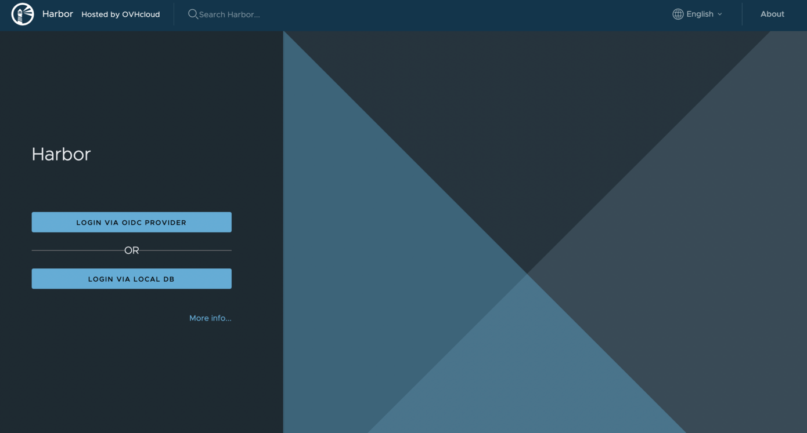
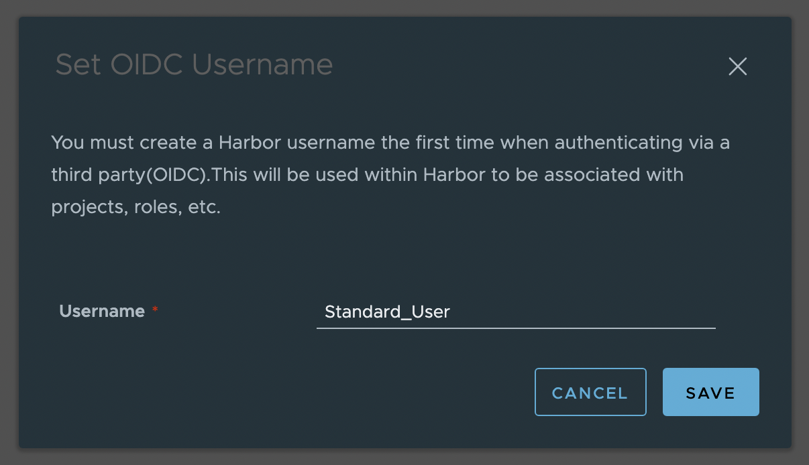
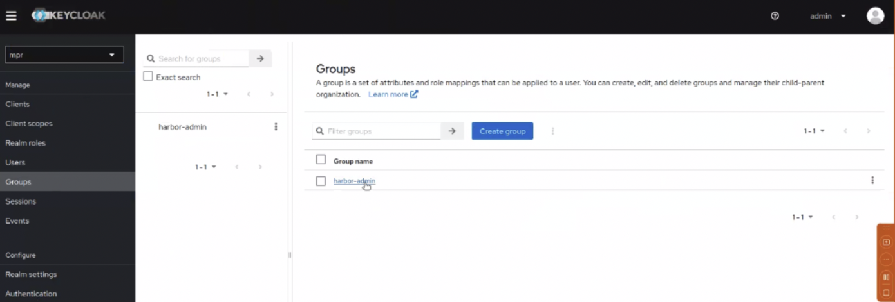
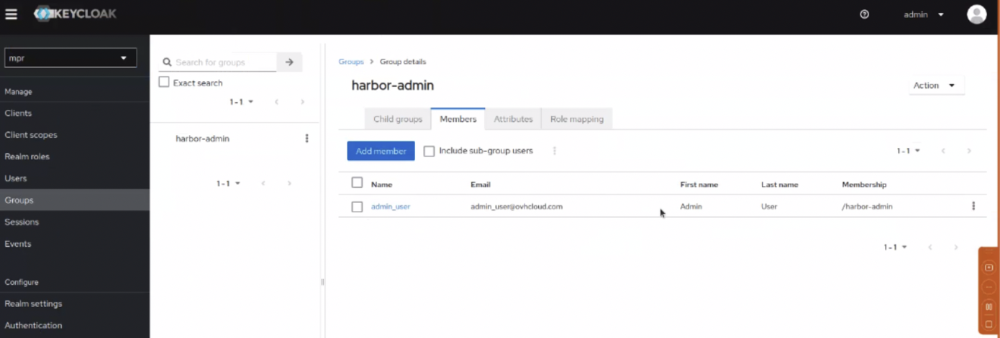

<style>
 pre {
     font-size: 14px;
 }
 pre.console {
   background-color: #300A24; 
   color: #ccc;
   font-family: monospace;
   padding: 5px;
   margin-bottom: 5px;
 }
 pre.console code {
   border: solid 0px transparent;
   color: #ccc;
   font-family: monospace !important;
   font-size: 0.75em;
 }
 .small {
     font-size: 0.75em;
 }
</style>

## Objective

The OVHcloud Managed Private Registry service, a cloud-native registry built on Harbor, allows you to store, manage and access your container images (OCI artifacts) and Helm charts.

By default, to log in to your OVHcloud Managed private registries you have to generate credentials (from the OVHcloud Control Panel, the APIv6 or Terraform), then log in with this user and administrate other users in the Harbor HMI.

However, you can also configure an Open ID Connect (OIDC) provider, for the OVHcloud Managed Private registry authentication, such as Keycloack.

- First of all, what is OIDC?

{.thumbnail}

OIDC stands for [OpenID Connect](https://en.wikipedia.org/wiki/OpenID). It is an open standard and decentralized authentication protocol.
This protocol allows verifying the user identity when a user is trying to access a protected HTTPs endpoint.

Several OpenID Connect providers exists like Dex, Keycloak, Okta or a SaaS provider. Harbor supports all of them. In this tutorial we will use Keycloack.

- What is Keycloak?

{.thumbnail}

[Keycloak](https://www.keycloak.org/) is an open source Identity and Access Management solution aimed at modern applications and services.
It makes it easy to secure applications and services with little to no code.
More information can be found here: [Official Keycloak documentation](https://www.keycloak.org/documentation.html).

**This guide will explain how to configure the authentication of your OVHcloud Managed Private Registry service to use an OIDC provider.**

## Requirements

- An OVHcloud [Managed Private Registry](/pages/public_cloud/containers_orchestration/managed_private_registry/creating-a-private-registry).
- The URL and login/password of your private registry.
- an OIDC provider, like a KeyCloack instance and credentials to access it.

Follow the official guide if you want to [install Keycloack on an OVHcloud Managed Kubernetes cluster](/pages/public_cloud/containers_orchestration/managed_kubernetes/installing-keycloak).

## Instructions

### Configure ythe OIDC provider through the API

#### The API Explorer

To simplify things, we are using the [API Explorer](https://api.ovh.com/) which allows to explore, learn and interact with the API in an interactive way.

Log in to the API Explorer using your OVHcloud account credentials.

{.thumbnail}

If you go to the [Kubernetes section](https://api.ovh.com/console/#/cloud/project/%7bservicename%7d/kube~get) of the API Explorer, you will see the available endpoints:

{.thumbnail}

#### API endpoints

- Configure an OIDC provider for your OVHcloud Managed Private Registry:

Do a POST HTTP request and fill the input fields with the keycloack/OIDC provider information.

> [!api]
>
> @api {v1} /cloud POST /cloud/project/{serviceName}/containerRegistry/{registryID}/openIdConnect
>

**Input:**

```
serviceName: <your service name>
registryID: <the ID of the registry>
OIDCPost:
  deleteUsers: true
  provider:
    adminGroup: harbor-admin //optional, it's my admin group in keycloack
    clientSecret: <keycloack client secret>
    endpoint: <keyclock endpoint> //ending with the realm, for example: https://xxx.yyy.com/realms/mpr 
    groupsClaim: <group in keycloack>
    name: keycloack //for example
    scope: openid,profile,email,offline_access
    userClaim: //optional, only useful when autOonboard is enabled
    verifyCert: true //optional, if you want to check the keycloack SSL/TLS certificate
```

**Result:**

```json
null
```

Go to the [Harbor documentation](https://goharbor.io/docs/2.8.0/administration/configure-authentication/oidc-auth/) to see the details of the needed information.

> [!primary]
>
> If you forget to enable the `deleteUsers` option, you will have an error: `{ "class": "Client::BadRequest", "message": "4 users exist, set parameter deleteUsers to delete them" }`. Indeed, when a new Private Registry is created, several users are created. So you need to enable the `deleteUsers` option in order to remove existing local users and enable OIDC authentication.

Now, access the Harbor HMI. New buttons should appear, especially the `Login via OIDC provider`{.action}:

{.thumbnail}

When you click the `Login via OIDC provider`{.action} button, you are redirected to the Keycloack interface. 

{.thumbnail}

If you don't enable the `autoOnboard` input field, a popup in the Harbor interface should appear asking you to fill the username.
When this option is checked, the attribute `UserClaim` must be set, Harbor will read the value of this claim from the ID token and use it as the username for onboarding the user.

{.thumbnail}

Click on the `Save`{.action} button to finally log in to Harbor with the OIDC provider.

- Get an existing registry's OIDC configuration:

> [!api]
>
> @api {v1} /cloud GET /cloud/project/{serviceName}/containerRegistry/{registryID}/openIdConnect
>

**Input:**

```
serviceName: <your service name>
registryId: xxxxxxxx-xxxx-xxxx-xxxx-xxxxxxxxxxxx
```

**Result:**

```json
{
  "id": "xxxxxxxx-xxxx-xxxx-xxxx-xxxxxxxxxxxx",
  "name": "keycloak",
  "createdAt": "2023-08-24T13:35:07.217448Z",
  "updatedAt": "2023-08-24T13:35:07.300496Z",
  "status": "READY",
  "endpoint": "https://xxxx.yyy.com/realms/mpr",
  "clientId": "harbor",
  "groupsClaim": "groups",
  "adminGroup": "harbor-admin",
  "scope": "openid,profile,email,offline_access",
  "verifyCert": true,
  "autoOnboard": false,
  "userClaim": ""
}
```

- Update an existing registry's OIDC provider:

With this API endpoint, we can, for example, add adminGroup and groupsClaim fields.

When an `adminGroup` is configured, all users belonging to this group will have the admin rights on Harbor.

First, retrieve information about groups in keycloack:

{.thumbnail}

Check you have at least one member in the group:

{.thumbnail}

Then, update the configuration with a PUT request.

> [!api]
>
> @api {v1} /cloud PUT /cloud/project/{serviceName}/containerRegistry/{registryID}/openIdConnect
>

```
OIDCPost:
  provider:
    adminGroup: harbor-admin //optional, it's my admin group in keycloack
    groupsClaim: groups
```

Result:

```json
null
```

- Listing users

When you log in to the Harbor HMI with an OIDC provider user, the user will be saved. Use this API endpoint to list users:

> [!api]
>
> @api {v1} /cloud GET /cloud/project/{serviceName}/containerRegistry/{registryID}/users
> 

**Input:**

```
serviceName: <your service name>
registryId: xxxxxxxx-xxxx-xxxx-xxxx-xxxxxxxxxxxx
```

**Result:**

```json
[
  {
    "id": "8",
    "user": "Standard_User",
    "email": "standard_user@ovhcloud.com",
    "password": ""
  }
]
```

- Setting a user as admin

By default a user created in an OIDC provider doesn't have the admin rights. To grant a user the admin rights, use the following PUT call:

> [!api]
>
> @api {v1} /cloud PUT /cloud/project/{serviceName}/containerRegistry/{registryID}/users/{userID}/setAsAdmin
> 

**Input:**

```
serviceName: <your service name>
registryId: xxxxxxxx-xxxx-xxxx-xxxx-xxxxxxxxxxxx
userID: 8 //the user ID
```

**Result:**

```json
```

> [!primary]
>
> The response will be empty but you should get a 2xx HTTP status code telling you that everything worked successfully.

When you log again with this user, you are now an Administrator.

{.thumbnail}

- Deleting an existing registry's OIDC configuration:

If you want to delete the authentication with OIDC configuration, execute a DELETE action in the API:

> [!api]
>
> @api {v1} /cloud DELETE /cloud/project/{serviceName}/containerRegistry/{registryID}/openIdConnect
> 

**Input:**

```
serviceName: <your service name>
registryId: xxxxxxxx-xxxx-xxxx-xxxx-xxxxxxxxxxxx
```

**Result:**

```json
```

> [!primary]
>
> The response will be empty but you should get a 2xx HTTP status code telling you that everything worked successfully.

This request will delete all the users.

> [!primary]
>
> You can generate again the users credentials via the OVHcloud Control Panel, the APIv6 or Terraform and log in with these new local credentials.

## Go further

To have an overview of OVHcloud Managed Private Registry service, read the [OVHcloud Managed Private Registry documentation](/products/public-cloud-containers-orchestration-managed-private-registry).

If you need training or technical assistance to implement our solutions, contact your sales representative or click on [this link](https://www.ovhcloud.com/en-sg/professional-services/) to get a quote and ask our Professional Services experts for assisting you on your specific use case of your project.

Join our community of users on <https://community.ovh.com/en/>.
