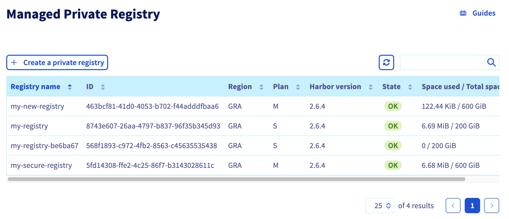
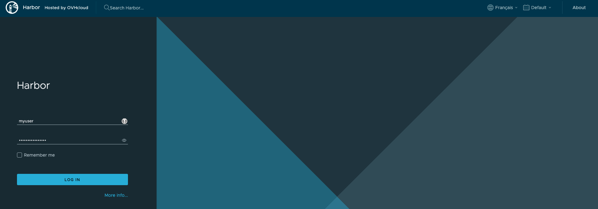
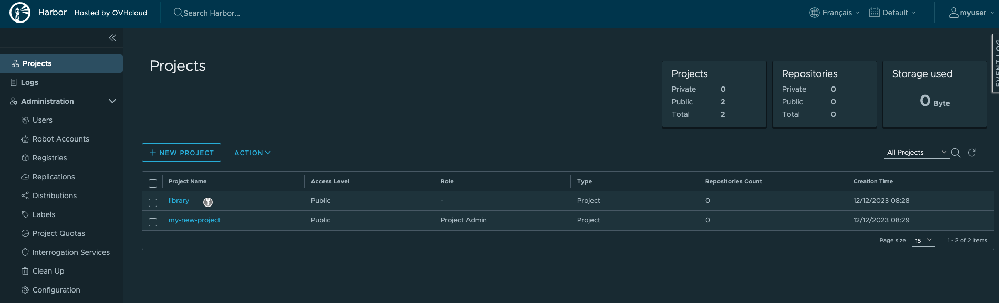
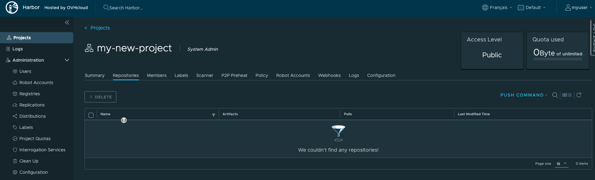

## Objective

You can create an OVHcloud Managed Private Registry via the OVHcloud Control Panel, but you can also deploy a registry programmatically with Infrastructure as Code (IaC) tools. This can be done via Terraform thanks to our OVHcloud provider, and now also with Pulumi.

### Pulumi


[Pulumi](https://www.pulumi.com/) is an Infrastructure as Code (IasC) tool that allows you to build your infrastructures with a programming language, in Golang for example.
Users define the desired state in Pulumi programs and Pulumi creates the desired resources.

Pulumi offers an intuitive command line interface (CLI), to provision, update or delete your infrastructure. If you are familiar with Docker Compose CLI and Terraform CLI, you will adopt [Pulumi CLI](https://www.pulumi.com/docs/cli/) too.

## Requirements

- A [Public Cloud project](/pages/public_cloud/compute/create_a_public_cloud_project) in your OVHcloud account
- Installing the [Pulumi CLI](https://www.pulumi.com/docs/install/){.external}
- An account in [Pulumi](https://www.pulumi.com/)
- A [Pulumi access token](https://app.pulumi.com/account/tokens)
- Installing the [kubectl CLI](https://kubernetes.io/docs/tasks/tools/)

### Before you begin

You should have installed the Pulumi CLI on your machine. Verify the Pulumi CLI is successfully installed in your machine with the `pulumi version` command.

You should have a result like this:

```bash
$ pulumi version
v3.86.0
```

#### OVHcloud Pulumi provider

In order to create a Private Registry (Harbor instance) and other resources, you will use the [OVHcloud Pulumi provider](https://github.com/ovh/pulumi-ovh). This provider is a bridge to our official [Terraform provider](https://registry.terraform.io/providers/ovh/ovh/latest){.external}.

All available Pulumi resources have their definition and [documentation](https://www.pulumi.com/registry/packages/ovh).

In this guide, we will create several resources:

- a [capabilities datasource](https://www.pulumi.com/registry/packages/ovh/api-docs/cloudproject/getcapabilitiescontainerregistry/){.external} that represents the configuration of the registry
- a [registry resource](https://www.pulumi.com/registry/packages/ovh/api-docs/cloudproject/containerregistry/){.external} that represents an OVHcloud Managed Private Registry
- a [registry user resource](https://www.pulumi.com/registry/packages/ovh/api-docs/cloudproject/containerregistryuser/){.external} that represents a user in the private registry

You will also use the [Harbor Pulumi provider](https://www.pulumi.com/registry/packages/harbor/) to create a project inside the private registry (harbor).

#### Getting your registry/API tokens information

The “OVH provider” needs to be configured with a set of credentials, which can be set using [Pulumi stack configuration](https://www.pulumi.com/docs/concepts/config/) or environment variables:

- `ovh:endpoint` (environment variable: `OVH_ENDPOINT`)
- `ovh:applicationKey` (environment variable: `OVH_APPLICATION_KEY`)
- `ovh:applicationSecret` (secret) (environment variable: `OVH_APPLICATION_SECRET`)
- `ovh:consumerKey` (environment variable: `OVH_CONSUMER_KEY`)

**Why?**

Behind the scenes, the provider is doing requests to OVHcloud APIs. 

In order to retrieve this necessary information, please follow our [first steps with the OVHcloud APIs](/pages/manage_and_operate/api/first-steps) guide.

In concrete terms, you have to generate these credentials via the [OVH token generation page](https://api.ovh.com/createToken/?GET=/*&POST=/*&PUT=/*&DELETE=/*) with the following rights:

{.thumbnail}

When you have successfully generated your OVH tokens, please save them as you will have to use them in the coming minutes.

The last needed information is the `serviceName`: it is the ID of your Public Cloud project.

**How to get it?**

In the Public Cloud section, you can retrieve your service name ID thanks to the `Copy to clipboard`{.action} button.

{.thumbnail}

Define the secret keys as environment variables:

```bash
export OVH_ENDPOINT="ovh-eu"
export OVH_APPLICATION_KEY="xxx"
export OVH_APPLICATION_SECRET="xxx"
export OVH_CONSUMER_KEY="xxx"
```

> [!primary]
>
> Replace `xxx` by the correct values and `ovh-eu` with the correct endpoint.

## Instructions

One advantage of Pulumi is that it allows you to build your infrastructures with the programming language of your choice. It supports a variety of programming languages.

In this tutorial you will be able to deploy your private registry (harbor) with a user and its project in the Go/Golang programming language.
For your information, our OVH Pulumi provider currently supports Go but also Python, Node.js/Typescript and C#/Dotnet.

Examples:

- [Python](https://github.com/ovh/pulumi-ovh/tree/main/examples/kubernetes/ovh-python)
- [Typescript](https://github.com/ovh/pulumi-ovh/tree/main/examples/kubernetes/ovh-typescript)
- [C#](https://github.com/ovh/pulumi-ovh/tree/main/examples/kubernetes/ovh-csharp)
- [Go](https://github.com/ovh/pulumi-ovh/tree/main/examples/kubernetes/ovh-go)

### Deploy your Managed Private Registry (Harbor) in Go / Golang

#### Pulumi project creation and initialization

In Pulumi, the infrastructure is organized into projects. In the Pulumi ecosystem, a project represents a Pulumi program which, when run, declares the desired infrastructure for Pulumi to manage.

First, create a folder named `ovh-registry-go` which represents our project and go into it.

```bash
mkdir ovh-registry-go
cd ovh-registry-go
```

Initialize your project:

```bash
pulumi new go -y
```

The output should be like this:

```bash
$ pulumi new go -y
Created project 'ovh-registry-go'

Please enter your desired stack name.
To create a stack in an organization, use the format <org-name>/<stack-name> (e.g. `acmecorp/dev`).
Created stack 'dev'

Installing dependencies...

Finished installing dependencies

Your new project is ready to go! 

To perform an initial deployment, run `pulumi up`
```

The command creates a `dev` stack and the code organization of your project:

```bash
$ tree
.
├── go.mod
├── go.sum
├── main.go
└── Pulumi.yaml
```

Now you need to install the Pulumi OVH provider.

```bash
go get github.com/ovh/pulumi-ovh/sdk/go/...
```

And the Pulumi Harbor provider:

```bash
go get github.com/pulumiverse/pulumi-harbor/sdk/v3/go/...
```

In order to create an OVHcloud Managed Private Registry, you need to define the `serviceName`.

```bash
pulumi config set serviceName <your-service-name>
```

Or you can edit the `Pulumi.yaml` file with the following content:

```yaml
config:
 serviceName: <your-service-name>
```

> [!primary]
>
> Replace `<your-service-name>` by your Public Cloud project.

Then, edit the `main.go` file and replace the content with the following:

```go
package main

import (
	"github.com/ovh/pulumi-ovh/sdk/go/ovh/cloudproject"
	"github.com/pulumi/pulumi/sdk/v3/go/pulumi"
	"github.com/pulumi/pulumi/sdk/v3/go/pulumi/config"
	"github.com/pulumiverse/pulumi-harbor/sdk/v3/go/harbor"
)

func main() {
	pulumi.Run(func(ctx *pulumi.Context) error {

		serviceName := config.Require(ctx, "serviceName")

		// Initiate the configuration of the registry
		regcap, err := cloudproject.GetCapabilitiesContainerFilter(ctx, &cloudproject.GetCapabilitiesContainerFilterArgs{
			ServiceName: serviceName,
			PlanName:    "SMALL",
			Region:      "GRA",
		}, nil)
		if err != nil {
			return err
		}

		// Deploy a new Managed private registry
		myRegistry, err := cloudproject.NewContainerRegistry(ctx, "my-registry", &cloudproject.ContainerRegistryArgs{
			ServiceName: pulumi.String(regcap.ServiceName),
			PlanId:      pulumi.String(regcap.Id),
			Region:      pulumi.String(regcap.Region),
		})
		if err != nil {
			return err
		}

		// Create a User
		myRegistryUser, err := cloudproject.NewContainerRegistryUser(ctx, "user", &cloudproject.ContainerRegistryUserArgs{
			ServiceName: pulumi.String(regcap.ServiceName),
			RegistryId:  myRegistry.ID(),
			Email:       pulumi.String("myuser@ovh.com"),
			Login:       pulumi.String("myuser"),
		})
		if err != nil {
			return err
		}

		//Add as an output registry information
		ctx.Export("registryID", myRegistry.ID())
		ctx.Export("registryName", myRegistry.Name)
		ctx.Export("registryURL", myRegistry.Url)
		ctx.Export("registryVersion", myRegistry.Version)
		ctx.Export("registryUser", myRegistryUser.User)
		ctx.Export("registryPassword", myRegistryUser.Password)

		//Use the created regsitry to initiate the harbor provider
		harborProvider, err := harbor.NewProvider(ctx, "harbor", &harbor.ProviderArgs{
			Username: myRegistryUser.User,
			Password: myRegistryUser.Password,
			Url:      myRegistry.Url,
		}, pulumi.DependsOn([]pulumi.Resource{myRegistry, myRegistryUser}))
		if err != nil {
			return err
		}

		// Create a public project in your harbor registry
		project, err := harbor.NewProject(ctx, "project", &harbor.ProjectArgs{
			Name:   pulumi.String("my-new-project"),
			Public: pulumi.String("true"),
		}, pulumi.Provider(harborProvider))
		if err != nil {
			return err
		}

		ctx.Export("project", project.Name)

		return nil
	})
}
```

This Go program will create an OVHcloud Managed Private registry:

- named `my-registry-` followed by a random ID
- in the `GRA` region
- with a `SMALL` plan
- in your Public Cloud project (depending on the `serviceName` you defined)

A registry user:

- named `myuser`
- with `myuser@ovh.com` email address

And a project inside the created registry:

- named `my-new-project`
- with `Public` visibility

Then, run the `go mod tidy` command to ask Go to download and install the necessary Go providers and dependencies.

```bash
go mod tidy
```

#### Create your Private Registry (Harbor) through Pulumi

Now you can deploy your registry. To do that, just execute the `pulumi up` command.
This will display the plan/the preview of the desired state. You will be prompted to choose the stack (`dev` by default) and to confirm that you want to perform/apply the changes.

```bash
$ pulumi up

Previewing update (dev)

View in Browser (Ctrl+O): https://app.pulumi.com/scraly/ovh-registry-go/dev/previews/xxxxxxxx-xxxx-xxxx-xxxx-xxxxxxxxxxxx

     Type                                       Name                 Plan       
 +   pulumi:pulumi:Stack                        ovh-registry-go-dev  create     
 +   ├─ ovh:CloudProject:ContainerRegistry      my-registry          create     
 +   ├─ ovh:CloudProject:ContainerRegistryUser  user                 create     
 +   ├─ pulumi:providers:harbor                 harbor               create     
 +   └─ harbor:index:Project                    project              create     


Outputs:
    project         : output<string>
    registryID      : output<string>
    registryName    : "my-registry-be6ba67"
    registryPassword: output<string>
    registryURL     : output<string>
    registryUser    : output<string>
    registryVersion : output<string>

Resources:
    + 5 to create

Do you want to perform this update? yes
Updating (dev)

View in Browser (Ctrl+O): https://app.pulumi.com/scraly/ovh-registry-go/dev/updates/1

     Type                                       Name                 Status              
 +   pulumi:pulumi:Stack                        ovh-registry-go-dev  created (146s)      
 +   ├─ ovh:CloudProject:ContainerRegistry      my-registry          created (141s)      
 +   ├─ ovh:CloudProject:ContainerRegistryUser  user                 created (1s)        
 +   ├─ pulumi:providers:harbor                 harbor               created (0.39s)     
 +   └─ harbor:index:Project                    project              created (0.96s)     


Outputs:
    project         : "my-new-project"
    registryID      : "xxxxxxxx-xxxx-xxxx-xxxx-xxxxxxxxxxxx"
    registryName    : "my-registry-be6ba67"
    registryPassword: [secret]
    registryURL     : "https://034nl9k0.c1.gra9.container-registry.ovh.net"
    registryUser    : "myuser"
    registryVersion : "2.6.4"

Resources:
    + 5 created

Duration: 2m30s
```

Log in to the [OVHcloud Control Panel](/links/manager), go to the `Public Cloud`{.action} section and click on `Managed Private Registry`. <br>
As you can see, your registry has been successfuly created:

{.thumbnail}

#### Connect to the registry

Your registry is created with a user, so you have all the information to connect to it.

In order to do this, retrieve the registry URL, login and password from the `dev` Pulumi stack:

```bash
pulumi stack output registryURL -s dev
pulumi stack output registryUser -s dev
pulumi stack output registryPassword --show-secrets -s dev
```

Connect to the Managed Private Registry with the login and password:

{.thumbnail}

{.thumbnail}

Then click on the created project:

{.thumbnail}

You can now deploy your applications and/or create new clusters through Pulumi.

## Known issues

### "Provider is missing a required configuration key"

If you encounter the following error, it means you forgot to export the needed OVHcloud environment variables.

```bash
$ pulumi up
Previewing update (dev)

View in Browser (Ctrl+O): https://app.pulumi.com/scraly/ovh-registry-go/dev/previews/xxxxxxxx-xxxx-xxxx-xxxx-xxxxxxxxxxxx

     Type                     Name                                           Plan     Info
     pulumi:pulumi:Stack      ovh-registry-go-dev                                    
     └─ pulumi:providers:ovh  default_github_/api.github.com/ovh/pulumi-ovh           1 error


Diagnostics:
  pulumi:providers:ovh (default_github_/api.github.com/ovh/pulumi-ovh):
    error: pulumi:providers:ovh resource 'default_github_/api.github.com/ovh/pulumi-ovh' has a problem: Provider is missing a required configuration key, try `pulumi config set ovh:endpoint`: The OVH API endpoint to target (ex: "ovh-eu").
```

The solution is to export the missing required configuration:

```bash
export OVH_ENDPOINT="ovh-eu"
export OVH_APPLICATION_KEY="xxx"
export OVH_APPLICATION_SECRET="xxx"
export OVH_CONSUMER_KEY="xxx"
```

> [!primary]
>
> Replace `xxx` by the correct values and `ovh-eu` with the correct endpoint.

## Destroy (cleanup)

If you want to easily destroy created resources, you can use the `pulumi destroy` command.

```bash
$ pulumi destroy

Previewing destroy (dev)

View in Browser (Ctrl+O): https://app.pulumi.com/scraly/ovh-registry-go/dev/previews/xxxxxxxxx-xxxx-xxxx-xxxx-xxxxxxxxxxxx

     Type                                       Name                 Plan       
 -   pulumi:pulumi:Stack                        ovh-registry-go-dev  delete     
 -   ├─ harbor:index:Project                    project              delete     
 -   ├─ pulumi:providers:harbor                 harbor               delete     
 -   ├─ ovh:CloudProject:ContainerRegistryUser  user                 delete     
 -   └─ ovh:CloudProject:ContainerRegistry      my-registry          delete     


Outputs:
  - project         : "my-new-project"
  - registryID      : "xxxxxxxx-xxxx-xxxx-xxxx-xxxxxxxxxxxx"
  - registryName    : "my-registry-be6ba67"
  - registryPassword: [secret]
  - registryURL     : "https://034nl9k0.c1.gra9.container-registry.ovh.net"
  - registryUser    : "myuser"
  - registryVersion : "2.6.4"

Resources:
    - 5 to delete

Do you want to perform this destroy? yes
Destroying (dev)

View in Browser (Ctrl+O): https://app.pulumi.com/scraly/ovh-registry-go/dev/updates/2

     Type                                       Name                 Status              
 -   pulumi:pulumi:Stack                        ovh-registry-go-dev  deleted             
 -   ├─ harbor:index:Project                    project              deleted (1s)        
 -   ├─ pulumi:providers:harbor                 harbor               deleted (0.22s)     
 -   ├─ ovh:CloudProject:ContainerRegistryUser  user                 deleted (1s)        
 -   └─ ovh:CloudProject:ContainerRegistry      my-registry          deleted (10s)       


Outputs:
  - project         : "my-new-project"
  - registryID      : "xxxxxxxx-xxxx-xxxx-xxxx-xxxxxxxxxxxx"
  - registryName    : "my-registry-be6ba67"
  - registryPassword: [secret]
  - registryURL     : "https://034nl9k0.c1.gra9.container-registry.ovh.net"
  - registryUser    : "myuser"
  - registryVersion : "2.6.4"

Resources:
    - 5 deleted

Duration: 16s

The resources in the stack have been deleted, but the history and configuration associated with the stack are still maintained. 
If you want to remove the stack completely, run `pulumi stack rm dev`.
```

Your OVHcloud Managed registry, the user and the project have been correctly destroyed.

## Go further

Join our community of users on <https://community.ovh.com/en/>.
