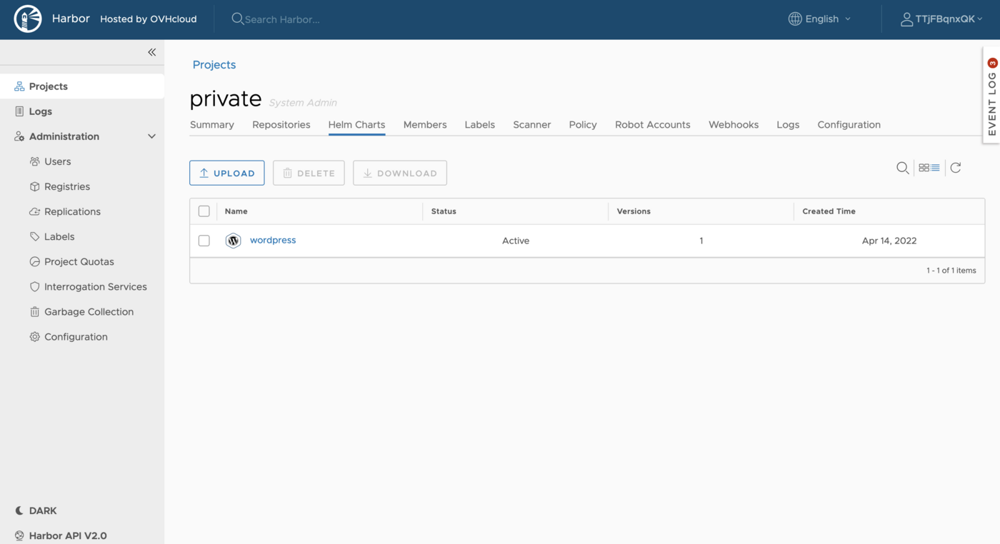

OVHcloud Managed Private Registry service is a composite cloud-native registry which supports both container image management and [Helm](https://helm.sh/){.external} [chart](https://helm.sh/docs/topics/charts/){.external} management.

This guide will explain how to deploy a Helm chart from your OVHcloud Managed Private Registry in a Kubernetes cluster.

## Before you begin

This tutorial presupposes that you already have a working OVHcloud Managed Kubernetes cluster, and some basic knowledge of how to operate it. If you want to know more on those topics, please look at the [deploying a Hello World application](/pages/public_cloud/containers_orchestration/managed_kubernetes/deploying-hello-world) documentation. You will need to have Helm installed on your cluster (see the [installing helm](/pages/public_cloud/containers_orchestration/managed_kubernetes/installing-helm) guide for more information).

You also need to have a working OVHcloud Managed Private Registry and have followed the guide on [managing Helm charts in the OVHcloud Managed Private Registry](/pages/public_cloud/containers_orchestration/managed_private_registry/using-helm-charts).

After following the previous guide, you should have at least one WordPress Helm chart in your Managed Private Registry:



## Prerequisites

### Install Helm v3.8+

Check if Helm is installed in the required version:

```bash
$ helm version
version.BuildInfo{Version:"v3.12.0", GitCommit:"c9f554d75773799f72ceef38c51210f1842a1dea", GitTreeState:"clean", GoVersion:"go1.20.3"}
```

If the version is less than v3.8.0, follow the [official instructions](https://helm.sh/docs/intro/install/) to install Helm in latest version.

## Instructions

### Deploying a chart from your registry in Kubernetes

#### Login to the OVHcloud Managed Private Registry

Before being able to pull or push Helm charts, login to Harbor:

```bash
helm registry login <registry url>
```

For example:

```console
$ helm registry login https://8xghzr01.c1.bhs5.container-registry.ovh.net
Username: MbwQLGCglA
Password: 
Login Succeeded
```

#### Install charts

Deploy the Wordpress Helm chart inside the Kubernetes cluster:

```bash
helm install myrelease oci://<registry url>/<project>/<chart name> --version <version>
```

In my case:

```console
$ helm install my-wordpress-release oci://8xghzr01.c1.bhs5.container-registry.ovh.net/private/wordpress --version 18.1.14

Pulled: 8xghzr01.c1.bhs5.container-registry.ovh.net/private/wordpress:18.1.14
Digest: sha256:89afb47c221899db67c7b125f49394eecd078245181715337b5691a0ee199cb7
NAME: my-wordpress-release
LAST DEPLOYED: Mon Nov 20 17:46:16 2023
NAMESPACE: default
STATUS: deployed
REVISION: 1
TEST SUITE: None
NOTES:
CHART NAME: wordpress
CHART VERSION: 18.1.14
APP VERSION: 6.4.1

** Please be patient while the chart is being deployed **

Your WordPress site can be accessed through the following DNS name from within your cluster:

    my-wordpress-release.default.svc.cluster.local (port 80)

To access your WordPress site from outside the cluster follow the steps below:

1. Get the WordPress URL by running these commands:

  NOTE: It may take a few minutes for the LoadBalancer IP to be available.
        Watch the status with: 'kubectl get svc --namespace default -w my-wordpress-release'

   export SERVICE_IP=$(kubectl get svc --namespace default my-wordpress-release --template "{{ range (index .status.loadBalancer.ingress 0) }}{{ . }}{{ end }}")
   echo "WordPress URL: http://$SERVICE_IP/"
   echo "WordPress Admin URL: http://$SERVICE_IP/admin"

2. Open a browser and access WordPress using the obtained URL.

3. Login with the following credentials below to see your blog:

  echo Username: user
  echo Password: $(kubectl get secret --namespace default my-wordpress-release -o jsonpath="{.data.wordpress-password}" | base64 -d)

```

Check WordPress is running correctly:

```console
$ kubectl get pod -l app.kubernetes.io/instance=my-wordpress-release
NAME                                    READY   STATUS    RESTARTS   AGE
my-wordpress-release-796cc4d6b8-ckb6c   1/1     Running   0          3m25s
my-wordpress-release-mariadb-0          1/1     Running   0          3m25s

```

## Go further

To have an overview of the OVHcloud Managed Private Registry service, you can go to the [OVHcloud Managed Private Registry site](/products/public-cloud-containers-orchestration-managed-private-registry).

Join our community of users on <https://community.ovh.com/en/>.
