> [!warning]
>
> Usage of [Managed Rancher Service](https://labs.ovhcloud.com/en/managed-rancher-service/) is currently in Beta phase.
> This guide may be incomplete and will be extended during the beta phase. Our team remains available on our dedicated Discord Channel, do not hesitate to join and reach us: <https://discord.gg/ovhcloud>. Ask questions, provide feedback and interact directly with the team that builds our Container and Orchestration services.
>

## Objective

Managed Rancher Service by OVHcloud provides a powerful platform for orchestrating Kubernetes clusters seamlessly. 

In this guide, you will use Rancher to backup and restore a Kubernetes cluster, take a snapshot and save the etcd recurring snapshots on an OVHcloud Object Storage S3 bucket.

## Requirements

- A [Public Cloud project](/links/public-cloud/public-cloud) in your OVHcloud account
- An OVHcloud Managed Rancher Service (see the [creating a Managed Rancher Service](/pages/public_cloud/containers_orchestration/managed_rancher_service/create-update-rancher) guide for more information)
- An access to the Rancher UI to operate it (see the [connecting to the Rancher UI](/pages/public_cloud/containers_orchestration/managed_rancher_service/create-update-rancher) guide for more information)
- A Kubernetes cluster created or imported in Rancher

## Instructions

In the Rancher UI, Kubernetes cluster's `etcd` backup and recovery can be easily performed.

It is recommended to configure recurrent `etcd` snapshots for all production clusters. Additionally, one-time snapshots can be taken as well.

Snapshots of the etcd database are taken and saved either [locally onto the etcd nodes](https://ranchermanager.docs.rancher.com/how-to-guides/new-user-guides/backup-restore-and-disaster-recovery/back-up-rancher-launched-kubernetes-clusters#local-backup-target) or to a S3 compatible target like our OVHcloud Object Storage. 

The advantages of configuring S3 is that if all `etcd` nodes are lost, your snapshot is saved remotely and can be used to restore the cluster.

### Create an OVHcloud Object Storage S3 backup

First, you need to have an Object Storage container, if you don't already have one, you can follow the [Creating an Object Storage container](/pages/storage_and_backup/object_storage/pcs_create_container) guide.

Note that you need to create a `S3 API` object:

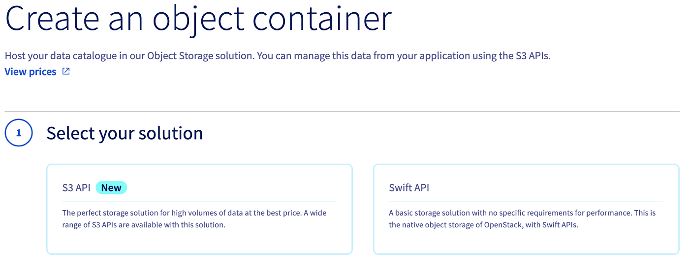{.thumbnail}

In this guide, our Object Storage container is named `etcd-rancher` and its region is `GRA`.

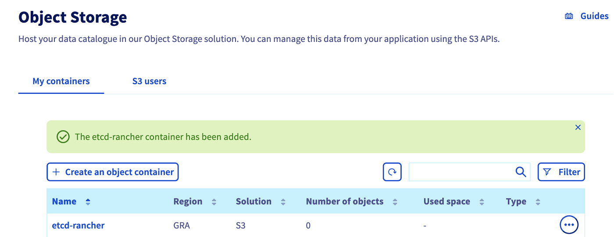{.thumbnail}

> [!primary]
> 
> Save the S3 credentials, you will use the `S3 access key` and the `S3 secret key` in the configuration of the upcoming etcd backup.

Click on the name of your object storage bucket to see its information:

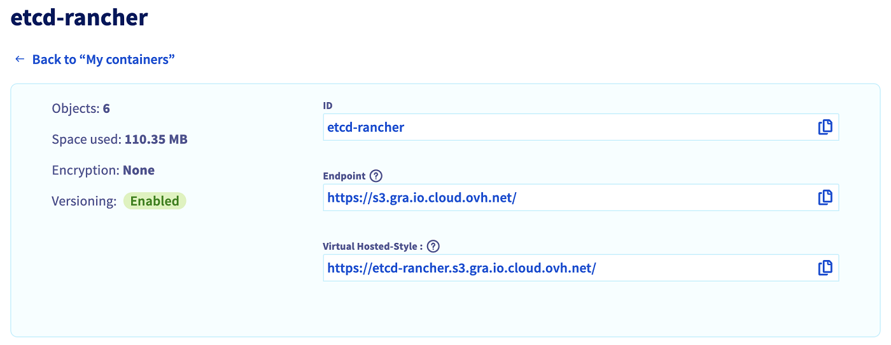{.thumbnail}

> [!primary]
>
> Copy the ID/name of your bucket and the endpoint, this information will be needed in the next step on the Rancher user interface.

### Enable etcd recurring backup snapshots to S3 on an existing Kubernetes cluster

Log into your Managed Rancher Service UI.

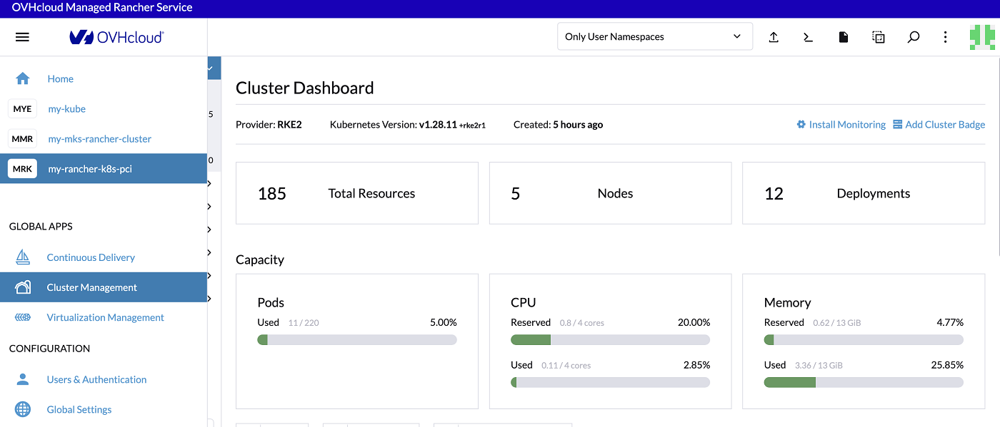{.thumbnail}

Click on `Cluster Management`{.action} in the menu.

For the chosen cluster, click on the three-dot button and then on the `Edit Config`{.action} button.

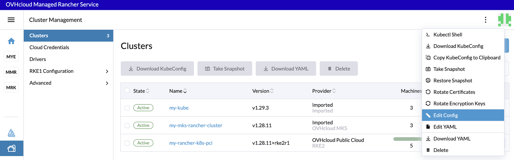{.thumbnail}

In the **Cluster Configuration** section, click on the **etcd** tab. 
In **Automatic Snapshots**, change the radio button `Disable` to `Enable` and change the `Cron Schedule` according to your needs.

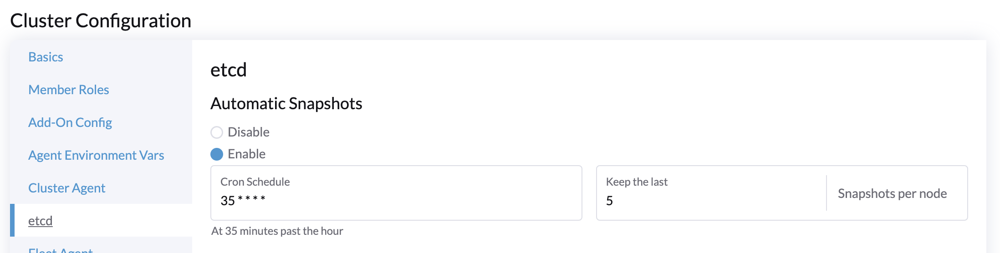{.thumbnail}

In this configuration of automatic etcd snapshots, you will have a snapshot every hour at hh:35 minutes and you will keep the last 5 snapshots per nodes.

In **Backup Snapshots to S3**, change the radio button `Disable` to `Enable`.

In the Authentication list, select the `Create a S3-Compatible Auth Secret`.
Fill the S3 Access Key, the S3 Secret Key and the bucket name.
Fill the `Region` (in lowercase).

> [!warning]
>
> The region must be typed in lowercase. So if your bucket is in the `GRA` region, you must enter `gra`.

Fill the endpoint `s3.gra.io.cloud.ovh.net`: 

> [!warning]
>
> It is a copy of the endpoint of your Object Storage bucket without `https://`.

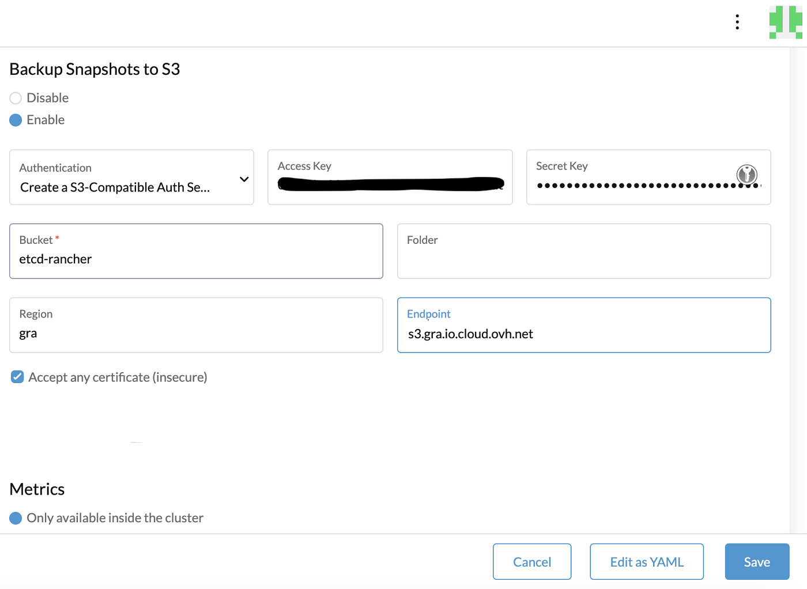{.thumbnail}

Finally, click to activate the checkbox `Accept any certificate (insecure)` and click on the Save`{.action} button. 

### Check the etcd snapshots

In **Cluster Management**, click on your cluster.

{.thumbnail}

To check and retrieve the backup snapshots, click on the **Snapshots** tab.

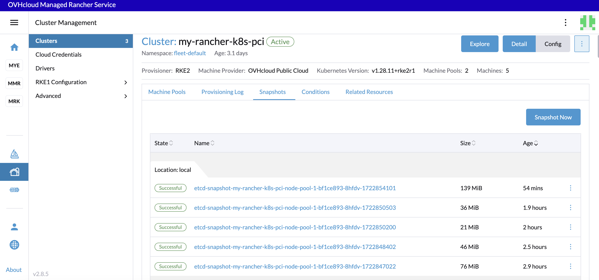{.thumbnail} 
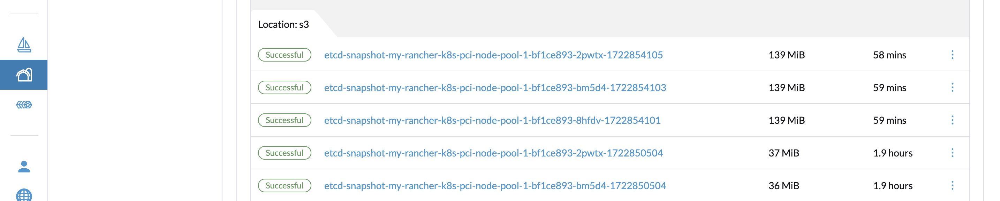{.thumbnail}

The name of the snapshot is auto-generated, it is based on the type (whether the snapshot is manual: `on-demand` or recurring: `etcd-snapshot`). The naming convention is as follows:

`<name>-<node>-<timestamp>`

You can also verify in your bucket in the OVHcloud Control Panel that the snapshots have been successfully saved.

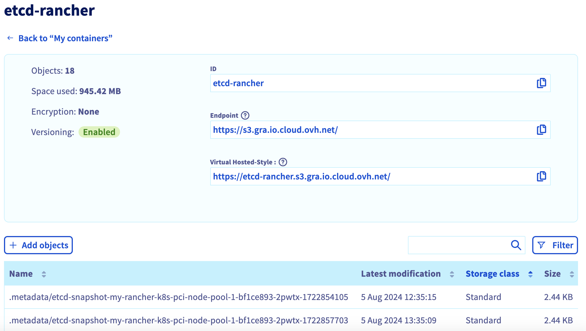{.thumbnail}

### Create a one-time snapshot

In addition to recurring snapshots, you may want to take a "one-time" snapshot.
It can be useful, for example, before upgrading the Kubernetes version of a cluster and ugrading the Service Mesh version of a cluster. In general, it is recommended to backup the state of the cluster to protect against upgrade failure.

On the **Cluster Management** view on Rancher UI, click on the checkbox near your Kubernetes cluster and click on the `Take Snapshot`{.action} button.

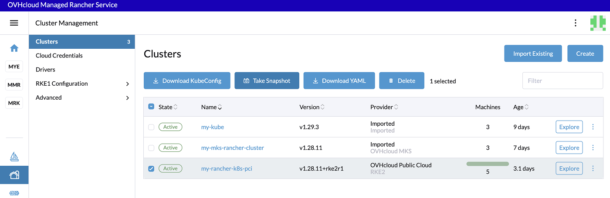{.thumbnail}

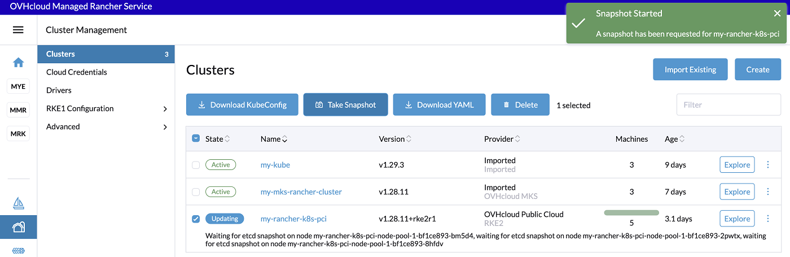{.thumbnail}

### Restore from a snapshot

On the **Snapshots** tab of your Kubernetes cluster in the Rancher UI, click on the `Restore`{.action} button.

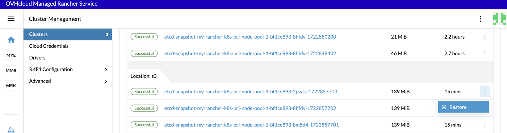{.thumbnail}

On Rancher, you can choose different restore types:

- Only etcd
- Kubernetes version and etcd
- Cluster config, Kubernetes version and etcd

In the **Restore Snapshot** popup, click on the restore type you want to do and click on the `Restore`{.action} button.

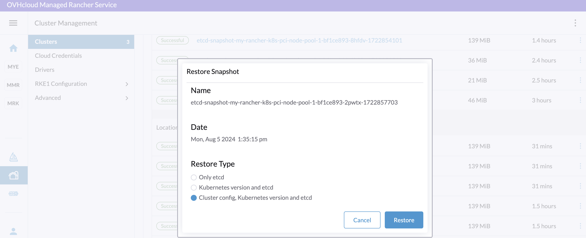{.thumbnail}

After clicking on the button, the restore from the snapshot is in progress.

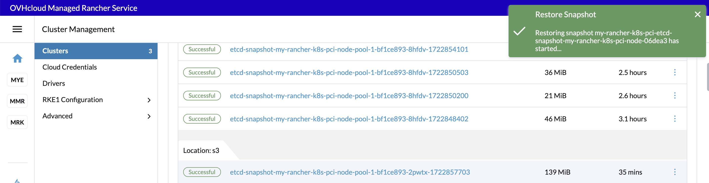{.thumbnail}

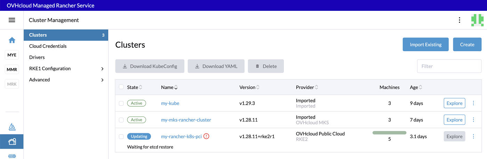{.thumbnail}

The restoration of a cluster can take few minutes.

### Known issues

#### Failed to test for existence of bucket xxx: Access Denied

If you have this following error message: `failed to test for existence of bucket etcd-rancher: Access Denied.`, you may have an error in the S3 endpoint.

Remove the `https://` scheme in the endpoint URL and check the endpoint URL of your OVHcloud Object Storage S3 bucket.

A correct S3 endpoint should be `s3.gra.io.cloud.ovh.net`.

## Go further

- Follow the Rancher official documentation to know more about [backup and restore](https://ranchermanager.docs.rancher.com/how-to-guides/new-user-guides/backup-restore-and-disaster-recovery/back-up-rancher-launched-kubernetes-clusters).

- To have an overview of OVHcloud Managed Rancher Service, you can go to the [OVHcloud Managed Rancher Service page](https://www.ovhcloud.com/it/public-cloud/managed-rancher-service/).

- If you need training or technical assistance to implement our solutions, contact your sales representative or click on [this link](/links/professional-services) to get a quote and ask our Professional Services experts for assisting you on your specific use case of your project.

Join our [community of users](/links/community).