> [!warning]
>
> Usage of [Managed Rancher Service](https://labs.ovhcloud.com/en/managed-rancher-service/) is currently in Beta phase.
> This guide may be incomplete and will be extended during the beta phase. Our team remains available on our dedicated Discord Channel, do not hesitate to join and reach us : <https://discord.gg/ovhcloud>. Ask questions, provide feedback and interact directly with the team that builds our Container and Orchestration services.
>

## Objective

Container orchestration has become a cornerstone of modern application deployment, offering scalability, flexibility, and resource efficiency. Rancher is an open-source container management platform that simplifies the deployment and management of Kubernetes clusters.
Managed Rancher Service by OVHcloud provides a powerful platform for orchestrating Kubernetes clusters seamlessly. This guide will cover the creation of a Managed Rancher Service.

## Requirements

- A [Public Cloud project](https://www.ovhcloud.com/fr-ca/public-cloud/) in your OVHcloud account
- Access to the [OVHcloud Control Panel](https://ca.ovh.com/auth/?action=gotomanager&from=https://www.ovh.com/ca/fr/&ovhSubsidiary=qc)

## Instructions

### Creating a Managed Rancher Service

To initiate your journey, log in to the [OVHcloud Control Panel](https://ca.ovh.com/auth/?action=gotomanager&from=https://www.ovh.com/ca/fr/&ovhSubsidiary=qc) and open the `Public Cloud`{.action} section.
Then access the `Managed Rancher Service`{.action} under the `Containers & Orchestration` section.
Using the OVHcloud Control Panel you can trigger the creation of a Rancher which will be operated and managed by OVHcloud.

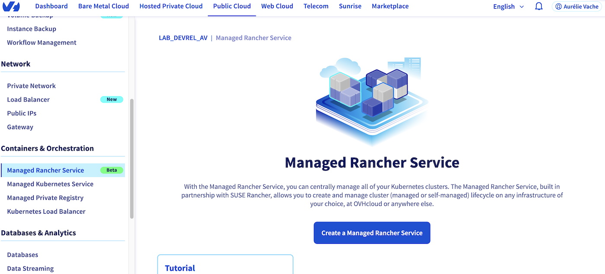{.thumbnail}

Click on the `Create a Managed Rancher Service`{.action} button.

Fill the name:
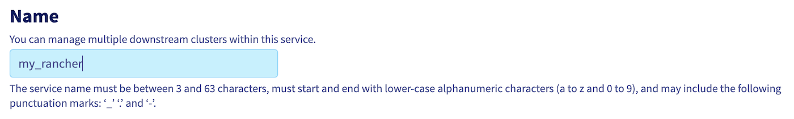{.thumbnail}

Choose your plan between **OVHcloud Edition** (coming soon) and **Standard**.

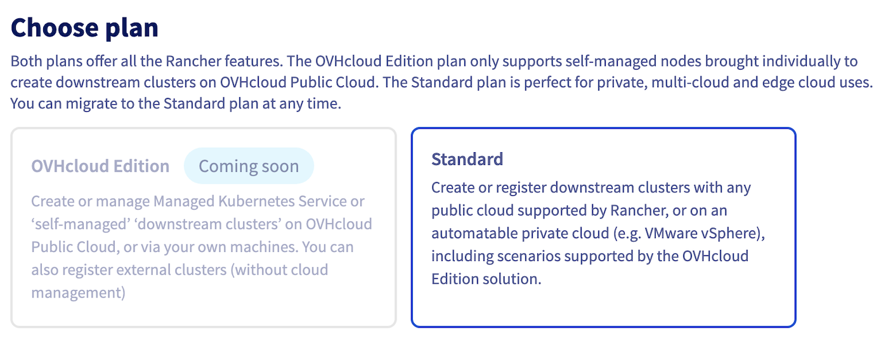{.thumbnail}

Choose the Rancher version and then click on `Create a Managed Rancher Service`{.action} button.

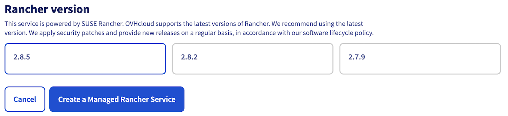{.thumbnail}

The Rancher creation is now in progress. It should be available within a few minutes in your OVHcloud Control Panel.

### Upating a Managed Rancher Service

Access the administration UI for your OVHcloud Managed Rancher instances by clicking on `Managed Rancher Service`{.action} in the left-hand menu.

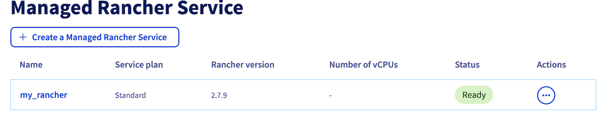{.thumbnail}

Click on the `...`{.action} button to the right of your Rancher instance and choose `Manage` or click on the name of your Rancher instance.

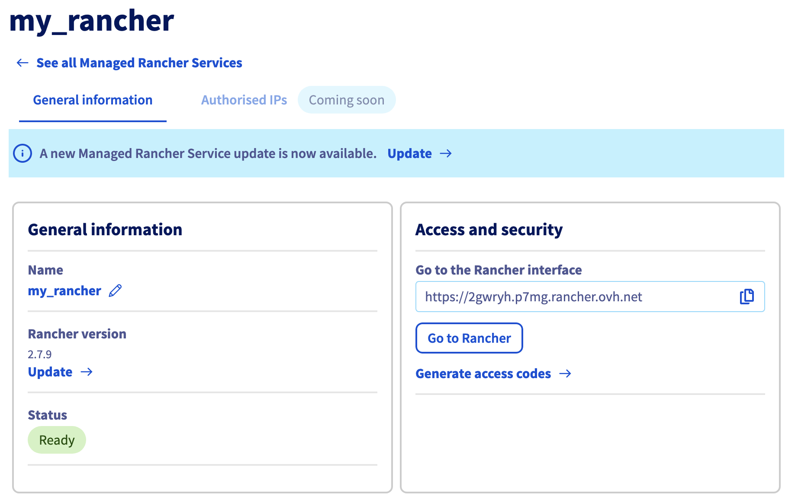{.thumbnail}

If the Rancher instance need to be updated, the information message `A new Managed Rancher Service update is now available.` is displayed.

Click on the `Update`{.action} button.

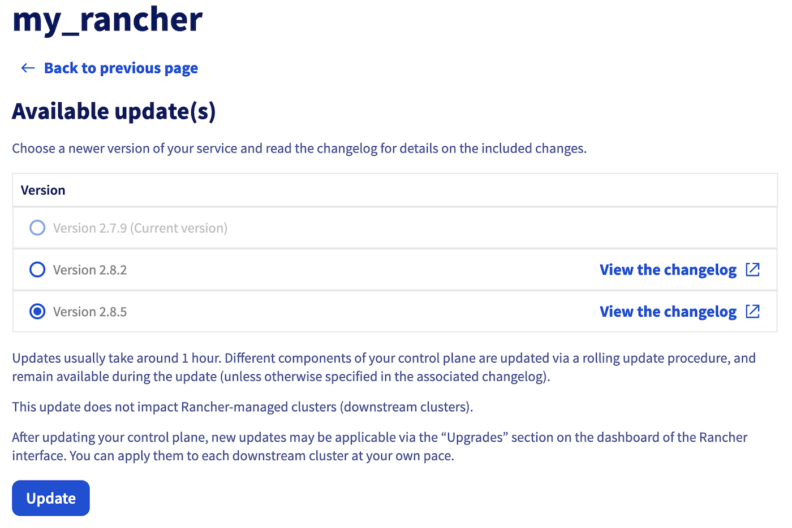{.thumbnail}

Choose the version and click on `Update`{.action} button.

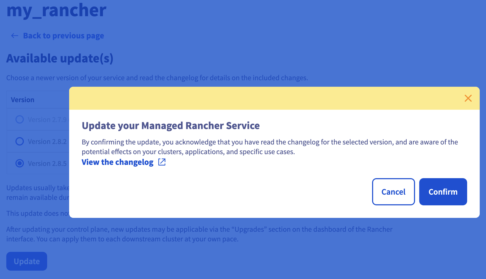{.thumbnail}

> [!warning]
>
>  You can read the changelog before updating a cluster by clicking on the `View the changelog{.action}` button.

A popup appear, click on the `Confirm`{.action} button to update your Rancher.

The Rancher instance is now updating. It should be updated within a few minutes.

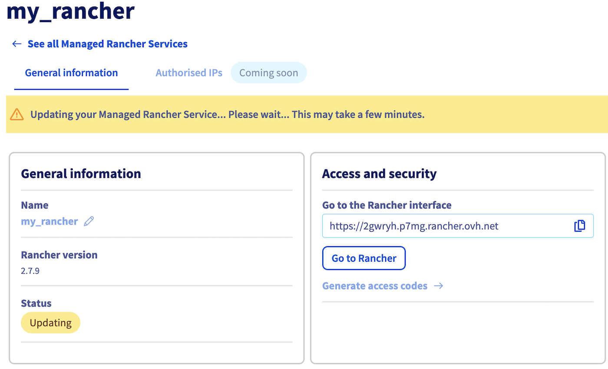{.thumbnail}

### Access a Managed Rancher Service

Access the administration UI for your OVHcloud Managed Rancher instances by clicking on `Managed Rancher Service`{.action} in the left-hand menu.

Click on the `...`{.action} button to the right of your Rancher instance and choose `Manage` or click on the name of your Rancher instance.

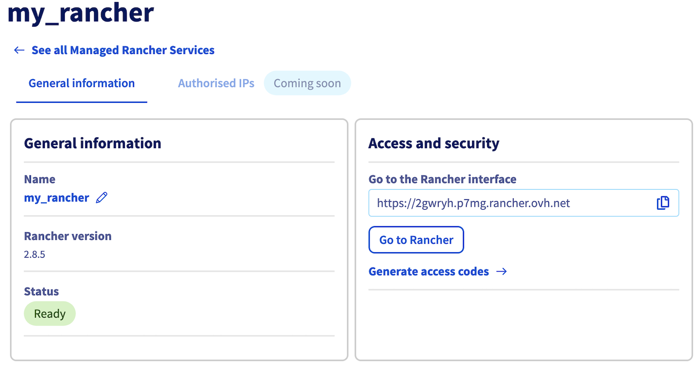{.thumbnail}

In the "Access and security" section, Click on `Generate access codes`{.action} button.

A popup will appear, then click on `Confirm`{.action} button.

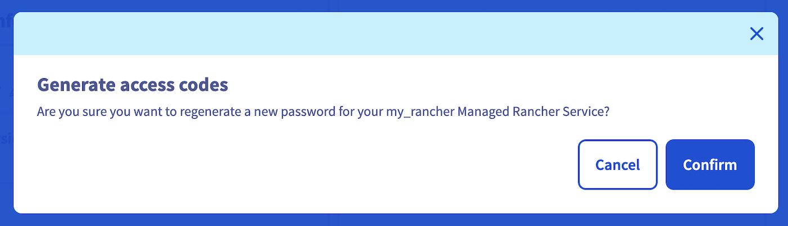{.thumbnail}

Copy/paste the generated username and password and click on `Go to Rancher`{.action} button to access to the Rancher login page.

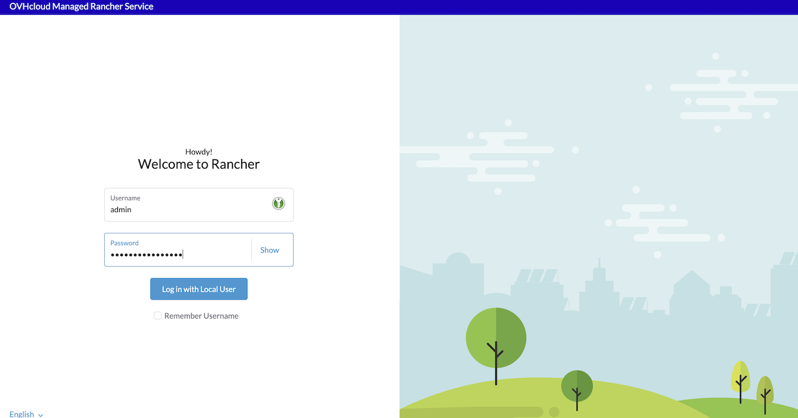{.thumbnail}

Finally, fill the Username and the Password fields and then click on `Log in with Local User`{.action} button.

> [!warning]
>
> At your first login, you will be asked to change your password with a randmly generated one or you can define it by yourself.
> In case of lost password, you have the possibility to generate a new one by using the Generate access details action button.

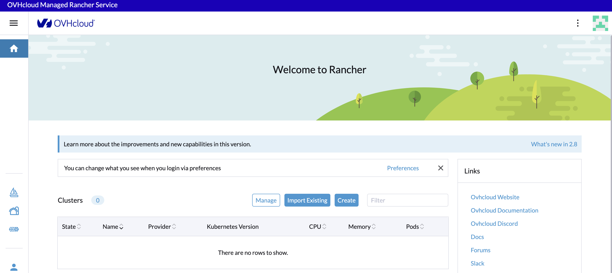{.thumbnail}

You now have access to the Rancher dashboard. It is designed to offer an intuitive and comprehensive view of your containerized environment.
This web-based interface serves as your command center for orchestrating containers & clusters, visualizing cluster health and managing various aspects of your Kubernetes infrastructure. Explore the navigation menu, which includes sections for clusters, projects, applications and Rancher settings.

## Go further

- To have an overview of OVHcloud Managed Rancher service, you can go to the [OVHcloud Managed Rancher page](https://www.ovhcloud.com/fr-ca/public-cloud/managed-rancher-service/).

- If you need training or technical assistance to implement our solutions, contact your sales representative or click on [this link](https://www.ovhcloud.com/fr-ca/professional-services/) to get a quote and ask our Professional Services experts for assisting you on your specific use case of your project.

- Join our community of users on <https://community.ovh.com/en/>.
