> [!warning]
>
> Usage of [Managed Rancher Service](https://labs.ovhcloud.com/en/managed-rancher-service/) is currently in Beta phase.
> This guide may be incomplete and will be extended during the beta phase. Our team remains available on our dedicated Discord Channel, do not hesitate to join and reach us: <https://discord.gg/ovhcloud>. Ask questions, provide feedback and interact directly with the team that builds our Container and Orchestration services.
>

## Objective

Managed Rancher Service by OVHcloud provides a powerful platform for orchestrating Kubernetes clusters seamlessly. You can use Rancher to launch a Kubernetes cluster on any platform and location including:

- Hosted Kubernetes provider (e.g. OVHcloud Managed Kubernetes Service, AWS EKS, GCP GKE, etc).
- Infrastructure Provider - Public Cloud or Private Cloud (vSphere, Nutanix, etc).
- Bare-metal servers, cloud hosted or on premise.
- Virtual machines, cloud hosted or on premise

In this guide we will explore how to **use OVHcloud as an Infrastructure Provider** and create a Kubernetes cluster based on [OVHcloud Compute Instances](https://www.ovhcloud.com/en-ca/public-cloud/compute/).

## Requirements

- A [Public Cloud project](https://www.ovhcloud.com/en-ca/public-cloud/) in your OVHcloud account
- An OVHcloud Managed Rancher Service (see the [creating a Managed Rancher Service](/pages/public_cloud/containers_orchestration/managed_rancher_service/create-update-rancher) guide for more information)
- An access to the Rancher UI to operate it (see the [connecting to the Rancher UI](/pages/public_cloud/containers_orchestration/managed_rancher_service/create-update-rancher) guide for more information)
- An [OpenStack user](/pages/public_cloud/compute/create_and_delete_a_user)
- A [private network with a Gateway](/pages/public_cloud/public_cloud_network_services/getting-started-02-create-private-network-gateway)

## Instructions

### Creating OVHcloud Public Cloud credentials

To create OVHcloud Public Cloud credential, you need to have an existing **OpenStack user** with the `Compute Operator` role as a minimum. Read this guide on how to [create an OpenStack user](/pages/public_cloud/compute/create_and_delete_a_user) if you don't have one yet.

Log in to your Managed Rancher Service UI.

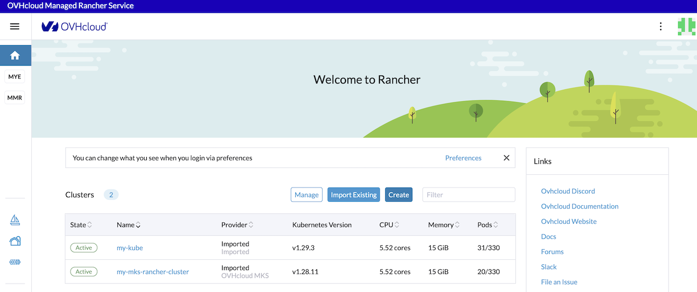{.thumbnail}

Click on `Cluster Management`{.action} in the menu.

Then click on `Cloud Credentials`{.action}.

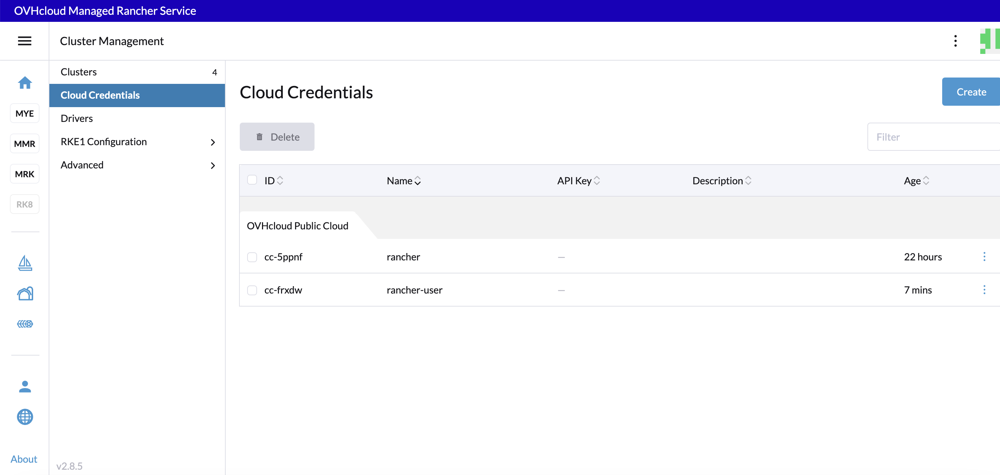{.thumbnail}

If you don't have any **OVHcloud Public Cloud** credentials yet, click the `Create`{.action} button.

Click the `OVHcloud Public Cloud`{.action} button.

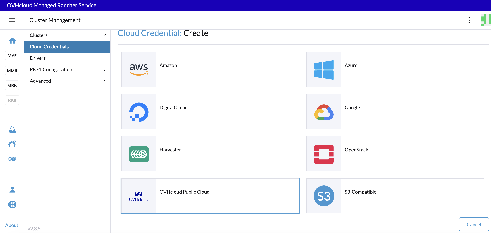{.thumbnail}

Define a name for the credentials, e.g. `pci`. Then fill in the OpenStack user's username and password.

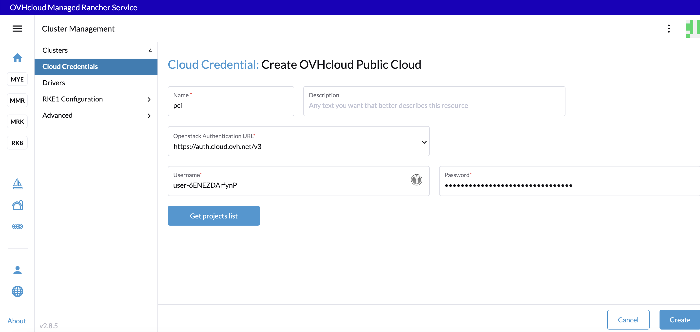{.thumbnail}

Click on `Get projects list`{.action}:

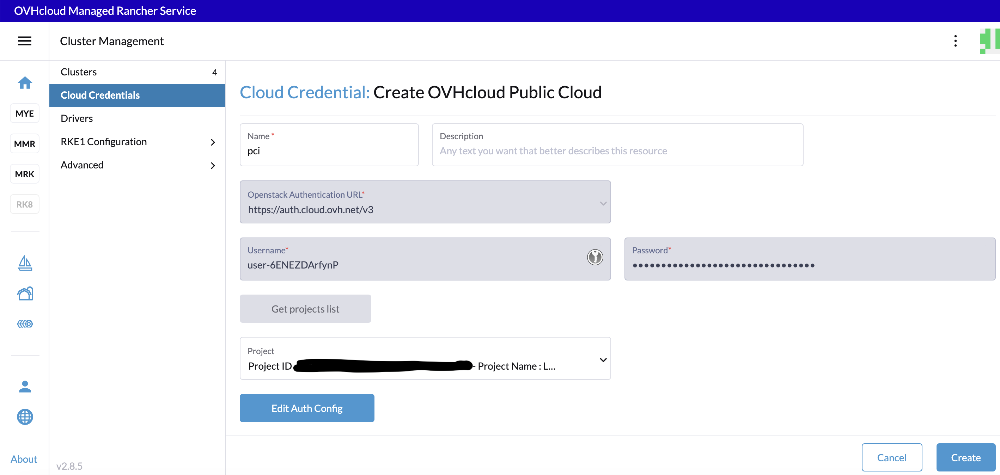{.thumbnail}

Select your Public Cloud Project in this list then click the `Create`{.action} button.

> [!warning]
>
> You don't have to click the `Edit Auth Config`{.action} button.

The OVHcloud Public Cloud credentials have been created. Now you can use them to create a Kubernetes cluster based on Public Cloud Instances (PCI). These credentials will be used to provision nodes in your clusters.
You can use these credentials to create several Kubernetes clusters.

### Creating a Kubernetes cluster on Compute Instances

Log in to your Managed Rancher Service UI.

{.thumbnail}

Click the `Create`{.action} button.

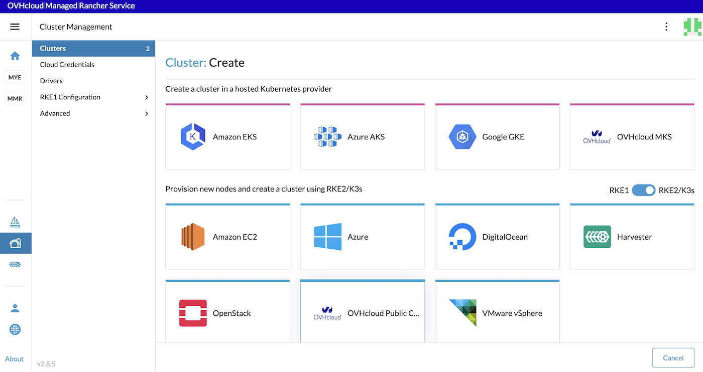{.thumbnail}

In Rancher you can create a Kubernetes cluster with different methods. To create a Kubernetes cluster running in Compute Instances, use the **Provision new nodes and create a cluster using RKE2/K3s** way and click the `OVHcloud Public Cloud`{.action} driver.

Select an OVHcloud Public Cloud credential:

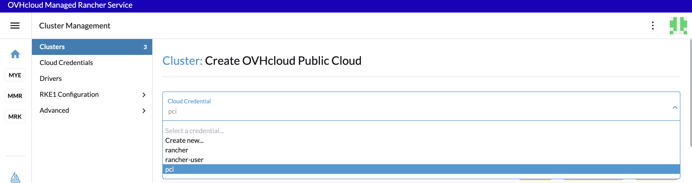{.thumbnail}

Then, define the cluster name.

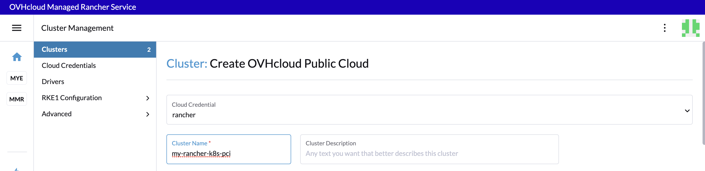{.thumbnail}

In the **Machine Pools** section you will configure your cluster.

> [!primary]
>
> When you configure a machine pool in Rancher, there are three roles that can be assigned to nodes: `etcd`, `Control Plane` and `Worker`.

Here are some good practices:

- At least 3 machines/nodes with the role `etcd` are needed to survive a loss of 1 node and have a minimum high availability configuration for etcd. 3 `etcd` nodes are generally sufficient for smaller and medium clusters, and 5 `etcd` nodes for large clusters.
- At least 2 machines/nodes with the role `Control Plane` for master component high availability.
- You can set both the `etcd` and `Control Plane` roles for one instance.
- The `Worker` role should not be used or added to nodes with the `etcd` or `Control Plane` role.
- At least 2 machines/nodes with the `Worker` role for workload rescheduling upon node failure.

In this guide we will:

- Create a machine pool with 3 compute instances for `etcd` and `Control Plane`.
- Create a machine pool with 2 compute instances for `Worker`.

For each of the machine pools, you have to:

- Define the pool name (`node-pool-1` for example for the first machine pool).
- Define machine count (3 for example for the first machine pool).
- Select roles (check `etcd` and `Control Plane` for the first machine pool)/
- Choose the region (`GRA9` for example for the first machine pool). If you want to check the availability of specific products that you plan to use alongside Kubernetes, you can refer to the [Availability of Public Cloud Product](/links/public-cloud/regions-pci) page.
- Choose the flavor (`b2-7` for example for ). You can refer to the [OVHcloud Flavor list](https://www.ovhcloud.com/en-ca/public-cloud/prices/).
- Choose the image for the Operating System (OS) used for your machines/nodes. Please refer to [Rancher Operating Systems and Container Runtime Requirements](https://ranchermanager.docs.rancher.com/how-to-guides/new-user-guides/kubernetes-clusters-in-rancher-setup/node-requirements-for-rancher-managed-clusters).
- Choose a Key Pair (optional). It's the SSH Key Pair that will be used to access your nodes. Please refer to this guide on [how to create a SSH KeyPair and add it to your Public Cloud project](/pages/public_cloud/compute/public-cloud-first-steps). If you leave this field empty, a new keypair will be generated automatically.
- Choose the Security Group that will be applied to created instances. You can leave the field empty.
- Choose the Availability Zone (only `nova` is supported at the moment).
- Choose the Floating IP Pools (only `Ext-Net` is supported at the moment).
- Choose the Networks. You need to choose a private network (with a gateway). The compute instances will be created in this private network.

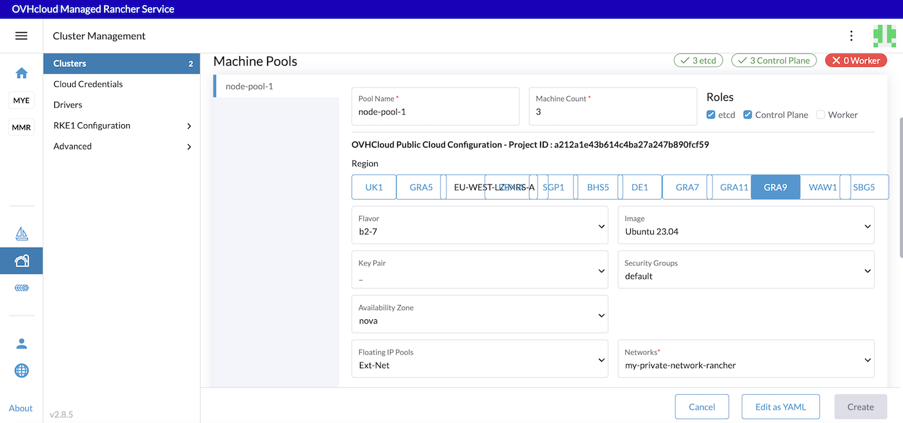{.thumbnail}

At the bottom of the **Machine Pools** section, click on the `+`{.action} button to add the second machine pool with 2 `workers` machines/nodes and the same configuration.

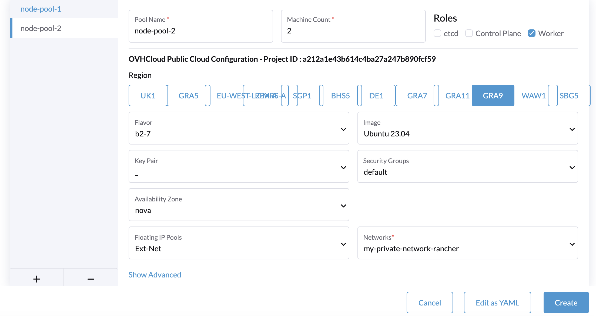{.thumbnail}

In the **Cluster Configuration** section, choose the Kubernetes version. You need to choose between RKE2 and K3s Kubernetes Operating System (OS). For a production environment, we recommend choosing RKE2.
Select the `Container Network`, choose if you want to activate a Project Network isolation and the System Services tooling you want to install in your cluster.

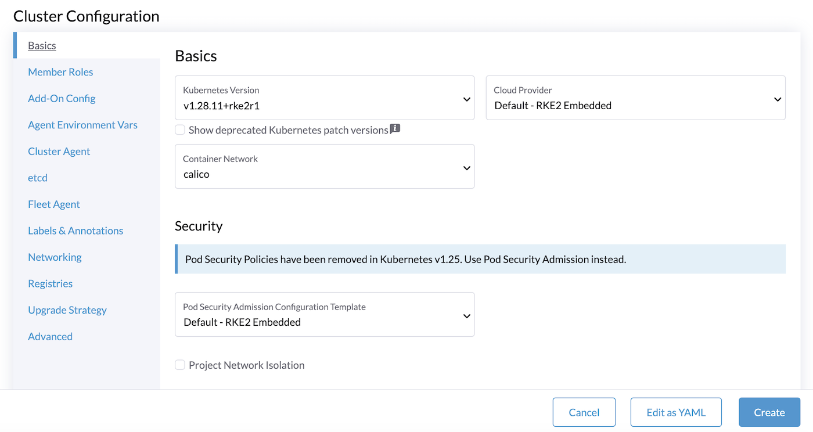{.thumbnail}

> [!primary]
>
> Follow the [RKE2 cluster configuration reference](https://ranchermanager.docs.rancher.com/reference-guides/cluster-configuration/rancher-server-configuration/rke2-cluster-configuration) for the Cluster Configuration.

In the **Member Roles** tab, you can add members for users that need to access the cluster.
After creating the cluster, you can also add members.

Finally, click the `Create`{.action} button to create your Kubernetes cluster with OVHcloud PCI driver.

The cluster creation can take several minutes (depending on the OS and on the number of nodes you want).

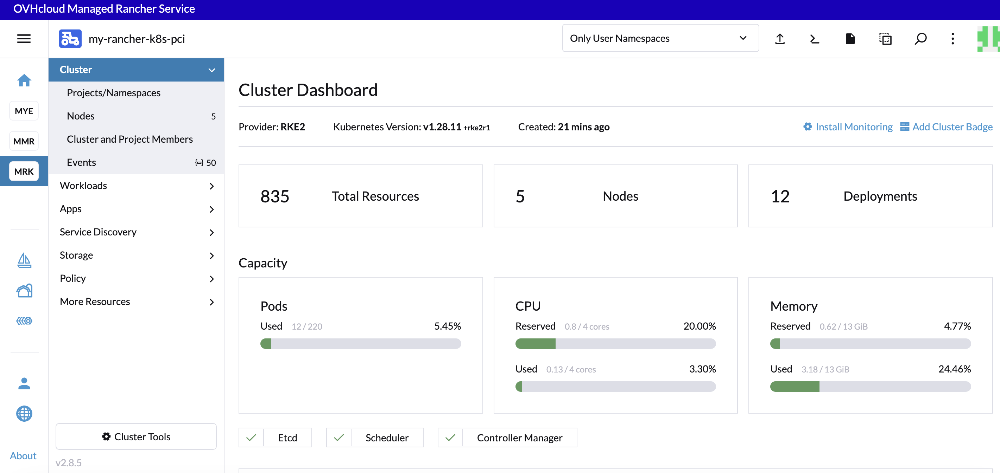{.thumbnail}

### Testing the Kubernetes cluster 

To test your cluster, on the Rancher UI, in the **Cluster** menu, after selecting your cluster, you can simply click on the `Kubectl Shell`{.action} icon to open a terminal.

{.thumbnail}

List the nodes:

```bash
kubectl get nodes
```

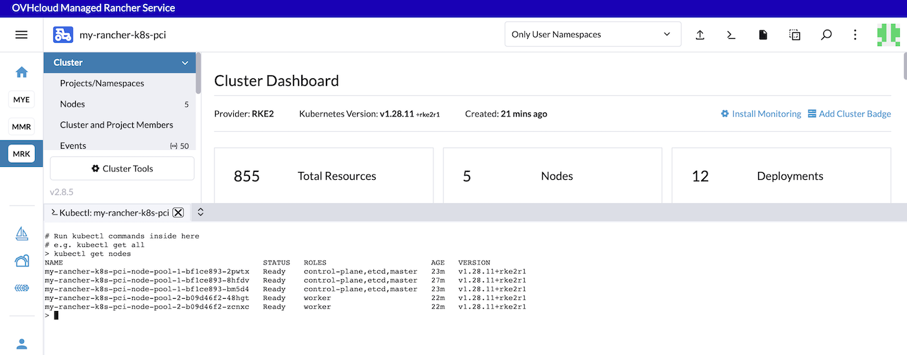{.thumbnail}

List the namespaces:

```bash
kubectl get ns
```

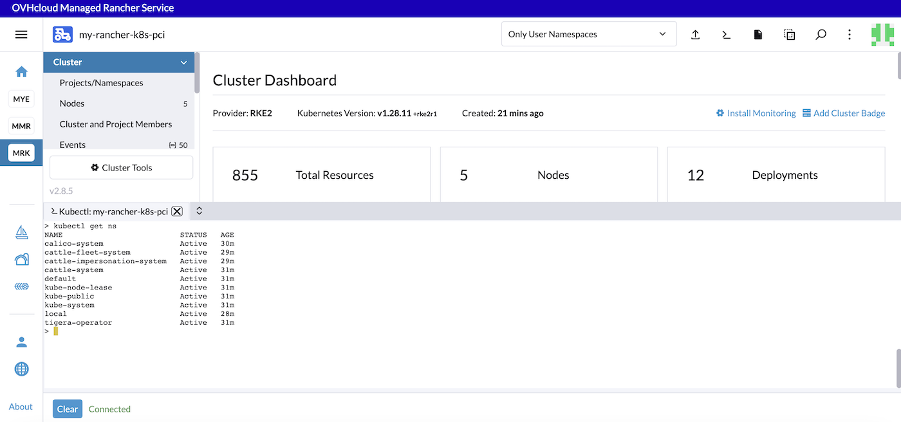{.thumbnail}

You can now install applications in your Kubernetes cluster though the `kubectl` CLI or the Rancher UI.

## Go further

- To have an overview of OVHcloud Managed Rancher Service, you can go to the [OVHcloud Managed Rancher Service page](https://www.ovhcloud.com/en-ca/public-cloud/managed-rancher-service/).

- If you need training or technical assistance to implement our solutions, contact your sales representative or click on [this link](/links/professional-services) to get a quote and ask our Professional Services experts for assisting you on your specific use case of your project.

- Join our [community of users](/links/community).
