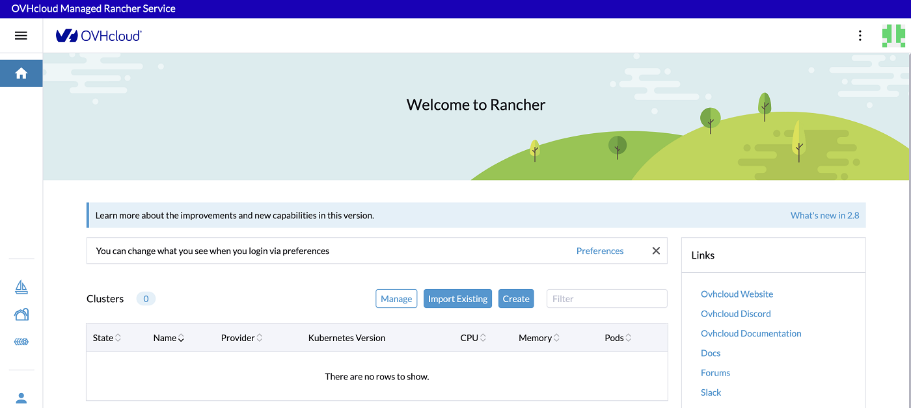
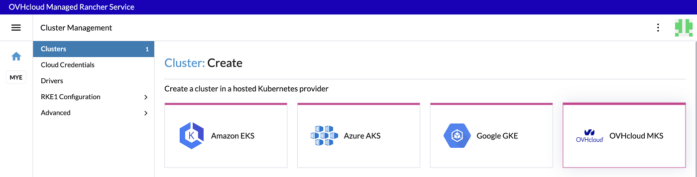
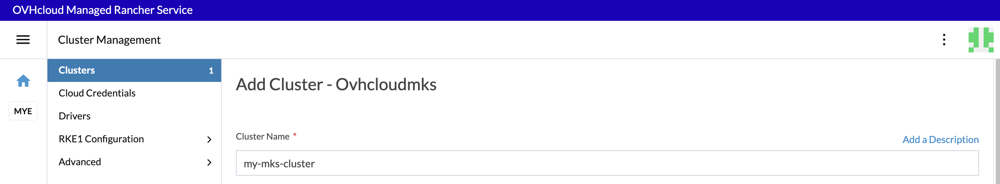
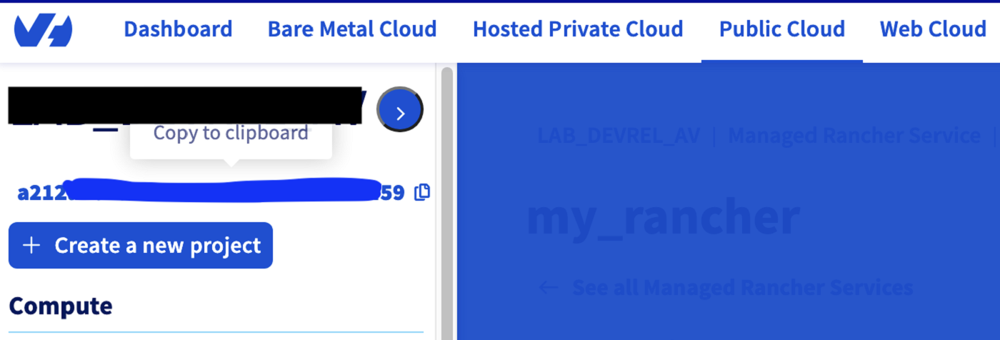
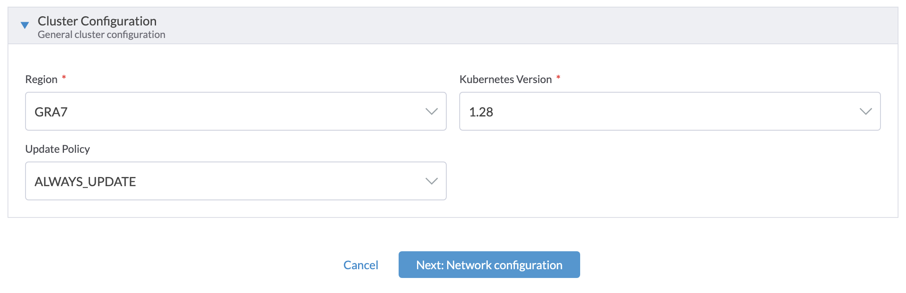
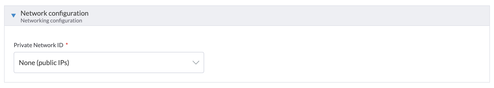
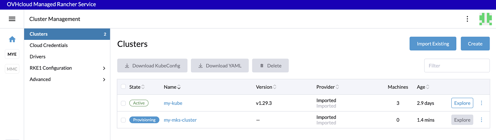
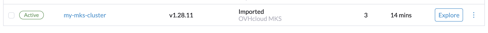
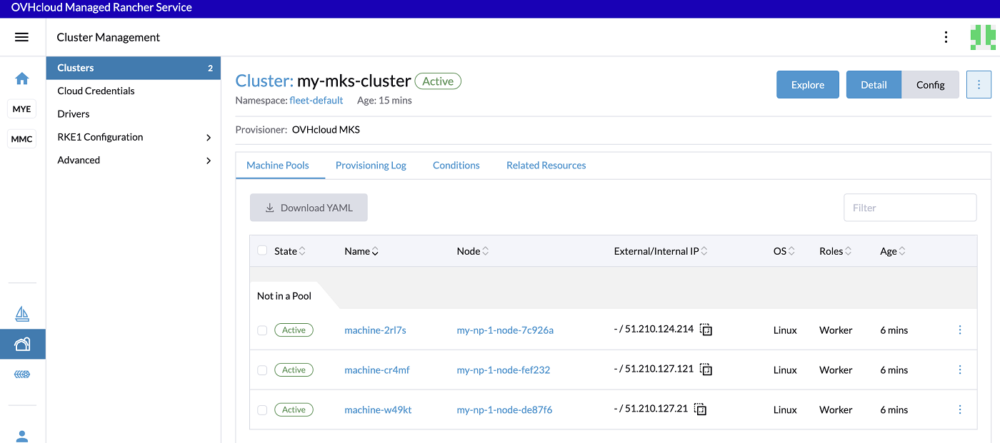

> [!warning]
>
> Usage of [Managed Rancher Service](https://labs.ovhcloud.com/en/managed-rancher-service/) is currently in Beta phase.
> This guide may be incomplete and will be extended during the beta phase. Our team remains available on our dedicated Discord Channel, do not hesitate to join and reach us: <https://discord.gg/ovhcloud>. Ask questions, provide feedback and interact directly with the team that builds our Container and Orchestration services.
>

## Objective

Managed Rancher Service by OVHcloud provides a powerful platform for orchestrating Kubernetes clusters seamlessly. In this guide we will explore how to create a Managed Kubernetes Service (MKS) cluster.

## Requirements

- A [Public Cloud project](/links/public-cloud/public-cloud) in your OVHcloud account
- An OVHcloud Managed Rancher Service (see the [creating a Managed Rancher Service](/pages/public_cloud/containers_orchestration/managed_rancher_service/create-update-rancher) guide for more information)
- An access to the Rancher UI to operate it (see the [connecting to the Rancher UI](/pages/public_cloud/containers_orchestration/managed_rancher_service/create-update-rancher) guide for more information)

## Instructions

### Creating a Managed Kubernetes Service (MKS) cluster

You can create your [OVHcloud Managed Kubernetes Service](/links/public-cloud/kubernetes) clusters via the OVHcloud Control Panel, the OVHcloud API and the OVHcloud Terraform provider, but managing several Kubernetes clusters can be complicated, so let's discover how to create an MKS cluster via Managed Rancher Service (MRS).

Log in to your Managed Rancher Service UI.

{.thumbnail}

Next, click on the `Create`{.action} button.

{.thumbnail}

In Rancher, you can create a Kubernetes cluster in a different way. To create an MKS cluster, use the **hosted Kubernetes provider** way and click on the `OVHcloud MKS`{.action} driver.

First, enter an MKS cluster name, for example `my-mks-cluster`:

{.thumbnail}

(Optional) You can configure **Member Roles** to control who has access to the cluster and what permissions they have to change it. If you want to change the default parameters, click the `Add Member`{.action} button to add users that can access the cluster and use the **Role** drop-down menu to set permissions for each user.

(Optional) You can add **Labels & Annotations** on your cluster. Click on the `Add Label`{.action} button if you want to add some labels and on the `Add Annotation`{.action} button if you want to add some annotations.

For the **Account Configuration**, you need to provide your OVHcloud API credentials (`Application Key`, `Application Secret` and `Consumer Key`).
If you don't have OVHcloud API credentials, you can follow our guide on how to [Generate your OVHcloud API keys](/pages/manage_and_operate/api/first-steps#advanced-usage-pair-ovhcloud-apis-with-an-application).

Also provide your `Public Cloud project ID`. The project ID is where your Managed Kubernetes Service (MKS) cluster will be deployed. You can follow the guide on [How to create your first Project](/pages/public_cloud/compute/create_a_public_cloud_project) or if already existing, you can copy/paste it from the [OVHcloud Control Panel](/links/manager) or [API](https://eu.api.ovh.com/console-preview/?section=%2Fcloud&branch=v1#get-/cloud/project).

{.thumbnail}

Finally, for this step, choose an `OVH API Endpoint`, depending on your location (EU, US or CA).

For the **Cluster Configuration**, you need to select the `Region` where your cluster will be deployed. Then, select the `Kubernetes Version`. Note that only versions supported by the current version of Rancher are listed (you can refer to the [Official Support Matrix](https://www.suse.com/suse-rancher/support-matrix/all-supported-versions)). Then, select `Update Policy` information. If you want further information, refer to the [Managed Kubernetes Update Policies](/pages/public_cloud/containers_orchestration/managed_kubernetes/change-security-update) guide.

{.thumbnail}

For the **Network Configuration**, in the `Private Network ID` field, select an existing OVHcloud Public Cloud private network or choose `None` if you want to create a cluster with nodes using only public interfaces.

{.thumbnail}

For the **NodePools Configuration**, for every NodePool you want to:

- Enter the **Name** of the NodePool. The name must be unique inside a same MKS cluster.
- Choose an OVHcloud instance **Flavor** used by this NodePool.
- Enable or disable the Autoscaling.
- Enter the number of nodes you want, it's the **Size** of your NodePool. If the autoscaling is enabled, then choose the minimum and maximum number of nodes.
- Enable the **Monthly Billing** (Hourly billing by default).
- Click on the `Add Node Pool`{.action} button to add the node pool in the list below.

You can add multiple Node Pools and then manage your list of Node Pools. Note that the "Delete" button (represented by a garbage icon) next to your first NodePool is grayed out until a second one is created.

{.thumbnail}

Click on the `Finish & Create Cluster`{.action} button.

Your MKS cluster is provisioning, the creation will take several minutes. 

{.thumbnail}

{.thumbnail}

When the MKS cluster becomes `Active`, click on the name of your cluster in order to jump into the **Cluster** view and have more information.

{.thumbnail}

You can click on the `Explore`{.action} button to manage your MKS Cluster.

> [!warning]
>
> Deploying to OVHcloud will incur charges. For more information, refer to the [MKS](https://www.ovhcloud.com/es/public-cloud/prices/#568) and [Compute](https://www.ovhcloud.com/es/public-cloud/prices/) pricing pages.
>
> Once your Managed Kubernetes clusters are created, we do recommend performing all actions (upgrade, nodepool management, cluster modification) from the Rancher console and not performing any action directly via the OVHcloud API, OVHcloud Terraform provider or the OVHcloud Control Panel as this can lead to desynchronization.
>

## Go further

- To have an overview of the OVHcloud Managed Rancher Service, you can go to the [OVHcloud Managed Rancher Service page](https://www.ovhcloud.com/es/public-cloud/managed-rancher-service/).

- If you need training or technical assistance to implement our solutions, contact your sales representative or click on [this link](/links/professional-services) to get a quote and ask our Professional Services experts for assisting you on your specific use case of your project.

Join our [community of users](/links/community).