> [!warning]
>
> Usage of [Managed Rancher Service](https://labs.ovhcloud.com/en/managed-rancher-service/) is currently in Beta phase.
> This guide may be incomplete and will be extended during the beta phase. Our team remains available on our dedicated Discord Channel, do not hesitate to join and reach us: <https://discord.gg/ovhcloud>. Ask questions, provide feedback and interact directly with the team that builds our Container and Orchestration services.
>

## Objective

Managed Rancher Service by OVHcloud provides a powerful platform for orchestrating Kubernetes clusters seamlessly. 

This guide will show you how to deploy, in Rancher, a monitoring stack (Prometheus & Grafana) to monitor your Kubernetes cluster.

The `rancher-monitoring` operator is powered by [Prometheus](https://prometheus.io/), [Grafana](https://grafana.com/grafana/), [Alertmanager](https://prometheus.io/docs/alerting/latest/alertmanager/), the [Prometheus Operator](https://github.com/prometheus-operator/prometheus-operator), and the [Prometheus adapter](https://github.com/DirectXMan12/k8s-prometheus-adapter).

The monitoring application allows you to:

- Monitor the state and processes of your cluster nodes, Kubernetes components, and software deployments
- Define alerts based on metrics collected via Prometheus
- Create custom Grafana dashboards
- Configure alert-based notifications via Email, Slack, PagerDuty, etc. using Prometheus Alertmanager
- Define precomputed, frequently needed or computationally expensive expressions as new time series based on metrics collected via Prometheus
- Expose collected metrics from Prometheus to the Kubernetes Custom Metrics API via Prometheus Adapter for use in HPA

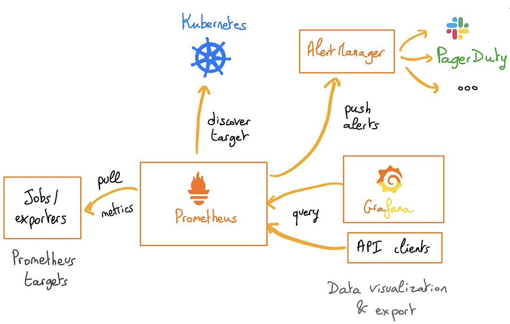{.thumbnail}

## Requirements

- A [Public Cloud project](/links/public-cloud/public-cloud) in your OVHcloud account
- An OVHcloud Managed Rancher Service (see the [creating a Managed Rancher Service](/pages/public_cloud/containers_orchestration/managed_rancher_service/create-update-rancher) guide for more information)
- An access to the Rancher UI to operate it (see the [connecting to the Rancher UI](/pages/public_cloud/containers_orchestration/managed_rancher_service/create-update-rancher) guide for more information)
- A Kubernetes cluster created or imported in Rancher

## Instructions

In this guide you will deploy the monitoring Helm chart that is based on the upstream [kube-prometheus-stack chart](https://github.com/prometheus-community/helm-charts/tree/main/charts/kube-prometheus-stack). The chart deploys [Prometheus Operator](https://github.com/prometheus-operator/prometheus-operator) and its CRDs along with [Grafana](https://github.com/grafana/helm-charts/tree/main/charts/grafana), [Prometheus Adapter](https://github.com/prometheus-community/helm-charts/tree/main/charts/prometheus-adapter) and additional charts / Kubernetes manifests to gather metrics. It allows users to monitor their Kubernetes clusters, view metrics in Grafana dashboards, and set up alerts and notifications.

### Install the monitoring stack (Prometheus & Grafana)

Log in to your Managed Rancher Service UI.

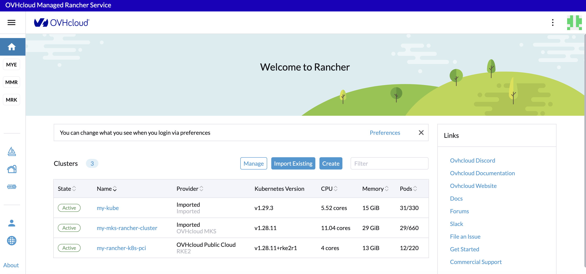{.thumbnail}

Click on the name of your cluster.

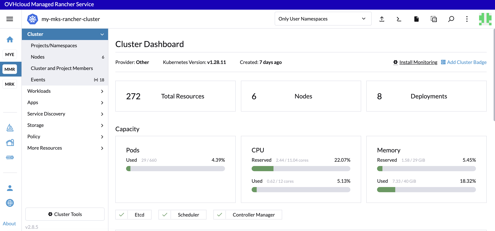{.thumbnail}

Click on `Install Monitoring`{.action}.

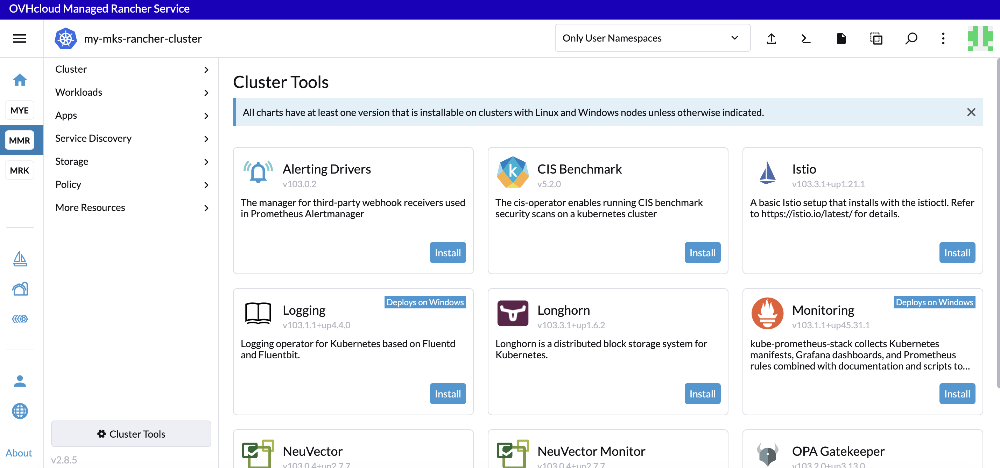{.thumbnail}

Click on `Install`{.action} in the **Monitoring** app to install Prometheus.

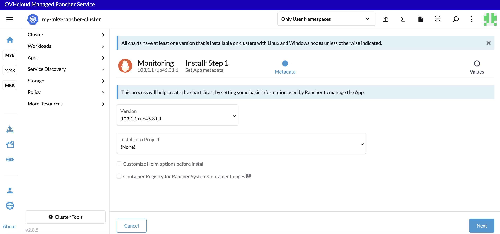{.thumbnail}

You can customize Helm chart options if you want by ticking the `Customize Helm options before install` checkbox.

Click the `Next`{.action} button to jump into the second step.

Choose the `Cluster Type`.

> [!warning]
>
> Select `K3s` or `RKE2` if you installed the Kubernetes cluster nodes with Rancher or `Other` for a MKS cluster.

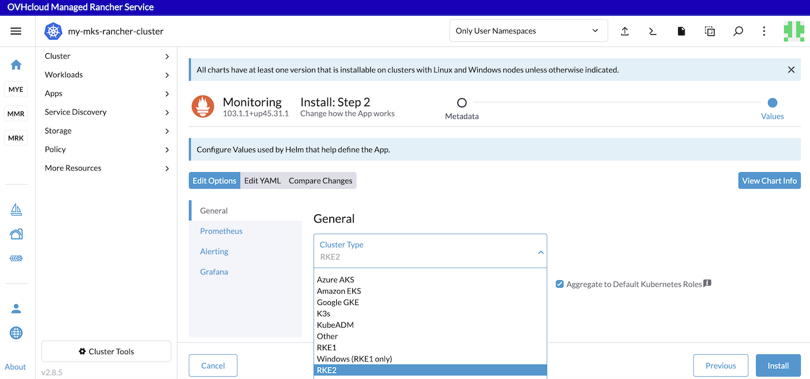{.thumbnail}

In the `Prometheus` tab you can configure scrapping intervals, retention and resource memory and limits.

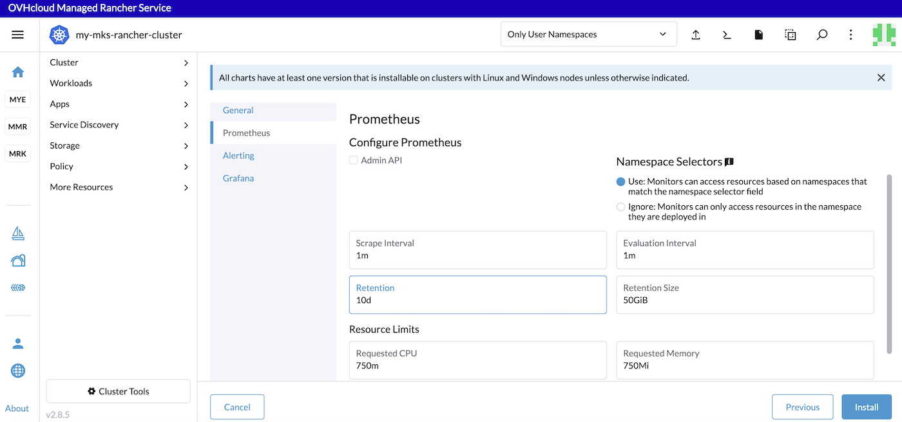{.thumbnail}

In the `Alerting` tab you can configure and deploy Alertmanager.

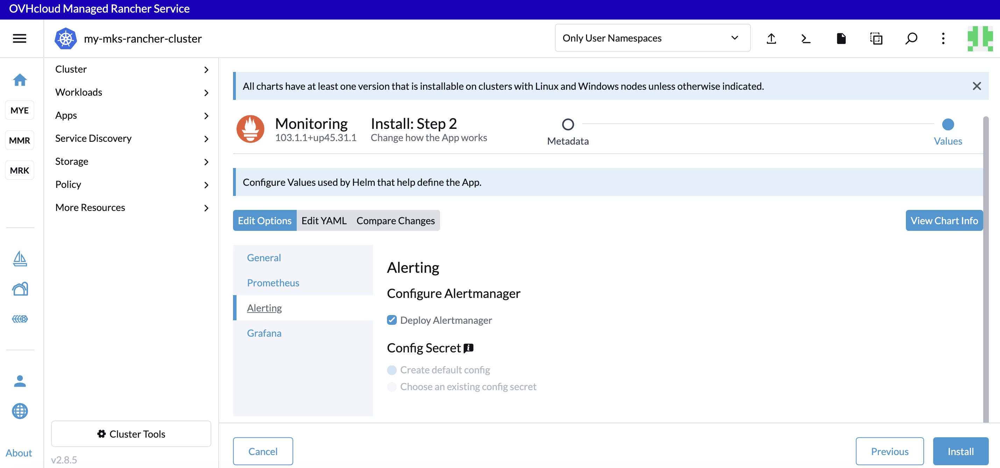{.thumbnail}

In the `Grafana` tab you can view the chart info and configure Grafana storage.

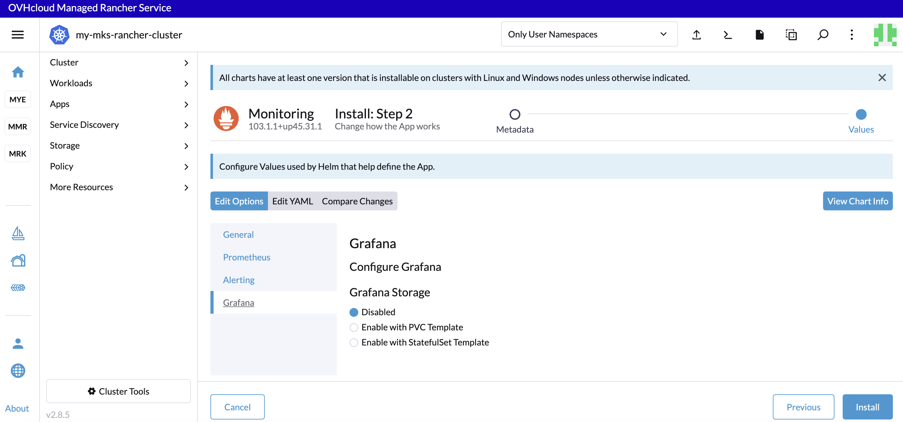{.thumbnail}

Click the `Install`{.action} button to install the monitoring stack.

The Logs will be displayed and showing you that the Helm chart has been installed.

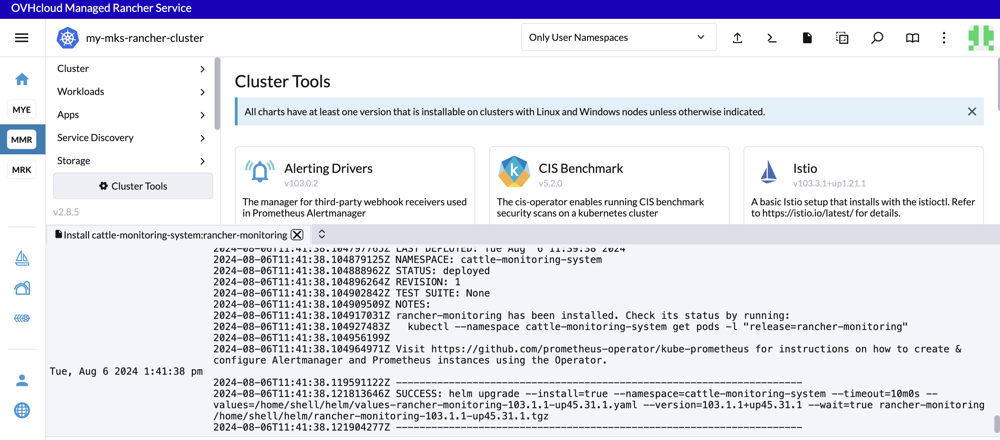{.thumbnail}

Click the `Kubectl Shell` icon to open a terminal inside Rancher and then execute the following command to list the monitoring pods installed:

```bash
kubectl get po -n cattle-monitoring-system
```

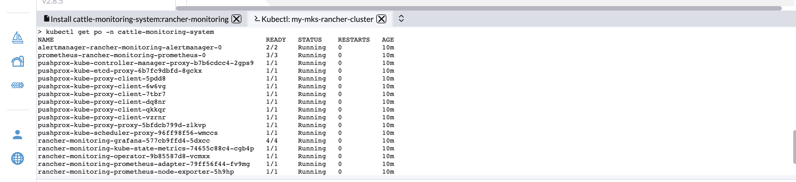{.thumbnail}

### View metrics and Grafana dashboards

By default, the monitoring application deploys:

- Grafana dashboards (curated by the kube-prometheus project) onto a cluster.
- An Alertmanager UI and a Prometheus UI.
- Exporters (such as node-exporter and kube-state-metrics).
- Some alerts by default.

On the Rancher UI, click the `Cluster Management`{.action} menu, then click the `Explore`{.action} button for the cluster which metrics you want to visualize.

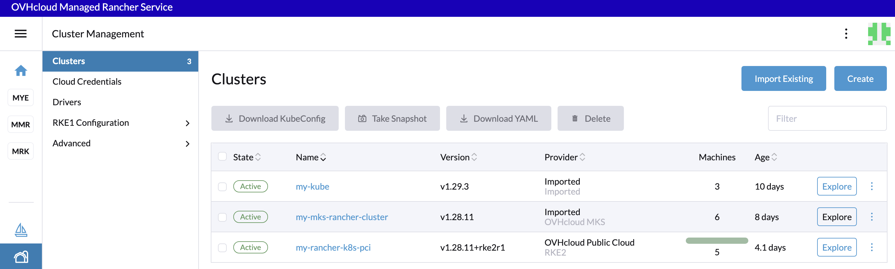{.thumbnail}

In the left navigation bar, click on `Monitoring`{.action}.

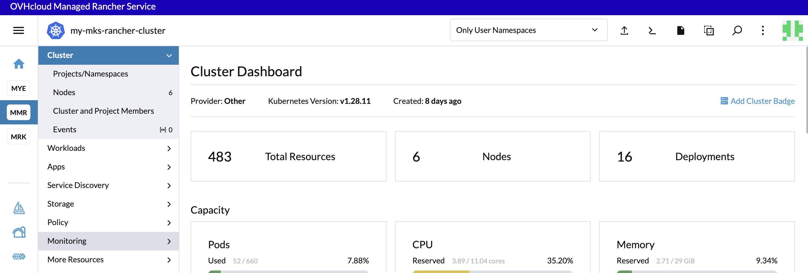{.thumbnail}

In this page you can see the links to the Alertmanager, Grafana dashboard and also active Prometheus alerts.

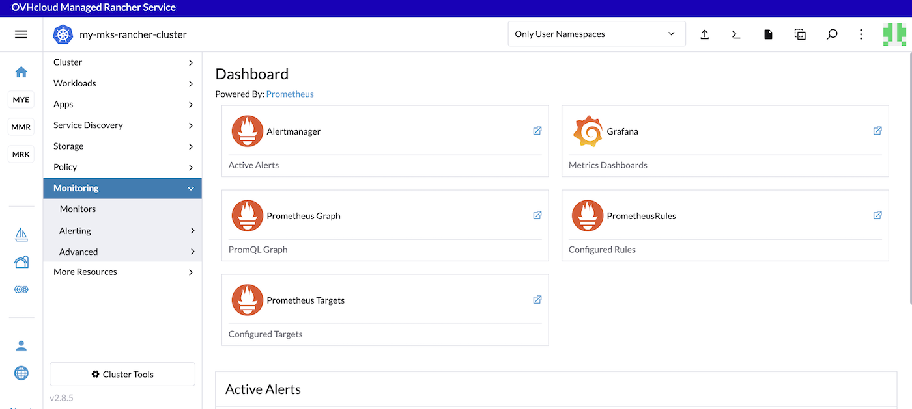{.thumbnail}

By clicking on the Grafana link you can see the Grafana dashboards:

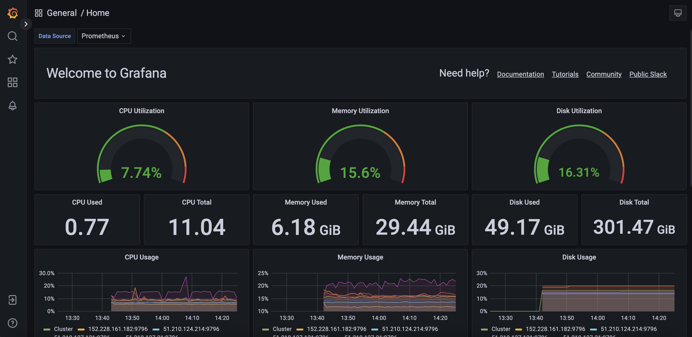{.thumbnail}

You can also execute PromQL queries.

Without doing anything on your side, several built-in metrics are already available. You can test them by typing `sum(kube_pod_owner{job="kube-state-metrics"}) by (namespace)` in the search bar.

Click the `Execute`{.action} button to determine if the Kubernetes metrics are visible:

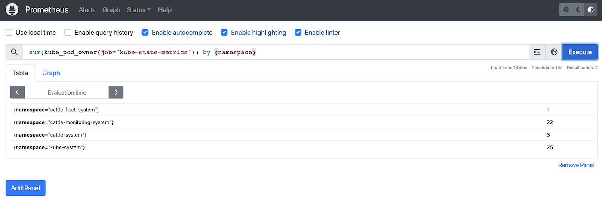{.thumbnail}

Thanks to this PromQL query you can list the number of pods per namespace in your Kubernetes cluster.

### Known issues

In the installation view, you can have a warning message: "This chart requires 4.5 CPU cores, but the cluster only has xx.x available":

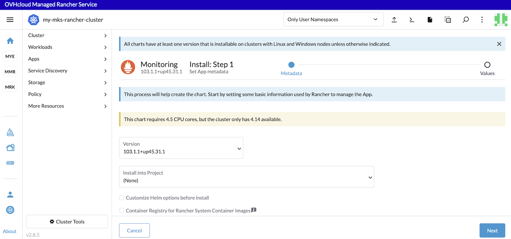{.thumbnail}

If it's the case, you can add more nodes in your Kubernetes cluster and try the installation of the monitoring stack.

## Go further

- Follow the Rancher official documentation to know more about [monitoring and alerting](https://ranchermanager.docs.rancher.com/v2.5/explanations/integrations-in-rancher/monitoring-and-alerting).

- When the monitoring application is installed, you will be able to [edit components in the Rancher UI](https://ranchermanager.docs.rancher.com/v2.5/explanations/integrations-in-rancher/monitoring-and-alerting/how-monitoring-works#components-exposed-in-the-rancher-ui).

- To have an overview of OVHcloud Managed Rancher Service, you can go to the [OVHcloud Managed Rancher Service page](/links/public-cloud/rancher).

- If you need training or technical assistance to implement our solutions, contact your sales representative or click on [this link](/links/professional-services) to get a quote and ask our Professional Services experts for assisting you on your specific use case of your project.

Join our [community of users](/links/community).
