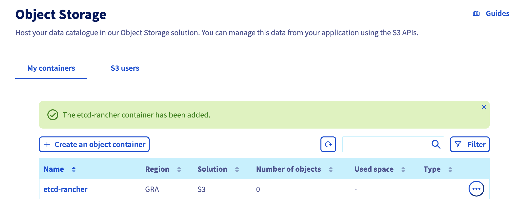
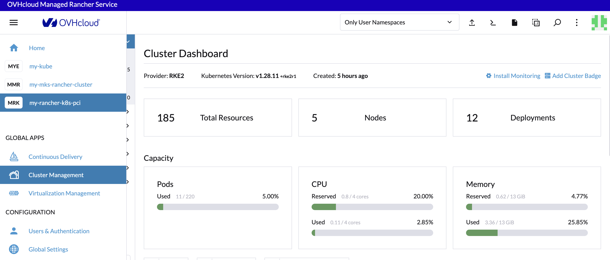
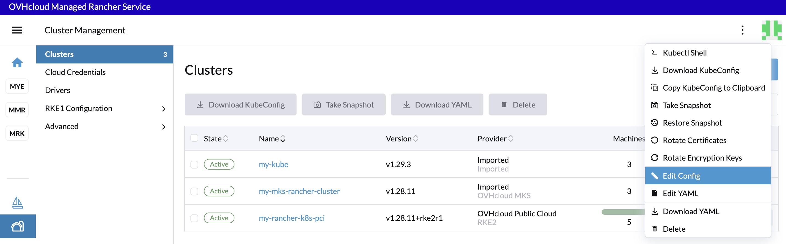

When you create or edit a Custom Kubernetes cluster or a cluster running on OVHcloud Public Cloud Instances (PCI), you can enable the etcd backups snapshots on S3.

In this guide we ill explore how to do that.

### Create a OVHcloud Object Storage S3 backup

First, you need to have an Object Storage container, if you don't already had one, you can follow the [Creating an Object Storage container](https://help.ovhcloud.com/csm/en-gb-public-cloud-storage-pcs-create-container?id=kb_article_view&sysparm_article=KB0047112) guide.

For this guide, our Object Storage container is named `etcd-rancher` and its region is `GRA`.

{.thumbnail}

> [!primary]
> 
> Save the S3 credentials, you will use the `S3 access key` and the `S3 secret key` in the coming etcd backup configuration.

### Enable etcd backup snapshots to S3 on an existing Kubernetes cluster

Log in your Managed Rancher Service UI.

{.thumbnail}

Click on `Cluster Management`{.action} in the menu.

For the choosen cluster, click on the three dot button and then in `Edit Config`{.action} button.

{.thumbnail}

In the **Cluster Configuration** section, click on the **etcd** tab.
In **Backup Snapshots to S3**, change the radio button Disable to `Enable`.

In the Authentication list, select the `Create a S3-Compatible Auth Secret`.
Fill the S3 Access Key, the S3 Secret Key and the bucket name.
Finally, fill the Region (in lowercase) and the endpoint `https://s3.gra.cloud.ovh.net`: 

{.thumbnail}

