## Objective

Container orchestration has become a cornerstone of modern application deployment, offering scalability, flexibility, and resource efficiency. Rancher is an open-source container management platform that simplifies the deployment and management of Kubernetes clusters.
Managed Rancher Service by OVHcloud provides a powerful platform for orchestrating Kubernetes clusters seamlessly. In this Getting Started guide we will explore the intricacies of setting up and managing container clusters.

## Requirements

- A [Public Cloud project](/pages/public_cloud/compute/create_a_public_cloud_project) in your OVHcloud account
- Access to the [OVHcloud Control Panel](/links/manager)

> [!success]
> Take advantage of reduced prices by committing to a period of 1 to 36 months on your Public Cloud resources. More information on our [Savings Plans](/links/public-cloud/savings-plan) page.

## Instructions

### Rancher Creation and Access

To initiate your journey, log in to the [OVHcloud Control Panel](/links/manager) and open the `Public Cloud`{.action} section.
Then access the `Managed Rancher Service`{.action} under the `Containers & Orchestration` section.
Using the OVHcloud Control Panel you can trigger the creation of a Rancher which will be operated and managed by OVHcloud.

Simply click on the `Create`{.action} button at the top right of the Control Panel and follow the steps below:

1. Define your Rancher's name.
2. Select your Plan between **OVHcloud Edition** (coming soon) and **Standard**.
3. Select the Rancher version.
4. Click on `Create`{.action}.
5. Wait for your Rancher to be created.
6. Access the details of your newly created Rancher by clicking on its name.
7. In the "Security and Access" section, click on `Generate access details`{.action}, confirm, then click `Access Rancher UI`{.action}.
8. Copy/Paste the provided credentials on the Rancher login page. Note: you will need to change your password at first login. In case of lost password, you have the possibility to generate a new one by using the `Generate access details`{.action} action button.

You now have access to the Rancher dashboard. It is designed to offer an intuitive and comprehensive view of your containerized environment.
This web-based interface serves as your command center for orchestrating containers & clusters, visualizing cluster health and managing various aspects of your Kubernetes infrastructure. Explore the navigation menu, which includes sections for clusters, projects, applications and Rancher settings.

As it is a brand new Rancher instance you do not have any downstream Kubernetes cluster. The next step will describe how to add one. To do so, you have two options: Importing an existing Kubernetes cluster or creating a new cluster using Rancher.

### Creating or importing a Kubernetes cluster

#### Creating a Kubernetes cluster with Rancher

Using this option you will be able to create a Kubernetes cluster from scratch. Rancher simplifies the creation of clusters by allowing you to create them through the Rancher UI rather than more complex alternatives.
You can use Rancher to launch a Kubernetes cluster on any platform and location including:

- Hosted Kubernetes provider (e.g. OVHcloud Managed Kubernetes Service, AWS EKS, GCP GKE, etc).
- Infrastructure Provider - Public Cloud or Private Cloud (vSphere, Nutanix, etc).
- Bare-metal servers, cloud hosted or on premise.
- Virtual machines, cloud hosted or on premise.

For the last three options, when Rancher deploys Kubernetes onto these nodes, you can choose between the Rancher Kubernetes Engine (`RKE2`) or `K3s` distributions.

Follow the official Rancher documentation on [How to launch Kubernetes with Rancher](https://ranchermanager.docs.rancher.com/how-to-guides/new-user-guides/launch-kubernetes-with-rancher). This documentation explains how to define cluster settings, the number of nodes (master, worker, etcd), authentication and other additional configuration.

We will detail below how to use OVHcloud as a Hosted Kubernetes provider and Infrastructure Provider using our official OVHcloud Drivers.

##### Use OVHcloud as a **Hosted Kubernetes Provider**

> [!warning]
>
> Deploying to OVHcloud will incur charges. For more information, refer to the [MKS](https://www.ovhcloud.com/en-ie/public-cloud/prices/#568) and [Compute](/links/public-cloud/prices) pricing pages.
> Once your Managed Kubernetes clusters are created, we do recommend performing all actions (upgrade, nodepool management, cluster modification) from the Rancher console and not performing any action directly via the OVHcloud API or the OVHcloud Control Panel as this can lead to desynchronizations.
>

On this part we will detail how to use Rancher to create and manage [OVHcloud Managed Kubernetes Service](/links/public-cloud/kubernetes) clusters.

1. From the Rancher Homepage, click on `Create`{.action}.

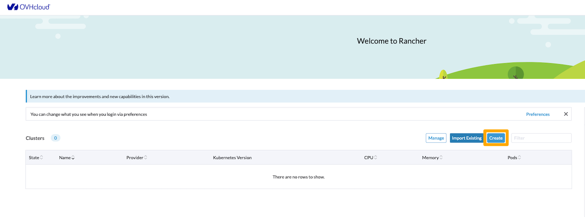{.thumbnail}

2\. Use the OVHcloud **Hosted Kubernetes provider** by clicking on `OVHcloud MKS`{.action}.

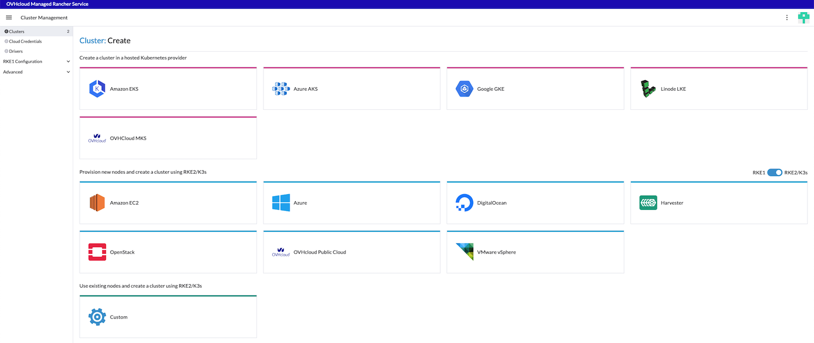{.thumbnail}

3\. Set the parameters of your MKS cluster:

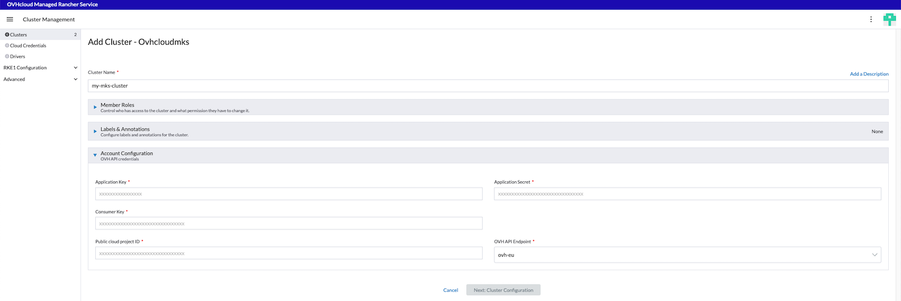{.thumbnail}

You need to provide the following parameters:

| Field | Mandatory | Description |
|---|---|---|
| Name | Yes | Name of the Managed Kubernetes Service Cluster that will be created. |
| Member Roles | Yes, default value is ok | Configure user authorization for the cluster. Click `Add Member`{.action} to add users that can access the cluster. Use the Role drop-down menu to set permissions for each user. |
| Label & Annotations | No | Add Kubernetes labels or annotations to the cluster. |
| Account Configuration | Yes | Provide your OVH API credentials, you can follow our guide on how to [Generate your OVHcloud API keys](/pages/manage_and_operate/api/first-steps#advanced-usage-pair-ovhcloud-apis-with-an-application). wildcard. |
| Application Key | Yes | Refer to the guide provided above. Value is provided at the API keys generation step on <https://www.ovh.com/auth/api/createToken>. |
| Consumer Key | Yes | Refer to the guide provided above. Value is provided at the API keys generation step on <https://www.ovh.com/auth/api/createToken>. |
| Application Secret | Yes | Refer to the guide provided above. Value is provided at the API keys generation step on <https://www.ovh.com/auth/api/createToken>. |
| Public Cloud project ID | Yes | The projectID of the OVHcloud project where your MKS cluster will be deployed. You can follow the guide on [How to create your first Project](/pages/public_cloud/compute/create_a_public_cloud_project) or if already existing, you can copy/paste it from the OVHcloud Control Panel or [API](https://eu.api.ovh.com/console-preview/?section=%2Fcloud&branch=v1#get-/cloud/project) |
| OVH API Endpoint | Yes | Select the OVHcloud subsidiary (EU, US, CA) |

4\. Move to **Cluster Configuration**

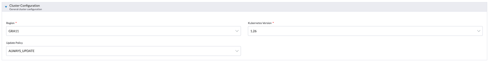{.thumbnail}

Provide the following parameters:

- The **Region** where your cluster will be deployed.
- The **Kubernetes Version**. Only versions supported by Rancher current version are listed (you can refer to the [Official Support Matrix](https://www.suse.com/suse-rancher/support-matrix/all-supported-versions)).
- The **Update Policy** you want to define for your managed cluster (for more information, refer to the [Managed Kubernetes Update Policies](/pages/public_cloud/containers_orchestration/managed_kubernetes/change-security-update) guide).

5\. Move to **Network Configuration**

{.thumbnail}

Provide the following parameters:

- The **Private Network ID** for your MKS cluster. Select an existing OVHcloud Public Cloud private network or choose `None` to create a cluster with nodes using only public interfaces.
- The **Default vRack Gateway** (optional). Leave it empty to use the default gateway of your Private Network.
- The **Private Network Routing As Default** state. Activate this feature if you want to use an OVHcloud Managed Gateway or a custom Gateway as a single exit point for your MKS nodes.

6\. Move to **NodePools Configuration**

{.thumbnail}

Provide the following parameters:

- The **Name** of the NodePool. It must be unique inside a same MKS cluster.
- The OVHcloud Instance **Flavor** used by this NodePool.
- The **Autoscaling** state. If the autoscaling is enabled, it will display the minimum and maximum number of nodes instead.
- The **Size** of your NodePool (number of nodes that will be created).
- The **Monthly Billing** state (hourly by default).

Then click on `Add Node Pool`{.action}. You can add multiple NodePools and then manage your list of Nodepools (note that the `Delete`{.action} action button of your first NodePool is grayed out until a second one is created).

7\. Click on **Finish & Create Cluster**.

8\. From the home page your cluster is now in `Provisioning` state

{.thumbnail}

From the Cluster Management page, wait for your cluster to become `Active`.

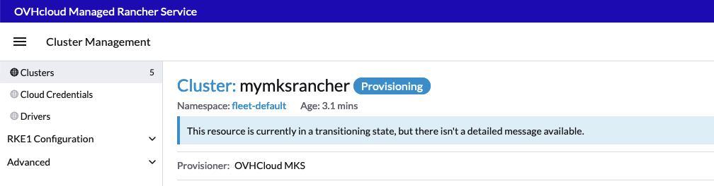{.thumbnail}

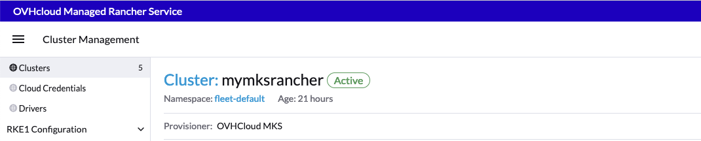{.thumbnail}

Your cluster is now fully functional. You can click on the `Explore`{.action} button to manage your MKS Cluster.

##### Use OVHcloud as an **Infrastructure Provider**

On this part we will detail how to use Rancher to create and manage Kubernetes clusters based on [OVHcloud Public Cloud Compute Instances](/links/public-cloud/compute).

> [!warning]
> Deploying to OVHcloud will incur charges.
> For more information, refer to the [MKS](https://www.ovhcloud.com/en-ie/public-cloud/prices/#568) and [Compute](/links/public-cloud/prices) pricing pages.

1\. From the Rancher Homepage, click on `Create`{.action}.

{.thumbnail}

2\. Use the OVHcloud `Infrastructure Provider` by clicking on `OVHcloud Public Cloud`{.action} under the "Provision new nodes and create using RKE2/k3s" section:

{.thumbnail}

3\. Create your cloud credentials

{.thumbnail}

Provide the following parameters:

- **Credential Name** (optional).
- **OpenStack Authentication URL**, default value can't be changed.
- Your OpenStack **Username**, please refer to our Documentation for [Creating and deleting OpenStack users](/pages/public_cloud/compute/create_and_delete_a_user).
- your OpenStack **Password**, please refer to our Documentation for [Creating and deleting OpenStack users](/pages/public_cloud/compute/create_and_delete_a_user).

Once created, the cloud credentials will be used to provision nodes in your cluster. You can reuse these credentials for other node templates or in other clusters.

4\. Click on `Get Project List`{.action} and select the **Project** were you want to create your cluster.

5\. Click on `Continue`{.action}.

6\. Set your **Cluster Name** and **Cluster Description**.

{.thumbnail}

7\. Create a **Machine Pool** for each Kubernetes role. Refer to the following guides for recommendations on role assignments and counts:

- [Best Practices](https://ranchermanager.docs.rancher.com/how-to-guides/new-user-guides/launch-kubernetes-with-rancher/use-new-nodes-in-an-infra-provider#node-roles)
- [Node Requirements for Rancher Managed Clusters](https://ranchermanager.docs.rancher.com/how-to-guides/new-user-guides/kubernetes-clusters-in-rancher-setup/node-requirements-for-rancher-managed-clusters)
- [Requirements for RKE2 installation (flavors and OS)](https://docs.rke2.io/install/requirements)
- [Recommended Cluster Architecture](https://ranchermanager.docs.rancher.com/how-to-guides/new-user-guides/kubernetes-clusters-in-rancher-setup/checklist-for-production-ready-clusters/recommended-cluster-architecture)

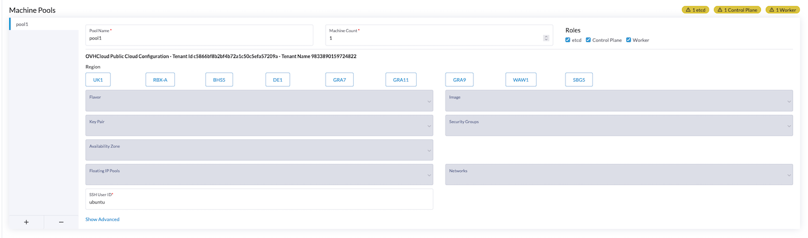{.thumbnail}

For each machine pool, define the machine configuration by providing the following parameters:

- **Pool Name** - Name of the Machine Pool.
- **Machine Count** - Number of instances.
- **Roles** - `etcd`, `Control Plane` or `Worker`. You can refer to the [Node Roles](https://ranchermanager.docs.rancher.com/how-to-guides/new-user-guides/launch-kubernetes-with-rancher/use-new-nodes-in-an-infra-provider#node-roles) documentation.
- **Region** - The OVHcloud Public Cloud region. If you want to check the availability of specific products that you plan to use alongside Kubernetes, you can refer to the [Availability of Public Cloud Product](https://www.ovhcloud.com/en-ie/public-cloud/regions-availability/) page.
- **Flavor** - The instance flavor used for your nodes. You can refer to the [OVHcloud Flavor list](https://www.ovhcloud.com/en-ie/public-cloud/prices/#13569).
- **Image** - The Operating System image used for your nodes. Please refer to [Rancher Operating Systems and Container Runtime Requirements](https://ranchermanager.docs.rancher.com/how-to-guides/new-user-guides/kubernetes-clusters-in-rancher-setup/node-requirements-for-rancher-managed-clusters).
- **Key Pair** (optional) - The SSH Key Pair that should be used to access your nodes. Please refer to this guide on [how to create a SSH KeyPair and add it to your Public Cloud project](/pages/public_cloud/compute/public-cloud-first-steps). If you leave this field empty, a new keypair will be generated automatically.
- **Security Group** - The security group from your Public Cloud project that will be applied to created instances.
- **Availability Zone** - Only `nova` is supported at the moment.
- **Floating IP Pools** - Only `Ext-Net` is supported at the moment.
- **Networks** - The Public Cloud private Network to which created instances will be attached. The selected network needs to have a gateway configured.
- **SSH user ID** - Username that will be used to access your nodes through SSH.

8\. Use the **Cluster Configuration** to choose the version of Kubernetes that will be installed, which network provider will be used and if you want to enable project network isolation. For help configuring the cluster, refer to the [RKE2 cluster configuration reference](https://ranchermanager.docs.rancher.com/reference-guides/cluster-configuration/rancher-server-configuration/rke2-cluster-configuration).
Use Member Roles to configure user authorization for the cluster. Click `Add Member`{.action} to add users that can access the cluster. Use the `Role` drop-down menu to set permissions for each user.

9\. Click `Create`{.action}.

#### Importing an existing Kubernetes cluster

For organizations with pre-existing Kubernetes clusters, Rancher simplifies integration. Import your clusters seamlessly, wherever they are deployed, allowing Rancher to take over the management responsibilities. This process facilitates the transition to Rancher without disrupting your existing infrastructure.

You can refer to the official Rancher documentation on how to [Register Existing Cluster](https://ranchermanager.docs.rancher.com/how-to-guides/new-user-guides/kubernetes-clusters-in-rancher-setup/register-existing-clusters).

##### Importing an existing OVHcloud Managed Kubernetes Service cluster

If you already use our [OVHcloud Managed Kubernetes Service](/links/public-cloud/kubernetes), you can easily import an existing cluster.
The workflow is similar to the one described on the official Rancher documentation on [how to register a cluster](https://ranchermanager.docs.rancher.com/how-to-guides/new-user-guides/kubernetes-clusters-in-rancher-setup/register-existing-clusters#registering-a-cluster) and it takes only a few minutes.

1\. From the Rancher home page, click on `Import Existing`{.action}.

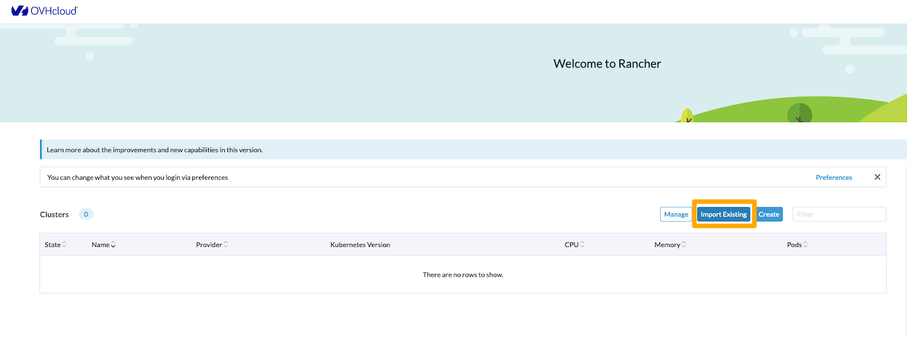{.thumbnail}

2\. Select **Generic**

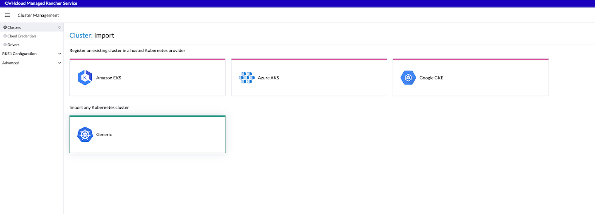{.thumbnail}

3\. Set the Cluster Name (it is not mandatory to match the name of your existing MKS cluster) then click on `Create`{.action}

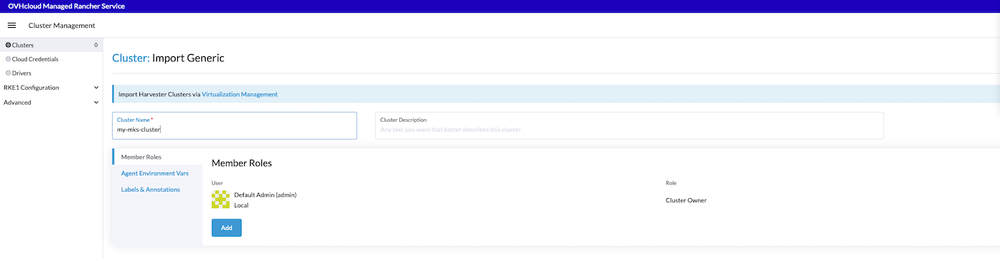{.thumbnail}

4\. Follow the instructions provided on the **Registration** tab.

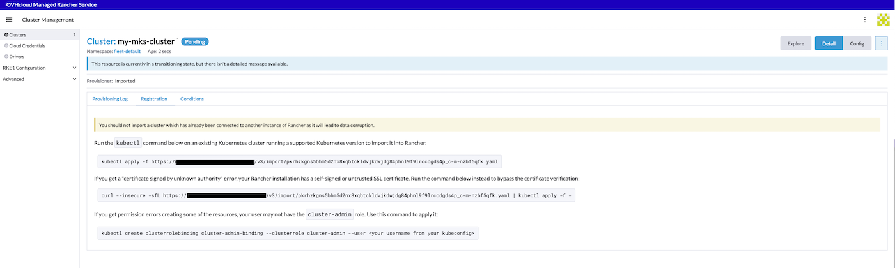{.thumbnail}

Run the provided kubectl command on an existing Managed Kubernetes Service cluster that is running a supported Kubernetes version to import it into Rancher:

```shell
kubectl apply -f https://rancher.ovh.net/v3/import/file.yaml
```

```shell
  clusterrole.rbac.authorization.k8s.io/proxy-clusterrole-kubeapiserver unchanged
  clusterrolebinding.rbac.authorization.k8s.io/proxy-role-binding-kubernetes-master unchanged
  namespace/cattle-system created
  serviceaccount/cattle created
  clusterrolebinding.rbac.authorization.k8s.io/cattle-admin-binding created
  secret/cattle-credentials-ac3c0a4 created
  clusterrole.rbac.authorization.k8s.io/cattle-admin created
  deployment.apps/cattle-cluster-agent created
  service/cattle-cluster-agent created
```

5\. Wait until your cluster becomes available:

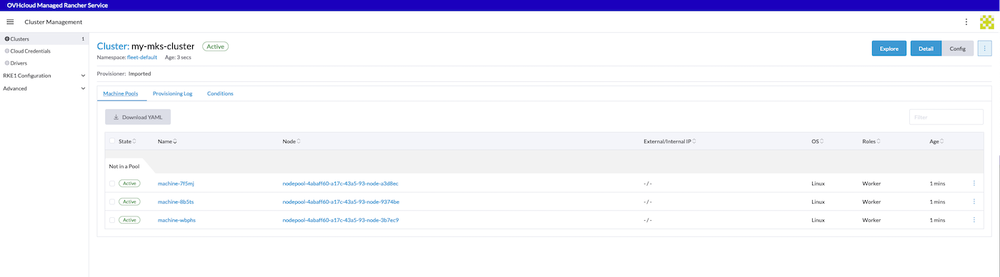{.thumbnail}

6\. Your cluster is now federated on your Rancher. You can click on **Explore** to manage your MKS cluster.

### Deploying applications with Rancher

Now that your clusters are set up, leverage Rancher's user-friendly interface to deploy applications effortlessly. Define workloads, services, and deployment strategies within the Rancher UI. Explore the extensive catalog of pre-configured application templates to simplify and optimize your application deployment process.
To access the application catalog, explore your federated downstream Kubernetes cluster and click on `Apps/Charts`{.action} in the left panel.

{.thumbnail}

### Managing resources

Rancher empowers you with robust tools for resources management. Monitor the nodes health, track resources utilization, and scale applications dynamically as demand fluctuates. The centralized control provided by Rancher ensures efficient resource allocation across your Kubernetes clusters.

### Monitoring and troubleshooting

Dive into Rancher's monitoring capabilities to gain real-time insights into the performance of your clusters and applications. Use logging features and diagnostic tools to troubleshoot issues promptly. Rancher's comprehensive monitoring suite ensures you can proactively address potential challenges.

### Regular updates and maintenance

Stay informed about updates to Rancher and OVHcloud Managed Rancher Service features. Regularly check for new releases, security patches and optimizations. This proactive approach ensures that your container orchestration environment remains secure, efficient, and aligned with the latest industry standards.

### Conclusion

Rancher, when used within the OVHcloud Cloud environment, offers a fully managed solution for containers orchestration. By following these detailed steps, you will not only establish a robust Kubernetes infrastructure but also harness the full potential of Rancher's features within the unique context of OVHcloud Public Cloud.
Happy Ranchering!

## Go further

- To have an overview of OVHcloud Managed Kubernetes service, you can go to the [OVHcloud Managed Kubernetes page](/links/public-cloud/kubernetes).

- If you need training or technical assistance to implement our solutions, contact your sales representative or click on [this link](/links/professional-services) to get a quote and ask our Professional Services experts for assisting you on your specific use case of your project.

- Our team remains available on our dedicated Discord Channel, do not hesitate to join and reach us : <https://discord.gg/ovhcloud>. Ask questions, provide feedback and interact directly with the team that builds our Container and Orchestration services.

- Join our [community of users](/links/community).
