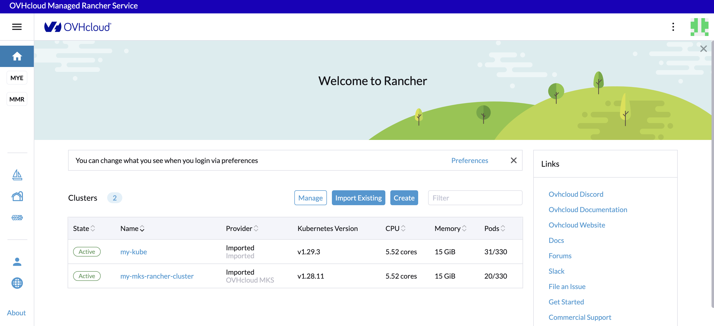
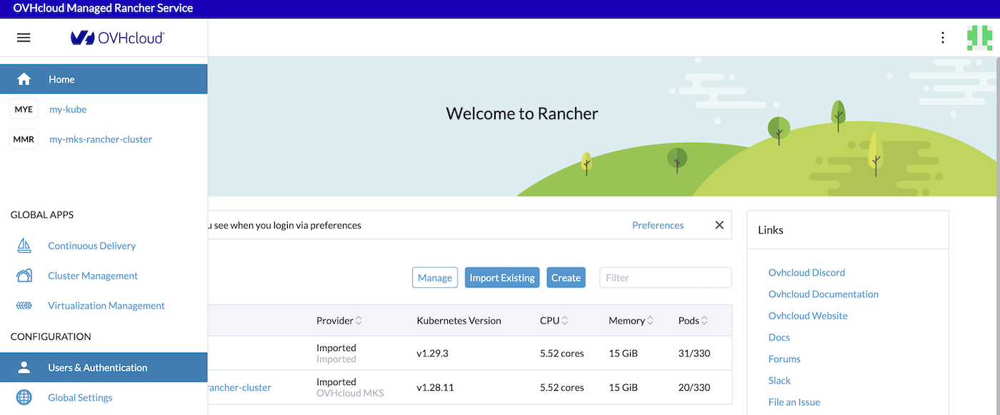
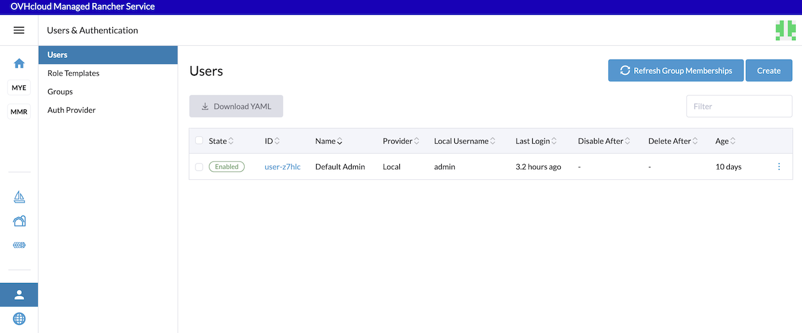
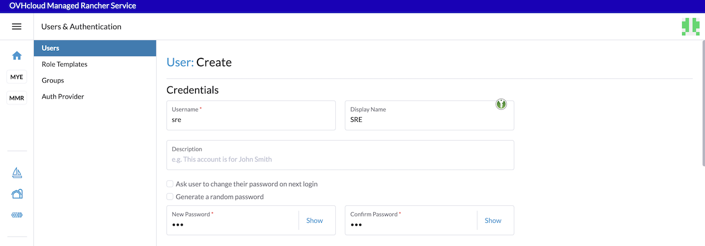
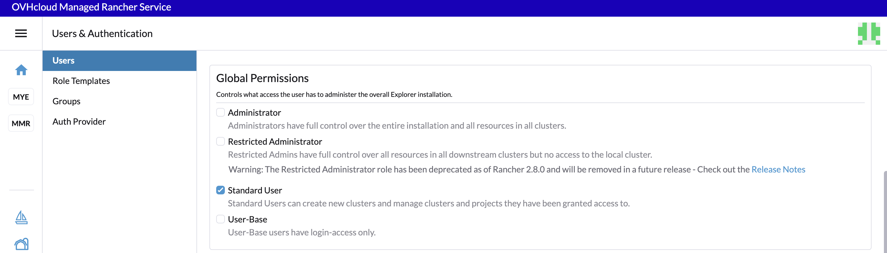
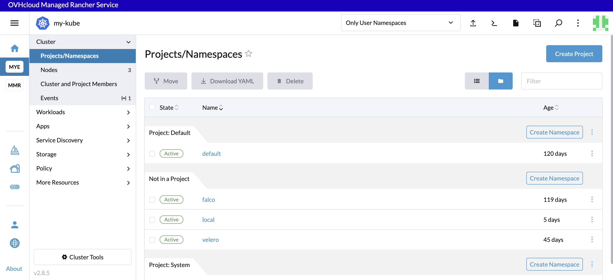
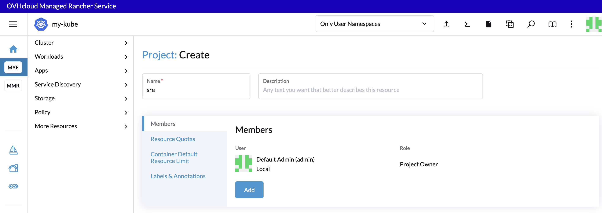
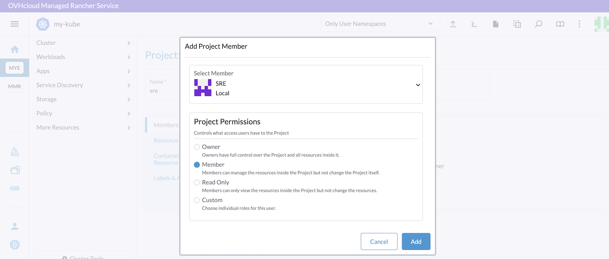
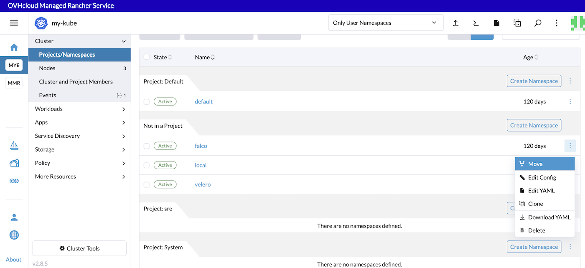
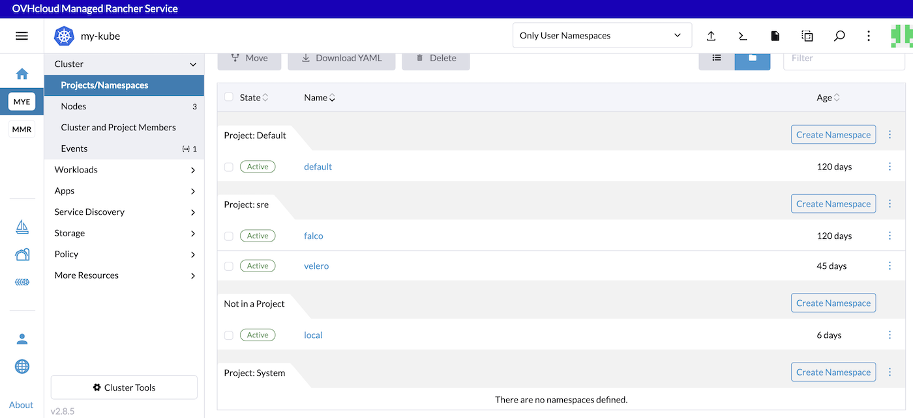

## Objective

Managed Rancher Service by OVHcloud provides a powerful platform for orchestrating Kubernetes clusters seamlessly. This guide will explain how to manage users and projects on your OVHcloud Managed Rancher Service.

## Requirements

- A [Public Cloud project](https://www.ovhcloud.com/pt/public-cloud/) in your OVHcloud account
- An OVHcloud Managed Rancher Service (see the [creating a Managed Rancher Service](/pages/public_cloud/containers_orchestration/managed_rancher_service/create-update-rancher) guide for more information)
- An access to the Rancher UI to operate it (see the [connecting to the Rancher UI](/pages/public_cloud/containers_orchestration/managed_rancher_service/create-update-rancher) guide for more information)

## Instructions

You can manage projects, users and rights on your Managed Rancher Service by using the Rancher UI.

### Creating a new user

Log in your Managed Rancher Service UI.

{.thumbnail}

In the menu, click on `Users & Authentication`{.action}.

{.thumbnail}

A list of existing users is displayed. You should have at least a `Default Admin` user.

To create a new user, click on the `Create`{.Action}  button

{.thumbnail}

Fill the username, a new password and confirm the password. You can also optionally enter a display name and a description.

{.thumbnail}

> [!warning]
>
> The password needs to have at least 12 characters.

Rancher have several levels of global permissions. If you want a user that have the rights to create and managed new clusters, you can choose `Standard User` global permission.

{.thumbnail}

Please refer to the official documentation to know more about [global permissions](https://ranchermanager.docs.rancher.com/how-to-guides/new-user-guides/authentication-permissions-and-global-configuration/manage-role-based-access-control-rbac/global-permissions).

After choosing, if you want, fine-grained built-in roles, click on the `Create`{.action} button.

{.thumbnail}

The user have been created.

### Creating a new project

A project in Rancher is a group of Kubernetes namespaces. Projects allow you to manage multiple namespaces as a group and perform Kubernetes operations in them. You can use projects to support multi-tenancy, so that a team can access a project within a cluster without having access to other projects in the same cluster.

In terms of hierarchy:
- Clusters contain projects
- Projects contain namespaces

In Kubernetes, features like Role-Based Access Rights (RBAC) or cluster resources are assigned to individual namespaces. A project allows you to save time by giving an individual or a team access to multiple namespaces simultaneously.

Let's create a project:

Log in your Managed Rancher Service UI.

{.thumbnail}

Click on the name of your choosen Kubernetes cluster.
In the **Cluster** menu, click on `Projects/Namespaces`

{.thumbnail}

You can see that our example cluster have several existing projects: `Default` and `System`. The Default project contains the default namespace and they are several namespaces that are not in a project.

You will create a project that will contains several namespaces for a special team in your company.

Click on the `Create Project`{.action} button.

Enter the name of the project and then click on `Add`{.action} button to add a member to the `sre` project.

{.thumbnail}

Select the user `sre` you previously created and select the project permissions. you can select `Member` permission if you want an user that can manage the resources inside the project but not the project itself.

{.thumbnail}

Then click on `Add`{.action} button to add the member to the project.

Finally, click on `Create`{.action} button to create the project.

To move the existing wanted namespaces in our `sre` project, clck on the three dot button and click on `Move`{.action}.

{.thumbnail}

Select the project and click on `Move`{.action} button to move `falco` namepace in our project.
You can do the same thing for all of the namespaces you want.

{.thumbnail}

### Go further

To have an overview of OVHcloud Managed Rancher Service, you can go to the [OVHcloud Managed Rancher Service page](https://www.ovhcloud.com/de/public-cloud/managed-rancher-service/).

Follow the offical documentation from Rancher to know more about:
- [Projects](https://ranchermanager.docs.rancher.com/how-to-guides/new-user-guides/manage-clusters/projects-and-namespaces)
- [Adding users to projects](https://ranchermanager.docs.rancher.com/how-to-guides/new-user-guides/add-users-to-projects)
- [Users global permissions](https://ranchermanager.docs.rancher.com/how-to-guides/new-user-guides/authentication-permissions-and-global-configuration/manage-role-based-access-control-rbac/global-permissions)

Join our [community of users](/links/community).