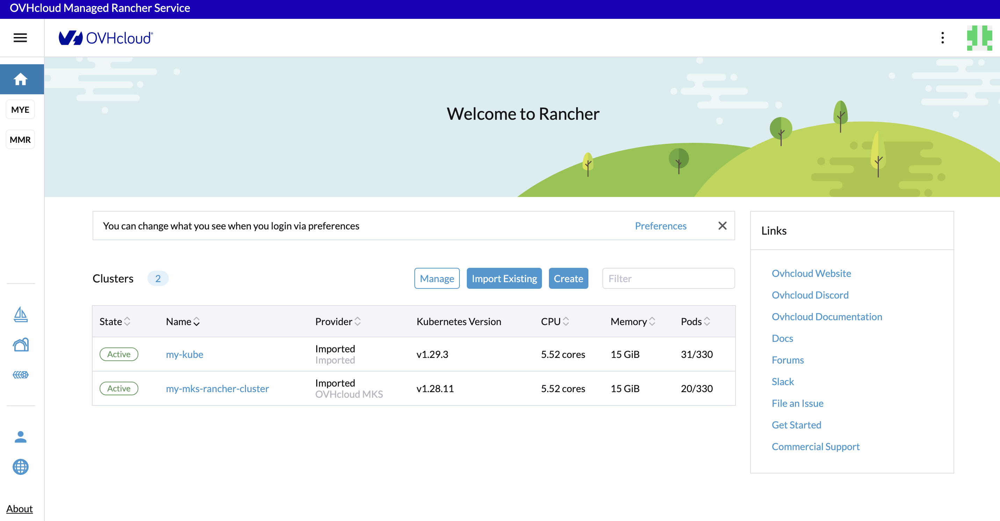
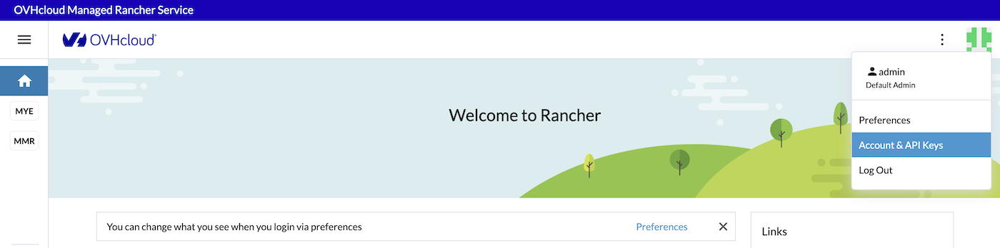
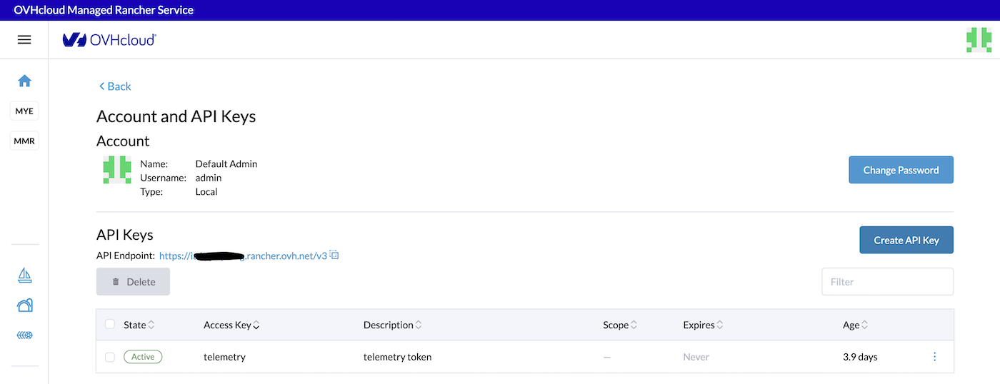
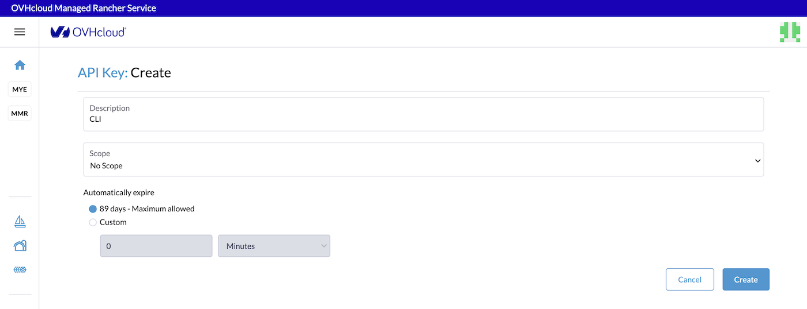

> [!warning]
>
> Usage of [Managed Rancher Service](https://labs.ovhcloud.com/en/managed-rancher-service/) is currently in Beta phase.
> This guide may be incomplete and will be extended during the beta phase. Our team remains available on our dedicated Discord Channel, do not hesitate to join and reach us : <https://discord.gg/ovhcloud>. Ask questions, provide feedback and interact directly with the team that builds our Container and Orchestration services.
>

## Objective

Managed Rancher Service by OVHcloud provides a powerful platform for orchestrating Kubernetes clusters seamlessly. In this guide we will discover that in addition to the Rancher UI you can handle your Kubernetes clusters through the Ranhcer CLI.

## Requirements

- A [Public Cloud project](https://www.ovhcloud.com/asia/public-cloud/) in your OVHcloud account
- An OVHcloud Managed Rancher Service (see the [creating a Managed Rancher Service](/pages/public_cloud/containers_orchestration/managed_rancher_service/create-update-rancher) guide for more information)
- An access to the Rancher UI to operate it (see the [connecting to the Rancher UI](/pages/public_cloud/containers_orchestration/managed_rancher_service/create-update-rancher) guide for more information)

## Instructions

### Rancher CLI

The [Rancher CLI (Command Line Interface)](https://ranchermanager.docs.rancher.com/reference-guides/cli-with-rancher/rancher-cli) is a unified tool that you can use to interact with an OVHcloud Managed Rancher Service (MRS). With this tool, you can operate MRS using a command line rather than the UI.

### Downoad and install Rancher CLI

To download the Rancher CLI, log in your Managed Rancher Service UI, click on the `About`{action} link at the bottom of the navigation sidebar menu:

{.thumbnail}

Under the **CLI Downloads** section, click to download the binaries for your OS (macOS, Linux or Windows), untar the package and copy the `rancher` binary in your PATH.

> [!primary]
>
> You can download the binaries directly in the [Rancher CLI GitHub repository](https://github.com/rancher/cli).

### Generate an API Key to use the Rancher CLI

To use the Rancher CLI and login to our OVHcloud MRS, you need to create an API Key.

On the top right, click on your avatar and then on `Account & API Keys`{.action} button menu. 

{.thumbnail}

The Account and API Keys page is displayed. 

{.thumbnail}

Click on the `Create API Key`{.action} button to create an API key.

Define a description that will identify your API Key (`CLI` for example), keep the scope `No Scope` by default, define the expiration date.

{.thumbnail}

> [!warning]
>
> You can change the scope to allow the Rancher CLI to access only to one of your Kubernetes cluster if you want.

Then click on the `Create`{.action} button.

A new API Key has been created. 
Copy and paste in a password manager the `Access Key`, the `Secret Key` and the `Bearer Token`.

### Use the Rancher CLI

Login with the CLI to your MRS:

```bash
rancher login <MRS_URL> --token <BEARER_TOKEN>
```

You should have the following result:

```bash
rancher login https://xxxxxx.xxxx.rancher.ovh.net --token token-phbts:qhsdfuqsdfuhdsqfdqshfdsqhkfhsqdkjfhkqsj

NUMBER    CLUSTER NAME             PROJECT ID             PROJECT NAME   PROJECT DESCRIPTION
1         my-mks-rancher-cluster   c-gcqnf:p-lt2z4        Default        Default project created for the cluster
2         my-mks-rancher-cluster   c-gcqnf:p-t4tcj        System         System project created for the cluster
3         my-kube                  c-m-2brxmwcz:p-dcpvf   Default        Default project created for the cluster
4         my-kube                  c-m-2brxmwcz:p-vcwrr   System         System project created for the cluster
Select a Project:1
INFO[0044] Saving config to /Users/avache/.rancher/cli2.json
```

Now you are authenticated in your MRS, you can display the list of Kubernetes clusters:

```bash
rancher clusters

CURRENT   ID             STATE     NAME                     PROVIDER   NODES     CPU         RAM             PODS
*         c-gcqnf        active    my-mks-rancher-cluster   Unknown    3         1.38/5.52   0.97/14.72 GB   20/330
          c-m-2brxmwcz   active    my-kube                  Imported   3         2.11/5.52   1.44/15.09 GB   31/330
```

As you can see, in our example, we have one MKS cluster and one existing cluster we imported before.

Select one of the Kubernetes cluster:

```bash
rancher context switch

NUMBER    CLUSTER NAME             PROJECT ID             PROJECT NAME   PROJECT DESCRIPTION
1         my-mks-rancher-cluster   c-gcqnf:p-lt2z4        Default        Default project created for the cluster
2         my-mks-rancher-cluster   c-gcqnf:p-t4tcj        System         System project created for the cluster
3         my-kube                  c-m-2brxmwcz:p-dcpvf   Default        Default project created for the cluster
4         my-kube                  c-m-2brxmwcz:p-vcwrr   System         System project created for the cluster
Select a Project:3
INFO[0004] Setting new context to project Default
INFO[0004] Saving config to /Users/avache/.rancher/cli2.json
```

By choosing 3, you switched in the `my-kube` cluster.

List the pods in the `my_kube` cluster directly through Rancher CLI:

```bash
rancher kubectl get pod -A

NAMESPACE             NAME                                           READY   STATUS    RESTARTS        AGE
cattle-fleet-system   fleet-agent-f7dc57db7-wx4s5                    1/1     Running   0               3d23h
cattle-system         cattle-cluster-agent-6ccc7dbf48-8phk6          1/1     Running   0               3d23h
cattle-system         cattle-cluster-agent-6ccc7dbf48-kv26f          1/1     Running   0               3d23h
cattle-system         rancher-webhook-fd7599678-tptcd                1/1     Running   0               3d23h
default               hello-world-deployment-c7584d4f5-w98l7         1/1     Running   0               110d
default               nfs-nginx-29r49                                1/1     Running   0               6d1h
default               nfs-nginx-f5j92                                1/1     Running   0               6d1h
default               nfs-nginx-z9qjg                                1/1     Running   0               6d1h
ingress-nginx         ingress-nginx-controller-55474d95c5-7tl7n      1/1     Running   0               110d
kube-system           calico-kube-controllers-66b876699d-j8tsl       1/1     Running   1 (64d ago)     118d
kube-system           canal-j7dtp                                    2/2     Running   0               118d
kube-system           canal-lc5vl                                    2/2     Running   0               118d
kube-system           canal-swrxf                                    2/2     Running   0               118d
kube-system           coredns-5594b5bf54-gh26t                       1/1     Running   0               118d
kube-system           coredns-5594b5bf54-tqnvc                       1/1     Running   0               118d
kube-system           csi-nfs-node-88zds                             3/3     Running   0               6d1h
kube-system           csi-nfs-node-b4kf7                             3/3     Running   0               6d1h
kube-system           csi-nfs-node-rqz25                             3/3     Running   0               6d1h
kube-system           csi-nfs2-controller-74f4559bc4-rmjhb           4/4     Running   2 (4d21h ago)   6d1h
kube-system           kube-dns-autoscaler-9f54dfbf4-btmm6            1/1     Running   0               118d
kube-system           kube-proxy-9p6t8                               1/1     Running   0               118d
kube-system           kube-proxy-jk77j                               1/1     Running   0               118d
kube-system           kube-proxy-tjvnf                               1/1     Running   0               118d
kube-system           metrics-server-5876b4d5bf-jr9z6                1/1     Running   0               118d
kube-system           ovhcloud-apiserver-proxy-8w656                 1/1     Running   0               118d
kube-system           ovhcloud-apiserver-proxy-btdn4                 1/1     Running   0               118d
kube-system           ovhcloud-apiserver-proxy-rbclj                 1/1     Running   0               118d
kube-system           ovhcloud-konnectivity-agent-7d9b9dfddd-9s4vk   1/1     Running   0               118d
kube-system           ovhcloud-konnectivity-agent-7d9b9dfddd-nhhp7   1/1     Running   0               118d
trivy-system          trivy-operator-84b86599cb-tzmg4                1/1     Running   0               110d
velero                velero-55f979c9c-hmb7v                         1/1     Running   0               43d
```

## Go further

- If you want to know more about the Rancher CLI and all its commands, read the [Rancher CLI](https://ranchermanager.docs.rancher.com/reference-guides/cli-with-rancher/rancher-cli) documentation.

- To have an overview of OVHcloud Managed Rancher Service, you can go to the [OVHcloud Managed Rancher Service page](https://www.ovhcloud.com/asia/public-cloud/managed-rancher-service/).

- If you need training or technical assistance to implement our solutions, contact your sales representative or click on [this link](https://www.ovhcloud.com/asia/professional-services/) to get a quote and ask our Professional Services experts for assisting you on your specific use case of your project.

- Join our community of users on <https://community.ovh.com/en/>.