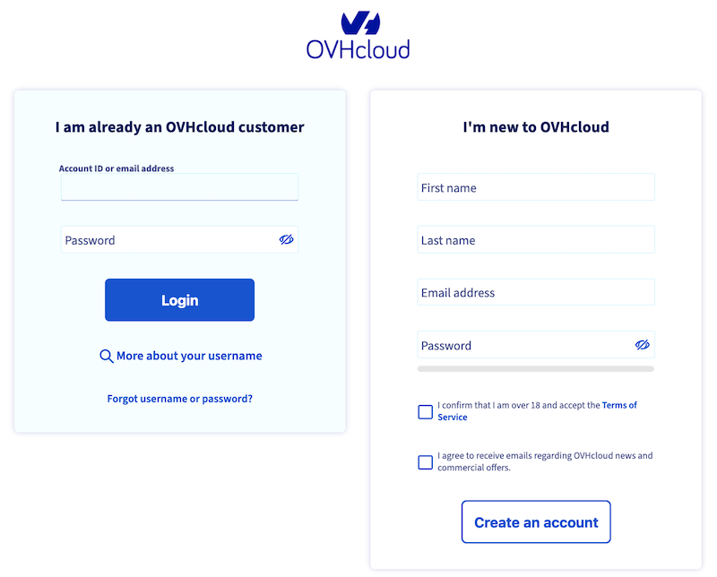

## How to access the Data Platform <small>Beta</small>

> [!warning]
>
> Data Platform is currently only deployed as a beta version. If you experience any difficulties and/or would like to discuss your experience with other users, you can ask for support by reaching out to us on the Data Platform Channel within the [Discord Server](https://discord.gg/ovhcloud). You can also find a step by step guide towards joining our Discord server in the [support](https://docs.forepaas.io/#/en/support/index) section.
> 

### Signin

Click [here](https://eu.dataplatform.ovh.net/) to access the Data Platform.

If you are accessing the Data Platform for the first time, you need:

- either to sign up with an existing or new OVHcloud account.
- or to sign up wth a local Data Platform account, only if you have received an invitation to join an existing Data Platform Organization by an admin from your company beforehand.

> [!primary]
>
> The administration account needs to be linked to an OVHcloud account.
>

- If you are a regular user, fill the Login/Password form [here](https://hq-fp.dataintegration.ovh.net):

> [!primary]
>
> Regular users do not need an OVHcloud account to onboard.
>

To get more information, please click [here](https://docs.forepaas.io/#/en/product/organisations/create-account) to access our complete account creation guide.